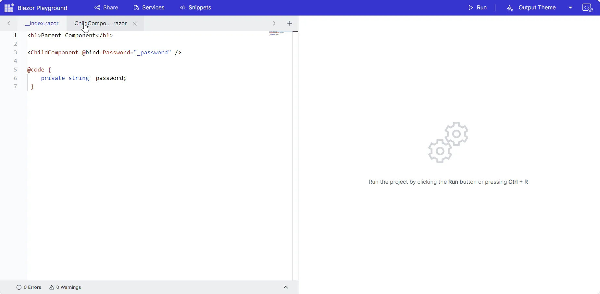

# Working with Components in Blazor Playground

The [Blazor Playground](https://blazorplayground.syncfusion.com) allows you to create and manage multiple [Blazor components](https://www.syncfusion.com/blazor-components) within a single project. You can add child components to your Blazor Playground project and remove them when they are no longer needed.

## Add a child component

1\. Click the **+** button to add a new component.
2\. Name the component in the input box.
3\. Add code to the child component file (for example, `ChildComponent.razor`).




<input @oninput="OnPasswordChanged"
       required
       type="@(_showPassword ? "text" : "password")"
       value="@Password" />
<button class="btn btn-primary" @onclick="ToggleShowPassword">
    Show password
</button>
@code {
    private bool _showPassword;
    [Parameter]
    public string Password { get; set; }
    [Parameter]
    public EventCallback<string> PasswordChanged { get; set; }

    private Task OnPasswordChanged(ChangeEventArgs e)
    {
        Password = e.Value.ToString();

        return PasswordChanged.InvokeAsync(Password);
    }
    private void ToggleShowPassword()
    {
        _showPassword = !_showPassword;
    }
}




4\. The `_Index.razor` file is the main entry point in the Blazor Playground. To render the child component, reference it in `_Index.razor` file.




<h1>Parent Component</h1>

<ChildComponent @bind-Password="_password" />

@code {
    private string _password;
}




5\. Press the **Run** button or <kbd>Ctrl</kbd>+<kbd>R</kbd> to execute the code. The output appears in the result view.

## Remove a child component

Click the **cancel (✕)** icon next to the child component tab in the Playground.

N> Blazor Playground does not automatically remove component references from `_Index.razor`. After deleting a child component, remove any corresponding `@using` directives and component tags from `_Index.razor` to prevent build errors.

## See also

* [Getting Started with Blazor Playground](./getting-started.md)
* [Manage NuGet Packages in Blazor Playground](./managing-nuget-packages)
* [Features and Capabilities of Blazor Playground](./end-user-capabilities)