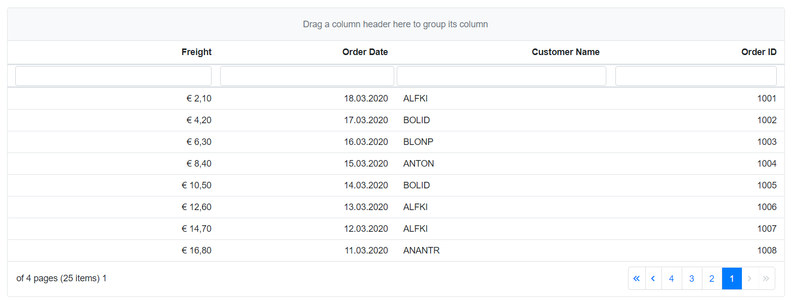

# Right-to-left Support in Syncfusion® Blazor Components

Right-to-left (RTL) support can be enabled for Syncfusion<sup style="font-size:70%">&reg;</sup> Blazor components by setting the `EnableRtl` property to `true`. This renders supported Syncfusion<sup style="font-size:70%">&reg;</sup> Blazor components in a right-to-left layout.

## Enable RTL for all components

Enable right-to-left (RTL) globally for all Syncfusion<sup style="font-size:70%">&reg;</sup> components by setting the [EnableRtl](https://help.syncfusion.com/cr/blazor/Syncfusion.Blazor.GlobalOptions.html#Syncfusion_Blazor_GlobalOptions_EnableRtl) global option to `true` when adding Syncfusion Blazor via `AddSyncfusionBlazor()`.

### Blazor Web App

For **.NET 8 and .NET 9** Blazor Web Apps using any render mode (Server, WebAssembly, or Auto), set the [EnableRtl](https://help.syncfusion.com/cr/blazor/Syncfusion.Blazor.GlobalOptions.html#Syncfusion_Blazor_GlobalOptions_EnableRtl) property to `true` using the `AddSyncfusionBlazor` service method in the `~/Program.cs` file.





using Syncfusion.Blazor;
....
builder.Services.AddSyncfusionBlazor(options => { options.EnableRtl = true; });






### Blazor WebAssembly Standalone App

For Blazor WebAssembly Standalone apps, set the [EnableRtl](https://help.syncfusion.com/cr/blazor/Syncfusion.Blazor.GlobalOptions.html#Syncfusion_Blazor_GlobalOptions_EnableRtl) property to `true` using the `AddSyncfusionBlazor` service method in the `~/Program.cs` file.





using Syncfusion.Blazor;

var builder = WebAssemblyHostBuilder.CreateDefault(args);

....
builder.Services.AddSyncfusionBlazor(options => { options.EnableRtl = true; });
await builder.Build().RunAsync();
....





The above configuration enables RTL globally for all Syncfusion<sup style="font-size:70%">&reg;</sup> Blazor components. For illustration, the Syncfusion<sup style="font-size:70%">&reg;</sup> Blazor DataGrid component is displayed with Right-To-Left (RTL).



## Enable RTL for an individual component

Enable right-to-left (RTL) for a specific component by setting that component's `EnableRtl` property to `true`.

In the following example, RTL is enabled for the `SfDropDownList` component by setting its `EnableRtl` property directly.

```cshtml

@using Syncfusion.Blazor.DropDowns

<SfDropDownList TValue="string" Placeholder="Select the country" TItem="Countries" DataSource="@CountryList" EnableRtl="true">
    <DropDownListFieldSettings Text="Name" Value="Code"></DropDownListFieldSettings>
</SfDropDownList>

@code {

    SfDropDownList<string, Countries> dropdownObj;

    public class Countries
    {
        public string Name { get; set; }

        public string Code { get; set; }
    }
    List<Countries> CountryList = new List<Countries>
    {
        new Countries() { Name = "Australia", Code = "AU" },
        new Countries() { Name = "Bermuda", Code = "BM" },
        new Countries() { Name = "Canada", Code = "CA" },
        new Countries() { Name = "Cameroon", Code = "CM" }
    };
}

```


