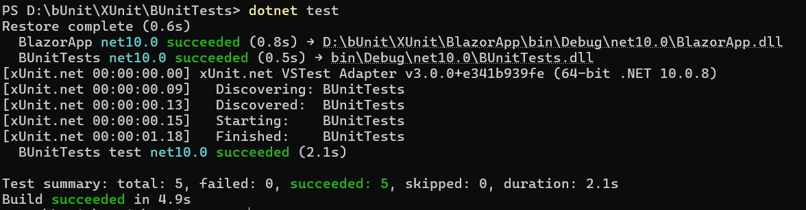

# Getting Started with bUnit Testing for Blazor Components

This guide demonstrates how to test [Blazor components](https://www.syncfusion.com/blazor-components) using [bUnit](https://bunit.dev/docs/getting-started/index.html). It helps validate component behavior, verify UI rendering, and ensure that components function correctly through isolated unit testing.

## Prerequisites

* [.NET SDK](https://dotnet.microsoft.com/en-us/download/dotnet) 8.0 or later (this guide uses .NET 10)
* [Visual Studio](https://visualstudio.microsoft.com/downloads/) 2022 or later or [Visual Studio Code](https://code.visualstudio.com/) with [C# Dev Kit](https://marketplace.visualstudio.com/items?itemName=ms-dotnettools.csdevkit) extension

## Set up the Blazor application

### Create a Blazor project

If you already have a Blazor project, proceed to the [Install required packages for the Blazor project](#install-required-packages-for-the-blazor-project) section. Otherwise, create one using the following Blazor getting started guides.

* [Getting Started with Blazor Server App](https://blazor.syncfusion.com/documentation/getting-started/blazor-server-side-visual-studio)
* [Getting Started with Blazor Web App](https://blazor.syncfusion.com/documentation/getting-started/blazor-web-app)

### Install required packages for the Blazor project

Install the required packages through NuGet Package Manager in Visual Studio (*Tools → NuGet Package Manager → Manage NuGet Packages for Solution*), or the integrated terminal in Visual Studio Code (`dotnet add package`), or the .NET CLI.

* [Syncfusion.Blazor.Grid](https://www.nuget.org/packages/Syncfusion.Blazor.Grid)
* [Syncfusion.Blazor.Themes](https://www.nuget.org/packages/Syncfusion.Blazor.Themes)

You can install the required packages by using the following .NET CLI commands.




dotnet add package Syncfusion.Blazor.Grid -v {{ site.releaseversion }}
dotnet add package Syncfusion.Blazor.Themes -v {{ site.releaseversion }}




### Add required namespaces

Open the `~/_Imports.razor` file and add the `Syncfusion.Blazor`, `Syncfusion.Blazor.Grids` namespaces.




@using Syncfusion.Blazor
@using Syncfusion.Blazor.Grids




### Register Blazor service

Add the Syncfusion Blazor service to the `~/Program.cs` file to enable Blazor components in the application.




...
using Syncfusion.Blazor;
...
builder.Services.AddSyncfusionBlazor();
...




### Add Blazor DataGrid component

Add the [Blazor DataGrid](https://www.syncfusion.com/blazor-components/blazor-datagrid) to a `.razor` page in your application to enable UI functionality that can be validated using bUnit.

The Blazor DataGrid displays data through binding, allowing you to verify rendering output and ensure that the component behaves correctly during testing.




@page "/"

<SfGrid DataSource="@Orders" AllowPaging="true">
    <GridPageSettings PageSize="12"></GridPageSettings>
    <GridColumns>
        <GridColumn Field=@nameof(Order.OrderID) HeaderText="Order ID" Width="120" TextAlign="TextAlign.Right"></GridColumn>
        <GridColumn Field=@nameof(Order.CustomerID) HeaderText="Customer Name" Width="150"></GridColumn>
        <GridColumn Field=@nameof(Order.OrderDate) HeaderText="Order Date" Width="130" Format="d" TextAlign="TextAlign.Right"></GridColumn>
        <GridColumn Field=@nameof(Order.Freight) HeaderText="Freight" Width="120" Format="C2" TextAlign="TextAlign.Right"></GridColumn>
        <GridColumn Field=@nameof(Order.ShipCountry) HeaderText="Ship Country" Width="150"></GridColumn>
    </GridColumns>
</SfGrid>

@code {
    public List<Order> Orders { get; set; } = new List<Order>();

    protected override void OnInitialized()
    {
        Orders = Enumerable.Range(1, 75).Select(i => new Order
        {
            OrderID = 1000 + i,
            CustomerID = (new[] { "Maria", "Ana", "Antonio", "Thomas", "Peter", "Anne", "Berglund", "Fin" })[i % 8],
            OrderDate = DateTime.Now.AddDays(-i),
            Freight = i * 50.5m,
            ShipCountry = (new[] { "USA", "Germany", "Brazil", "France", "UK", "Spain", "Italy", "Argentina" })[i % 8]
        }).ToList();
    }

    public class Order
    {
        public int OrderID { get; set; }
        public string CustomerID { get; set; } = "";
        public DateTime OrderDate { get; set; }
        public decimal Freight { get; set; }
        public string ShipCountry { get; set; } = "";
    }
}




## Set up the bUnit test project

### Install the template

Install the bUnit template from NuGet using this command. This step is the same regardless of the test framework you choose.




dotnet new install bunit.template




### Create a new test project

Open a terminal and create a new bUnit test project by running the command for your preferred test framework.




dotnet new bunit --framework xunit -o BlazorXUnitTesting
cd BlazorXUnitTesting




dotnet new bunit --framework nunit -o BlazorNUnitTesting
cd BlazorNUnitTesting




dotnet new bunit --framework mstest -o BlazorMSTestTesting
cd BlazorMSTestTesting




### Install packages

Install the required packages through NuGet Package Manager in Visual Studio (*Tools → NuGet Package Manager → Manage NuGet Packages for Solution*), or the integrated terminal in Visual Studio Code (`dotnet add package`), or the .NET CLI.

**Syncfusion packages**

* [Syncfusion.Blazor.Grid](https://www.nuget.org/packages/Syncfusion.Blazor.Grid)
* [Syncfusion.Blazor.Themes](https://www.nuget.org/packages/Syncfusion.Blazor.Themes)

**Testing package**
* [bunit](https://www.nuget.org/packages/bunit)

You can install the required packages by using the following .NET CLI commands.




dotnet add package Syncfusion.Blazor.Grid -v {{ site.releaseversion }}
dotnet add package Syncfusion.Blazor.Themes -v {{ site.releaseversion }}
dotnet add package bunit --version 2.7.2




### Add the test project to your existing project

Add a project reference from your test project to your Blazor app project so the tests can access your components.




dotnet add reference ../path/to/YourBlazorApp/YourBlazorApp.csproj




### Write a bUnit test

Create a `TestBase` class that all test classes inherit from. It registers the Syncfusion Blazor service, enables options support, and sets the JS interop to `Loose` mode so that JavaScript calls from Blazor components are accepted without throwing errors during testing.

The `TestBase` base class differs by framework: xUnit uses `TestContext`, while NUnit and MSTest use `BunitContext`. The `NUnit/TestBase.cs` and `MSTest/TestBase.cs` implementations are identical — only the inherited base class name differs from xUnit.




using Bunit;
using Microsoft.Extensions.DependencyInjection;
using Syncfusion.Blazor;

public abstract class TestBase : TestContext
{
    protected TestBase()
    {
        Services.AddSyncfusionBlazor();
        Services.AddOptions();
        JSInterop.Mode = JSRuntimeMode.Loose;
    }
}




using Bunit;
using Microsoft.Extensions.DependencyInjection;
using Syncfusion.Blazor;

public abstract class TestBase : BunitContext
{
    protected TestBase()
    {
        Services.AddSyncfusionBlazor();
        Services.AddOptions();
        JSInterop.Mode = JSRuntimeMode.Loose;
    }
}




using Bunit;
using Microsoft.Extensions.DependencyInjection;
using Syncfusion.Blazor;

public abstract class TestBase : BunitContext
{
    protected TestBase()
    {
        Services.AddSyncfusionBlazor();
        Services.AddOptions();
        JSInterop.Mode = JSRuntimeMode.Loose;
    }
}




Each test class inherits from `TestBase` and uses the assertion style idiomatic to its framework: `Assert.Equal` for xUnit, `Assert.That(..., Is.EqualTo(...))` for NUnit, and `Assert.AreEqual` for MSTest. The following tests cover the key behaviors of the Blazor DataGrid component.




using BlazorApp.Components.Pages;
using Xunit;
using System.Linq;

public class DataGridTests : TestBase
{
    [Fact]
    public void DataGrid_DataSource_Count()
    {
        var comp = Render<Home>();
        var instance = comp.Instance;
        Assert.Equal(75, instance.Orders.Count);
    }

    [Fact]
    public void DataGrid_Paging_Is_Configured()
    {
        var comp = Render<Home>();
        // Pager exists
        var pager = comp.Find(".e-pager");
        Assert.NotNull(pager);
        // Validate first page row count (PageSize = 12)
        var rows = comp.FindAll(".e-row");
        Assert.Equal(12, rows.Count);
    }

    [Fact]
    public void DataGrid_Column_Definition_Check()
    {
        var comp = Render<Home>();
        var headers = comp.FindAll(".e-headercell");
        Assert.Equal(5, headers.Count);
        Assert.Equal("Order ID", headers[0].TextContent.Trim());
        Assert.Equal("Customer Name", headers[1].TextContent.Trim());
        Assert.Equal("Order Date", headers[2].TextContent.Trim());
        Assert.Equal("Freight", headers[3].TextContent.Trim());
        Assert.Equal("Ship Country", headers[4].TextContent.Trim());
    }

    [Fact]
    public void DataGrid_Field_Value_Check()
    {
        var comp = Render<Home>();
        var instance = comp.Instance;
        var firstData = instance.Orders.First();
        var firstRowCells = comp.Find(".e-row").Children;
        // OrderID
        Assert.Equal(firstData.OrderID.ToString(), firstRowCells[0].TextContent.Trim());
        // CustomerID
        Assert.Equal(firstData.CustomerID, firstRowCells[1].TextContent.Trim());
        // ShipCountry
        Assert.Equal(firstData.ShipCountry, firstRowCells[4].TextContent.Trim());
    }
}




using NUnit.Framework;
using System.Linq;
using BlazorApp.Components.Pages;

public class DataGridTests : TestBase
{
    [Test]
    public void DataGrid_DataSource_Count()
    {
        var comp = Render<Home>();
        var instance = comp.Instance;
        Assert.That(instance.Orders.Count, Is.EqualTo(75));
    }

    [Test]
    public void DataGrid_Paging_Working()
    {
        var comp = Render<Home>();
        var pager = comp.Find(".e-pager");
        Assert.That(pager, Is.Not.Null);
        var rows = comp.FindAll(".e-row");
        Assert.That(rows.Count, Is.EqualTo(12));
    }

    [Test]
    public void DataGrid_Column_Definition_Check()
    {
        var comp = Render<Home>();
        var headers = comp.FindAll(".e-headercell");
        Assert.That(headers.Count, Is.EqualTo(5));
        Assert.That(headers[0].TextContent.Trim(), Is.EqualTo("Order ID"));
        Assert.That(headers[1].TextContent.Trim(), Is.EqualTo("Customer Name"));
        Assert.That(headers[2].TextContent.Trim(), Is.EqualTo("Order Date"));
        Assert.That(headers[3].TextContent.Trim(), Is.EqualTo("Freight"));
        Assert.That(headers[4].TextContent.Trim(), Is.EqualTo("Ship Country"));
    }

    [Test]
    public void DataGrid_Field_Value_Check()
    {
        var comp = Render<Home>();
        var instance = comp.Instance;
        var firstData = instance.Orders.First();
        var firstRowCells = comp.Find(".e-row").Children;
        Assert.That(firstRowCells[0].TextContent.Trim(), Is.EqualTo(firstData.OrderID.ToString()));
        Assert.That(firstRowCells[1].TextContent.Trim(), Is.EqualTo(firstData.CustomerID));
        Assert.That(firstRowCells[4].TextContent.Trim(), Is.EqualTo(firstData.ShipCountry));
    }
}




using Microsoft.VisualStudio.TestTools.UnitTesting;
using System.Linq;
using BlazorApp.Components.Pages;

[TestClass]
public class DataGridTests : TestBase
{
    [TestMethod]
    public void DataGrid_DataSource_Count()
    {
        var comp = Render<Home>();
        var instance = comp.Instance;
        Assert.AreEqual(75, instance.Orders.Count);
    }

    [TestMethod]
    public void DataGrid_Paging_Working()
    {
        var comp = Render<Home>();
        // Pager exists
        var pager = comp.Find(".e-pager");
        Assert.IsNotNull(pager);
        // Page size = 12
        var rows = comp.FindAll(".e-row");
        Assert.AreEqual(12, rows.Count);
    }

    [TestMethod]
    public void DataGrid_Column_Header_Text()
    {
        var comp = Render<Home>();
        var headers = comp.FindAll(".e-headercell");
        Assert.AreEqual(5, headers.Count);
        Assert.AreEqual("Order ID", headers[0].TextContent.Trim());
        Assert.AreEqual("Customer Name", headers[1].TextContent.Trim());
        Assert.AreEqual("Order Date", headers[2].TextContent.Trim());
        Assert.AreEqual("Freight", headers[3].TextContent.Trim());
        Assert.AreEqual("Ship Country", headers[4].TextContent.Trim());
    }

    [TestMethod]
    public void DataGrid_Field_Value_Check()
    {
        var comp = Render<Home>();
        var instance = comp.Instance;
        var firstData = instance.Orders.First();
        var firstRowCells = comp.Find(".e-row").Children;
        Assert.AreEqual(firstData.OrderID.ToString(), firstRowCells[0].TextContent.Trim());
        Assert.AreEqual(firstData.CustomerID, firstRowCells[1].TextContent.Trim());
        Assert.AreEqual(firstData.ShipCountry, firstRowCells[4].TextContent.Trim());
    }
}




N> Replace `BlazorApp.Components.Pages` with the actual namespace of your Blazor project's Pages folder. This typically follows the pattern `<YourProjectName>.Components.Pages`.

### Run the tests

You can execute the bUnit tests to validate the behavior of your Blazor application.

From the test project directory, run the following command to execute all tests.




dotnet test




After running the tests, the test execution completes with a `Passed` status in the console, indicating that all validated component behaviors are correct. bUnit renders components in-memory — no browser or running server is required.

## See Also

* [Test Blazor components](https://learn.microsoft.com/en-us/aspnet/core/blazor/test)
* [Getting started with Blazor DataGrid](https://blazor.syncfusion.com/documentation/datagrid/)
* [Getting started with bUnit](https://bunit.dev/docs/getting-started/)
* [bUnit GitHub repository](https://github.com/bUnit-dev/bUnit)

