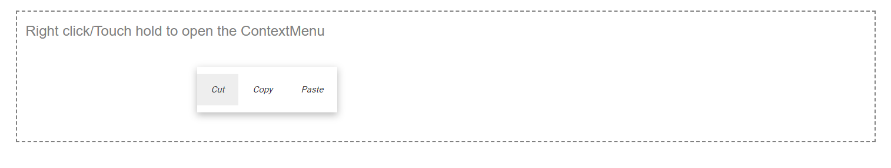
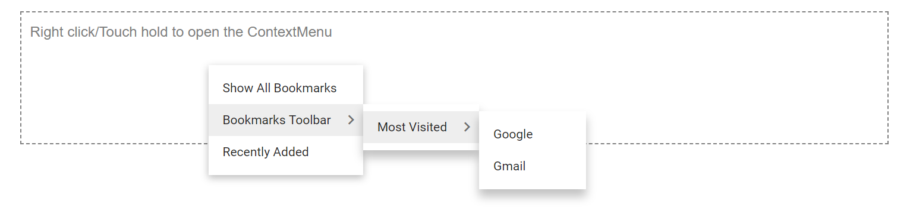

# Customizing and Multilevel Nesting in Blazor ContextMenu Component

## Customizing Context Menu Items

To customize [Blazor Context Menu](https://www.syncfusion.com/blazor-components/blazor-context-menu) items in your application, set your customized template using [MenuTemplates](https://help.syncfusion.com/cr/blazor/Syncfusion.Blazor.Navigations.MenuTemplates-1.html). In the following example, the Context Menu has been rendered with customized Context Menu items.

```cshtml

@using Syncfusion.Blazor.Navigations

<div id="target">Right click/Touch hold to open the ContextMenu </div>
<div class="col-lg-12 control-section">
    <SfContextMenu Target="#target" TValue="MenuItem">
        <MenuTemplates TValue="MenuItem">
            <Template>
                @context.Text
                <span class="shortcut">@((@context.Text == "Save As...") ? "Ctrl + S" : "Ctrl + Shift + I")</span>
            </Template>
        </MenuTemplates>
        <MenuItems>
            <MenuItem Text="Save As..."></MenuItem>
            <MenuItem Text="Inspect"></MenuItem>
        </MenuItems>
    </SfContextMenu>
</div>
<style>
    #target {
        border: 1px dashed;
        height: 150px;
        padding: 10px;
        position: relative;
        text-align: justify;
        color: gray;
        user-select: none;
    }
    .shortcut {
        float: right;
        font-size: 10px;
        opacity: 0.5;
    }
</style>
@code{

}

```





### Customizing Context Menu items using CssClass

The Context Menu items can be customized by using the `CssClass` property. In the following sample, the menu items are customized by adding new styles.

```cshtml

@using Syncfusion.Blazor.Navigations

<div id="target">Right click/Touch hold to open the ContextMenu </div>
<SfContextMenu Target="#target" TValue="MenuItem" CssClass="custom">
    <MenuItems>
        <MenuItem Text="Cut"></MenuItem>
        <MenuItem Text="Copy"></MenuItem>
        <MenuItem Text="Paste"></MenuItem>
    </MenuItems>
</SfContextMenu>

<style>
    #target {
        border: 1px dashed;
        height: 150px;
        padding: 10px;
        position: relative;
        text-align: justify;
        color: gray;
        user-select: none;
    }
    .custom.e-contextmenu-container .e-menu-item {
        display: inline-block;
        font-size: 10px;
        font-style: oblique;
    }
</style>

```





## Multilevel nesting

The Multiple level nesting supports in Context Menu. It can be achieved by mapping the [MenuItems](https://help.syncfusion.com/cr/blazor/Syncfusion.Blazor.Navigations.MenuItems.html) property inside the parent [MenuItem](https://help.syncfusion.com/cr/blazor/Syncfusion.Blazor.Navigations.MenuItem.html). In the below sample, three level nesting of Context Menu is provided.

```cshtml
@using Syncfusion.Blazor.Navigations

<div id="target">Right click/Touch hold to open the ContextMenu </div>
<SfContextMenu Target="#target" TValue="MenuItem">
    <MenuItems>
        <MenuItem Text="Show All Bookmarks"></MenuItem>
        <MenuItem Text="Bookmarks Toolbar">
            <MenuItems>
                <MenuItem Text="Most Visited">
                    <MenuItems>
                        <MenuItem Text="Google"></MenuItem>
                        <MenuItem Text="Gmail"></MenuItem>
                    </MenuItems>
                </MenuItem>
            </MenuItems>
        </MenuItem>
        <MenuItem Text="Recently Added"></MenuItem>
    </MenuItems>
</SfContextMenu>

<style>
    #target {
        border: 1px dashed;
        height: 150px;
        padding: 10px;
        position: relative;
        text-align: justify;
        color: gray;
        user-select: none;
    }
</style>

```



