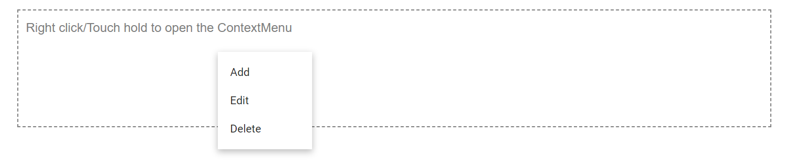

# Change Menu Item Dynamically

The items visible in the Context Menu can be changed dynamically based on the target. To achieve this behavior, initialize Context Menu with all items using [`MenuItems`](https://help.syncfusion.com/cr/blazor/Syncfusion.Blazor.Navigations.MenuItems.html) component and then you can Hide/Show items using [`Hidden`](https://help.syncfusion.com/cr/blazor/Syncfusion.Blazor.Navigations.MenuItem.html#Syncfusion_Blazor_Navigations_MenuItem_Hidden) property by updating its state in [`OnOpen`](https://help.syncfusion.com/cr/blazor/Syncfusion.Blazor.Navigations.MenuEvents-1.html#Syncfusion_Blazor_Navigations_MenuEvents_1_OnOpen) event.

```cshtml

@using Syncfusion.Blazor.Navigations

<div id="target">Right click/Touch hold to open the ContextMenu </div>
<SfContextMenu Target="#target" TValue="MenuItem">
    <MenuItems>
        <MenuItem Text="Cut" Hidden="@hideItems1"></MenuItem>
        <MenuItem Text="Copy" Hidden="@hideItems1"></MenuItem>
        <MenuItem Text="Paste" Hidden="@hideItems1"></MenuItem>
        <MenuItem Text="Add" Hidden="@hideItems2"></MenuItem>
        <MenuItem Text="Edit" Hidden="@hideItems2"></MenuItem>
        <MenuItem Text="Delete" Hidden="@hideItems2"></MenuItem>
    </MenuItems>
    <MenuEvents TValue="MenuItem" OnOpen="@BeforeOpenHandler"></MenuEvents>
</SfContextMenu>

@code {
    private bool hideItems1;
    private bool hideItems2 = true;
    private void BeforeOpenHandler()
    {
        hideItems1 = !hideItems1;
        hideItems2 = !hideItems2;
    }
}

<style>
    #target {
        border: 1px dashed;
        height: 150px;
        padding: 10px;
        position: relative;
        text-align: justify;
        color: gray;
        user-select: none;
    }
</style>

```

Output be like

