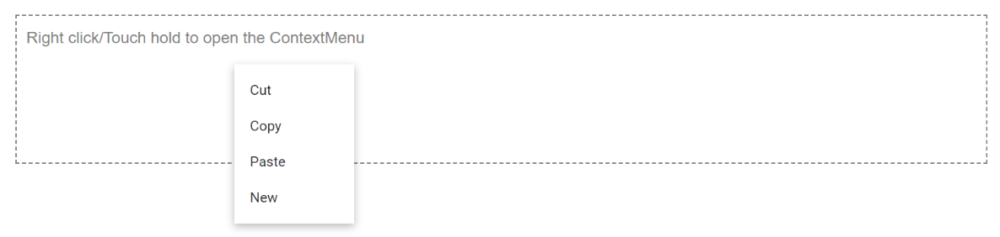

# Data Binding in Blazor ContextMenu Component

To bind local data source to the Context Menu, menu items are populated from data source and mapped to `Items` property. In the following example, custom data with different data type is mapped to `Items` property.

```cshtml

@using Syncfusion.Blazor.Navigations

<div id="target">Right click/Touch hold to open the ContextMenu </div>
<SfContextMenu Target="#target" Items="@menuItems">
    <MenuFieldSettings Text="Content"></MenuFieldSettings>
</SfContextMenu>

@code {
    private List<CustomItem> menuItems = new List<CustomItem>();

    protected override void OnInitialized()
    {
        base.OnInitialized();
        menuItems.Add(new CustomItem { Content = "Cut", Id = "1" });
        menuItems.Add(new CustomItem { Content = "Copy", Id = "2" });
        menuItems.Add(new CustomItem { Content = "Paste", Id = "3" });
        menuItems.Add(new CustomItem { Content = "New", Id = "4" });
    }
    private class CustomItem
    {
        public string Content { get; set; }
        public string Id { get; set; }
    }
}
<style>
    #target {
        border: 1px dashed;
        height: 150px;
        padding: 10px;
        position: relative;
        text-align: justify;
        color: gray;
        user-select: none;
    }
</style>

```



