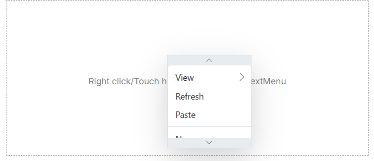

# Implement Scrollable ContextMenu in Blazor Component

To enable scrolling functionality for the ContextMenu, utilize the [`EnableScrolling`](https://help.syncfusion.com/cr/blazor/Syncfusion.Blazor.Navigations.SfContextMenu-1.html#Syncfusion_Blazor_Navigations_SfContextMenu_1_EnableScrolling) property. This property controls the overflow behavior of menu items, allowing the menu to become scrollable when its content exceeds the available viewport height. This ensures that all menu items remain accessible without disrupting the page layout, especially beneficial for menus with an extensive list of options.

To achieve this functionality, set the `EnableScrolling` property to `true`. Additionally, use the `ScrollHeight` property within the `BeforeOpenCloseMenuEventArgs` of the `OnOpen` event to define the maximum height of the menu, thereby enabling the scrollable area.

```cshtml
@using Syncfusion.Blazor.Navigations

<SfContextMenu Target="#target" TValue="MenuItem" CssClass="custom" EnableScrolling="true" BeforeOpen="OnBeforeOpen">
    <MenuEvents TValue="MenuItem" OnOpen="@OnBeforeOpen"></MenuEvents>
    <MenuItems>
        <MenuItem Text="View">
            <MenuItems>
                <MenuItem Text="Mobile" />
                <MenuItem Text="Desktop Smaller" />
                <MenuItem Text="Desktop Normal" />
                <MenuItem Text="Desktop Bigger Smaller" />
                <MenuItem Text="Desktop Bigger Normal" />
            </MenuItems>
        </MenuItem>
        <MenuItem Text="Refresh" />
        <MenuItem Text="Paste" />
        <MenuItem Separator="true" />
        <MenuItem Text="New" />
        <MenuItem Text="Personalize" />
    </MenuItems>
</SfContextMenu>

<div id="target">Right click/Touch hold to open the ContextMenu </div>

@code {
    private void OnBeforeOpen(BeforeOpenCloseMenuEventArgs<MenuItem> args)
    {
        args.ScrollHeight = 150;
    }
}

<style>
    #target {
        border: 1px dashed;
        height: 250px;
        padding: 10px;
        position: relative;
        text-align: center;
        color: gray;
        line-height: 17;
        font-size: 14px;
    }
</style>

```

