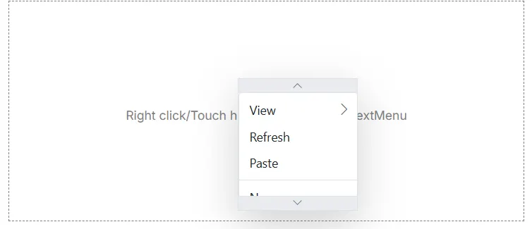

# How to render scrollable Context Menu in Blazor Context Menu

To enable scrolling for the Context Menu, use the `EnableScrolling` property to manage the overflow behavior of menu items by enabling or disabling scroll functionality. This is especially useful when dealing with a large number of menu items that exceed the viewport height, ensuring the context menu remains accessible without affecting the page layout.

To achieve this functionality, set the `EnableScrolling` property to `true`. Additionally, use the `BeforeOpenCloseMenuEventArgs` event to adjust the height of the menu's parent element, ensuring the scrollable area is applied correctly.

```cshtml
@using Syncfusion.Blazor.Navigations

<div id="target">Right click/Touch hold to open the ContextMenu </div>

<SfContextMenu Target="#target" TValue="MenuItem" CssClass="custom" EnableScrolling="true">
    <MenuEvents TValue="MenuItem" OnOpen="@OnBeforeOpen"></MenuEvents>
    <MenuItems>
        <MenuItem Text="View">
            <MenuItems>
                <MenuItem Text="Mobile" />
                <MenuItem Text="Desktop Smaller" />
                <MenuItem Text="Desktop Normal" />
                <MenuItem Text="Desktop Bigger Smaller" />
                <MenuItem Text="Desktop Bigger Normal" />
            </MenuItems>
        </MenuItem>
        <MenuItem Text="Refresh" />
        <MenuItem Text="Paste" />
        <MenuItem Separator="true" />
        <MenuItem Text="New" />
        <MenuItem Text="Personalize" />
    </MenuItems>
</SfContextMenu>

@code {
    private void OnBeforeOpen(BeforeOpenCloseMenuEventArgs<MenuItem> args)
    {
        args.ScrollHeight = 150;
    }
}

<style>
    #target {
        border: 1px dashed;
        height: 250px;
        padding: 10px;
        position: relative;
        text-align: center;
        color: gray;
        line-height: 17px;
        font-size: 14px;
    }
</style>

```

