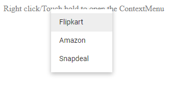

# Icons and Navigation in Blazor ContextMenu Component

## Icons

The [Blazor Context Menu](https://www.syncfusion.com/blazor-components/blazor-context-menu) component allows the inclusion of icons or images within its menu items to provide a visual representation of their associated actions. To add an icon to a menu item, set the [`IconCss`](https://help.syncfusion.com/cr/blazor/Syncfusion.Blazor.Navigations.MenuItem.html#Syncfusion_Blazor_Navigations_MenuItem_IconCss) property with the `e-icons` class and the specific icon class name. By default, the icon is positioned to the left of the menu item.

The following sample demonstrates how to add icons for "Cut," "Copy," and "Paste" menu items using the `IconCss` property:

```cshtml
@using Syncfusion.Blazor.Navigations

<div id="target">Right click/Touch hold to open the Context Menu </div>
<SfContextMenu Target="#target" TValue="MenuItem">
    <MenuItems>
        <MenuItem Text="Cut" IconCss="e-icons e-cut"></MenuItem>
        <MenuItem Text="Copy" IconCss="e-icons e-copy"></MenuItem>
        <MenuItem Text="Paste" IconCss="e-icons e-paste"></MenuItem>
    </MenuItems>
</SfContextMenu>

<style>
    #target {
        border: 1px dashed;
        height: 150px;
        padding: 10px;
        position: relative;
        text-align: justify;
        color: gray;
        user-select: none;
    }
    .e-cut::before {
        content: '\e279';
    }
    .e-copy::before {
        content: '\e280';
    }
    .e-paste::before {
        content: '\e601';
    }
</style>

```




N> The Context Menu provides a set of [icons](https://blazor.syncfusion.com/documentation/appearance/icons) that can be loaded by applying the `e-icons` class name to the element.
You can also use third-party icons on the Context Menu using the `IconCss` property.

## Navigation

The Context Menu can be configured to navigate to another web page when a menu item is clicked. This is achieved by providing a URL to the menu item using the [`Url`](https://help.syncfusion.com/cr/blazor/Syncfusion.Blazor.Navigations.MenuItem.html#Syncfusion_Blazor_Navigations_MenuItem_Url) property.

The following sample demonstrates how to add navigation URLs for "Flipkart," "Amazon," and "Snapdeal" menu items using the `Url` property:

```cshtml
@using Syncfusion.Blazor.Navigations

<div id="target">Right click/Touch hold to open the ContextMenu </div>
<SfContextMenu Target="#target" TValue="MenuItem">
    <MenuItems>
        <MenuItem Text="Flipkart" Url="https://www.google.co.in/search?q=flipkart"></MenuItem>
        <MenuItem Text="Amazon" Url="https://www.google.co.in/search?q=amazon"></MenuItem>
        <MenuItem Text="Snapdeal" Url="https://www.google.co.in/search?q=snapdeal"></MenuItem>
    </MenuItems>
</SfContextMenu>

<style>
    #target {
        border: 1px dashed;
        height: 150px;
        padding: 10px;
        position: relative;
        text-align: justify;
        color: gray;
        user-select: none;
    }
</style>

```



