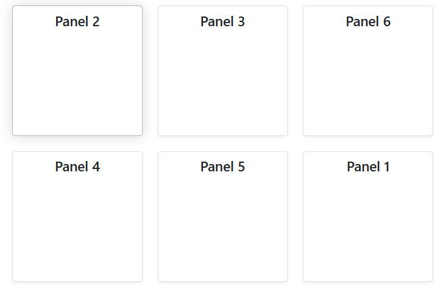

# Preventing Panel Overlap in Blazor Dashboard Layout

When dynamically rendering [DashboardLayoutPanel](https://help.syncfusion.com/cr/blazor/Syncfusion.Blazor.Layouts.DashboardLayoutPanel.html) components, panels may overlap if not configured correctly. This issue typically occurs when multiple panels are assigned the same [`Id`](https://help.syncfusion.com/cr/blazor/Syncfusion.Blazor.Layouts.DashboardLayoutPanel.html#Syncfusion_Blazor_Layouts_DashboardLayoutPanel_Id) property. The Dashboard Layout component uses this `Id` internally to uniquely identify and manage each panel's position and state. If `Id` values are duplicated, the component treats these panels as the same instance, causing them to render in the same location (e.g., Row = 0, Column = 0) and visually overlap.

To ensure each panel renders independently in its specified location, assign a unique `Id` to every `DashboardLayoutPanel`.

Here is an example demonstrating how to assign unique `Id` values to dynamically generated panels:

```cshtml

@using Syncfusion.Blazor.Layouts

<SfDashboardLayout CellSpacing="@(new double[]{20, 20})" Columns="4">
    <DashboardLayoutPanels>
        @foreach (var panel in PanelItems)
        {
            <DashboardLayoutPanel Id="@panel.Id" Row="@panel.Row" Column="@panel.Column">
                <ContentTemplate>
                    <div class="panel-content">@panel.Content</div>
                </ContentTemplate>
            </DashboardLayoutPanel>
        }
    </DashboardLayoutPanels>
</SfDashboardLayout>

@code {
    public class PanelModel
    {
        public string Id { get; set; }
        public int Row { get; set; } = 0;
        public int Column { get; set; } = 0;
        public string Content { get; set; }
    }

    private List<PanelModel> PanelItems = new List<PanelModel>
    {
        new PanelModel { Id = "panel1", Row = 0, Column = 0, Content = "Panel 1" },
        new PanelModel { Id = "panel2", Row = 0, Column = 1, Content = "Panel 2" },
        new PanelModel { Id = "panel3", Row = 0, Column = 2, Content = "Panel 3" },
        new PanelModel { Id = "panel4", Row = 1, Column = 0, Content = "Panel 4" },
        new PanelModel { Id = "panel5", Row = 1, Column = 1, Content = "Panel 5" },
        new PanelModel { Id = "panel6", Row = 1, Column = 2, Content = "Panel 6" }
    };
}

<style>
    .panel-content {
        text-align: center;
        margin-top: 10px;
        font-size: 18px;
        font-weight: 500;
    }
</style>

```


