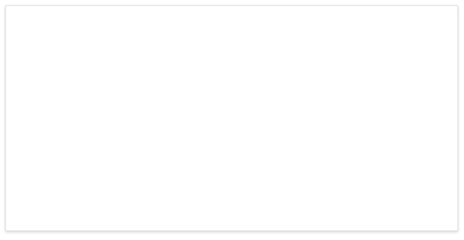
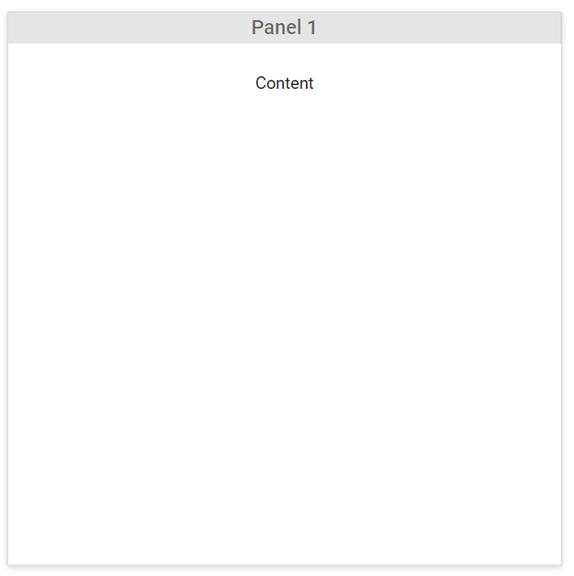

# Getting Started with Blazor Dashboard Layout Component

This section briefly explains about how to include [Blazor Dashboard Layout](https://www.syncfusion.com/blazor-components/blazor-dashboard) component in your Blazor Server App and Blazor WebAssembly App using Visual Studio.

## Prerequisites

* [System requirements for Blazor components](https://blazor.syncfusion.com/documentation/system-requirements)

## Create a new Blazor App in Visual Studio

You can create **Blazor Server App** or **Blazor WebAssembly App** using Visual Studio in one of the following ways,

* [Create a Project using Microsoft Templates](https://docs.microsoft.com/en-us/aspnet/core/blazor/tooling?pivots=windows)

* [Create a Project using Syncfusion Blazor Extension](https://blazor.syncfusion.com/documentation/visual-studio-integration/vs2019-extensions/create-project)

## Install Syncfusion Blazor Layouts NuGet in the App

Syncfusion Blazor components are available in [nuget.org](https://www.nuget.org/packages?q=syncfusion.blazor). To use Syncfusion Blazor components in the application, add reference to the corresponding NuGet. Refer to [NuGet packages topic](https://blazor.syncfusion.com/documentation/nuget-packages) for available NuGet packages list with component details.

To add Blazor Dashnoard Layout component in the app, open the NuGet package manager in Visual Studio (*Tools → NuGet Package Manager → Manage NuGet Packages for Solution*), search for [Syncfusion.Blazor.Layouts](https://www.nuget.org/packages/Syncfusion.Blazor.Layouts) and then install it.

## Register Syncfusion Blazor Service

Open **~/_Imports.razor** file and import the Syncfusion.Blazor namespace.




@using Syncfusion.Blazor




Now, register the Syncfusion Blazor Service in the Blazor Server App or Blazor WebAssembly App. Here, Syncfusion Blazor Service is registered by setting [IgnoreScriptIsolation](https://help.syncfusion.com/cr/blazor/Syncfusion.Blazor.GlobalOptions.html#Syncfusion_Blazor_GlobalOptions_IgnoreScriptIsolation) property as true to load the scripts externally in the [next steps](#add-script-reference).

### Blazor Server App

* For **.NET 6** app, open the **~/Program.cs** file and register the Syncfusion Blazor Service.

* For **.NET 5 and .NET 3.X** app, open the **~/Startup.cs** file and register the Syncfusion Blazor Service.




using Microsoft.AspNetCore.Components;
using Microsoft.AspNetCore.Components.Web;
using Syncfusion.Blazor;

var builder = WebApplication.CreateBuilder(args);

// Add services to the container.
builder.Services.AddRazorPages();
builder.Services.AddServerSideBlazor();
builder.Services.AddSyncfusionBlazor(options => { options.IgnoreScriptIsolation = true; });

var app = builder.Build();
....





using Syncfusion.Blazor;

namespace BlazorApplication
{
    public class Startup
    {
        ...
        public void ConfigureServices(IServiceCollection services)
        {
            services.AddRazorPages();
            services.AddServerSideBlazor();
            services.AddSyncfusionBlazor(options => { options.IgnoreScriptIsolation = true; });
        }
        ...
    }
}




### Blazor WebAssembly App

Open **~/Program.cs** file and register the Syncfusion Blazor Service in the client web app.




using Microsoft.AspNetCore.Components.Web;
using Microsoft.AspNetCore.Components.WebAssembly.Hosting;
using Syncfusion.Blazor;

var builder = WebAssemblyHostBuilder.CreateDefault(args);
builder.RootComponents.Add<App>("#app");
builder.RootComponents.Add<HeadOutlet>("head::after");

builder.Services.AddScoped(sp => new HttpClient { BaseAddress = new Uri(builder.HostEnvironment.BaseAddress) });

builder.Services.AddSyncfusionBlazor(options => { options.IgnoreScriptIsolation = true; });
await builder.Build().RunAsync();
....





using Syncfusion.Blazor;

namespace WebApplication1
{
    public class Program
    {
        public static async Task Main(string[] args)
        {
            ....
            builder.Services.AddSyncfusionBlazor(options => { options.IgnoreScriptIsolation = true; });
            await builder.Build().RunAsync();
        }
    }
}




## Add Style Sheet

Checkout the [Blazor Themes topic](https://blazor.syncfusion.com/documentation/appearance/themes) to learn different ways ([Static Web Assets](https://blazor.syncfusion.com/documentation/appearance/themes#static-web-assets), [CDN](https://sfblazor.azurewebsites.net/staging/documentation/appearance/themes#cdn-reference) and [CRG](https://blazor.syncfusion.com/documentation/common/custom-resource-generator)) to refer themes in Blazor application, and to have the expected appearance for Syncfusion Blazor components. Here, the theme is referred using [Static Web Assets](https://blazor.syncfusion.com/documentation/appearance/themes#static-web-assets).

To add theme to the app, open the NuGet package manager in Visual Studio (*Tools → NuGet Package Manager → Manage NuGet Packages for Solution*), search for [Syncfusion.Blazor.Themes](https://www.nuget.org/packages/Syncfusion.Blazor.Themes/) and then install it. Then, the theme style sheet from NuGet can be referred as follows,

### Blazor Server App

* For .NET 6 app, add the Syncfusion bootstrap5 theme in the `<head>` element of the **~/Pages/_Layout.cshtml** file.

* For .NET 5 and .NET 3.X app, add the Syncfusion bootstrap5 theme in the `<head>` element of the **~/Pages/_Host.cshtml** file.




<head>
    <link href="_content/Syncfusion.Blazor.Themes/bootstrap5.css" rel="stylesheet" />
</head>





<head>
    <link href="_content/Syncfusion.Blazor.Themes/bootstrap5.css" rel="stylesheet" />
</head>




### Blazor WebAssembly App

The theme style sheet from NuGet can be referred inside the `<head>` of **wwwroot/index.html** file in client web app.




<head>
    <link href="_content/Syncfusion.Blazor.Themes/bootstrap5.css" rel="stylesheet" />
</head>




## Add Script Reference

Checkout [Adding Script Reference topic](https://blazor.syncfusion.com/documentation/common/adding-script-references) to learn different ways to add script reference in Blazor Application. In this getting started walk-through, the required scripts are referred using [Static Web Assets](https://sfblazor.azurewebsites.net/staging/documentation/common/adding-script-references#static-web-assets) externally inside the `<head>` as follows,

### Blazor Server App

* **~/Pages/_Layout.cshtml** file for **.NET 6** app.

* **~/Pages/_Host.cshtml** file for **.NET 5 and .NET 3.X** app.




<head>
    ....
    <link href="_content/Syncfusion.Blazor.Themes/bootstrap5.css" rel="stylesheet" />
    
</head>





<head>
    ....
    <link href="_content/Syncfusion.Blazor.Themes/bootstrap5.css" rel="stylesheet" />
    
</head>




### Blazor WebAssembly App




<head>
    ....
    <link href="_content/Syncfusion.Blazor.Themes/bootstrap5.css" rel="stylesheet" />
    
</head>




> Syncfusion recommends to reference scripts using [Static Web Assets](https://blazor.syncfusion.com/documentation/common/adding-script-references#static-web-assets), [CDN](https://blazor.syncfusion.com/documentation/common/adding-script-references#cdn-reference) and [CRG](https://blazor.syncfusion.com/documentation/common/custom-resource-generator) by [disabling JavaScript isolation](https://blazor.syncfusion.com/documentation/common/adding-script-references#disable-javascript-isolation) for better loading performance of the Blazor application.

## Add Blazor Dashboard Layout component

* Open **~/_Imports.razor** file or any other page under the `~/Pages` folder where the component is to be added and import the **Syncfusion.Blazor.Layouts** namespace.




@using Syncfusion.Blazor
@using Syncfusion.Blazor.Layouts




* Now, add the Syncfusion Dashboard Layout component in razor file. Here, the Dashboard Layout component is added in the **~/Pages/Index.razor** file under the **~/Pages** folder.




<SfDashboardLayout>
    <DashboardLayoutPanels>
        <DashboardLayoutPanel>
        </DashboardLayoutPanel>
    </DashboardLayoutPanels>
</SfDashboardLayout>




> There is no need to assign default value for panels. Refer to the [Panels](./panels/position-sizing-of-panels/#panels) section to learn about default value.

* Press <kbd>Ctrl</kbd>+<kbd>F5</kbd> (Windows) or <kbd>⌘</kbd>+<kbd>F5</kbd> (macOS) to run the application. Then, the Syncfusion `Blazor Dashboard Layout` component will be rendered in the default web browser.

## Defining panels

A dashboard layout can be rendered with multiple panels to design a template with its basic properties.

A dashboard layout panel consists of two sections, which are Header and Content section. `HeaderTemplate` is used to render the Header section and `ContentTemplate` is used to render the content section.

Also, it is easy to interact with the panels by dragging, floating, and resizing functionality of panels.

### Panels with simple data

A dashboard layout panel is rendered with simple data. The header of a panel is defined by `HeaderTemplate` and content of a panel is defined by `ContentTemplate`.




<SfDashboardLayout>
    <DashboardLayoutPanels>
        <DashboardLayoutPanel>
            <HeaderTemplate>
Panel 1
</HeaderTemplate>
            <ContentTemplate>
Content
</ContentTemplate>
        </DashboardLayoutPanel>
    </DashboardLayoutPanels>
</SfDashboardLayout>




The Dashboard layout with simple content will be rendered in the web browser as demonstrated in the following screenshot.

### Panels with components

A dashboard layout can be rendered with the components like the chart, grids, maps, gauge, and more as a content of dashboard layout panel.

These complex data (components) are placed as the panel content by assigning the corresponding component element as the `ContentTemplate` of the panel.




@using Syncfusion.Blazor.Charts
@using Syncfusion.Blazor.Grids

    <SfDashboardLayout Columns="6" CellSpacing="@(new double[]{10 ,10 })">
        <DashboardLayoutPanels>
            <DashboardLayoutPanel Id="Panel1" SizeX="4" SizeY="2">
                <HeaderTemplate>
 Customers Count 
</HeaderTemplate>
                <ContentTemplate>
                    

                        <SfChart ID="linechart" @ref="linechartObj">
                            <ChartPrimaryXAxis ValueType="Syncfusion.Blazor.Charts.ValueType.DateTime">
                            </ChartPrimaryXAxis>
                            <ChartSeriesCollection>
                                <ChartSeries DataSource="@DataSource" XName="XValue" YName="YValue" Type="ChartSeriesType.Line">
                                    <ChartMarker Visible="true">
                                        <ChartDataLabel Visible="true" Position="Syncfusion.Blazor.Charts.LabelPosition.Top">
                                        </ChartDataLabel>
                                    </ChartMarker>
                                </ChartSeries>
                            </ChartSeriesCollection>
                        </SfChart>
                    

                </ContentTemplate>
            </DashboardLayoutPanel>
            <DashboardLayoutPanel Id="Panel2" SizeX="2" SizeY="2" Column="4">
                <HeaderTemplate>
 Product sales in Years 
</HeaderTemplate>
                <ContentTemplate>
                    

                        <SfRangeNavigator ID="range" @ref="rangeObj" Value="@Value" ValueType="Syncfusion.Blazor.Charts.RangeValueType.DateTime" IntervalType="RangeIntervalType.Years" LabelFormat="yyyy">
                            <RangeNavigatorSeriesCollection>
                                <RangeNavigatorSeries DataSource="@DataSource" XName="XValue" Type="RangeNavigatorType.Area" YName="YValue"></RangeNavigatorSeries>
                            </RangeNavigatorSeriesCollection>
                        </SfRangeNavigator>
                    

                </ContentTemplate>
            </DashboardLayoutPanel>
            <DashboardLayoutPanel Id="Panel3" SizeX="3" SizeY="2" Row=2 Column=3>
                <HeaderTemplate>
 Sales Ratio in Countries 
</HeaderTemplate>
                <ContentTemplate>
                    

                        <SfChart ID="chart" @ref="barchartObj">
                            <ChartPrimaryXAxis Title="Country" EnableTrim="true" ValueType="Syncfusion.Blazor.Charts.ValueType.Category">
                                <ChartAxisMajorGridLines Width="0"></ChartAxisMajorGridLines>
                            </ChartPrimaryXAxis>
                            <ChartSeriesCollection>
                                <ChartSeries DataSource="@DataSource" XName="X" YName="Y" Type="ChartSeriesType.Bar">
                                </ChartSeries>
                            </ChartSeriesCollection>
                        </SfChart>
                    

                </ContentTemplate>
            </DashboardLayoutPanel>
            <DashboardLayoutPanel Id="Panel4" SizeX=3 SizeY=2 Row=2 Column=0>
                <HeaderTemplate>
 Sales Comparison in Products  
</HeaderTemplate>
                <ContentTemplate>
                    

                        <SfChart ID="chart1" @ref="chartObj" Width="100%" Height="100%">
                            <ChartPrimaryXAxis ValueType="Syncfusion.Blazor.Charts.ValueType.Category"></ChartPrimaryXAxis>
                            <ChartSeriesCollection>
                                <ChartSeries DataSource="@DataSource" Name="Editors" XName="X1" YName="YValue" Type="ChartSeriesType.StackingColumn">
                                </ChartSeries>
                                <ChartSeries DataSource="@DataSource" Name="Layouts" XName="X1" YName="YValue" Type="ChartSeriesType.StackingColumn">
                                </ChartSeries>
                                <ChartSeries DataSource="@DataSource" Name="Grids" XName="X1" YName="YValue" Type="ChartSeriesType.StackingColumn">
                                </ChartSeries>
                            </ChartSeriesCollection>
                        </SfChart>
                    

                </ContentTemplate>
            </DashboardLayoutPanel>
            <DashboardLayoutPanel Id="Panel5" SizeX=6 SizeY=2 Column=6 Row=4>
                <HeaderTemplate>
 Top Customers Details
</HeaderTemplate>
                <ContentTemplate>
                    

                        <SfGrid ID="grid" DataSource="@Orders">
                            <GridPageSettings></GridPageSettings>
                            <GridColumns>
                                <GridColumn Field=@nameof(Order.OrderID) HeaderText="Order ID" TextAlign="Syncfusion.Blazor.Grids.TextAlign.Right" Width="120"></GridColumn>
                                <GridColumn Field=@nameof(Order.CustomerID) HeaderText="Customer Name" Width="130"></GridColumn>
                                <GridColumn Field=@nameof(Order.OrderDate) HeaderText=" Order Date" Format="yMd" Type="ColumnType.Date" TextAlign="Syncfusion.Blazor.Grids.TextAlign.Right" Width="150"></GridColumn>
                                <GridColumn Field=@nameof(Order.Freight) HeaderText="Freight" Format="C2" TextAlign="Syncfusion.Blazor.Grids.TextAlign.Right" Width="120"></GridColumn>
                            </GridColumns>
                        </SfGrid>
                    

                </ContentTemplate>
            </DashboardLayoutPanel>
        </DashboardLayoutPanels>
    </SfDashboardLayout>

@code
 { SfChart chartObj;
    SfChart barchartObj;
    SfRangeNavigator rangeObj;
    SfChart linechartObj;
    private object[] Value = new object[] { new DateTime(2006, 01, 01), new DateTime(2008, 01, 01) };
    public class ChartData
    {
        public DateTime XValue;
        public double YValue;
        public string X;
        public double Y;
        public string Country;
        public string X1;
        public double Y1;
        public double Y2;
        public double Y3;
        public double Y4;
    }
    public List<ChartData> DataSource = new List<ChartData>
{
        new ChartData { XValue = new DateTime(2005, 01, 01), YValue = 21, X = "USA", Y =300.2, Country = "USA: 72", X1= "2012"},
        new ChartData { XValue = new DateTime(2006, 01, 01), YValue = 24, X = "Russia", Y = 103.1, Country = "RUS: 103.1", X1= "2013"},
        new ChartData { XValue = new DateTime(2007, 01, 01), YValue = 36, X = "Brazil", Y = 139.1, Country = "BRZ: 139.1", X1= "2014"},
        new ChartData { XValue = new DateTime(2008, 01, 01), YValue = 38, X = "India", Y = 262.1, Country = "IND: 262.1", X1= "2015"},
        };
    public List<Order> Orders { get; set; }

    protected override void OnInitialized()
    {
        Orders = Enumerable.Range(1, 6).Select(x => new Order()
        {
            OrderID = 1000 + x,
            CustomerID = (new string[] { "ALFKI", "ANANTR", "ANTON", "BLONP", "BOLID" })[new Random().Next(5)],
            Freight = 2.1 * x,
            OrderDate = DateTime.Now.AddDays(-x),
        }).ToList();
    }

    public class Order
    {
        public int? OrderID { get; set; }
        public string CustomerID { get; set; }
        public DateTime? OrderDate { get; set; }
        public double? Freight { get; set; }
    }
    protected override async Task OnAfterRenderAsync(bool firstRender)
    {
        await Task.Delay(3000); // simulate the async operations
        this.chartObj.Refresh();
        this.linechartObj.Refresh();
        this.barchartObj.Refresh();
    }
 }




By default, the dashboard layout control is rendered with auto adjustable and [responsive](https://blazor.syncfusion.com/documentation/dashboard-layout/responsive-adaptive/) according to the parent dimensions.

## See Also

* [Getting Started with Syncfusion Blazor for Client-Side in .NET Core CLI](https://blazor.syncfusion.com/documentation/getting-started/blazor-webassembly-dotnet-cli/)

* [Getting Started with Syncfusion Blazor for Client-Side in Visual Studio 2019](https://blazor.syncfusion.com/documentation/getting-started/blazor-webassembly-visual-studio-2019/)

* [Getting Started with Syncfusion Blazor for Server-Side in .NET Core CLI](https://blazor.syncfusion.com/documentation/getting-started/blazor-server-side-dotnet-cli/)