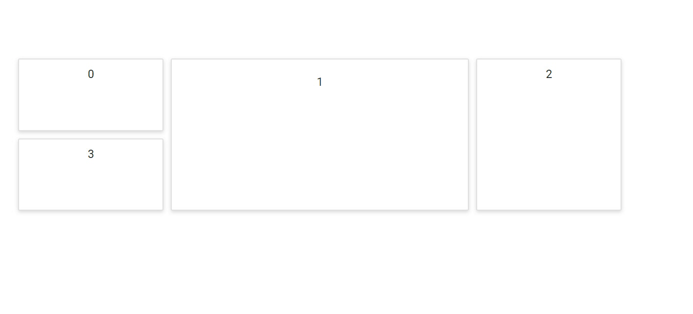

# Resizing Panels in Blazor Dashboard Layout Component

The DashboardLayout component is also provided with the panel resizing functionality, which can be enabled or disabled using the `AllowResizing` property. This functionality allows you to resize the panels dynamically through UI interactions using the resizing handlers, which controls the panel resizing in various directions.

```csharp

@using Syncfusion.Blazor.Layouts

<SfDashboardLayout CellSpacing="@(new double[]{10 ,10 })" Columns="5" CellAspectRatio="2"  AllowResizing="true">
    <DashboardLayoutPanels>
        <DashboardLayoutPanel>
            <ContentTemplate><div>0</div></ContentTemplate>
        </DashboardLayoutPanel>
        <DashboardLayoutPanel SizeX=2 SizeY=2 Column=1>
            <ContentTemplate><div>1</div></ContentTemplate>
        </DashboardLayoutPanel>
        <DashboardLayoutPanel SizeY=2 Column=3>
            <ContentTemplate><div>2</div></ContentTemplate>
        </DashboardLayoutPanel>
        <DashboardLayoutPanel Row=1>
            <ContentTemplate><div>3</div></ContentTemplate>
        </DashboardLayoutPanel>
    </DashboardLayoutPanels>
</SfDashboardLayout>

<style>
    .e-panel-content {
        text-align: center;
        margin-top: 10px;
    }
</style>

```

The following output demonstrates the Resizing behavior of Dashboard layout component.



>**Note:** Initially, the panels can be resized only in south-east direction. However, panels can also be resized in east, west, north, south, and south-west directions by defining the required directions with the `ResizableHandles` property.