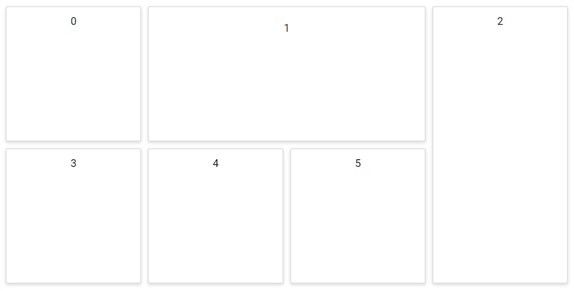

# Size and Position in Blazor Dashboard Layout Component

Panels are the basic building blocks of the Dashboard Layout component. They act as a container for the data to be visualized or presented.

The following table represents all the available panel properties and the corresponding functionalities:

| **PanelObject** | **Default Value** | **Description** |
| --- | --- | --- |
| <kbd>Id</kbd> | null | Specifies the ID value of the panel. |
| <kbd>Row</kbd> | 0 | Specifies the row value in which the panel to be placed. |
| <kbd>Column</kbd> | 0 | Specifies the column value in which the panel to be placed. |
| <kbd>SizeX</kbd> | 1 | Specifies the width of the panel in cells count. |
| <kbd>SizeY</kbd> | 1 | Specifies the height of the panel in cells count. |
| <kbd>MinSizeX</kbd> | 1 | Specifies the minimum width of the panel in cells count. |
| <kbd>MinSizeY</kbd> | 1 | Specifies the minimum height of the panel in cells count. |
| <kbd>MaxSizeX</kbd> | null | Specifies the maximum width of the panel in cells count. |
| <kbd>MaxSizeY</kbd> |  null | Specifies the maximum height of the panel in cells count. |
| <kbd>HeaderTemplate</kbd> | null | Specifies the header template of the panel. |
| <kbd>ContentTemplate</kbd> | null | Specifies the content template of the panel. |
| <kbd>CssClass</kbd> | null | Specifies the CSS class name that can be appended with each panel element.|

## Positioning of panels

The panels within the layout can be easily positioned or ordered using the [`Row`](https://help.syncfusion.com/cr/blazor/Syncfusion.Blazor.Layouts.DashboardLayoutPanel.html#Syncfusion_Blazor_Layouts_DashboardLayoutPanel_Row) and [`Column`](https://help.syncfusion.com/cr/blazor/Syncfusion.Blazor.Layouts.DashboardLayoutPanel.html#Syncfusion_Blazor_Layouts_DashboardLayoutPanel_Column) properties of the panels. Positioning of panels will be beneficial to represent the data in any desired order.

```cshtml

@using Syncfusion.Blazor.Layouts

<SfDashboardLayout CellSpacing="@(new double[]{20 ,20 })" Columns="4">
    <DashboardLayoutPanels>
        <DashboardLayoutPanel>
            <ContentTemplate><div>1</div></ContentTemplate>
        </DashboardLayoutPanel>
        <DashboardLayoutPanel  Column=1>
            <ContentTemplate><div>2</div></ContentTemplate>
        </DashboardLayoutPanel>
        <DashboardLayoutPanel Column=2>
            <ContentTemplate><div>3</div></ContentTemplate>
        </DashboardLayoutPanel>
        <DashboardLayoutPanel Row=1>
            <ContentTemplate><div>4</div></ContentTemplate>
        </DashboardLayoutPanel>
        <DashboardLayoutPanel Row=1 Column=1>
            <ContentTemplate><div>5</div></ContentTemplate>
        </DashboardLayoutPanel>
        <DashboardLayoutPanel Row=1 Column=2>
            <ContentTemplate><div>6</div></ContentTemplate>
        </DashboardLayoutPanel>
    </DashboardLayoutPanels>
</SfDashboardLayout>

<style>
    .e-panel-content {
        text-align: center;
        margin-top: 10px;
    }
</style>

```



The following screenshot shows the positioning of panels within the Dashboard Layout using the row and column properties of the panels.


## Sizing of panels

A panel's size can be varied easily by defining the [`SizeX`](https://help.syncfusion.com/cr/blazor/Syncfusion.Blazor.Layouts.DashboardLayoutPanel.html#Syncfusion_Blazor_Layouts_DashboardLayoutPanel_SizeX) and [`SizeY`](https://help.syncfusion.com/cr/blazor/Syncfusion.Blazor.Layouts.DashboardLayoutPanel.html#Syncfusion_Blazor_Layouts_DashboardLayoutPanel_SizeY) properties.

* `SizeX` property defines the width of a panel in cells count.
* `SizeY` property defines the height of a panel in cells count.

These properties are helpful in designing a dashboard, where the content of each panel may vary in size.

```cshtml

@using Syncfusion.Blazor.Layouts

<SfDashboardLayout CellSpacing="@(new double[]{10 ,10 })" Columns="5">
    <DashboardLayoutPanels>
        <DashboardLayoutPanel>
            <ContentTemplate><div>0</div></ContentTemplate>
        </DashboardLayoutPanel>
        <DashboardLayoutPanel SizeX=2 Column=1>
            <ContentTemplate><div>1</div></ContentTemplate>
        </DashboardLayoutPanel>
        <DashboardLayoutPanel SizeY=2 Column=3>
            <ContentTemplate><div>2</div></ContentTemplate>
        </DashboardLayoutPanel>
        <DashboardLayoutPanel Row=1>
            <ContentTemplate><div>3</div></ContentTemplate>
        </DashboardLayoutPanel>
        <DashboardLayoutPanel Row=1 Column=1>
            <ContentTemplate><div>4</div></ContentTemplate>
        </DashboardLayoutPanel>
        <DashboardLayoutPanel Row=1 Column=2>
            <ContentTemplate><div>5</div></ContentTemplate>
        </DashboardLayoutPanel>
    </DashboardLayoutPanels>
</SfDashboardLayout>

<style>
    .e-panel-content {
        text-align: center;
        margin-top: 10px;
    }
</style>

```



The following screenshot shows the sizing of panels within the Dashboard Layout using the SizeX and SizeY properties of the panels.

