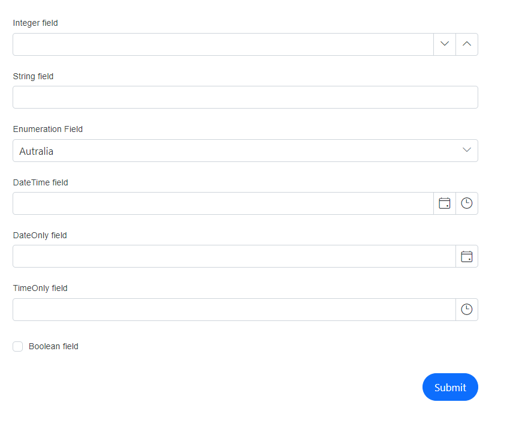
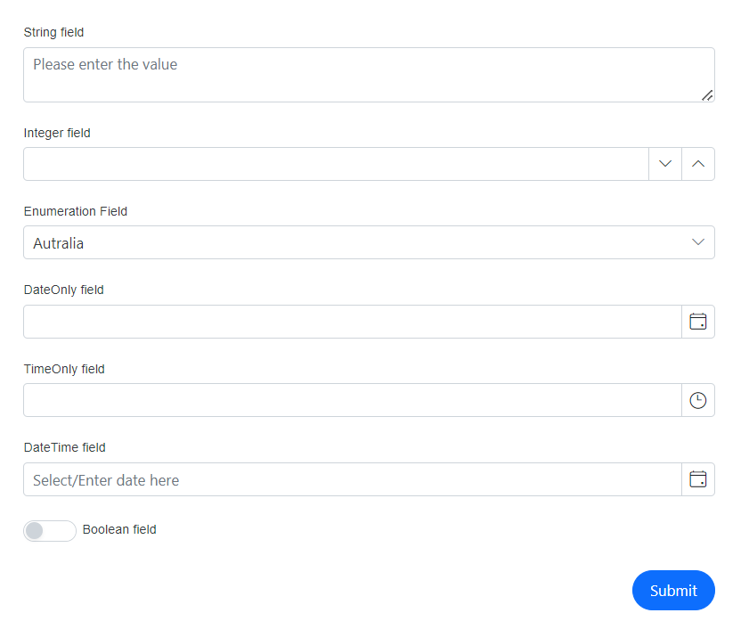
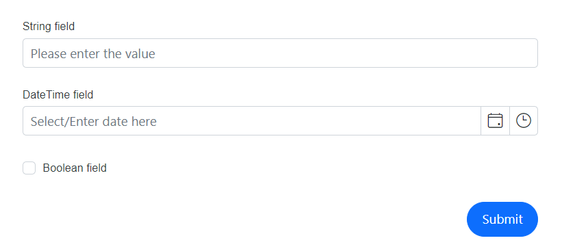

# Configuring auto generation 

Blazor DataForm can create editor fields automatically based on the primitive property types when the [FormAutoGenerateItems](https://help.syncfusion.com/cr/blazor/Syncfusion.Blazor.DataForm.FormAutoGenerateItems.html) tag is used inside the DataForm. The following table lists each supported type with its corresponding default editor component.

| Type | Component |
| ------------ | ----------------------- |
| `int` , `float`, `decimal`,`double`,`long` | [SfNumericTextBox](https://help.syncfusion.com/cr/blazor/Syncfusion.Blazor.Inputs.SfNumericTextBox-1.html#properties) |
| `string` | [SfTextBox](https://help.syncfusion.com/cr/blazor/Syncfusion.Blazor.Inputs.SfTextBox.html) |
| `DateTime` | [SfDateTimePicker](https://help.syncfusion.com/cr/blazor/Syncfusion.Blazor.Calendars.SfDateTimePicker-1.html) |
| `DateOnly` | [SfDatePicker](https://help.syncfusion.com/cr/blazor/Syncfusion.Blazor.Calendars.SfDatePicker-1.html) |
| `TimeOnly` | [SfTimePicker](https://help.syncfusion.com/cr/blazor/Syncfusion.Blazor.Calendars.SfTimePicker-1.html) |
| `bool` | [SfCheckBox](https://help.syncfusion.com/cr/blazor/Syncfusion.Blazor.Buttons.SfCheckBox-1.html) |
| `enum` | [SfDropDownList](https://help.syncfusion.com/cr/blazor/Syncfusion.Blazor.DropDowns.SfDropDownList-2.html) |

The following example demonstrates auto-generated items for the supported types.









## Combined auto generated and custom fields

The `FormAutoGenerateItems` can be utilized independently, as demonstrated in the previous example, or it can be placed in-between, above, or below multiple `FormItem` tags. This creates editors for all supported types except those explicitly defined using `FormItem`, preventing duplicate editors.









In the given example, `StringField`, `DateTimeField`, and `BoolField` are explicitly defined with `FormItem`. All remaining eligible properties are auto-generated with their corresponding editor types and positioned relative to the `FormAutoGenerateItems` tag.

## Cancel the auto generate fields 

Auto-generation can be controlled in two ways:
- To disable auto-generation entirely, omit the `FormAutoGenerateItems` tag. Only the explicitly declared `FormItem` elements will render.
- To exclude specific fields while keeping auto-generation for the rest, declare those fields explicitly using `FormItem`. When both `FormItem` and `FormAutoGenerateItems` are present, the explicitly defined fields are not auto-generated.









## See also

[Explicitly define editors](https://blazor.syncfusion.com/documentation/data-form/form-items)