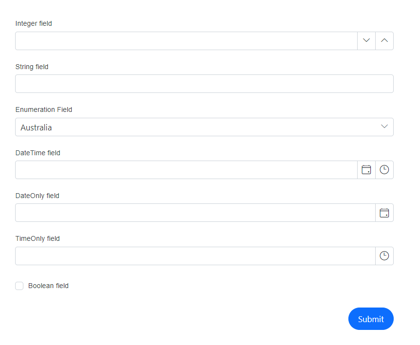

# Configuring auto generated items in DataForm Component

Blazor DataForm component generates the editors automatically based on the primitive property types if we use [FormAutoGenerateItems](https://help.syncfusion.com/cr/blazor/Syncfusion.Blazor.DataForm.FormAutoGenerateItems.html) inside it.The types with its corresponding default editor components listed below for reference.

| Type | Component |
| ------------ | ----------------------- |
| `int` , `float`, `decimal`,`double`,`long` | [SfNumericTextBox](https://help.syncfusion.com/cr/blazor/Syncfusion.Blazor.Inputs.SfNumericTextBox-1.html#properties) |
| `string` | [SfTextBox](https://help.syncfusion.com/cr/blazor/Syncfusion.Blazor.Inputs.SfTextBox.html) |
| `DateTime` | [SfDateTimePicker](https://help.syncfusion.com/cr/blazor/Syncfusion.Blazor.Calendars.SfDateTimePicker-1.html) |
| `DateOnly` | [SfDatePicker](https://help.syncfusion.com/cr/blazor/Syncfusion.Blazor.Calendars.SfDatePicker-1.html) |
| `TimeOnly` | [SfTimePicker](https://help.syncfusion.com/cr/blazor/Syncfusion.Blazor.Calendars.SfTimePicker-1.html) |
| `bool` | [SfCheckBox](https://help.syncfusion.com/cr/blazor/Syncfusion.Blazor.Buttons.SfCheckBox-1.html) |
| `enum` | [SfDropDownList](https://help.syncfusion.com/cr/blazor/Syncfusion.Blazor.DropDowns.SfDropDownList-2.html) |

The below example demonstrates the auto generated items with possible types 




@using Syncfusion.Blazor.DataForm
@using System.ComponentModel.DataAnnotations

<SfDataForm ID="MyForm" Model="@FieldTypeModel" Width="50%">
           
    <FormValidator>
        <DataAnnotationsValidator></DataAnnotationsValidator>
    </FormValidator>

    <FormItems>
        <FormAutoGenerateItems />
    </FormItems>

</SfDataForm>

@code {

    public enum Countries
    {
        Australia,
        Bermuda,
        Canada
    }

    public class FieldTypes
    {
        [Required(ErrorMessage = "Please enter a value for the IntField")]
        [Display(Name = "Integer field")]
        public int? IntField { get; set; }

        [Required(ErrorMessage = "Please enter a value for the StringField")]
        [Display(Name = "String field")]
        public string StringField { get; set; }

        [Required(ErrorMessage = "Please enter a value for the StringField")]
        [Display(Name = "Enumeration Field")]
        public Countries EnumField { get; set; }

        [Required(ErrorMessage = "Please select a date for the DateTimeField")]
        [Display(Name = "DateTime field")]
        public DateTime? DateTimeField { get; set; }

        [Required(ErrorMessage = "Please select a date for the DateOnlyField")]
        [Display(Name = "DateOnly field")]
        public DateOnly? DateOnlyField { get; set; }

        [Required(ErrorMessage = "Please select a time for the TimeOnlyField")]
        [Display(Name = "TimeOnly field")]
        public TimeOnly? TimeOnlyField { get; set; }

        [Required(ErrorMessage = "Please check the BoolField")]
        [Range(typeof(bool), "true", "true", ErrorMessage = "The BoolField must be checked")]
        [Display(Name = "Boolean field")]
        public bool BoolField { get; set; }
    }

    private FieldTypes FieldTypeModel = new FieldTypes();
}




## Combination of FormAutoGenerateItems and FormItem

The `FormAutoGenerateItems` can be utilized independently, as demonstrated in the previous example, or it can be placed in-between, above, or below multiple `FormItem` tags. This will create editors for all types except those explicitly defined using `FormItem`.




@using Syncfusion.Blazor.DataForm
@using System.ComponentModel.DataAnnotations
@using Syncfusion.Blazor.DataForm
@using System.ComponentModel.DataAnnotations

<SfDataForm ID="MyForm" Model="@FieldTypeModel" Width="50%">
           
    <FormValidator>
        <DataAnnotationsValidator></DataAnnotationsValidator>
    </FormValidator>

    <FormItems>
        <FormItem Field="@nameof(FieldTypeModel.StringField)" EditorType="FormEditorType.TextArea" Placeholder="Please enter the value"></FormItem>
        <FormAutoGenerateItems />
        <FormItem Field="@nameof(FieldTypeModel.DateTimeField)" EditorType="FormEditorType.DatePicker" Placeholder="Select/Enter date here"></FormItem>
        <FormItem Field="@nameof(FieldTypeModel.BoolField)" EditorType="FormEditorType.Switch" ></FormItem>

    </FormItems>

</SfDataForm>

@code {

    public enum Countries
    {
        Australia,
        Bermuda,
        Canada
    }

    public class FieldTypes
    {
        [Required(ErrorMessage = "Please enter a value for the IntField")]
        [Display(Name = "Integer field")]
        public int? IntField { get; set; }

        [Required(ErrorMessage = "Please enter a value for the StringField")]
        [Display(Name = "String field")]
        public string StringField { get; set; }

        [Required(ErrorMessage = "Please enter a value for the StringField")]
        [Display(Name = "Enumeration Field")]
        public Countries EnumField { get; set; }

        [Required(ErrorMessage = "Please select a date for the DateTimeField")]
        [Display(Name = "DateTime field")]
        public DateTime? DateTimeField { get; set; }

        [Required(ErrorMessage = "Please select a date for the DateOnlyField")]
        [Display(Name = "DateOnly field")]
        public DateOnly? DateOnlyField { get; set; }

        [Required(ErrorMessage = "Please select a time for the TimeOnlyField")]
        [Display(Name = "TimeOnly field")]
        public TimeOnly? TimeOnlyField { get; set; }

        [Required(ErrorMessage = "Please check the BoolField")]
        [Range(typeof(bool), "true", "true", ErrorMessage = "The BoolField must be checked")]
        [Display(Name = "Boolean field")]
        public bool BoolField { get; set; }
    }

    private FieldTypes FieldTypeModel = new FieldTypes();
}




In the given example, apart from `StringField`, `DateTimeField`, and `BoolField`, the remaining elements will be generated and placed automatically within the specified `FormItem` along with their corresponding editor types.

## See Also

[Explicitly define editors](https://blazor.syncfusion.com/documentation/data-form/form-items)