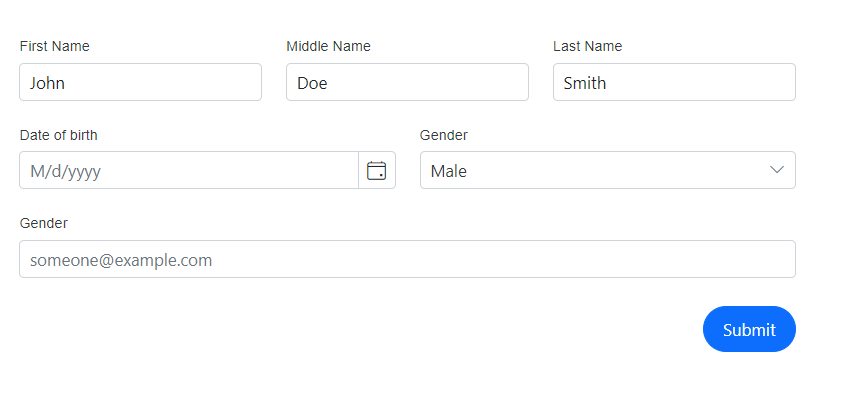

# Column layout in Blazor DataForm Component

This segment provides guidance on dividing the form field editors inside the DataForm component into a column-based layout. Additionally, it details the method for setting the column span for each `FormItem`.

The [ColumnCount](https://help.syncfusion.com/cr/blazor/Syncfusion.Blazor.DataForm.SfDataForm.html#Syncfusion_Blazor_DataForm_SfDataForm_ColumnCount) property allows us to specify the number of columns into which the DataForm should be divided. Additionally, by utilizing the [ColumnSpan](https://help.syncfusion.com/cr/blazor/Syncfusion.Blazor.DataForm.FormItem.html#Syncfusion_Blazor_DataForm_FormItem_ColumnSpan) attribute of a `FormItem`, we can control the width of the editor, either allowing it to expand to full width or allocating it a portion of the width based on the provided column span.




@using Syncfusion.Blazor.DataForm
@using System.ComponentModel.DataAnnotations

<SfDataForm Width="50%"
            Model="@RegistrationDetailsModel" ColumnCount="6" ColumnSpacing="20px">

    <FormValidator>
        <DataAnnotationsValidator></DataAnnotationsValidator>
    </FormValidator>

    <FormItems>
        <FormItem Field="@nameof(RegistrationDetailsModel.FirstName)" LabelText="First Name"  ColumnSpan="2"></FormItem>
        <FormItem Field="@nameof(RegistrationDetailsModel.MiddleName)" LabelText="Middle Name" ColumnSpan="2"></FormItem>
        <FormItem Field="@nameof(RegistrationDetailsModel.LastName)" LabelText="Last Name" ColumnSpan="2"></FormItem>
        <FormItem Field="@nameof(RegistrationDetailsModel.DOB)" LabelText="Date of birth" Placeholder="M/d/yyyy" EditorType="FormEditorType.DatePicker" ColumnSpan="3"></FormItem>
        <FormItem Field="@nameof(RegistrationDetailsModel.Sex)" LabelText="Gender" ColumnSpan="3"></FormItem>
        <FormItem Field="@nameof(RegistrationDetailsModel.Email)" LabelText="Gender" ColumnSpan="6" Placeholder="someone@example.com"></FormItem>
    </FormItems>

</SfDataForm>

@code {

    public enum Gender
    {
        Male,
        Female,
        Others
    }

    public class RegistrationDetails
    {

        [Required(ErrorMessage = "Please enter your first name")]
        public string FirstName { get; set; }

        public string MiddleName { get; set; }

        [Required(ErrorMessage = "Please enter your last name")]
        public string LastName { get; set; }

        [Required(ErrorMessage = "Please enter your date of birth")]
        public DateTime? DOB { get; set; }

        [Required(ErrorMessage = "Please choose your gender")]
        public Gender Sex { get; set; }

        [Required(ErrorMessage = "Please enter your email address")]
        [EmailAddress(ErrorMessage = "Please enter valid email address")]
        public string Email { get; set; }
    }

    private RegistrationDetails RegistrationDetailsModel = new RegistrationDetails()
    {
        FirstName = "John",
        MiddleName = "Doe",
        LastName = "Smith"
    };

}




In the provided example, the layout of the DataForm is segmented into six equal columns, with the editor fields distributed accordingly, depending on the column span allocated to each one.

## See Also

* [Adaptive Layout structure](https://blazor.syncfusion.com/demos/data-form/adaptive-layout?theme=fluent)