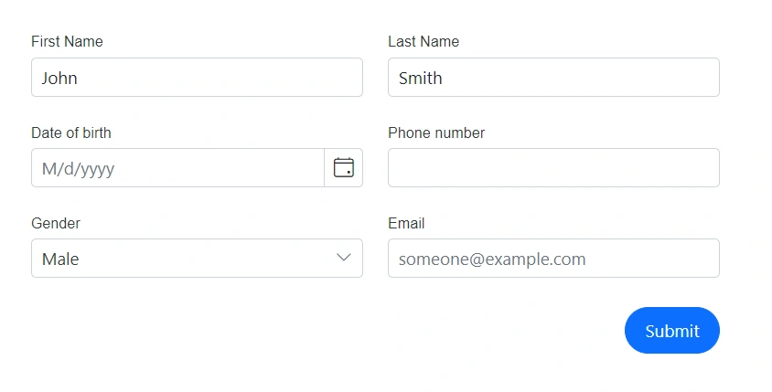
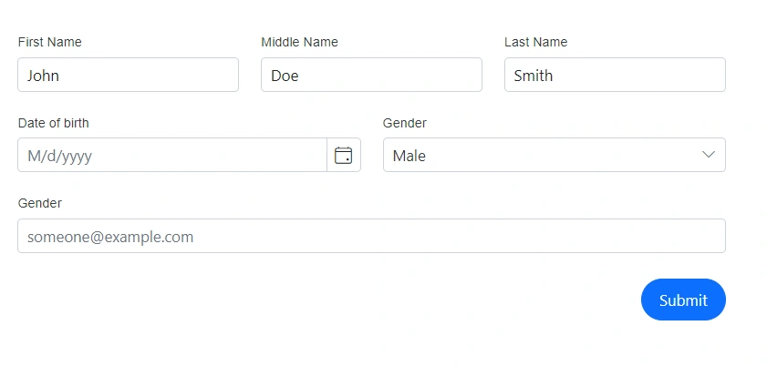

# Column Layout in Blazor Data Form

This section explains how to arrange DataForm editors in a column-based layout. Use the [ColumnCount](https://help.syncfusion.com/cr/blazor/Syncfusion.Blazor.DataForm.SfDataForm.html#Syncfusion_Blazor_DataForm_SfDataForm_ColumnCount) property to specify the number of columns into which the DataForm should be divided.









## Configure the column span

Additionally, by utilizing the [ColumnSpan](https://help.syncfusion.com/cr/blazor/Syncfusion.Blazor.DataForm.FormItem.html#Syncfusion_Blazor_DataForm_FormItem_ColumnSpan) attribute of a `FormItem`, we can control the width of the editor, either allowing it to expand to full width or allocating it a portion of the width based on the provided column span.









In the following example, the DataForm is divided into six equal columns. Each editor consumes space based on its configured column span, resulting in rows where items align cleanly and wrap to the next row when the remaining columns are insufficient.

## See Also

* [Adaptive Layout structure](https://blazor.syncfusion.com/demos/data-form/adaptive-layout?theme=fluent2)