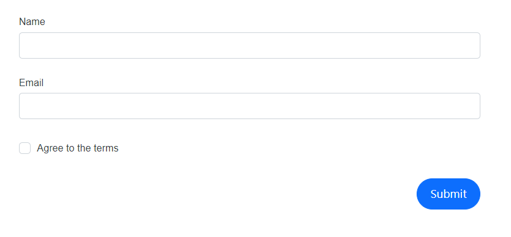

# Column layout in DataForm component

This segment provides guidance on dividing the form field editors inside the DataForm component into a column-based layout. The [ColumnCount](https://help.syncfusion.com/cr/blazor/Syncfusion.Blazor.DataForm.SfDataForm.html#Syncfusion_Blazor_DataForm_SfDataForm_ColumnCount) property allows us to specify the number of columns into which the DataForm should be divided. 









## Configure the column span 

Additionally, by utilizing the [ColumnSpan](https://help.syncfusion.com/cr/blazor/Syncfusion.Blazor.DataForm.FormItem.html#Syncfusion_Blazor_DataForm_FormItem_ColumnSpan) attribute of a `FormItem`, we can control the width of the editor, either allowing it to expand to full width or allocating it a portion of the width based on the provided column span.









In the provided example, the layout of the DataForm is segmented into six equal columns, with the editor fields distributed accordingly, depending on the column span allocated to each one.

## See Also

* [Adaptive Layout structure](https://blazor.syncfusion.com/demos/data-form/adaptive-layout?theme=fluent)