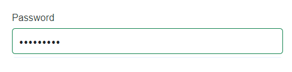

# Data annotation attributes

The DataForm component supports .NET data annotation attributes from [System.ComponentModel.DataAnnotations](https://learn.microsoft.com/en-us/dotnet/api/system.componentmodel.dataannotations?view=net-8.0) to control labels, placeholders, auto-generation, editable, and validation behavior.

## Display attribute

The [DisplayAttribute](https://learn.microsoft.com/en-us/dotnet/api/system.componentmodel.dataannotations.displayattribute?view=net-8.0) class specifies display-related metadata for a property. If a form item does not set a label explicitly, the DataForm uses the display name as the label for the corresponding editor. 

### Name property

The [Name](https://learn.microsoft.com/en-us/dotnet/api/system.componentmodel.dataannotations.displayattribute.name?view=net-8.0#system-componentmodel-dataannotations-displayattribute-name) property sets the display name used as the editor label when a form item does not define label text.




[Display(Name = "First Name")]
public string FirstName { get; set; }




### Short name property

The [ShortName](https://learn.microsoft.com/en-us/dotnet/api/system.componentmodel.dataannotations.displayattribute.shortname?view=net-8.0#system-componentmodel-dataannotations-displayattribute-shortname) property sets a shorter display name that can be used as the editor label when label text is not specified for the form item.




[Display(ShortName = "First Name")]
public string FirstName { get; set; }




N> DataForm gives priority to the [ShortName](https://learn.microsoft.com/en-us/dotnet/api/system.componentmodel.dataannotations.displayattribute.shortname?view=net-8.0#system-componentmodel-dataannotations-displayattribute-shortname) property over the [Name](https://learn.microsoft.com/en-us/dotnet/api/system.componentmodel.dataannotations.displayattribute.name?view=net-8.0#system-componentmodel-dataannotations-displayattribute-name) property of `DisplayAttribute` and the [LabelText](https://help.syncfusion.com/cr/blazor/Syncfusion.Blazor.DataForm.FormItem.html#Syncfusion_Blazor_DataForm_FormItem_LabelText) property of the `FormItem`.

### Prompt property

The [Prompt](https://learn.microsoft.com/en-us/dotnet/api/system.componentmodel.dataannotations.displayattribute.prompt?view=net-8.0#system-componentmodel-dataannotations-displayattribute-prompt) property specifies placeholder text for the corresponding editor.




[Display(Prompt = "Enter your first name")]
public string FirstName { get; set; }




### Auto generate field property

The [AutoGenerateField](https://learn.microsoft.com/en-us/dotnet/api/system.componentmodel.dataannotations.displayattribute.autogeneratefield?view=net-8.0#system-componentmodel-dataannotations-displayattribute-autogeneratefield) property indicates whether the property should be automatically generated as a field in the DataForm.




[Display(AutoGenerateField = false)]
public string ID { get; set; }




## Validation attributes

The DataForm component supports the following validation attributes from the [System.ComponentModel.DataAnnotations](https://learn.microsoft.com/en-us/dotnet/api/system.componentmodel.dataannotations?view=net-8.0) namespace. When validation fails, the DataForm displays the associated error message.

### Required attribute

The [RequiredAttribute](https://learn.microsoft.com/en-us/dotnet/api/system.componentmodel.dataannotations.requiredattribute?view=net-8.0) class specifies that a property value is mandatory.




[Required(ErrorMessage = "Name is required")]
public string Name { get; set; }




### Range attribute

The [RangeAttribute](https://learn.microsoft.com/en-us/dotnet/api/system.componentmodel.dataannotations.rangeattribute?view=net-8.0) class defines numeric range constraints for a property.




[Range(0, 100, ErrorMessage = "Age must be between 0 and 100")]
public int Age { get; set; }




### Regular expression attribute

The [RegularExpressionAttribute](https://learn.microsoft.com/en-us/dotnet/api/system.componentmodel.dataannotations.regularexpressionattribute?view=net-8.0) class enforces that a property value matches a specified regular expression pattern.




[RegularExpression(@"^[a-zA-Z]+$", ErrorMessage = "Name must contain only alphabets")]
public string Name { get; set; }




### String length Attribute

The [StringLengthAttribute](https://learn.microsoft.com/en-us/dotnet/api/system.componentmodel.dataannotations.stringlengthattribute?view=net-8.0) class specifies minimum and maximum length constraints for a property value.




 [StringLength(100, MinimumLength = 3, ErrorMessage = "Name must be between 5 and 10 characters")]
 public string Name { get; set; }




### Minimum length Attribute

The [MinLengthAttribute](https://learn.microsoft.com/en-us/dotnet/api/system.componentmodel.dataannotations.minlengthattribute?view=net-8.0) class defines the minimum length constraint for a property value.




[MinLength(3, ErrorMessage = "Name must be at least 3 characters")]
public string Name { get; set; }




### Maximum length Attribute

The [MaxLengthAttribute](https://learn.microsoft.com/en-us/dotnet/api/system.componentmodel.dataannotations.maxlengthattribute?view=net-8.0) class defines the maximum length constraint for a property value.




[MaxLength(10, ErrorMessage = "Name must be at most 10 characters")]
public string Name { get; set; }




### Phone number attribute

The [PhoneAttribute](https://learn.microsoft.com/en-us/dotnet/api/system.componentmodel.dataannotations.phoneattribute?view=net-8.0) class validates a property value against a phone number pattern.




[Phone(ErrorMessage = "Phone number is not valid")]
public string PhoneNumber { get; set; }




### Email address attribute

The [EmailAddressAttribute](https://learn.microsoft.com/en-us/dotnet/api/system.componentmodel.dataannotations.emailaddressattribute?view=net-8.0) class validates that a property value matches an email address pattern.




[EmailAddress(ErrorMessage = "Email address is not valid")]
public string Email { get; set; }




### URL attribute

The [UrlAttribute](https://learn.microsoft.com/en-us/dotnet/api/system.componentmodel.dataannotations.urlattribute?view=net-8.0) class validates that a property value matches a URL pattern.




[Url(ErrorMessage = "URL is not valid")]
public string Url { get; set; }




### Enum data type attribute

The [EnumDataTypeAttribute](https://learn.microsoft.com/en-us/dotnet/api/system.componentmodel.dataannotations.enumdatatypeattribute?view=net-8.0) class enforces that a property value is a member of the specified enumeration.




 [EnumDataType(typeof(Gender), ErrorMessage = "Please enter a valid gender")]
 public string Gender { get; set; }




### Compare attribute

The [CompareAttribute](https://learn.microsoft.com/en-us/dotnet/api/system.componentmodel.dataannotations.compareattribute?view=net-8.0) class validates that a property value matches another property’s value (for example, confirming a password). 




[Compare("Password", ErrorMessage = "Passwords do not match")]
public string ConfirmPassword { get; set; }




### String length attribute

The [StringLengthAttribute](https://learn.microsoft.com/en-us/dotnet/api/system.componentmodel.dataannotations.stringlengthattribute?view=net-8.0) class limits the length of input values and can display a validation message when limits are exceeded. Additionally, the editor component prevents entering characters beyond the specified maximum length. Note that the error message shown in the example is user-defined and may not mirror the exact minimum/maximum values configured in the attribute.




[StringLength(100, MinimumLength = 3, ErrorMessage = "Name must be between 5 and 10 characters")]
public string Name { get; set; }




## Data type attribute

The [DataTypeAttribute](https://learn.microsoft.com/en-us/dotnet/api/system.componentmodel.dataannotations.datatypeattribute?view=net-8.0) class specifies the semantic data type of a property. The DataForm uses this attribute to determine the editor type for the property. The following table lists supported data types and their corresponding editors.

| Data type | Editor type | Image |
| ------------ | ----------------------- | ------ |
| `DataType.Date` | [SfDatePicker](https://help.syncfusion.com/cr/blazor/Syncfusion.Blazor.Calendars.SfDatePicker-1.html) |  |
| `DataType.Time` | [SfTimePicker](https://help.syncfusion.com/cr/blazor/Syncfusion.Blazor.Calendars.SfTimePicker-1.html) | |
| `DataType.DateTime` | [SfDateTimePicker](https://help.syncfusion.com/cr/blazor/Syncfusion.Blazor.Calendars.SfDateTimePicker-1.html) | |
| `DataType.Currency` | [SfNumericTextBox](https://help.syncfusion.com/cr/blazor/Syncfusion.Blazor.Inputs.SfNumericTextBox-1.html) | |
| `DataType.PhoneNumber` | [SfMaskedTextBox](https://help.syncfusion.com/cr/blazor/Syncfusion.Blazor.Inputs.SfMaskedTextBox.html) | |
| `DataType.CreditCard` | [SfMaskedTextBox](https://help.syncfusion.com/cr/blazor/Syncfusion.Blazor.Inputs.SfMaskedTextBox.html) | |
| `DataType.MultilineText` | [SfTextBox](https://help.syncfusion.com/cr/blazor/Syncfusion.Blazor.Inputs.SfTextBox.html) |  |
| `DataType.Password` | [SfTextBox](https://help.syncfusion.com/cr/blazor/Syncfusion.Blazor.Inputs.SfTextBox.html) |  |
| <ul><li>`DataType.EmailAddress`</li><li>`DataType.Url`</li><li>`DataType.Text`</li><li> `DataType.ImageUrl`</li><li> `DataType.Html`</li></ul> | [SfTextBox](https://help.syncfusion.com/cr/blazor/Syncfusion.Blazor.Inputs.SfTextBox.html) | |

If a different data type is specified that is not listed above, the DataForm uses the [SfTextBox](https://help.syncfusion.com/cr/blazor/Syncfusion.Blazor.Inputs.SfTextBox.html) editor by default.




[DataType(DataType.Date)]
public DateTime? DateOfBirth { get; set; }




## Editable attribute

The [EditableAttribute](https://learn.microsoft.com/en-us/dotnet/api/system.componentmodel.dataannotations.editableattribute?view=net-8.0) class specifies whether a property is editable in the DataForm.




[Editable(false)]
public string ID { get; set; }




## Bindable attribute

The [BindableAttribute](https://learn.microsoft.com/en-us/dotnet/api/system.componentmodel.bindableattribute?view=net-8.0) class controls automatic field generation, similar to the `AutoGenerateField` setting in the Display attribute. When set to `false`, the property is not generated as a field in the DataForm.


  

[Bindable(false)]
public string ID { get; set; }




## Read only attribute

The [ReadOnlyAttribute](https://learn.microsoft.com/en-us/dotnet/api/system.componentmodel.readonlyattribute?view=net-8.0) class specifies whether the property should be read-only in the DataForm.




[ReadOnly(true)]
public string ID { get; set; }




## Custom attributes

### Data form display options attribute

The [DataFormDisplayOptionsAttribute](https://help.syncfusion.com/cr/blazor/Syncfusion.Blazor.DataForm.DataFormDisplayOptionsAttribute.html) attribute configures display options for a property in the DataForm. The DataForm uses this attribute to determine [ColumnSpan](https://help.syncfusion.com/cr/blazor/Syncfusion.Blazor.DataForm.DataFormDisplayOptionsAttribute.ColumnSpan.html) for the property.

















## Custom validation

A [custom validation attribute](https://learn.microsoft.com/en-us/previous-versions/aspnet/cc668224(v=vs.100)#creating-a-custom-validation-attribute) in .NET is a class that inherits from the [ValidationAttribute](https://learn.microsoft.com/en-us/dotnet/api/system.componentmodel.dataannotations.validationattribute?view=net-8.0&redirectedfrom=MSDN) abstract class and overrides the [IsValid](https://learn.microsoft.com/en-us/dotnet/api/system.componentmodel.dataannotations.validationattribute.isvalid?view=net-8.0#system-componentmodel-dataannotations-validationattribute-isvalid(system-object)) method. This method is called when the attribute is applied to a property and the property's value is being validated.

In the `IsValid` method, implement the validation logic. When validation fails, return a [ValidationResult](https://learn.microsoft.com/en-us/dotnet/api/system.componentmodel.dataannotations.validationresult?view=net-8.0) with an error message; when it succeeds, return `ValidationResult.Success`.









In the example, the `PasswordValidationAttribute` checks whether the password meets the required criteria (length, uppercase, lowercase, and special character). If not, it returns a `ValidationResult` with an appropriate message. The `EmailValidationAttribute` validates the email format and returns a `ValidationResult` with an error message when invalid.

