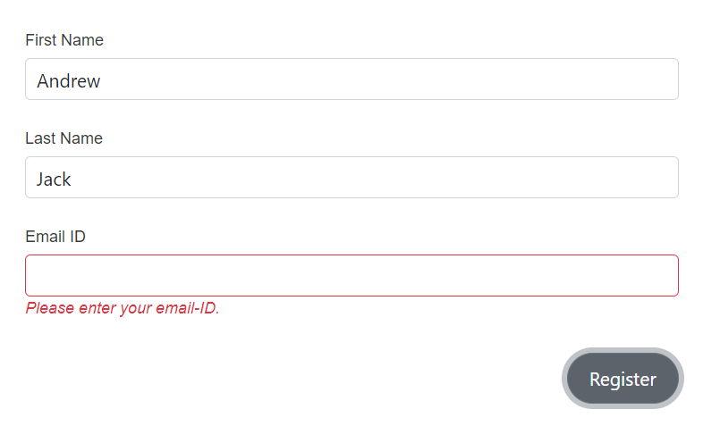

# Form binding in DataForm component

This section provides an overview of associating a [Model](https://learn.microsoft.com/en-us/dotnet/api/microsoft.aspnetcore.components.forms.editform.model?view=aspnetcore-7.0#microsoft-aspnetcore-components-forms-editform-model) or [EditContext](https://learn.microsoft.com/en-us/dotnet/api/microsoft.aspnetcore.components.forms.editform.editcontext?view=aspnetcore-7.0#microsoft-aspnetcore-components-forms-editform-editcontext) with a Data Form.

## Model binding 

The following example illustrates how the `Model` is bound to the DataForm component using the user-defined `EventRegistration` model class. Choose Model binding for straightforward scenarios where the form manages its own validation context internally.









## Edit context binding 

The following example illustrates how the `EditContext` is bound to the DataForm component using the user-defined `EventRegistration` model class. Choose EditContext binding when advanced control over validation state, messages, or custom validation logic is required, or when sharing an EditContext across components.









## FormName 

The `FormName` property to the DataForm component, will assign a specified value to the underlying EditForm.FormName. This allows unique identification of the form for processing or validation, especially in applications with multiple forms

The following example illustrates how to add the `FormName` for the DataForm component.






 
