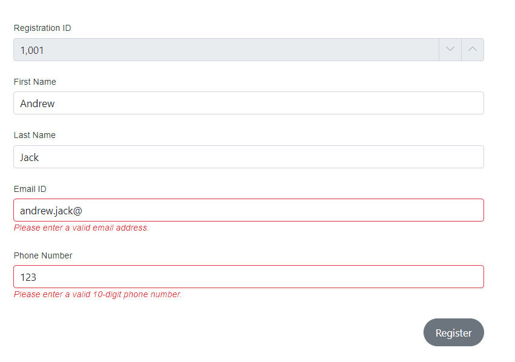

# Form Binding with Blazor DataForm Component

This segment provides a concise overview of the concepts involved in associating a [Model](https://learn.microsoft.com/en-us/dotnet/api/microsoft.aspnetcore.components.forms.editform.model?view=aspnetcore-7.0#microsoft-aspnetcore-components-forms-editform-model) or [EditContext](https://learn.microsoft.com/en-us/dotnet/api/microsoft.aspnetcore.components.forms.editform.editcontext?view=aspnetcore-7.0#microsoft-aspnetcore-components-forms-editform-editcontext) with a Data Form. Additionally, it covers how to apply the attributes of properties that are defined within the model class.

## Model and EditContext binding 

The following example illustrates how the `Model` or `EditContext` are bound to the DataForm component using the user-defined `EventRegistration` model class.




@using Syncfusion.Blazor.DataForm
@using Syncfusion.Blazor.Buttons
@using System.ComponentModel.DataAnnotations

<SfDataForm ID="MyForm" Width="50%"
            Model="@EventRegistrationModel">
    <FormValidator>
        <DataAnnotationsValidator></DataAnnotationsValidator>
    </FormValidator>
    <FormItems>
        <FormAutoGenerateItems></FormAutoGenerateItems>
    </FormItems>
    <FormButtons>
        <SfButton typeof="submit">Register</SfButton>
    </FormButtons>
</SfDataForm>
@code {
    private EventRegistration EventRegistrationModel = new EventRegistration()
        {
            FirstName = "Andrew",
            LastName = "Jack"
        };

    public class EventRegistration
    {
        [Required(ErrorMessage = "Please enter your name.")]
        [Display(Name = "First Name")]
        public string FirstName { get; set; }

        [Required(ErrorMessage = "Please enter your last name.")]
        [Display(Name = "Last Name")]
        public string LastName { get; set; }

        [Required(ErrorMessage = "Please enter your email-ID.")]
        [Display(Name = "Email ID")]
        public string Email { get; set; }
    }
}




@using Syncfusion.Blazor.DataForm
@using Syncfusion.Blazor.Buttons
@using System.ComponentModel.DataAnnotations

<SfDataForm ID="MyForm" Width="50%"
            EditContext="@RegistrationEditContext">
    <FormValidator>
        <DataAnnotationsValidator></DataAnnotationsValidator>
    </FormValidator>
    <FormItems>
        <FormAutoGenerateItems></FormAutoGenerateItems>
    </FormItems>
    <FormButtons>
        <SfButton typeof="submit">Register</SfButton>
    </FormButtons>
</SfDataForm>

@code {
    EditContext RegistrationEditContext { get; set; }

    protected override void OnInitialized()
    {
        RegistrationEditContext = new EditContext(EventRegistrationModel);
        base.OnInitialized();
    }

    private EventRegistration EventRegistrationModel = new EventRegistration()
    {
        FirstName = "Andrew",
        LastName = "Jack"
    };

    public class EventRegistration
    {
        [Required(ErrorMessage = "Please enter your name.")]
        [Display(Name = "First Name")]
        public string FirstName { get; set; }

        [Required(ErrorMessage = "Please enter your last name.")]
        [Display(Name = "Last Name")]
        public string LastName { get; set; }

        [Required(ErrorMessage = "Please enter your email-ID.")]
        [Display(Name = "Email ID")]
        public string Email { get; set; }
    }
}




## Data Annotation Attributes

The DataForm component enables users to define the data annotation attributes available from the instance of [System.ComponentModel.DataAnnotations](https://learn.microsoft.com/en-us/dotnet/api/system.componentmodel.dataannotations?view=net-5.0). For instance:

`[Display(Name = "Custom field name")]` - This attribute is used to set a custom name for the field, which will be shown as its label.

`[Editable(false)]` - When this attribute is used, it renders the associated field uneditable, thus preventing users from changing its content.

`[EmailAddress]` - This attribute checks to ensure that the value entered in the field conforms to a valid email address format.

For guidance on how to use some of these attributes in DataForm component, see the example provided below.




@using Syncfusion.Blazor.DataForm
@using Syncfusion.Blazor.Buttons
@using System.ComponentModel.DataAnnotations

@using Syncfusion.Blazor.DataForm
@using Syncfusion.Blazor.Buttons
@using System.ComponentModel.DataAnnotations

<SfDataForm ID="MyForm" Width="50%"
            Model="@EventRegistrationModel">
    <FormValidator>
        <DataAnnotationsValidator></DataAnnotationsValidator>
    </FormValidator>
    <FormItems>
        <FormAutoGenerateItems></FormAutoGenerateItems>
    </FormItems>
    <FormButtons>
        <SfButton typeof="submit">Register</SfButton>
    </FormButtons>
</SfDataForm>
@code {

    private EventRegistration EventRegistrationModel = new EventRegistration()
        {
            RegistrationId = 1001,
            FirstName = "Andrew",
            LastName = "Jack"
        };

    public class EventRegistration
    {
        [Required(ErrorMessage = "Please enter your name.")]
        [Display(Name = "Registration Id")]
        [Editable(false)]
        public int RegistrationId { get; set; }

        [Required(ErrorMessage = "Please enter your name.")]
        [Display(Name = "First Name")]
        public string FirstName { get; set; }

        [Required(ErrorMessage = "Please enter your last name.")]
        [Display(Name = "Last Name")]
        public string LastName { get; set; }

        [Required(ErrorMessage = "Please enter your email-ID.")]
        [EmailAddress(ErrorMessage = "Please enter a valid email address.")]
        [Display(Name = "Email ID")]
        public string Email { get; set; }

        [Required(ErrorMessage = "Please enter your phone number.")]
        [Display(Name = "Phone Number")]
        [RegularExpression(@"^\d{10}$", ErrorMessage = "Please enter a valid 10-digit phone number.")]
        public string PhoneNumber { get; set; }
    }
}



