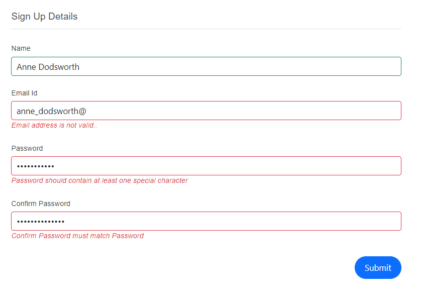

# Form Binding with Blazor DataForm Component

This segment provides a concise overview of the concepts involved in associating a [Model](https://learn.microsoft.com/en-us/dotnet/api/microsoft.aspnetcore.components.forms.editform.model?view=aspnetcore-7.0#microsoft-aspnetcore-components-forms-editform-model) or [EditContext](https://learn.microsoft.com/en-us/dotnet/api/microsoft.aspnetcore.components.forms.editform.editcontext?view=aspnetcore-7.0#microsoft-aspnetcore-components-forms-editform-editcontext) with a Data Form. Additionally, it covers how to apply the attributes of properties that are defined within the model class.

## Model binding 

The following example illustrates how the `Model` is bound to the DataForm component using the user-defined `EventRegistration` model class.




@using Syncfusion.Blazor.DataForm
@using Syncfusion.Blazor.Buttons
@using System.ComponentModel.DataAnnotations

<SfDataForm ID="MyForm" Width="50%"
            Model="@EventRegistrationModel">
    <FormValidator>
        <DataAnnotationsValidator></DataAnnotationsValidator>
    </FormValidator>
    <FormItems>
        <FormAutoGenerateItems></FormAutoGenerateItems>
    </FormItems>
    <FormButtons>
        <SfButton typeof="submit">Register</SfButton>
    </FormButtons>
</SfDataForm>
@code {
    private EventRegistration EventRegistrationModel = new EventRegistration()
        {
            FirstName = "Andrew",
            LastName = "Jack"
        };

    public class EventRegistration
    {
        [Required(ErrorMessage = "Please enter your name.")]
        [Display(Name = "First Name")]
        public string FirstName { get; set; }

        [Required(ErrorMessage = "Please enter your last name.")]
        [Display(Name = "Last Name")]
        public string LastName { get; set; }

        [Required(ErrorMessage = "Please enter your email-ID.")]
        [Display(Name = "Email ID")]
        public string Email { get; set; }
    }
}




## EditContext binding 

The following example illustrates how the `EditContext` is bound to the DataForm component using the user-defined `EventRegistration` model class.




@using Syncfusion.Blazor.DataForm
@using Syncfusion.Blazor.Buttons
@using System.ComponentModel.DataAnnotations

<SfDataForm ID="MyForm" Width="50%"
            EditContext="@RegistrationEditContext">
    <FormValidator>
        <DataAnnotationsValidator></DataAnnotationsValidator>
    </FormValidator>
    <FormItems>
        <FormAutoGenerateItems></FormAutoGenerateItems>
    </FormItems>
    <FormButtons>
        <SfButton typeof="submit">Register</SfButton>
    </FormButtons>
</SfDataForm>

@code {
    EditContext RegistrationEditContext { get; set; }

    protected override void OnInitialized()
    {
        RegistrationEditContext = new EditContext(EventRegistrationModel);
        base.OnInitialized();
    }

    private EventRegistration EventRegistrationModel = new EventRegistration()
    {
        FirstName = "Andrew",
        LastName = "Jack"
    };

    public class EventRegistration
    {
        [Required(ErrorMessage = "Please enter your name.")]
        [Display(Name = "First Name")]
        public string FirstName { get; set; }

        [Required(ErrorMessage = "Please enter your last name.")]
        [Display(Name = "Last Name")]
        public string LastName { get; set; }

        [Required(ErrorMessage = "Please enter your email-ID.")]
        [Display(Name = "Email ID")]
        public string Email { get; set; }
    }
}




## Data Annotation Attributes

The DataForm component enables users to define the data annotation attributes available from the instance of [System.ComponentModel.DataAnnotations](https://learn.microsoft.com/en-us/dotnet/api/system.componentmodel.dataannotations?view=net-5.0). For instance:

| FormButtonsAlignment | Snapshot |
| ------------ | ----------------------- |
|[Display(Name = "Custom field name")](https://learn.microsoft.com/en-us/dotnet/api/system.componentmodel.dataannotations.displayattribute?view=net-5.0)| This attribute is used to set a custom name for the field, which will be shown as its label.|
|[Editable(false)](https://learn.microsoft.com/en-us/dotnet/api/system.componentmodel.dataannotations.editableattribute?view=net-5.0) | When this attribute is used, it renders the associated field uneditable, thus preventing users from changing its content.|
|[EmailAddress](https://learn.microsoft.com/en-us/dotnet/api/system.componentmodel.dataannotations.emailaddressattribute?view=net-5.0) | This attribute checks to ensure that the value entered in the field conforms to a valid email address format.|

For guidance on how to use some of these attributes in DataForm component, see the example provided below.




@using Syncfusion.Blazor.DataForm
@using Syncfusion.Blazor.Buttons
@using System.ComponentModel.DataAnnotations

<SfDataForm ID="MyForm" Width="50%"
            Model="@EventRegistrationModel">
    <FormValidator>
        <DataAnnotationsValidator></DataAnnotationsValidator>
    </FormValidator>
    <FormItems>
        <FormAutoGenerateItems></FormAutoGenerateItems>
    </FormItems>
    <FormButtons>
        <SfButton typeof="submit">Register</SfButton>
    </FormButtons>
</SfDataForm>
@code {

    private EventRegistration EventRegistrationModel = new EventRegistration()
        {
            RegistrationId = 1001,
            FirstName = "Andrew",
            LastName = "Jack"
        };

    public class EventRegistration
    {
        [Required(ErrorMessage = "Please enter your name.")]
        [Display(Name = "Registration ID")]
        [Editable(false)]
        public int RegistrationId { get; set; }

        [Required(ErrorMessage = "Please enter your name.")]
        [Display(Name = "First Name")]
        public string FirstName { get; set; }

        [Required(ErrorMessage = "Please enter your last name.")]
        [Display(Name = "Last Name")]
        public string LastName { get; set; }

        [Required(ErrorMessage = "Please enter your email-ID.")]
        [EmailAddress(ErrorMessage = "Please enter a valid email address.")]
        [Display(Name = "Email ID")]
        public string Email { get; set; }

        [Required(ErrorMessage = "Please enter your phone number.")]
        [Display(Name = "Phone Number")]
        [RegularExpression(@"^\d{10}$", ErrorMessage = "Please enter a valid 10-digit phone number.")]
        public string PhoneNumber { get; set; }
    }
}



### Custom Validation

A [custom validation attribute](https://learn.microsoft.com/en-us/previous-versions/aspnet/cc668224(v=vs.100)#creating-a-custom-validation-attribute) in .NET is a class that inherits from the [ValidationAttribute](https://learn.microsoft.com/en-us/dotnet/api/system.componentmodel.dataannotations.validationattribute?view=net-8.0&redirectedfrom=MSDN) abstract class and overrides the [IsValid](https://learn.microsoft.com/en-us/dotnet/api/system.componentmodel.dataannotations.validationattribute.isvalid?view=net-8.0#system-componentmodel-dataannotations-validationattribute-isvalid(system-object)) method. This method is called when the attribute is applied to a property and the property's value is being validated.

In the `IsValid` method, you can define your custom validation logic. If the validation fails, you return a [ValidationResult](https://learn.microsoft.com/en-us/dotnet/api/system.componentmodel.dataannotations.validationresult?view=net-8.0) object with an error message. If the validation passes, you return `ValidationResult.Success`.




@using System;
@using System.ComponentModel.DataAnnotations;
@using Syncfusion.Blazor.DataForm;
@using System.Text.RegularExpressions;

<SfDataForm ID="MyForm"
            Model="@EmployeeModel"
            Width="50%">
    <FormValidator>
        <DataAnnotationsValidator></DataAnnotationsValidator>
    </FormValidator>
    <FormItems>
        <FormGroup LabelText="Sign Up Details">
            <FormItem Field="@nameof(EmployeeModel.Name)" LabelText="Name"></FormItem>
            <FormItem Field="@nameof(EmployeeModel.Email)" LabelText="Email Id"></FormItem>
            <FormItem Field="@nameof(EmployeeModel.Password)" LabelText="Password" EditorType="FormEditorType.Password"> </FormItem>
            <FormItem Field="@nameof(EmployeeModel.ConfirmPassword)" LabelText="Confirm Password" EditorType="FormEditorType.Password"> </FormItem>
        </FormGroup>
    </FormItems>
</SfDataForm>

@code {
    private EmployeeDetails EmployeeModel = new EmployeeDetails();

    public class EmployeeDetails
    {
        [Required]
        public string? Name { get; set; }

        [Required]
        [PasswordValidation(ErrorMessage = "This field should not be Empty")]
        public string? Password { get; set; }

        [Required]
        [Compare("Password", ErrorMessage = "Confirm Password must match Password")]
        public string? ConfirmPassword { get; set; }

        [Required]
        [EmailValidation(ErrorMessage = "This field should not be Empty")]
        public string? Email { get; set; }
    }

    public class PasswordValidationAttribute : ValidationAttribute
    {
        protected override ValidationResult IsValid(object value, ValidationContext validationContext)
        {
            string fieldValue = value as string;

            if (fieldValue.Length < 10)
            {
                return new ValidationResult("Password should have at least 10 characters", new[] { validationContext.MemberName });
            }

            if (!Regex.IsMatch(fieldValue, @"[A-Z]"))
            {
                return new ValidationResult("Password should contain at least one uppercase letter", new[] { validationContext.MemberName });
            }

            if (!Regex.IsMatch(fieldValue, @"[a-z]"))
            {
                return new ValidationResult("Password should contain at least one lowercase letter", new[] { validationContext.MemberName });
            }

            if (!Regex.IsMatch(fieldValue, @"[@#$%^&+=]"))
            {
                return new ValidationResult("Password should contain at least one special character", new[] { validationContext.MemberName });
            }

            return ValidationResult.Success;
        }
    }

    public class EmailValidationAttribute : ValidationAttribute
    {
        protected override ValidationResult IsValid(object value, ValidationContext validationContext)
        {
            string email = value as string;

            if (!IsValidEmail(email))
            {
                return new ValidationResult("Email address is not valid..", new[] { validationContext.MemberName });
            }

            return ValidationResult.Success;
        }

        private bool IsValidEmail(string email)
        {
            return Regex.IsMatch(email, @"^[A-Za-z0-9._%+-]+@[A-Za-z0-9.-]+\.[A-Za-z]{2,4}$");
        }
    }
}




 In the above example, In the `PasswordValidationAttribute` class, the `IsValid` method checks if the password meets certain criteria (length, contains uppercase letter, contains lowercase letter, contains special character). If it doesn't, it returns a `ValidationResult` with an appropriate error message.In the `EmailValidationAttribute` class, the IsValid method checks if the email is in a valid format. If it's not, it returns a `ValidationResult` with an error message. 

