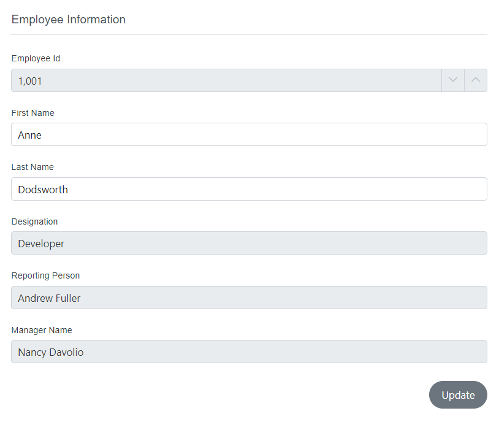
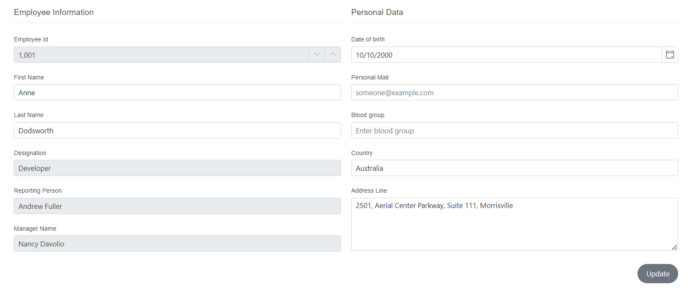
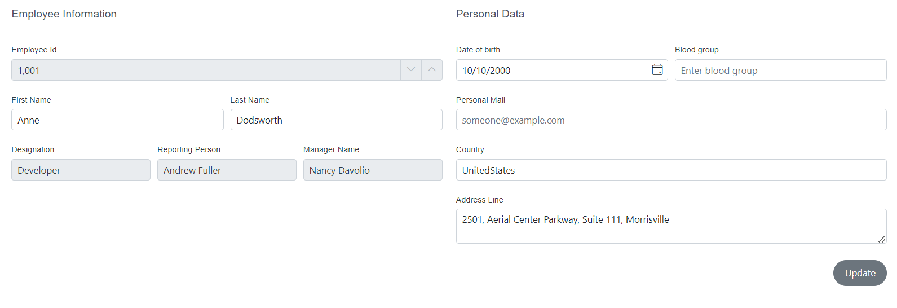
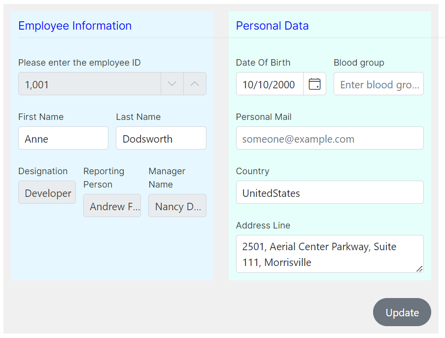

# Form group in DataForm component

In DataForm , [FormGroup](https://help.syncfusion.com/cr/blazor/Syncfusion.Blazor.DataForm.FormGroup.html) feature provides a way to organize the `FormItem` and `FormAutoGenerateItems` with descriptive label text and a layout organized into columns.

## Configure the group name and ID 

The below example showcases how to configure `FormGroup` within  DataForm component with [GroupName](https://help.syncfusion.com/cr/blazor/Syncfusion.Blazor.DataForm.FormGroup.html#Syncfusion_Blazor_DataForm_FormGroup_LabelText) and [ID](https://help.syncfusion.com/cr/blazor/Syncfusion.Blazor.DataForm.FormGroup.html#Syncfusion_Blazor_DataForm_FormGroup_ID) properties.









## Column layout for the group

The DataForm component provides the functionality to organize various form groups within a layout based on columns. You can define the number of columns to split the DataForm into by setting the [ColumnCount](https://help.syncfusion.com/cr/blazor/Syncfusion.Blazor.DataForm.SfDataForm.html#Syncfusion_Blazor_DataForm_SfDataForm_ColumnCount) property.














## Configure the column spacing 

This section explains how to configure the DataForm component on dividing the collection of [FormGroups](https://help.syncfusion.com/cr/blazor/Syncfusion.Blazor.DataForm.FormGroup.html) and organizing the subdivisions within the `FormGroup` with thw help of [ColumnsCount](https://help.syncfusion.com/cr/blazor/Syncfusion.Blazor.DataForm.FormGroup.html#Syncfusion_Blazor_DataForm_FormGroup_ColumnCount) and [ColumnSpacing](https://help.syncfusion.com/cr/blazor/Syncfusion.Blazor.DataForm.FormGroup.html#Syncfusion_Blazor_DataForm_FormGroup_ColumnSpacing).














In the provided example, the DataForm is divided into two sections, with each section populating its respective `FormGroup`. The first group is further segmented into six subsections, with the elements within it distributed according to their assigned column span. In a similar manner, the second group is split into two columns, with its elements being divided accordingly.

## Change the appearance of the form group

You can customize the appearance of the form group by using the [CssClass](https://help.syncfusion.com/cr/blazor/Syncfusion.Blazor.DataForm.FormGroup.html#Syncfusion_Blazor_DataForm_FormGroup_CssClass) property `FormGroup` component. The following example demonstrates how to change the background color and set padding of the form group wrapper .















