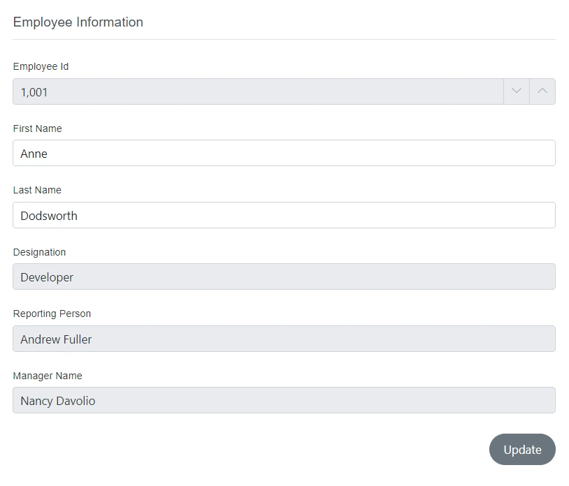
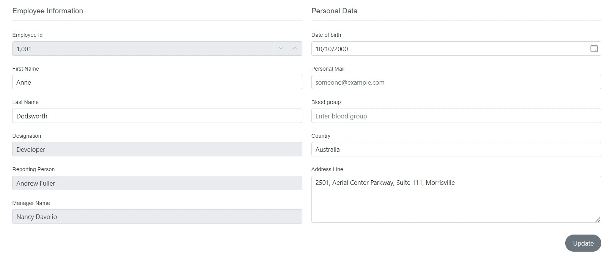
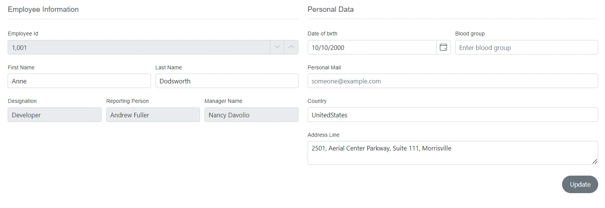
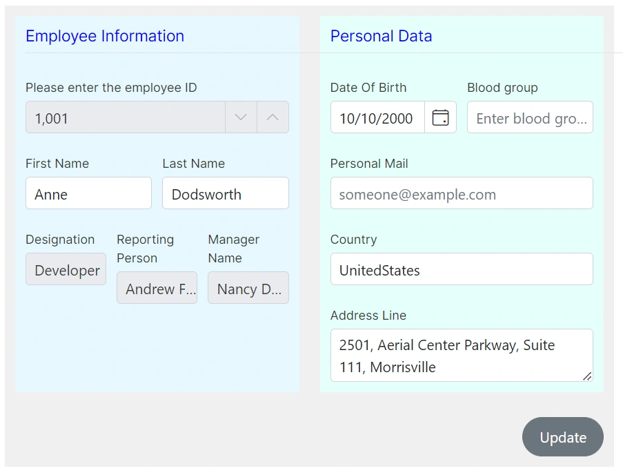

# Form Group in Blazor Data Form

In the DataForm, the [FormGroup](https://help.syncfusion.com/cr/blazor/Syncfusion.Blazor.DataForm.FormGroup.html) feature organizes `FormItem` and `FormAutoGenerateItems` under a descriptive group label with an optional identifier, and supports a column-based layout within each group.

## Configure the group name and ID 

The following example shows how to configure a `FormGroup` within the DataForm using the [GroupName](https://help.syncfusion.com/cr/blazor/Syncfusion.Blazor.DataForm.FormGroup.html#Syncfusion_Blazor_DataForm_FormGroup_LabelText) and [ID](https://help.syncfusion.com/cr/blazor/Syncfusion.Blazor.DataForm.FormGroup.html#Syncfusion_Blazor_DataForm_FormGroup_ID) properties. The group name labels the group section, and the ID uniquely identifies the group in the form.









## Column layout for the group

The DataForm can arrange multiple form groups across columns using the form-level [ColumnCount](https://help.syncfusion.com/cr/blazor/Syncfusion.Blazor.DataForm.SfDataForm.html#Syncfusion_Blazor_DataForm_SfDataForm_ColumnCount) property. Set this value to split the overall layout into the specified number of columns and place groups accordingly.














## Configure the column spacing 

This section explains how to divide the collection of [FormGroups](https://help.syncfusion.com/cr/blazor/Syncfusion.Blazor.DataForm.FormGroup.html) and organize subdivisions within a `FormGroup` using [ColumnsCount](https://help.syncfusion.com/cr/blazor/Syncfusion.Blazor.DataForm.FormGroup.html#Syncfusion_Blazor_DataForm_FormGroup_ColumnCount) and [ColumnSpacing](https://help.syncfusion.com/cr/blazor/Syncfusion.Blazor.DataForm.FormGroup.html#Syncfusion_Blazor_DataForm_FormGroup_ColumnSpacing). Use a suitable column count within each group and adjust spacing to achieve a clear, balanced layout.














In the example, the DataForm contains two groups. The first group uses six internal columns and distributes its fields by their column spans. The second group uses two internal columns and arranges its fields accordingly.

## Change the appearance of the form group

Customize the appearance of a form group using the [CssClass](https://help.syncfusion.com/cr/blazor/Syncfusion.Blazor.DataForm.FormGroup.html#Syncfusion_Blazor_DataForm_FormGroup_CssClass) property of the `FormGroup`. The following example demonstrates changing the background color and adding padding to the form group wrapper.















