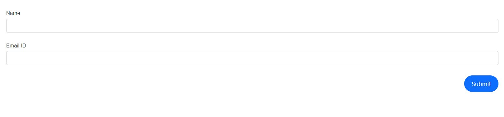
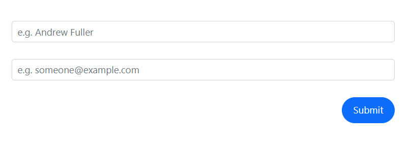
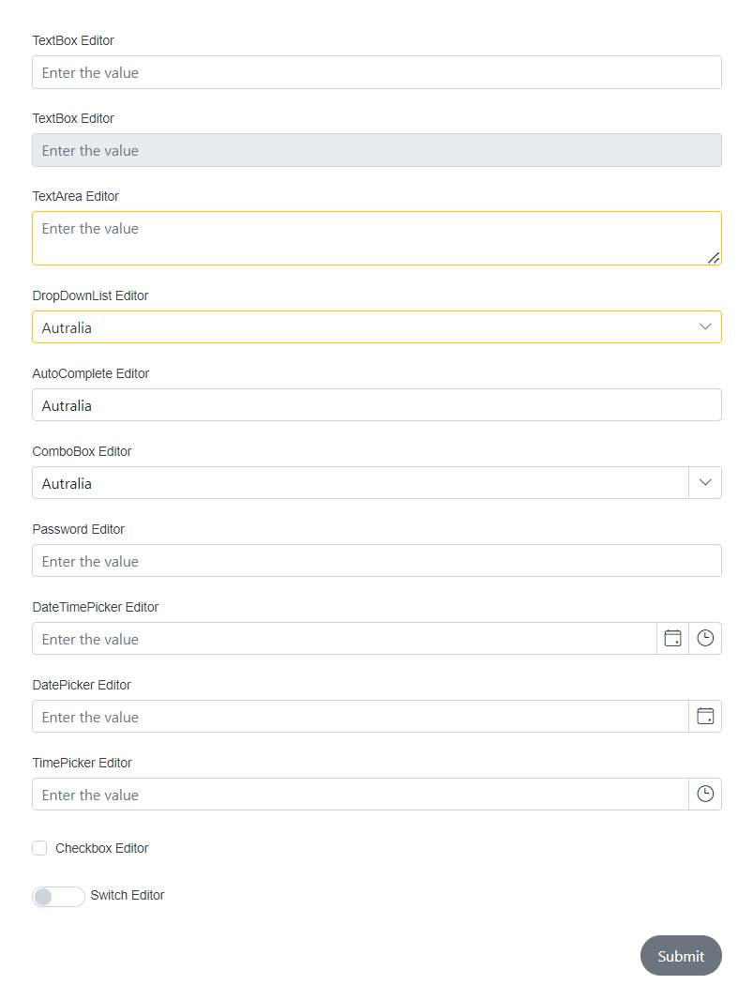
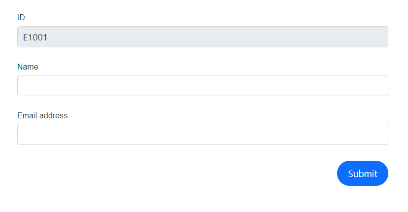
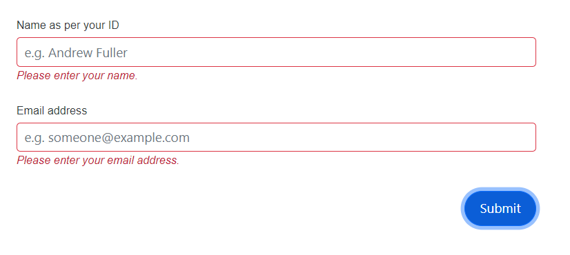
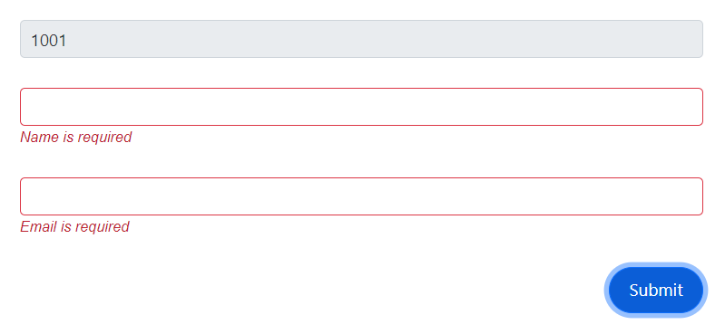

# Form items in DataForm component

The [FormItem](https://help.syncfusion.com/cr/blazor/Syncfusion.Blazor.DataForm.FormItem.html) configures the editor for a specific model field. It supports setting a unique identifier (ID), selecting the editor type, applying CSS classes, specifying placeholder and label text, and enabling or disabling the field. The following sections demonstrate common property usage:
- Field: map the model property to an editor
- ID: assign a unique identifier
- Placeholder: set hint text inside the editor
- EditorType: choose the editor control
- IsEnabled: enable or disable the form item
- Label/LabelText: set the editor’s label text
- CssClass: apply custom styles to the editor wrapper

## Configuring the model field and ID

The [Field](https://help.syncfusion.com/cr/blazor/Syncfusion.Blazor.DataForm.FormItem.html#Syncfusion_Blazor_DataForm_FormItem_Field) property maps the model field to the corresponding editor. The [ID](https://help.syncfusion.com/cr/blazor/Syncfusion.Blazor.DataForm.FormItem.html#Syncfusion_Blazor_DataForm_FormItem_ID) property sets a unique identifier for the editor component.















## Set the placeholder

The [Placeholder](https://help.syncfusion.com/cr/blazor/Syncfusion.Blazor.DataForm.FormItem.html#Syncfusion_Blazor_DataForm_FormItem_Placeholder) property sets the placeholder text for the editor.















## Change the editor type

The [EditorType](https://help.syncfusion.com/cr/blazor/Syncfusion.Blazor.DataForm.FormItem.html#Syncfusion_Blazor_DataForm_FormItem_EditorType) property selects the editor used for the field. Set the value from the [FormEditorType](https://help.syncfusion.com/cr/blazor/Syncfusion.Blazor.DataForm.FormEditorType.html) enumeration to override the default editor inferred from the field type.

| Field Type | Supported editor types |
| ------------ | ----------------------- |
| `string` | [TextBox](https://help.syncfusion.com/cr/blazor/Syncfusion.Blazor.DataForm.FormEditorType.html#Syncfusion_Blazor_DataForm_FormEditorType_TextBox), [TextArea](https://help.syncfusion.com/cr/blazor/Syncfusion.Blazor.DataForm.FormEditorType.html#Syncfusion_Blazor_DataForm_FormEditorType_TextArea), [Password](https://help.syncfusion.com/cr/blazor/Syncfusion.Blazor.DataForm.FormEditorType.html#Syncfusion_Blazor_DataForm_FormEditorType_Password) |
| `int`, `float`, `decimal`, `double`, `long` | [NumericTextBox](https://help.syncfusion.com/cr/blazor/Syncfusion.Blazor.DataForm.FormEditorType.html#Syncfusion_Blazor_DataForm_FormEditorType_NumericTextBox) |
| `bool` | [CheckBox](https://help.syncfusion.com/cr/blazor/Syncfusion.Blazor.DataForm.FormEditorType.html#Syncfusion_Blazor_DataForm_FormEditorType_CheckBox), [Switch](https://help.syncfusion.com/cr/blazor/Syncfusion.Blazor.DataForm.FormEditorType.html#Syncfusion_Blazor_DataForm_FormEditorType_Switch) |
| `DateTime` | [DatePicker](https://help.syncfusion.com/cr/blazor/Syncfusion.Blazor.DataForm.FormEditorType.html#Syncfusion_Blazor_DataForm_FormEditorType_DatePicker), [DateTimePicker](https://help.syncfusion.com/cr/blazor/Syncfusion.Blazor.DataForm.FormEditorType.html#Syncfusion_Blazor_DataForm_FormEditorType_DateTimePicker), [TimePicker](https://help.syncfusion.com/cr/blazor/Syncfusion.Blazor.DataForm.FormEditorType.html#Syncfusion_Blazor_DataForm_FormEditorType_TimePicker) |
| `enum` | [DropDownList](https://help.syncfusion.com/cr/blazor/Syncfusion.Blazor.DataForm.FormEditorType.html#Syncfusion_Blazor_DataForm_FormEditorType_DropDownList), [ComboBox](https://help.syncfusion.com/cr/blazor/Syncfusion.Blazor.DataForm.FormEditorType.html#Syncfusion_Blazor_DataForm_FormEditorType_ComboBox), [AutoComplete](https://help.syncfusion.com/cr/blazor/Syncfusion.Blazor.DataForm.FormEditorType.html#Syncfusion_Blazor_DataForm_FormEditorType_AutoComplete) |
| `DateOnly` | [DatePicker](https://help.syncfusion.com/cr/blazor/Syncfusion.Blazor.DataForm.FormEditorType.html#Syncfusion_Blazor_DataForm_FormEditorType_DatePicker) |
| `TimeOnly` | [TimePicker](https://help.syncfusion.com/cr/blazor/Syncfusion.Blazor.DataForm.FormEditorType.html#Syncfusion_Blazor_DataForm_FormEditorType_TimePicker) |















## Disable a form item

The [IsEnabled](https://help.syncfusion.com/cr/blazor/Syncfusion.Blazor.DataForm.FormItem.html#Syncfusion_Blazor_DataForm_FormItem_IsEnabled) property disables a specific form item.















## Change the label text 

Set the label using the [LabelText](https://help.syncfusion.com/cr/blazor/Syncfusion.Blazor.DataForm.FormItem.html#Syncfusion_Blazor_DataForm_FormItem_LabelText) property. When not set, the label is derived from data annotations on the bound model property, giving priority to DisplayAttribute.ShortName and then DisplayAttribute.Name.















## Change the appearance of the field editor

Use the [CssClass](https://help.syncfusion.com/cr/blazor/Syncfusion.Blazor.DataForm.FormItem.html#Syncfusion_Blazor_DataForm_FormItem_CssClass) property to apply a custom CSS class to the editor wrapper and customize the appearance.














## See also

- [Customization of specific field editor](https://blazor.syncfusion.com/documentation/data-form/templates#customization-of-specific-field-editor)