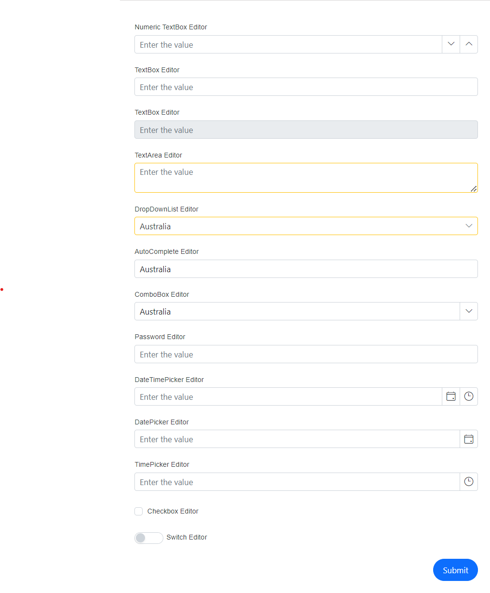
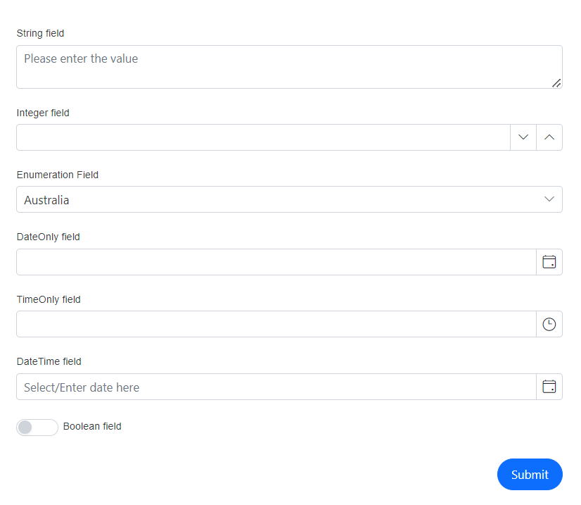

# Configuring Form Item in DataForm Component

The [FormItem](https://help.syncfusion.com/cr/blazor/Syncfusion.Blazor.DataForm.FormItem.html)  can be utilized to set up various configuration for the editor component, including the unique identifier (id), the type of editor component used, any additional CSS classes to be applied to the editor, and whether the field is to be active (enabled) or inactive (disabled) upon being rendered.The below example showcases the different property usages.




@using Syncfusion.Blazor.DataForm
@using System.ComponentModel.DataAnnotations

<SfDataForm ID="MyForm"
            Model="@EditorTypeModel"
            Width="50%"
            AutoComplete="on">

    <FormValidator>
        <DataAnnotationsValidator></DataAnnotationsValidator>
    </FormValidator>

    <FormItems>
        <FormItem Field="@nameof(EditorTypeModel.NumericTextBoxField)" ID="numeric-textbox" Placeholder="Enter the value" LabelText="Numeric TextBox Editor"></FormItem>
        <FormItem Field="@nameof(EditorTypeModel.TextBoxField)" ID="textbox" Placeholder="Enter the value" LabelText="TextBox Editor"></FormItem>
        <FormItem Field="@nameof(EditorTypeModel.DisabledTextBoxField)" ID="diabled" IsEnabled="false" Placeholder="Enter the value" LabelText="TextBox Editor"></FormItem>
        <FormItem Field="@nameof(EditorTypeModel.TextAreaField)" CssClass="e-warning" LabelText="TextArea Editor" Placeholder="Enter the value" EditorType="FormEditorType.TextArea"></FormItem>
        <FormItem Field="@nameof(EditorTypeModel.DropDownListField)" LabelText="DropDownList Editor" CssClass="e-warning" Placeholder="Select the value" EditorType="FormEditorType.DropDownList"></FormItem>
        <FormItem Field="@nameof(EditorTypeModel.AutoCompleteField)" LabelText="AutoComplete Editor" Placeholder="Select the value" EditorType="FormEditorType.AutoComplete"></FormItem>
        <FormItem Field="@nameof(EditorTypeModel.ComboBoxField)" LabelText="ComboBox Editor" Placeholder="Select the value" EditorType="FormEditorType.ComboBox"></FormItem>
        <FormItem Field="@nameof(EditorTypeModel.PasswordField)" LabelText="Password Editor" Placeholder="Enter the value" EditorType="FormEditorType.Password"></FormItem>
        <FormItem Field="@nameof(EditorTypeModel.DateTimePickerField)" LabelText="DateTimePicker Editor" Placeholder="Enter the value" EditorType="FormEditorType.DateTimePicker"></FormItem>
        <FormItem Field="@nameof(EditorTypeModel.DatePickerField)" LabelText="DatePicker Editor" Placeholder="Enter the value" EditorType="FormEditorType.DatePicker"></FormItem>
        <FormItem Field="@nameof(EditorTypeModel.TimePickerField)" LabelText="TimePicker Editor" Placeholder="Enter the value" EditorType="FormEditorType.TimePicker"></FormItem>
        <FormItem Field="@nameof(EditorTypeModel.CheckBoxField)" LabelText="Checkbox Editor"></FormItem>
        <FormItem Field="@nameof(EditorTypeModel.SwitchField)" LabelText="Switch Editor" EditorType="FormEditorType.Switch"></FormItem>
    </FormItems>
</SfDataForm>

@code {

    public enum Countries
    {
        Australia,
        Bermuda,
        Canada
    }

    public class EditorTypes
    {
        [Required(ErrorMessage = "Please enter a value for NumericTextBoxField")]
        public int? NumericTextBoxField { get; set; }

        [Required(ErrorMessage = "Please enter a value for TextBoxField")]
        public string TextBoxField { get; set; }

        [Required(ErrorMessage = "Please enter a value for TextBoxField")]
        public string DisabledTextBoxField { get; set; }

        [Required(ErrorMessage = "Please enter a value for TextAreaField")]
        public string TextAreaField { get; set; }

        [Required(ErrorMessage = "Please select a value for DropDownListField")]
        public Countries DropDownListField { get; set; }

        [Required(ErrorMessage = "Please enter a value for AutoCompleteField")]
        public Countries AutoCompleteField { get; set; }

        [Required(ErrorMessage = "Please select a value for ComboBoxField")]
        public Countries ComboBoxField { get; set; }

        [Required(ErrorMessage = "Please enter a value for PasswordField")]
        public string PasswordField { get; set; }

        [Required(ErrorMessage = "Please select a date for DateTimePickerField")]
        public DateTime? DateTimePickerField { get; set; }

        [Required(ErrorMessage = "Please select a date for DatePickerField")]
        public DateTime? DatePickerField { get; set; }

        [Required(ErrorMessage = "Please select a time for TimePickerField")]
        public DateTime? TimePickerField { get; set; }

        [Required(ErrorMessage = "Please check the CheckBoxField")]
        [Range(typeof(bool), "true", "true", ErrorMessage = "CheckBoxField must be checked")]
        public bool CheckBoxField { get; set; }

        [Required(ErrorMessage = "Please toggle the SwitchField")]
        [Range(typeof(bool), "true", "true", ErrorMessage = "SwitchField must be toggled")]
        public bool SwitchField { get; set; }
    }

    private EditorTypes EditorTypeModel = new EditorTypes();
}




## FormAutoGenerateItems

Blazor DataForm component generates the editors automatically based on the primitive property types if we use [FormAutoGenerateItems](https://help.syncfusion.com/cr/blazor/Syncfusion.Blazor.DataForm.FormAutoGenerateItems.html) inside it.The types with its corresponding default editor components listed below for reference.

| Type | Component |
| ------------ | ----------------------- |
| `int` | [SfNumericTextBox](https://help.syncfusion.com/cr/blazor/Syncfusion.Blazor.Inputs.SfNumericTextBox-1.html#properties) |
| `string` | [SfTextBox](https://help.syncfusion.com/cr/blazor/Syncfusion.Blazor.Inputs.SfTextBox.html) |
| `DateTime` | [SfDateTimePicker](https://help.syncfusion.com/cr/blazor/Syncfusion.Blazor.Calendars.SfDateTimePicker-1.html) |
| `DateOnly` | [SfDatePicker](https://help.syncfusion.com/cr/blazor/Syncfusion.Blazor.Calendars.SfDatePicker-1.html) |
| `TimeOnly` | [SfTimePicker](https://help.syncfusion.com/cr/blazor/Syncfusion.Blazor.Calendars.SfTimePicker-1.html) |
| `bool` | [SfCheckBox](https://help.syncfusion.com/cr/blazor/Syncfusion.Blazor.Buttons.SfCheckBox-1.html) |
| `enum` | [SfDropDownList](https://help.syncfusion.com/cr/blazor/Syncfusion.Blazor.DropDowns.SfDropDownList-2.html) |

The below example demonstrates the auto generated items with possible types 




@using Syncfusion.Blazor.DataForm
@using System.ComponentModel.DataAnnotations

<SfDataForm ID="MyForm" Model="@FieldTypeModel" Width="50%">
           
    <FormValidator>
        <DataAnnotationsValidator></DataAnnotationsValidator>
    </FormValidator>

    <FormItems>
        <FormAutoGenerateItems />
    </FormItems>

</SfDataForm>

@code {

    public enum Countries
    {
        Australia,
        Bermuda,
        Canada
    }

    public class FieldTypes
    {
        [Required(ErrorMessage = "Please enter a value for the IntField")]
        [Display(Name = "Integer field")]
        public int? IntField { get; set; }

        [Required(ErrorMessage = "Please enter a value for the StringField")]
        [Display(Name = "String field")]
        public string StringField { get; set; }

        [Required(ErrorMessage = "Please enter a value for the StringField")]
        [Display(Name = "Enumeration Field")]
        public Countries EnumField { get; set; }

        [Required(ErrorMessage = "Please select a date for the DateTimeField")]
        [Display(Name = "DateTime field")]
        public DateTime? DateTimeField { get; set; }

        [Required(ErrorMessage = "Please select a date for the DateOnlyField")]
        [Display(Name = "DateOnly field")]
        public DateOnly? DateOnlyField { get; set; }

        [Required(ErrorMessage = "Please select a time for the TimeOnlyField")]
        [Display(Name = "TimeOnly field")]
        public TimeOnly? TimeOnlyField { get; set; }

        [Required(ErrorMessage = "Please check the BoolField")]
        [Range(typeof(bool), "true", "true", ErrorMessage = "The BoolField must be checked")]
        [Display(Name = "Boolean field")]
        public bool BoolField { get; set; }
    }

    private FieldTypes FieldTypeModel = new FieldTypes();
}




The `FormAutoGenerateItems` can be utilized independently, as demonstrated in the previous example, or placed in-between, above, or below multiple `FormItem` tags. This will create editors for all types except those explicitly defined using `FormItem`.




@using Syncfusion.Blazor.DataForm
@using System.ComponentModel.DataAnnotations
@using Syncfusion.Blazor.DataForm
@using System.ComponentModel.DataAnnotations

<SfDataForm ID="MyForm" Model="@FieldTypeModel" Width="50%">
           
    <FormValidator>
        <DataAnnotationsValidator></DataAnnotationsValidator>
    </FormValidator>

    <FormItems>
        <FormItem Field="@nameof(FieldTypeModel.StringField)" EditorType="FormEditorType.TextArea" Placeholder="Please enter the value"></FormItem>
        <FormAutoGenerateItems />
        <FormItem Field="@nameof(FieldTypeModel.DateTimeField)" EditorType="FormEditorType.DatePicker" Placeholder="Select/Enter date here"></FormItem>
        <FormItem Field="@nameof(FieldTypeModel.BoolField)" EditorType="FormEditorType.Switch" ></FormItem>

    </FormItems>

</SfDataForm>

@code {

    public enum Countries
    {
        Australia,
        Bermuda,
        Canada
    }

    public class FieldTypes
    {
        [Required(ErrorMessage = "Please enter a value for the IntField")]
        [Display(Name = "Integer field")]
        public int? IntField { get; set; }

        [Required(ErrorMessage = "Please enter a value for the StringField")]
        [Display(Name = "String field")]
        public string StringField { get; set; }

        [Required(ErrorMessage = "Please enter a value for the StringField")]
        [Display(Name = "Enumeration Field")]
        public Countries EnumField { get; set; }

        [Required(ErrorMessage = "Please select a date for the DateTimeField")]
        [Display(Name = "DateTime field")]
        public DateTime? DateTimeField { get; set; }

        [Required(ErrorMessage = "Please select a date for the DateOnlyField")]
        [Display(Name = "DateOnly field")]
        public DateOnly? DateOnlyField { get; set; }

        [Required(ErrorMessage = "Please select a time for the TimeOnlyField")]
        [Display(Name = "TimeOnly field")]
        public TimeOnly? TimeOnlyField { get; set; }

        [Required(ErrorMessage = "Please check the BoolField")]
        [Range(typeof(bool), "true", "true", ErrorMessage = "The BoolField must be checked")]
        [Display(Name = "Boolean field")]
        public bool BoolField { get; set; }
    }

    private FieldTypes FieldTypeModel = new FieldTypes();
}




In the given example, apart from `StringField`, `DateTimeField`, and `BoolField`, the remaining elements will be generated and placed automatically within the specified `FormItem` along with their corresponding editor types.

