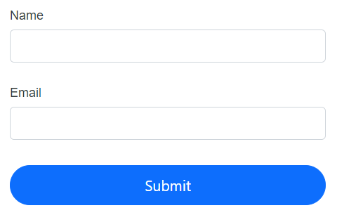
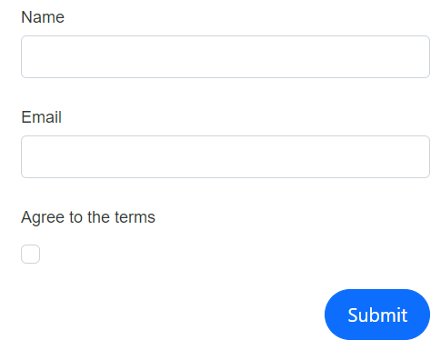
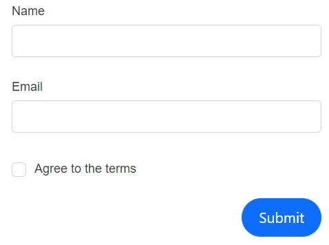

# Layout customization

This section explains how to position buttons and labels in the DataForm component, customize button areas, and display validation messages. It also describes how to enable floating labels and adjust the overall form width.

## Button alignment

The DataForm component can align form buttons horizontally within the form container by using the [ButtonsAlignment](https://help.syncfusion.com/cr/blazor/Syncfusion.Blazor.DataForm.FormButtonsAlignment.html) property. The `ButtonsAlignment` options are:

- Center: centers the buttons within the container
- Left: left-aligns the buttons
- Right: right-aligns the buttons
- Stretch: stretches buttons to fill the available width

| FormButtonsAlignment | Snapshot |
| ------------ | ----------------------- |
|[FormButtonsAlignment.Center](https://help.syncfusion.com/cr/blazor/Syncfusion.Blazor.DataForm.FormButtonsAlignment.html#Syncfusion_Blazor_DataForm_FormButtonsAlignment_Center)||
|[FormButtonsAlignment.Left](https://help.syncfusion.com/cr/blazor/Syncfusion.Blazor.DataForm.FormButtonsAlignment.html#Syncfusion_Blazor_DataForm_FormButtonsAlignment_Left)||
|[FormButtonsAlignment.Right](https://help.syncfusion.com/cr/blazor/Syncfusion.Blazor.DataForm.FormButtonsAlignment.html#Syncfusion_Blazor_DataForm_FormButtonsAlignment_Right)||
|[FormButtonsAlignment.Stretch](https://help.syncfusion.com/cr/blazor/Syncfusion.Blazor.DataForm.FormButtonsAlignment.html#Syncfusion_Blazor_DataForm_FormButtonsAlignment_Stretch)||

The following example shows how to use the `ButtonsAlignment` property in the DataForm component.









## Add additional buttons and customization

Add custom buttons or other elements by using the [FormButtons](https://help.syncfusion.com/cr/blazor/Syncfusion.Blazor.DataForm.FormButtons.html) `RenderFragment` within the DataForm component.

In the following example, an additional button is added to reset input fields by handling the [OnClick](https://help.syncfusion.com/cr/blazor/Syncfusion.Blazor.Buttons.SfButton.html#Syncfusion_Blazor_Buttons_SfButton_OnClick) event of the [SfButton](https://help.syncfusion.com/cr/blazor/Syncfusion.Blazor.Buttons.SfButton.html#Syncfusion_Blazor_Buttons_SfButton_OnClick).









## Label position

The DataForm component aligns labels either at the top or to the left of the field editors using the [LabelPosition](https://help.syncfusion.com/cr/blazor/Syncfusion.Blazor.DataForm.SfDataForm.html#Syncfusion_Blazor_DataForm_SfDataForm_LabelPosition) property. The available options are shown below.

| LabelPosition | Snapshot |
| ------------ | ----------------------- |
|[FormLabelPosition.Top](https://help.syncfusion.com/cr/blazor/Syncfusion.Blazor.DataForm.FormLabelPosition.html#Syncfusion_Blazor_DataForm_FormLabelPosition_Top)||
|[FormLabelPosition.Left](https://help.syncfusion.com/cr/blazor/Syncfusion.Blazor.DataForm.FormLabelPosition.html#Syncfusion_Blazor_DataForm_FormLabelPosition_Left)||
|When no specific value is provided, the layout defaults to `FormLabelPosition.Top`. For boolean editors such as [SfCheckBox](https://help.syncfusion.com/cr/blazor/Syncfusion.Blazor.Buttons.SfCheckBox-1.html) and [SfSwitch](https://help.syncfusion.com/cr/blazor/Syncfusion.Blazor.Buttons.SfSwitch-1.html), labels are positioned to the right of the control.||

The following example demonstrates how to configure the `LabelPosition` in the DataForm component.









## Floating label 

Enable floating labels to move the label to the top of the input when focused by setting [EnableFloatingLabel](https://help.syncfusion.com/cr/blazor/Syncfusion.Blazor.DataForm.SfDataForm.html#Syncfusion_Blazor_DataForm_SfDataForm_EnableFloatingLabel) to true. The following code example and GIF demonstrate floating label behavior.
















N> The floating label feature applies only when [LabelPosition](https://help.syncfusion.com/cr/blazor/Syncfusion.Blazor.DataForm.SfDataForm.html#Syncfusion_Blazor_DataForm_SfDataForm_LabelPosition) is set to [FormLabelPosition.Top](https://help.syncfusion.com/cr/blazor/Syncfusion.Blazor.DataForm.FormLabelPosition.html#Syncfusion_Blazor_DataForm_FormLabelPosition_Top).

## Change the form width 

Customize the width of the form container by using the [Width](https://help.syncfusion.com/cr/blazor/Syncfusion.Blazor.DataForm.SfDataForm.html#Syncfusion_Blazor_DataForm_SfDataForm_Width) property.









