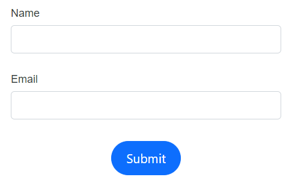

# Layout customization

This segment provides a concise overview of how to position buttons and labels correctly within the DataForm component. It also covers how to customize the button elements and the various ways to present validation messages.

## Button alignment

The DataForm component provides the capability to position the button horizontally within the form container as needed, utilizing the [ButtonsAlignment](https://help.syncfusion.com/cr/blazor/Syncfusion.Blazor.DataForm.FormButtonsAlignment.html) property .The `ButtonsAlignment` is categorized into three types, as outlined below,

| FormButtonsAlignment | Snapshot |
| ------------ | ----------------------- |
|[FormButtonsAlignment.Center](https://help.syncfusion.com/cr/blazor/Syncfusion.Blazor.DataForm.FormButtonsAlignment.html#Syncfusion_Blazor_DataForm_FormButtonsAlignment_Center)||
|[FormButtonsAlignment.Left](https://help.syncfusion.com/cr/blazor/Syncfusion.Blazor.DataForm.FormButtonsAlignment.html#Syncfusion_Blazor_DataForm_FormButtonsAlignment_Left)||
|[FormButtonsAlignment.Right](https://help.syncfusion.com/cr/blazor/Syncfusion.Blazor.DataForm.FormButtonsAlignment.html#Syncfusion_Blazor_DataForm_FormButtonsAlignment_Left)||
|[FormButtonsAlignment.Stretch](https://help.syncfusion.com/cr/blazor/Syncfusion.Blazor.DataForm.FormButtonsAlignment.html#Syncfusion_Blazor_DataForm_FormButtonsAlignment_Stretch)||

The below example portrays how to use the `ButtonsAlignment` property in DataForm component









## Add additional buttons and customization

It is possible to incorporate custom buttons along with other elements ,if necessary by using the [FormButtons](https://help.syncfusion.com/cr/blazor/Syncfusion.Blazor.DataForm.FormButtons.html) `RenderFragment` within the DataForm component.

In the provided code snippet, an extra button component is implemented to reset the input fields when pressed, by utilizing its [OnClick](https://help.syncfusion.com/cr/blazor/Syncfusion.Blazor.Buttons.SfButton.html) event handler of [SfButton](https://help.syncfusion.com/cr/blazor/Syncfusion.Blazor.Buttons.SfButton.html#Syncfusion_Blazor_Buttons_SfButton_OnClick).









## Label position

DataForm component allows you to align the label either to the top or left to the field editors , We can implement this feature by assigning values to [LabelPosition](https://help.syncfusion.com/cr/blazor/Syncfusion.Blazor.DataForm.SfDataForm.html#Syncfusion_Blazor_DataForm_SfDataForm_LabelPosition) , Classification of the respective property is outlined below ,

| LabelPosition | Snapshot |
| ------------ | ----------------------- |
|[FormLabelPosition.Top](https://help.syncfusion.com/cr/blazor/Syncfusion.Blazor.DataForm.FormLabelPosition.html#Syncfusion_Blazor_DataForm_FormLabelPosition_Top)||
|[FormLabelPosition.Left](https://help.syncfusion.com/cr/blazor/Syncfusion.Blazor.DataForm.FormLabelPosition.html#Syncfusion_Blazor_DataForm_FormLabelPosition_Left)||
|When no specific value is provided, the layout defaults to `FormLabelPosition.Top`. For boolean editors like [SfCheckBox](https://help.syncfusion.com/cr/blazor/Syncfusion.Blazor.Buttons.SfCheckBox-1.html) and [SfSwitch](https://help.syncfusion.com/cr/blazor/Syncfusion.Blazor.Buttons.SfSwitch-1.html), labels will be positioned to the right.  ||

The below code part explains how to configure the `LabelPosition` in DataForm component.









## Floating label 

The DataForm component allows you to float the label to the top of the input field when the input field is focused, by using the [EnableFloatingLabel](https://help.syncfusion.com/cr/blazor/Syncfusion.Blazor.DataForm.SfDataForm.html#Syncfusion_Blazor_DataForm_SfDataForm_EnableFloatingLabel) property.The below code example and gif demonstration illustrates how to use the `EnableFloatingLabel` property in DataForm component.
















N> The floating label feature is only applicable when the [LabelPosition](https://help.syncfusion.com/cr/blazor/Syncfusion.Blazor.DataForm.SfDataForm.html#Syncfusion_Blazor_DataForm_SfDataForm_LabelPosition) is set to [FormLabelPosition.Top](https://help.syncfusion.com/cr/blazor/Syncfusion.Blazor.DataForm.FormLabelPosition.html#Syncfusion_Blazor_DataForm_FormLabelPosition_Top).

## Change the form width 

The DataForm component allows you to customize the width of the form container by using the [Width](https://help.syncfusion.com/cr/blazor/Syncfusion.Blazor.DataForm.SfDataForm.html#Syncfusion_Blazor_DataForm_SfDataForm_Width) property.









