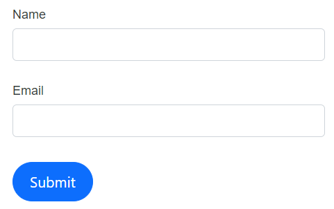
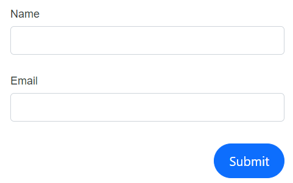
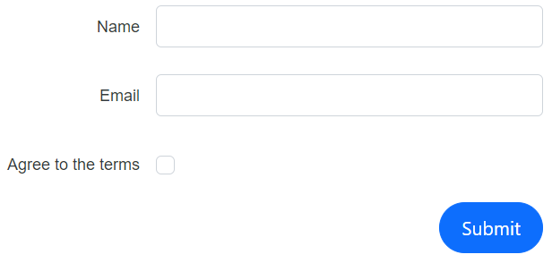
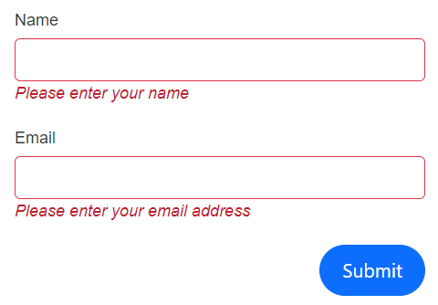
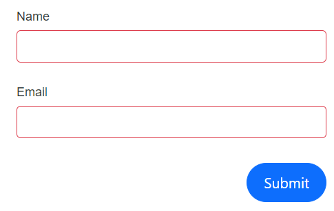

# Layout customization in DataForm component

This segment provides a concise overview of how to position buttons and labels correctly within the DataForm component. It also covers how to customize the button elements and the various ways to present validation messages.

## Button Alignment

The DataForm component provides the capability to position the button horizontally within the form container as needed, utilizing the [ButtonsAlignment](https://help.syncfusion.com/cr/blazor/Syncfusion.Blazor.DataForm.FormButtonsAlignment.html) property .The `ButtonsAlignment` is categorized into three types, as outlined below,

| FormButtonsAlignment | Snapshot |
| ------------ | ----------------------- |
|[FormButtonsAlignment.Center](https://help.syncfusion.com/cr/blazor/Syncfusion.Blazor.DataForm.FormButtonsAlignment.html#Syncfusion_Blazor_DataForm_FormButtonsAlignment_Center)||
|[FormButtonsAlignment.Left](https://help.syncfusion.com/cr/blazor/Syncfusion.Blazor.DataForm.FormButtonsAlignment.html#Syncfusion_Blazor_DataForm_FormButtonsAlignment_Left)||
|[FormButtonsAlignment.Right](https://help.syncfusion.com/cr/blazor/Syncfusion.Blazor.DataForm.FormButtonsAlignment.html#Syncfusion_Blazor_DataForm_FormButtonsAlignment_Left)||
|[FormButtonsAlignment.Stretch](https://help.syncfusion.com/cr/blazor/Syncfusion.Blazor.DataForm.FormButtonsAlignment.html#Syncfusion_Blazor_DataForm_FormButtonsAlignment_Stretch)||

The below example portrays how to use the `ButtonsAlignment` property in DataForm component




@using Syncfusion.Blazor.DataForm
@using System.ComponentModel.DataAnnotations

<SfDataForm Width="50%"
            Model="@RegistrationDetailsModel"
            ButtonsAlignment="FormButtonsAlignment.Center">

    <FormValidator>
        <DataAnnotationsValidator></DataAnnotationsValidator>
    </FormValidator>

    <FormItems>
        <FormAutoGenerateItems></FormAutoGenerateItems>
    </FormItems>

</SfDataForm>

@code {

    public class RegistrationDetails
    {

        [Required(ErrorMessage = "Please enter your name")]
        public string Name { get; set; }

        [Required(ErrorMessage = "Please enter your email address")]
        [EmailAddress(ErrorMessage = "Please enter valid email address")]
        public string Email { get; set; }
    }

    private RegistrationDetails RegistrationDetailsModel = new RegistrationDetails();
}




## Button Customization

It is possible to incorporate custom buttons along with other elements ,if necessary by using the [FormButtons](https://help.syncfusion.com/cr/blazor/Syncfusion.Blazor.DataForm.FormButtons.html) `RenderFragment` within the DataForm component.

In the provided code snippet, an extra button component is implemented to reset the input fields when pressed, by utilizing its [OnClick](https://help.syncfusion.com/cr/blazor/Syncfusion.Blazor.Buttons.SfButton.html) event handler of [SfButton](https://help.syncfusion.com/cr/blazor/Syncfusion.Blazor.Buttons.SfButton.html#Syncfusion_Blazor_Buttons_SfButton_OnClick).




@using Syncfusion.Blazor.DataForm
@using System.ComponentModel.DataAnnotations
@using Syncfusion.Blazor.Buttons

<SfDataForm Width="50%"
            EditContext="@RegistrationEditContext">

    <FormValidator>
        <DataAnnotationsValidator></DataAnnotationsValidator>
    </FormValidator>

    <FormItems>
        <FormAutoGenerateItems></FormAutoGenerateItems>
    </FormItems>

    <FormButtons>
        <SfButton type="submit" CssClass="e-success">Register</SfButton>
        <SfButton type="button" CssClass="e-warning" OnClick="ClickHandler">Clear</SfButton>
    </FormButtons>

</SfDataForm>

@code {
    public EditContext RegistrationEditContext { get; set; }

    protected override void OnInitialized()
    {
        RegistrationEditContext = new EditContext(RegistrationDetailsModel);
        base.OnInitialized();
    }

    public class RegistrationDetails
    {

        [Required(ErrorMessage = "Please enter your name")]
        public string Name { get; set; }

        [Required(ErrorMessage = "Please enter your email address")]
        [EmailAddress(ErrorMessage = "Please enter valid email address")]
        public string Email { get; set; }
    }

    private RegistrationDetails RegistrationDetailsModel = new RegistrationDetails();

    public void ClickHandler()
    {
        RegistrationDetailsModel = new RegistrationDetails();
        RegistrationEditContext = new EditContext(RegistrationDetailsModel);
    }
}




## Label positioning

DataForm component allows you to align the label either to the top or left to the field editors , We can implement this feature by assigning values to [LabelPosition](https://help.syncfusion.com/cr/blazor/Syncfusion.Blazor.DataForm.SfDataForm.html#Syncfusion_Blazor_DataForm_SfDataForm_LabelPosition) , Classification of the respective property is outlined below ,

| LabelPosition | Snapshot |
| ------------ | ----------------------- |
|[FormLabelPosition.Top](https://help.syncfusion.com/cr/blazor/Syncfusion.Blazor.DataForm.FormLabelPosition.html#Syncfusion_Blazor_DataForm_FormLabelPosition_Top)||
|[FormLabelPosition.Left](https://help.syncfusion.com/cr/blazor/Syncfusion.Blazor.DataForm.FormLabelPosition.html#Syncfusion_Blazor_DataForm_FormLabelPosition_Left)||
|When no specific value is provided, the layout defaults to `FormLabelPosition.Top`. For boolean editors like [SfCheckBox](https://help.syncfusion.com/cr/blazor/Syncfusion.Blazor.Buttons.SfCheckBox-1.html) and [SfSwitch](https://help.syncfusion.com/cr/blazor/Syncfusion.Blazor.Buttons.SfSwitch-1.html), labels will be positioned to the right.  ||

The below code part explains how to configure the `LabelPosition` in DataForm component.




@using Syncfusion.Blazor.DataForm
@using System.ComponentModel.DataAnnotations

<SfDataForm Width="50%"
            Model="@RegistrationDetailsModel"
            LabelPosition="FormLabelPosition.Left">

    <FormValidator>
        <DataAnnotationsValidator></DataAnnotationsValidator>
    </FormValidator>

    <FormItems>
        <FormAutoGenerateItems></FormAutoGenerateItems>
    </FormItems>

</SfDataForm>

@code {

    public class RegistrationDetails
    {

        [Required(ErrorMessage = "Please enter your name")]
        public string Name { get; set; }

        [Required(ErrorMessage = "Please enter your email address")]
        [EmailAddress(ErrorMessage = "Please enter valid email address")]
        public string Email { get; set; }

        [Required(ErrorMessage = "You need to agree to the Terms and Conditions")]
        [Range(typeof(bool), "true", "true", ErrorMessage = "You need to agree to the Terms and Conditions")]
        [Display(Name="Agree to the terms")]
        public bool Accept { get; set; }
    }

    private RegistrationDetails RegistrationDetailsModel = new RegistrationDetails();
}




## Validation Message Display

Within the DataForm component, we have the option to showcase validation messages in two distinct styles: inline or via a tooltip. When applying inline display, the validation messages remain statically visible whenever validation occurs. On the other hand, tooltip display reveals validation messages to users upon request. Additionally, there is functionality to hide the validation messages as desired by using [ValidationDisplayMode](https://help.syncfusion.com/cr/blazor/Syncfusion.Blazor.DataForm.SfDataForm.html#Syncfusion_Blazor_DataForm_SfDataForm_ValidationDisplayMode) . The classifications of the respective property are outline below 

| FormValidationDisplay | Snapshot |
| ------------ | ----------------------- |
|[FormValidationDisplay.Inline](https://help.syncfusion.com/cr/blazor/Syncfusion.Blazor.DataForm.FormValidationDisplay.html#Syncfusion_Blazor_DataForm_FormValidationDisplay_Inline)||
|[FormValidationDisplay.Tooltip](https://help.syncfusion.com/cr/blazor/Syncfusion.Blazor.DataForm.FormValidationDisplay.html#Syncfusion_Blazor_DataForm_FormValidationDisplay_Tooltip)||
|[FormValidationDisplay.None](https://help.syncfusion.com/cr/blazor/Syncfusion.Blazor.DataForm.FormValidationDisplay.html#Syncfusion_Blazor_DataForm_FormValidationDisplay_None)||

The below example demonstrate , how to configure validation message presentation with DataForm component




@using Syncfusion.Blazor.DataForm
@using System.ComponentModel.DataAnnotations

<SfDataForm Width="50%"
            Model="@RegistrationDetailsModel"
            ValidationDisplayMode="FormValidationDisplay.Tooltip">

    <FormValidator>
        <DataAnnotationsValidator></DataAnnotationsValidator>
    </FormValidator>

    <FormItems>
        <FormAutoGenerateItems></FormAutoGenerateItems>
    </FormItems>

</SfDataForm>

@code {

    public class RegistrationDetails
    {

        [Required(ErrorMessage = "Please enter your name")]
        public string Name { get; set; }

        [Required(ErrorMessage = "Please enter your email address")]
        [EmailAddress(ErrorMessage = "Please enter valid email address")]
        public string Email { get; set; }
    }

    private RegistrationDetails RegistrationDetailsModel = new RegistrationDetails();
}


