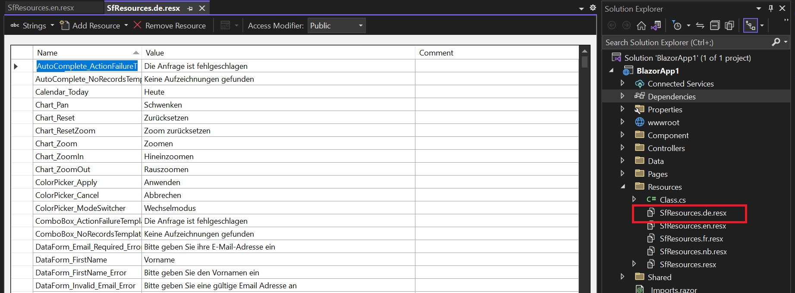
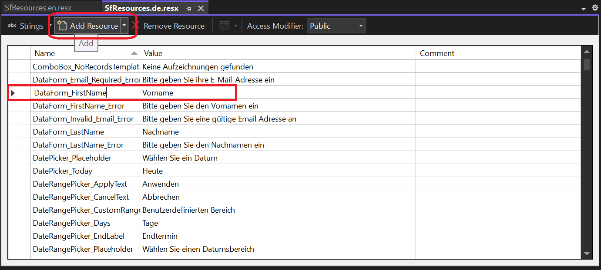
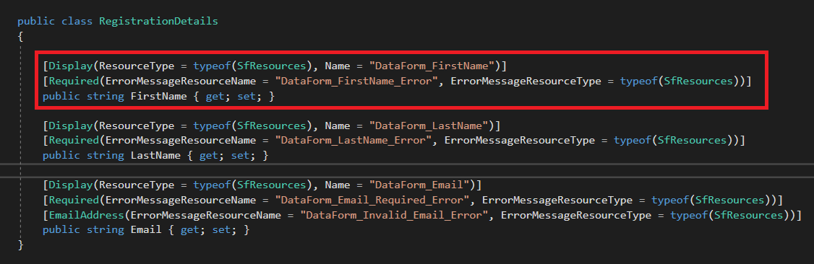
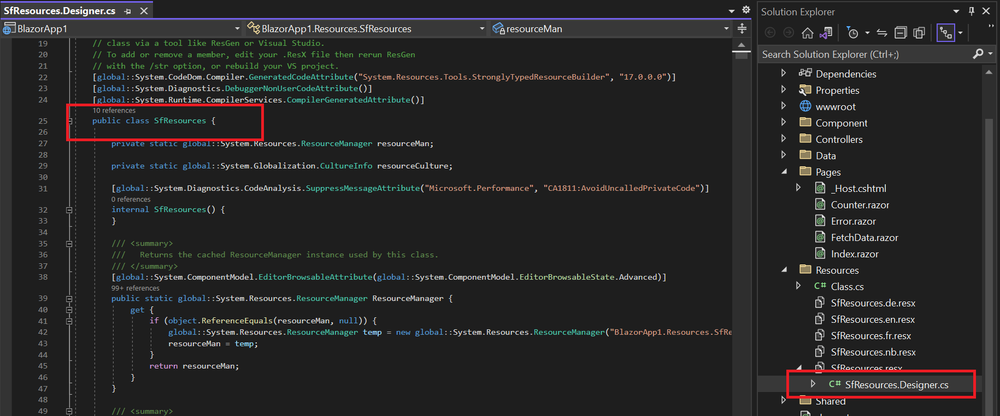
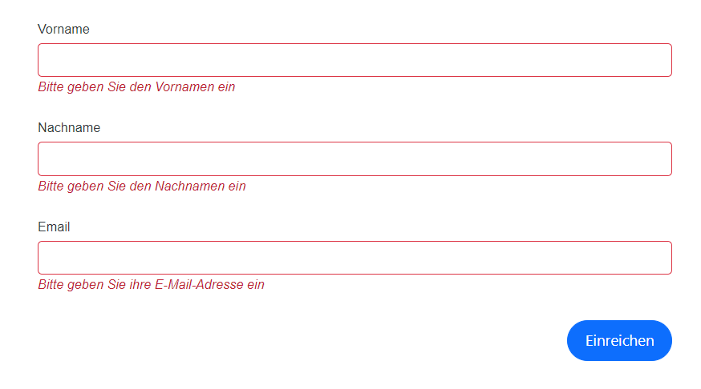

# Localization in Blazor DataForm component

The DataForm component supports localization for any culture. Refer to the [Blazor localization](https://blazor.syncfusion.com/documentation/common/localization) documentation to localize Syncfusion Blazor components.

## Configuring localization for label text and error messages

Follow these steps to configure localization for label text and validation error messages in the Blazor DataForm component.

1. After integrating localization files in the application as described in the [Blazor localization](https://blazor.syncfusion.com/documentation/common/localization) topic, open the required culture resource file in Visual Studio.

2. In the opened resource file, select Add Resource and include the appropriate key with the corresponding localized text as shown.

3. Specify the [ResourceType](https://learn.microsoft.com/en-us/dotnet/api/system.componentmodel.dataannotations.displayattribute.resourcetype?view=net-8.0#system-componentmodel-dataannotations-displayattribute-resourcetype) (from the Resources folder) and the resource key in the [Display](https://learn.microsoft.com/en-us/dotnet/api/system.componentmodel.dataannotations.displayattribute?view=net-8.0) attribute of the corresponding model property to localize labels. Similarly, localize validation messages by setting [ErrorMessageResourceType](https://learn.microsoft.com/en-us/dotnet/api/system.componentmodel.dataannotations.validationattribute.errormessageresourcetype?view=net-8.0#system-componentmodel-dataannotations-validationattribute-errormessageresourcetype) and [ErrorMessageResourceName](https://learn.microsoft.com/en-us/dotnet/api/system.componentmodel.dataannotations.validationattribute.errormessageresourcename?view=net-8.0#system-componentmodel-dataannotations-validationattribute-errormessageresourcename) on attributes such as [Required](https://learn.microsoft.com/en-us/dotnet/api/system.componentmodel.dataannotations.requiredattribute?view=net-8.0), as shown below.

|  |  |














4. Run the application to view the DataForm with localized labels and validation messages.

