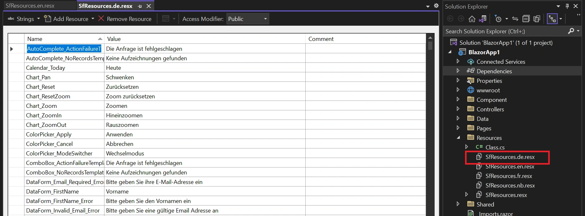
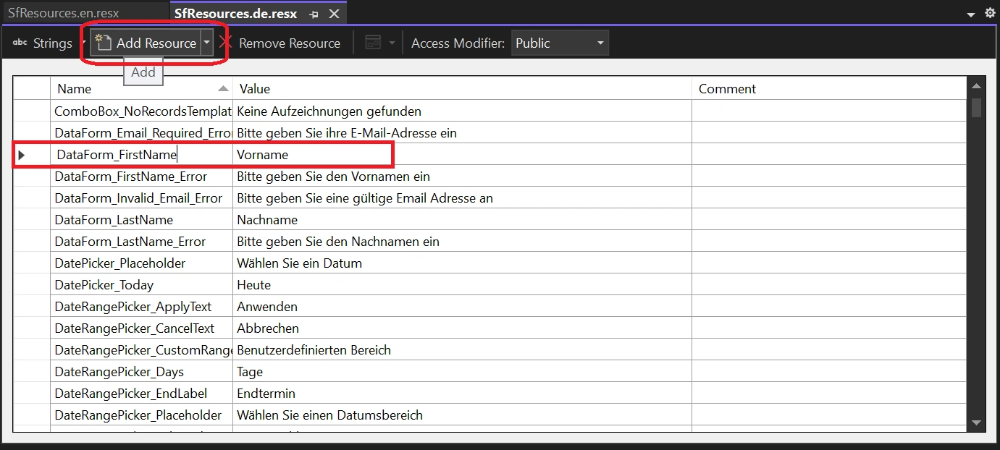
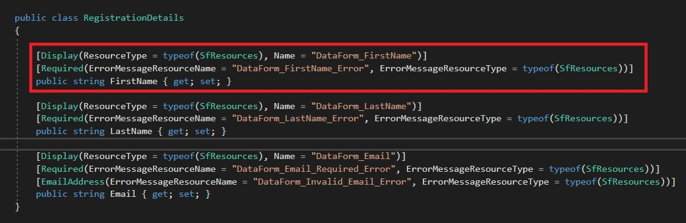
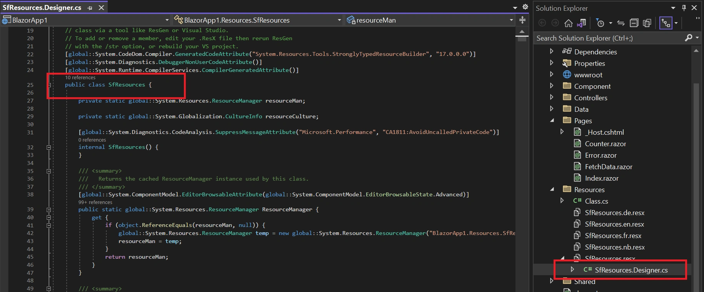
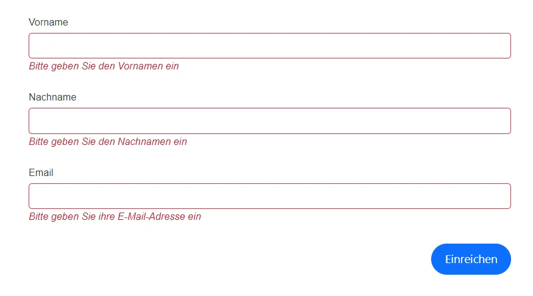

# Localization in Blazor DataForm component

The DataForm component supports localization for any culture. Refer to the [Blazor localization](https://blazor.syncfusion.com/documentation/common/localization) documentation to localize Syncfusion Blazor components.

## Configuring localization for label text and error messages

Follow these steps to configure localization for label text and validation error messages in the Blazor DataForm component.

<ol>
	<li>
		After integrating localization files in the application as described in the <a href="https://blazor.syncfusion.com/documentation/common/localization">Blazor localization</a> topic, open the required culture resource file in Visual Studio. 
		
	</li>
	<li>
		In the opened resource file, select Add Resource and include the appropriate key with the corresponding localized text as shown. 
		
	</li>
	<li>
		Specify the <a href="https://learn.microsoft.com/en-us/dotnet/api/system.componentmodel.dataannotations.displayattribute.resourcetype?view=net-8.0#system-componentmodel-dataannotations-displayattribute-resourcetype">ResourceType</a> (from the Resources folder) and the resource key in the <a href="https://learn.microsoft.com/en-us/dotnet/api/system.componentmodel.dataannotations.displayattribute?view=net-8.0">Display</a> attribute of the corresponding model property to localize labels. Similarly, localize validation messages by setting <a href="https://learn.microsoft.com/en-us/dotnet/api/system.componentmodel.dataannotations.validationattribute.errormessageresourcetype?view=net-8.0#system-componentmodel-dataannotations-validationattribute-errormessageresourcetype">ErrorMessageResourceType</a> and <a href="https://learn.microsoft.com/en-us/dotnet/api/system.componentmodel.dataannotations.validationattribute.errormessageresourcename?view=net-8.0#system-componentmodel-dataannotations-validationattribute-errormessageresourcename">ErrorMessageResourceName</a> on attributes such as <a href="https://learn.microsoft.com/en-us/dotnet/api/system.componentmodel.dataannotations.requiredattribute?view=net-8.0">Required</a>, as shown below. 
		<table>
			<tr>
				<td></td>
				<td></td>
			</tr>
		</table>
		
		
		
		
		
		
		
		
	</li>
	<li>
		Run the application to view the DataForm with localized labels and validation messages. 
		
	</li>
</ol>