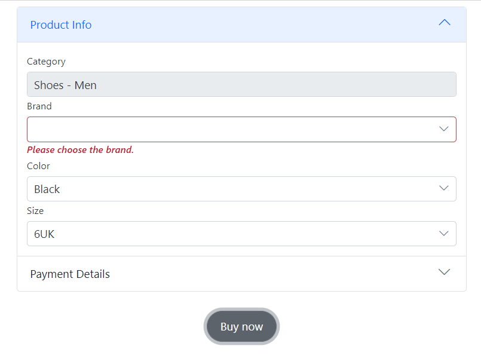

# Templates in DataForm component

In DataForm component we can customize the specific editor field or the entire form components using template feature. 

## Customization of specific field editor

We can customize the particular field editor with required UI customization using the [Template](https://help.syncfusion.com/cr/blazor/Syncfusion.Blazor.DataForm.Template.html) `RenderFragment` inside `FormItem` tag.









We can also utilize the above `Template` combination with [FormAutoGenerateItems](./form-items.md) which will generate the items except the specified `Formitem`.

## Customization of entire form

`DataForm` have the ability to customize the entire structure of the form, incorporating necessary components within it, and we can also personalize the messages displayed for validation errors.



















We can also integrate the `FormTemplate` renderer along with `FormItem` as showcased in the below example.









## Tooltip validation message with template

When using the `Template` renderer, we can also customize the validation message with the help of `Tooltip` component by setting `ID` field to the custom editor component similar to the form item's `ID` property.















## Validation summary 

The [ValidationSummary](https://learn.microsoft.com/en-us/dotnet/api/microsoft.aspnetcore.components.forms.validationsummary?view=aspnetcore-8.0) tag can be utilized to present a summary of validation messages, and it should be positioned within the `FormValidator` tag to function correctly.The below example demonstrates the usage of it.















