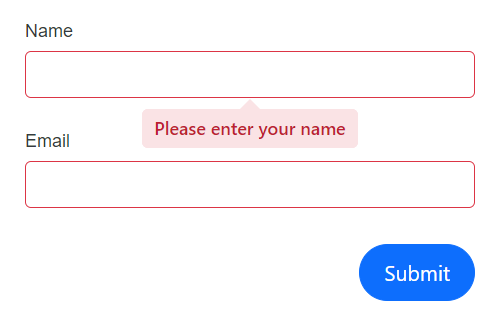

# Validation in DataForm component

DataForm supports standard and custom validation compatible with the[EditForm](https://learn.microsoft.com/en-us/dotnet/api/microsoft.aspnetcore.components.forms.editform?view=aspnetcore-7.0) component. Such as [DataAnnotationsValidator](https://learn.microsoft.com/en-us/dotnet/api/microsoft.aspnetcore.components.forms.dataannotationsvalidator?view=aspnetcore-7.0) , [ObjectGraphDataAnnotationsValidator ](https://learn.microsoft.com/en-us/aspnet/core/blazor/forms/validation?view=aspnetcore-8.0#nested-models-collection-types-and-complex-types) etc...We can specify the required validation inside `FormValidator` RenderFragment of the DataForm component , The following examples illustrate the procedures for setting up the component with various validation.

## Data annotations validation

`DataAnnotationsValidator` in the DataForm validates fields based on data annotation attributes applied to the model properties.









## Validation message display

Validation messages can be displayed inline, via tooltip, or hidden by using [ValidationDisplayMode](https://help.syncfusion.com/cr/blazor/Syncfusion.Blazor.DataForm.SfDataForm.html#Syncfusion_Blazor_DataForm_SfDataForm_ValidationDisplayMode). With inline display, messages are visible when validation occurs. Tooltip display reveals messages on hover/focus. None hides messages from the UI.

| FormValidationDisplay | Snapshot |
| ------------ | ----------------------- |
|[FormValidationDisplay.Inline](https://help.syncfusion.com/cr/blazor/Syncfusion.Blazor.DataForm.FormValidationDisplay.html#Syncfusion_Blazor_DataForm_FormValidationDisplay_Inline)||
|[FormValidationDisplay.Tooltip](https://help.syncfusion.com/cr/blazor/Syncfusion.Blazor.DataForm.FormValidationDisplay.html#Syncfusion_Blazor_DataForm_FormValidationDisplay_Tooltip)||
|[FormValidationDisplay.None](https://help.syncfusion.com/cr/blazor/Syncfusion.Blazor.DataForm.FormValidationDisplay.html#Syncfusion_Blazor_DataForm_FormValidationDisplay_None)||

The following example demonstrates how to configure validation message presentation in the DataForm component.









## Complex model validation 

The `ObjectGraphDataAnnotationsValidator` within the DataForm validates the entire object graph of the bound model, including collection and complex-type properties. In the following example, the `ValidateComplexType` attribute validates properties declared in nested classes such as `ChildModel` and `GrandChildModel`.

N> Install the [Microsoft.AspNetCore.Components.DataAnnotations.Validation](https://www.nuget.org/packages/Microsoft.AspNetCore.Components.DataAnnotations.Validation) NuGet package to enable complex model validation.









## Fluent validation 

[FluentValidator](https://www.nuget.org/packages/Blazored.FluentValidation/) is a custom validator that validates beyond standard data annotations. It supports rules such as credit card format checks, comparisons between fields, and range/threshold validations defined in FluentValidation rule classes.

N> Install the [Blazored.FluentValidation](https://www.nuget.org/packages/Blazored.FluentValidation/) NuGet package to use Fluent validation with the DataForm.









## See also

  * [Custom Validation attributes](https://blazor.syncfusion.com/documentation/data-form/data-annotation-attributes#custom-validation)