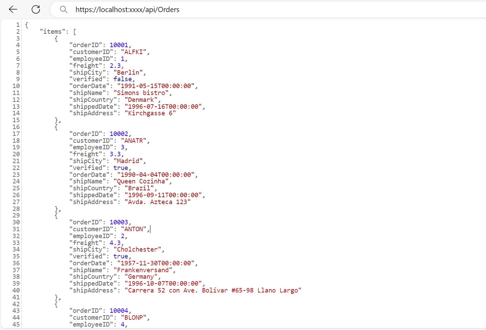

# WebApiAdaptor in Syncfusion<sup style="font-size:70%">&reg;</sup> Blazor Components

The `WebApiAdaptor` extends the `ODataAdaptor` and is specifically designed to interact with Web APIs that support OData query conventions. It facilitates seamless communication with Web API endpoints, enabling efficient data operations while ensuring compatibility with standard Web API architecture.

The `WebApiAdaptor` is used to interact with Web API endpoints that support **OData query options**. It extends the functionality of the **ODataAdaptor**, enabling the [SfDataManager](https://help.syncfusion.com/cr/blazor/Syncfusion.Blazor.Data.SfDataManager.html) to send OData-formatted queries and process responses from Web API services. Use this adaptor when the endpoint understands **OData** queries and returns data in a compatible format.

## WebApiAdaptor vs ODataV4Adaptor

While both adaptors work with OData-style queries, they have distinct use cases:

| Feature | WebApiAdaptor | ODataV4Adaptor |
|---------|---------------|----------------|
| **Server type** | ASP.NET Web API with custom handling. | Full OData V4 service. |
| **Query format** | OData query strings. | Standard OData V4 protocol. |
| **Response format** | Custom: `{ Items: [], Count: number }` | Standard OData: `{ value: [], @odata.count: number }` |
| **Server control** | Full control over query processing. | Framework handles queries automatically. |
| **Use case** | Existing Web APIs with custom logic. | Standard OData V4 services. |

This section describes a step-by-step process for retrieving data using the `WebApiAdaptor` and binding it to the Blazor components provides full control over server‑side query processing, allows flexible response formatting and custom business logic implementation, and supports OData‑style query syntax without requiring the full OData infrastructure.

## Prerequisites

Ensure the following software and packages are installed before proceeding:

| Software/Package | Version | Purpose |
|-----------------|---------|---------|
| Visual Studio 2026 | 18.0 or later | Development IDE with Blazor workload |
| .NET SDK | net8.0 or compatible | Runtime and build tools |

## Backend setup (Creating an API service)
 
To configure a server with the Syncfusion<sup style="font-size:70%">&reg;</sup> Blazor components, follow these steps:
 
### Step 1: Create a Blazor web app
 
You can create a **Blazor Web App** named **WebApiAdaptor** using Visual Studio 2022, either via [Microsoft Templates](https://learn.microsoft.com/en-us/aspnet/core/blazor/tooling?view=aspnetcore-8.0) or the [Syncfusion<sup style="font-size:70%">&reg;</sup> Blazor Extension](https://blazor.syncfusion.com/documentation/visual-studio-integration/template-studio). Make sure to configure the appropriate [interactive render mode](https://learn.microsoft.com/en-us/aspnet/core/blazor/components/render-modes?view=aspnetcore-8.0#render-modes) and [interactivity location](https://learn.microsoft.com/en-us/aspnet/core/blazor/tooling?view=aspnetcore-8.0&pivots=windows).

### Step 2: Create a model class
 
1. In Solution Explorer, right-click the **Server** project, choose **Add** → **New Folder**, and name it **Models**.

2. Right-click the **Models** folder, select **Add → Class**, name it **OrdersDetails.cs**, and replace its default content with the provided implementation.
 
```csharp

namespace WebApiAdaptor.Models
{
    public class OrdersDetails
    {
        public static List<OrdersDetails> order = new List<OrdersDetails>();

        public OrdersDetails() { }
 
        public OrdersDetails(int OrderID, string CustomerId, int EmployeeId, double Freight, bool Verified, DateTime OrderDate, string ShipCity, string ShipName, string ShipCountry, DateTime ShippedDate, string ShipAddress)
        {
            this.OrderID = OrderID;
            this.CustomerID = CustomerId;
            this.EmployeeID = EmployeeId;
            this.Freight = Freight;
            this.ShipCity = ShipCity;
            this.Verified = Verified;
            this.OrderDate = OrderDate;
            this.ShipName = ShipName;
            this.ShipCountry = ShipCountry;
            this.ShippedDate = ShippedDate;
            this.ShipAddress = ShipAddress;
        }

        public static List<OrdersDetails> GetAllRecords()
        {
            if (order.Count() == 0)
            {
                int code = 10000;
                for (int i = 1; i < 10; i++)
                {
                    order.Add(new OrdersDetails(code + 1, "ALFKI", i + 0, 2.3 * i, false, new DateTime(1991, 05, 15), "Berlin", "Simons bistro", "Denmark", new DateTime(1996, 7, 16), "Kirchgasse 6"));
                    order.Add(new OrdersDetails(code + 2, "ANATR", i + 2, 3.3 * i, true, new DateTime(1990, 04, 04), "Madrid", "Queen Cozinha", "Brazil", new DateTime(1996, 9, 11), "Avda. Azteca 123"));
                    order.Add(new OrdersDetails(code + 3, "ANTON", i + 1, 4.3 * i, true, new DateTime(1957, 11, 30), "Cholchester", "Frankenversand", "Germany", new DateTime(1996, 10, 7), "Carrera 52 con Ave. Bolívar #65-98 Llano Largo"));
                    order.Add(new OrdersDetails(code + 4, "BLONP", i + 3, 5.3 * i, false, new DateTime(1930, 10, 22), "Marseille", "Ernst Handel", "Austria", new DateTime(1996, 12, 30), "Magazinweg 7"));
                    order.Add(new OrdersDetails(code + 5, "BOLID", i + 4, 6.3 * i, true, new DateTime(1953, 02, 18), "Tsawassen", "Hanari Carnes", "Switzerland", new DateTime(1997, 12, 3), "1029 - 12th Ave. S."));
                    code += 5;
                }
            }
            return order;
        }

        public int? OrderID { get; set; }
        public string? CustomerID { get; set; }
        public int? EmployeeID { get; set; }
        public double? Freight { get; set; }
        public string? ShipCity { get; set; }
        public bool? Verified { get; set; }
        public DateTime OrderDate { get; set; }
        public string? ShipName { get; set; }
        public string? ShipCountry { get; set; }
        public DateTime ShippedDate { get; set; }
        public string? ShipAddress { get; set; }
    }
}
```
### Step 3: Web API controller configuration

Create a new folder named **Controllers**. Then, add a controller named **GridController.cs** in the **Controllers** folder to handle data communication with Blazor DataGrid. Implement the `Get` method in the controller to return data in JSON format, including the `Items` and `Count` properties as required by the `WebApiAdaptor`.

The sample response object should look like this:

```
{
    Items: [{..}, {..}, {..}, ...],
    Count: 830
}
```



 
using Microsoft.AspNetCore.Mvc;
using Syncfusion.Blazor.Data;
using Syncfusion.Blazor;
using WebApiAdaptor.Models;

namespace WebApiAdaptor.Controllers
{
    [ApiController]
    public class OrdersController : ControllerBase
    {
        /// <summary>
        /// Retrieve data from the data source.
        /// </summary>
        /// <returns>Returns a JSON object with the list of orders and the total count.</returns>
        [HttpGet]
        [Route("api/[controller]")]
        public object GetOrderData()
        {
            // Retrieve all order records.
            List<OrdersDetails> data = OrdersDetails.GetAllRecords().ToList();

            // Return the data and total count.
            return new { Items = data, Count = data.Count() };
        }
    }
}




**Key Points:**

- **[Route("api/[controller]")]**: Defines API endpoint as `/api/Orders`.
- **[ApiController]**: Enables automatic model validation and routing features.
- **Response format**: Returns object with two properties:
  - `Items`: Array of order records.
  - `Count`: Total number of records (required for pagination).
- **Why this format?**: WebApiAdaptor expects `{ Items, Count }` structure, unlike OData which uses `{ value, @odata.count }`.

> When using the WebAPI Adaptor, the data source is returned as a pair of **Items** and **Count**. However, if the `Offline` property of `SfDataManager` is enabled, the entire data source is returned from the server as a collection of objects. In this case, the `$inlinecount` will not be included. Additionally, only a single request is made to fetch all the data from the server, and no further requests are sent.

### Step 4: Register controllers in `Program.cs`
 
Add the following lines in the `Program.cs` file to register controllers:
 
```csharp
// Register controllers in the service container.
builder.Services.AddControllers();
 
// Map controller routes.
app.MapControllers();
```
 
### Step 5: Web API service verification
 
Run the application in Visual Studio, accessible on a URL like **https://localhost:xxxx**. Verify the API returns order data at **https://localhost:xxxx/api/Orders**, where **xxxx** is the port. 

**Example response:**
```json
{
  "Items": [
    {
      "orderID": 10001,
      "customerID": "ALFKI",
      "employeeID": 1,
      "freight": 2.3,
      "shipCity": "Berlin",
      "verified": false,
      "orderDate": "1991-05-15T00:00:00",
      "shipName": "Simons bistro",
      "shipCountry": "Denmark",
      "shippedDate": "1996-07-16T00:00:00",
      "shipAddress": "Kirchgasse 6"
    }
    // ... more records
  ],
  "count": 45
}
```


### Step 6: Understanding the required response format

When using the `WebApiAdaptor`, every backend API endpoint must return data in a specific JSON structure. This ensures that Syncfusion<sup style="font-size:70%">&reg;</sup> Blazor DataManager can correctly interpret the response and bind it to the component. The expected format is:


```json
{
  "Items": [
    { "OrderID": 10001, "CustomerID": "ALFKI", "ShipCity": "Berlin" },
    { "OrderID": 10002, "CustomerID": "ANATR", "ShipCity": "Madrid" },
    ...
  ],
  "Count": 10
}
```

- **Items**: Returns the data records for the current page/request displayed in the UI.
- **Count**: Indicates the total number of records in the dataset, enabling accurate pagination.

> * Without the `Count` field, paging and virtual scrolling cannot function correctly.
> * APIs returning just an array `[{...}, {...}]` instead of `{Items: [...], Count: ...}` will prevent proper data display. Responses must wrap in the required structure.

## Integration with Syncfusion<sup style="font-size:70%">&reg;</sup> Blazor components
 
To integrate the Syncfusion<sup style="font-size:70%">&reg;</sup> Blazor components with the `WebApiAdaptor`, refer to the documentation below:

- [DataGrid](https://blazor.syncfusion.com/documentation/datagrid/connecting-to-adaptors/web-api-adaptor)
 
