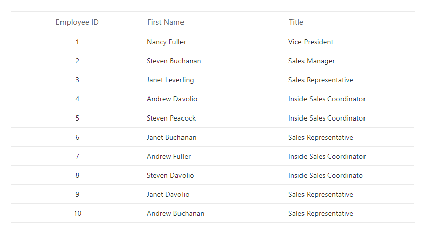

<!-- markdownlint-disable MD024 -->

# Data Binding in Blazor DataManager Component

Data binding establishes a connection between a Blazor component and its data source. The Syncfusion<sup style="font-size:70%">&reg;</sup> Blazor [DataManager](https://help.syncfusion.com/cr/blazor/Syncfusion.Blazor.Data.SfDataManager.html) component provides an efficient way to manage this connection. It acts as an intermediary between the data source and UI components such as [SfGrid](https://blazor.syncfusion.com/documentation/datagrid/getting-started-with-web-app).

The [SfDataManager](https://help.syncfusion.com/cr/blazor/Syncfusion.Blazor.Data.SfDataManager.html) supports two primary approaches for data binding:

* **Local Data Binding** – Binds in-memory collections directly to the component using the [Json](https://help.syncfusion.com/cr/blazor/Syncfusion.Blazor.DataManager.html#Syncfusion_Blazor_DataManager_Json) property.

* **Remote Data Binding** – Connects to remote services by specifying a service endpoint [URL](https://help.syncfusion.com/cr/blazor/Syncfusion.Blazor.DataManager.html#Syncfusion_Blazor_DataManager_Url) and configuring the [Adaptor](https://help.syncfusion.com/cr/blazor/Syncfusion.Blazor.DataManager.html#Syncfusion_Blazor_DataManager_Adaptor) property.

Built-in adaptors enable seamless integration with services such as **OData** and **Web API**. Common operations like **filtering**, **sorting**, **paging**, and **grouping** can be executed on the **client** or **server** based on the selected adaptor.

## Local data binding

Local data binding connects a component to data that resides in the application’s memory. This approach is suitable when the dataset is already available and does not require frequent updates from an external source.

**Key Benefits**

* Eliminates **network latency**.
* Ideal for **small to medium** sized collections.
* Simplifies configuration since no remote service is involved.
* Operations such as **sorting**, **filtering**, **paging**, and **grouping** are performed entirely on the client.

To configure local data binding, assign the in-memory collection to the [Json](https://help.syncfusion.com/cr/blazor/Syncfusion.Blazor.DataManager.html#Syncfusion_Blazor_DataManager_Json) property of the [SfDataManager](https://help.syncfusion.com/cr/blazor/Syncfusion.Blazor.Data.SfDataManager.html) component.


```cshtml
@using Syncfusion.Blazor.Data
@using Syncfusion.Blazor.Grids

<SfGrid TValue="EmployeeData" ID="Grid">
    <SfDataManager Json="@Employees"></SfDataManager>
    <GridColumns>
        <GridColumn Field="@nameof(EmployeeData.EmployeeID)" HeaderText="Employee ID" TextAlign="TextAlign.Center" Width="120"></GridColumn>
        <GridColumn Field="@nameof(EmployeeData.Name)" HeaderText="First Name" Width="130"></GridColumn>
        <GridColumn Field="@nameof(EmployeeData.Title)" HeaderText="Title" Width="120"></GridColumn>
    </GridColumns>
</SfGrid>

@code {

    public class EmployeeData
    {
        public int EmployeeID { get; set; }
        public string Name { get; set; }
        public string Title { get; set; }
    }

    private List<EmployeeData> Employees { get; set; } = new()
    {
        new EmployeeData { EmployeeID = 1, Name = "Nancy Fuller", Title = "Vice President" },
        new EmployeeData { EmployeeID = 2, Name = "Steven Buchanan", Title = "Sales Manager" },
        new EmployeeData { EmployeeID = 3, Name = "Janet Leverling", Title = "Sales Representative" },
        new EmployeeData { EmployeeID = 4, Name = "Andrew Davolio", Title = "Inside Sales Coordinator" },
        new EmployeeData { EmployeeID = 5, Name = "Steven Peacock", Title = "Inside Sales Coordinator" },
        new EmployeeData { EmployeeID = 6, Name = "Janet Buchanan", Title = "Sales Representative" },
        new EmployeeData { EmployeeID = 7, Name = "Andrew Fuller", Title = "Inside Sales Coordinator" },
        new EmployeeData { EmployeeID = 8, Name = "Steven Davolio", Title = "Inside Sales Coordinator" },
        new EmployeeData { EmployeeID = 9, Name = "Janet Davolio", Title = "Sales Representative" },
        new EmployeeData { EmployeeID = 10, Name = "Andrew Buchanan", Title = "Sales Representative" }
    };
}
```



## Remote data binding

Remote data binding connects a component to data hosted on an external service. This approach is recommended when working with large datasets or when data changes frequently and must be retrieved dynamically.

**Key Benefits**

* Enables integration with external services and APIs.
* Supports large-scale datasets without loading all data into memory.
* Allows server-side execution of operations such as **filtering**, **sorting**, **paging**, and **grouping** for improved performance.

To configure remote data binding in the [DataGrid](https://help.syncfusion.com/cr/blazor/Syncfusion.Blazor.Grids.SfGrid-1.html), set the [Url](https://help.syncfusion.com/cr/blazor/Syncfusion.Blazor.DataManager.html#Syncfusion_Blazor_DataManager_Url) property to the service endpoint and specify the [Adaptor](https://help.syncfusion.com/cr/blazor/Syncfusion.Blazor.DataManager.html#Syncfusion_Blazor_DataManager_Adaptor) property in the [SfDataManager](https://help.syncfusion.com/cr/blazor/Syncfusion.Blazor.Data.SfDataManager.htm) component to define how data operations are processed.

```cshtml
@using Syncfusion.Blazor
@using Syncfusion.Blazor.Data
@using Syncfusion.Blazor.Grids

<SfGrid TValue="Order" ID="Grid" AllowPaging="true">
    <SfDataManager Url="https://js.syncfusion.com/demos/ejServices/Wcf/Northwind.svc/Orders" Adaptor="Adaptors.ODataAdaptor"></SfDataManager>
    <GridColumns>
        <GridColumn Field="@nameof(Order.OrderID)" HeaderText="Order ID" IsPrimaryKey="true" TextAlign="TextAlign.Right" Width="120"></GridColumn>
        <GridColumn Field="@nameof(Order.CustomerID)" HeaderText="Customer Name" Width="150"></GridColumn>
        <GridColumn Field="@nameof(Order.OrderDate)" HeaderText="Order Date" Format="d" Type="ColumnType.Date" TextAlign="TextAlign.Right" Width="130"></GridColumn>
        <GridColumn Field="@nameof(Order.Freight)" HeaderText="Freight" Format="C2" TextAlign="TextAlign.Right" Width="120"></GridColumn>
    </GridColumns>
</SfGrid>

@code {
    public class Order
    {
        public int? OrderID { get; set; }
        public string CustomerID { get; set; }
        public DateTime? OrderDate { get; set; }
        public double? Freight { get; set; }
    }
}
```

