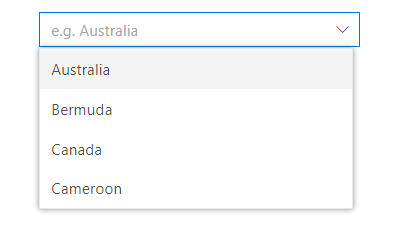

# Getting Started with Blazor DataManager Component

This section briefly explains about how to include [Blazor DataManager](https://help.syncfusion.com/cr/blazor/Syncfusion.Blazor.Data.SfDataManager.html) component in your Blazor Server App and Blazor WebAssembly App using Visual Studio.

## Prerequisites

* [System requirements for Blazor components](https://blazor.syncfusion.com/documentation/system-requirements)

## Create a new Blazor App in Visual Studio

You can create **Blazor Server App** or **Blazor WebAssembly App** using Visual Studio in one of the following ways,

* [Create a Project using Microsoft Templates](https://docs.microsoft.com/en-us/aspnet/core/blazor/tooling?pivots=windows)

* [Create a Project using Syncfusion Blazor Extension](https://blazor.syncfusion.com/documentation/visual-studio-integration/vs2019-extensions/create-project)

## Install Syncfusion Blazor Data NuGet in the App

Syncfusion Blazor components are available in [nuget.org](https://www.nuget.org/packages?q=syncfusion.blazor). To use Syncfusion Blazor components in the application, add reference to the corresponding NuGet. Refer to [NuGet packages topic](https://blazor.syncfusion.com/documentation/nuget-packages) for available NuGet packages list with component details.

To add Blazor DataManager component in the app, open the NuGet package manager in Visual Studio (*Tools → NuGet Package Manager → Manage NuGet Packages for Solution*), search for [Syncfusion.Blazor.Data](https://www.nuget.org/packages/Syncfusion.Blazor.Data) and then install it.

## Register Syncfusion Blazor Service

Open **~/_Imports.razor** file and import the Syncfusion.Blazor namespace.




@using Syncfusion.Blazor




Now, register the Syncfusion Blazor Service in the Blazor Server App or Blazor WebAssembly App. Here, Syncfusion Blazor Service is registered by setting [IgnoreScriptIsolation](https://help.syncfusion.com/cr/blazor/Syncfusion.Blazor.GlobalOptions.html#Syncfusion_Blazor_GlobalOptions_IgnoreScriptIsolation) property as true to load the scripts externally in the [next steps](#add-script-reference).

> From 2022 Vol1 (20.1) version - The default value of `IgnoreScriptIsolation` is changed as `true`, so, you don’t have to set `IgnoreScriptIsolation` property explicitly to refer scripts externally.

### Blazor Server App

* For **.NET 6** app, open the **~/Program.cs** file and register the Syncfusion Blazor Service.

* For **.NET 5 and .NET 3.X** app, open the **~/Startup.cs** file and register the Syncfusion Blazor Service.




using Microsoft.AspNetCore.Components;
using Microsoft.AspNetCore.Components.Web;
using Syncfusion.Blazor;

var builder = WebApplication.CreateBuilder(args);

// Add services to the container.
builder.Services.AddRazorPages();
builder.Services.AddServerSideBlazor();
builder.Services.AddSyncfusionBlazor(options => { options.IgnoreScriptIsolation = true; });

var app = builder.Build();
....





using Syncfusion.Blazor;

namespace BlazorApplication
{
    public class Startup
    {
        ...
        public void ConfigureServices(IServiceCollection services)
        {
            services.AddRazorPages();
            services.AddServerSideBlazor();
            services.AddSyncfusionBlazor(options => { options.IgnoreScriptIsolation = true; });
        }
        ...
    }
}




### Blazor WebAssembly App

Open **~/Program.cs** file and register the Syncfusion Blazor Service in the client web app.




using Microsoft.AspNetCore.Components.Web;
using Microsoft.AspNetCore.Components.WebAssembly.Hosting;
using Syncfusion.Blazor;

var builder = WebAssemblyHostBuilder.CreateDefault(args);
builder.RootComponents.Add<App>("#app");
builder.RootComponents.Add<HeadOutlet>("head::after");

builder.Services.AddScoped(sp => new HttpClient { BaseAddress = new Uri(builder.HostEnvironment.BaseAddress) });

builder.Services.AddSyncfusionBlazor(options => { options.IgnoreScriptIsolation = true; });
await builder.Build().RunAsync();
....





using Syncfusion.Blazor;

namespace WebApplication1
{
    public class Program
    {
        public static async Task Main(string[] args)
        {
            ....
            builder.Services.AddSyncfusionBlazor(options => { options.IgnoreScriptIsolation = true; });
            await builder.Build().RunAsync();
        }
    }
}




## Add style sheet

Checkout the [Blazor Themes topic](https://blazor.syncfusion.com/documentation/appearance/themes) to learn different ways ([Static Web Assets](https://blazor.syncfusion.com/documentation/appearance/themes#static-web-assets), [CDN](https://blazor.syncfusion.com/documentation/appearance/themes#cdn-reference) and [CRG](https://blazor.syncfusion.com/documentation/common/custom-resource-generator)) to refer themes in Blazor application, and to have the expected appearance for Syncfusion Blazor components. Here, the theme is referred using [Static Web Assets](https://blazor.syncfusion.com/documentation/appearance/themes#static-web-assets). Refer to [Enable static web assets usage](https://blazor.syncfusion.com/documentation/appearance/themes#enable-static-web-assets-usage) topic to use static assets in your project.

To add theme to the app, open the NuGet package manager in Visual Studio (*Tools → NuGet Package Manager → Manage NuGet Packages for Solution*), search for [Syncfusion.Blazor.Themes](https://www.nuget.org/packages/Syncfusion.Blazor.Themes/) and then install it. Then, the theme style sheet from NuGet can be referred as follows,

### Blazor Server App

* For .NET 6 app, add the Syncfusion bootstrap5 theme in the `<head>` of the **~/Pages/_Layout.cshtml** file.

* For .NET 5 and .NET 3.X app, add the Syncfusion bootstrap5 theme in the `<head>` of the **~/Pages/_Host.cshtml** file.




<head>
    <link href="_content/Syncfusion.Blazor.Themes/bootstrap5.css" rel="stylesheet" />
</head>





<head>
    <link href="_content/Syncfusion.Blazor.Themes/bootstrap5.css" rel="stylesheet" />
</head>




### Blazor WebAssembly App

For Blazor WebAssembly App, refer the theme style sheet from NuGet in the `<head>` of **wwwroot/index.html** file in the client web app.




<head>
    <link href="_content/Syncfusion.Blazor.Themes/bootstrap5.css" rel="stylesheet" />
</head>




## Add script reference

Checkout [Adding Script Reference topic](https://blazor.syncfusion.com/documentation/common/adding-script-references) to learn different ways to add script reference in Blazor Application. In this getting started walk-through, the required scripts are referred using [Static Web Assets](https://blazor.syncfusion.com/documentation/common/adding-script-references#static-web-assets) externally inside the `<head>` as follows. Refer to [Enable static web assets usage](https://blazor.syncfusion.com/documentation/common/adding-script-references#enable-static-web-assets-usage) topic to use static assets in your project.

### Blazor Server App

* For **.NET 6** app, refer script in the `<head>` of the **~/Pages/_Layout.cshtml** file.

* For **.NET 5 and .NET 3.X** app, refer script in the `<head>` of the **~/Pages/_Host.cshtml** file.




<head>
    ....
    <link href="_content/Syncfusion.Blazor.Themes/bootstrap5.css" rel="stylesheet" />
    
    <!--Use below script reference if you are using Syncfusion.Blazor Single NuGet-->
    <!---->
</head>





<head>
    ....
    <link href="_content/Syncfusion.Blazor.Themes/bootstrap5.css" rel="stylesheet" />
    
    <!--Use below script reference if you are using Syncfusion.Blazor Single NuGet-->
    <!---->
</head>




### Blazor WebAssembly App

For Blazor WebAssembly App, refer script in the `<head>` of the **~/index.html** file.




<head>
    ....
    <link href="_content/Syncfusion.Blazor.Themes/bootstrap5.css" rel="stylesheet" />
    
    <!--Use below script reference if you are using Syncfusion.Blazor Single NuGet-->
    <!---->
</head>




> Syncfusion recommends to reference scripts using [Static Web Assets](https://blazor.syncfusion.com/documentation/common/adding-script-references#static-web-assets), [CDN](https://blazor.syncfusion.com/documentation/common/adding-script-references#cdn-reference) and [CRG](https://blazor.syncfusion.com/documentation/common/custom-resource-generator) by [disabling JavaScript isolation](https://blazor.syncfusion.com/documentation/common/adding-script-references#disable-javascript-isolation) for better loading performance of the Blazor application.

## Add Blazor DataManager component

[SfDataManager](https://help.syncfusion.com/cr/aspnetcore-blazor/Syncfusion.Blazor.Data.SfDataManager.html) component should be used in conjunction with Syncfusion Blazor components that supports data binding.

In the following example, `SfDataManager` is used with Blazor DataGrid component to depict the usage of DataManager. The DataManager acts as a gateway for both local and remote data to interact with the data source based on the provided query.

### Binding to JSON data

Local JSON data can be bound to the DataGrid component by assigning the array of objects to the [Json](https://help.syncfusion.com/cr/blazor/Syncfusion.Blazor.DataManager.html#Syncfusion_Blazor_DataManager_Json) property of the [SfDataManager](https://help.syncfusion.com/cr/aspnetcore-blazor/Syncfusion.Blazor.Data.SfDataManager.html) component.

The following sample code demonstrates binding local data through the [SfDataManager](https://help.syncfusion.com/cr/aspnetcore-blazor/Syncfusion.Blazor.Data.SfDataManager.html) to the DataGrid component,




@using Syncfusion.Blazor.Grids

<SfGrid TValue="EmployeeData" ID="Grid">
    <SfDataManager Json=@Employees></SfDataManager>
    <GridColumns>
        <GridColumn Field=@nameof(EmployeeData.EmployeeID) TextAlign="TextAlign.Center" HeaderText="Employee ID" Width="120"></GridColumn>
        <GridColumn Field=@nameof(EmployeeData.Name) HeaderText="First Name" Width="130"></GridColumn>
        <GridColumn Field=@nameof(EmployeeData.Title) HeaderText="Title" Width="120"></GridColumn>
    </GridColumns>
</SfGrid>

@code{
    public class EmployeeData
    {
        public int EmployeeID { get; set; }
        public string Name { get; set; }
        public string Title { get; set; }
    }

    public EmployeeData[] Employees = new EmployeeData[]
    {
        new EmployeeData { EmployeeID = 1, Name = "Nancy Fuller", Title = "Vice President" },
        new EmployeeData { EmployeeID = 2, Name = "Steven Buchanan", Title = "Sales Manager" },
        new EmployeeData { EmployeeID = 3, Name = "Janet Leverling", Title = "Sales Representative" },
        new EmployeeData { EmployeeID = 4, Name = "Andrew Davolio", Title = "Inside Sales Coordinator" },
        new EmployeeData { EmployeeID = 5, Name = "Steven Peacock", Title = "Inside Sales Coordinator" },
        new EmployeeData { EmployeeID = 6, Name = "Janet Buchanan", Title = "Sales Representative" },
        new EmployeeData { EmployeeID = 7, Name = "Andrew Fuller", Title = "Inside Sales Coordinator" },
        new EmployeeData { EmployeeID = 8, Name = "Steven Davolio", Title = "Inside Sales Coordinato" },
        new EmployeeData { EmployeeID = 9, Name = "Janet Davolio", Title = "Sales Representative" },
        new EmployeeData { EmployeeID = 10, Name = "Andrew Buchanan", Title = "Sales Representative" }
    };
}




### Binding to OData

Remote data can be bound to the DataGrid component by binding the [SfDataManager](https://help.syncfusion.com/cr/aspnetcore-blazor/Syncfusion.Blazor.Data.SfDataManager.html) component to it and then assigning the service end point URL to the [Url](https://help.syncfusion.com/cr/blazor/Syncfusion.Blazor.DataManager.html#Syncfusion_Blazor_DataManager_Url) property of the [SfDataManager](https://help.syncfusion.com/cr/aspnetcore-blazor/Syncfusion.Blazor.Data.SfDataManager.html).

The following sample code demonstrates binding OData through the [SfDataManager](https://help.syncfusion.com/cr/aspnetcore-blazor/Syncfusion.Blazor.Data.SfDataManager.html) to the DataGrid component,




<SfGrid TValue="Order" ID="Grid" AllowPaging="true">
    <SfDataManager Url="https://js.syncfusion.com/demos/ejServices/Wcf/Northwind.svc/Orders" Adaptor="Adaptors.ODataAdaptor"></SfDataManager>
    <GridColumns>
        <GridColumn Field=@nameof(Order.OrderID) HeaderText="Order ID" IsPrimaryKey="true" TextAlign="TextAlign.Right" Width="120"></GridColumn>
        <GridColumn Field=@nameof(Order.CustomerID) HeaderText="Customer Name" Width="150"></GridColumn>
        <GridColumn Field=@nameof(Order.OrderDate) HeaderText=" Order Date" Format="d" Type="ColumnType.Date" TextAlign="TextAlign.Right" Width="130"></GridColumn>
        <GridColumn Field=@nameof(Order.Freight) HeaderText="Freight" Format="C2" TextAlign="TextAlign.Right" Width="120"></GridColumn>
    </GridColumns>
</SfGrid>

@code{
    public class Order {
        public int? OrderID { get; set; }
        public string CustomerID { get; set; }
        public DateTime? OrderDate { get; set; }
        public double? Freight { get; set; }
    }
}




## Component binding

The [SfDataManager](https://help.syncfusion.com/cr/aspnetcore-blazor/Syncfusion.Blazor.Data.SfDataManager.html) can be used with Syncfusion components which supports data binding. 
    
In the below example, the `SfDataManager` is bound with DropDownList component to demonstrate data binding for the components. In the same way, you can use `DataManager` with any other data-bound components of Syncfusion Blazor components.

### Local data binding

Local data can be bound to the DropDownList component by assigning the array of objects to the [Json](https://help.syncfusion.com/cr/blazor/Syncfusion.Blazor.DataManager.html#Syncfusion_Blazor_DataManager_Json) property of the [SfDataManager](https://help.syncfusion.com/cr/aspnetcore-blazor/Syncfusion.Blazor.Data.SfDataManager.html) component.

The following sample code demonstrates binding local data through the [SfDataManager](https://help.syncfusion.com/cr/aspnetcore-blazor/Syncfusion.Blazor.Data.SfDataManager.html) to the DropDownList component,




@using Syncfusion.Blazor.DropDowns

<SfDropDownList Placeholder="e.g. Australia" TValue="Countries">
    <SfDataManager Json=@Country></SfDataManager>
    <DropDownListFieldSettings Value="Name"></DropDownListFieldSettings>
</SfDropDownList>

@code{
    public class Countries
    {
        public string Name { get; set; }

        public string Code { get; set; }
    }

    public Countries[] Country = new Countries[]
    {
        new Countries { Name = "Australia", Code = "AU" },
        new Countries { Name = "Bermuda", Code = "BM" },
        new Countries { Name = "Canada", Code = "CA" },
        new Countries { Name = "Cameroon", Code = "CM" }
    };
}




### Remote data binding

Remote data can be bound to the DropDownList component by binding the [SfDataManager](https://help.syncfusion.com/cr/aspnetcore-blazor/Syncfusion.Blazor.Data.SfDataManager.html) component to it and then assigning the service end point URL to the [Url](https://help.syncfusion.com/cr/blazor/Syncfusion.Blazor.DataManager.html#Syncfusion_Blazor_DataManager_Url) property of the [SfDataManager](https://help.syncfusion.com/cr/aspnetcore-blazor/Syncfusion.Blazor.Data.SfDataManager.html).

The following sample code demonstrates binding remote data through the [SfDataManager](https://help.syncfusion.com/cr/aspnetcore-blazor/Syncfusion.Blazor.Data.SfDataManager.html) to the DropDownList component,




<SfDropDownList Placeholder="Name" TValue="Contact">
    <SfDataManager Url="https://services.odata.org/V4/Northwind/Northwind.svc/Customers" Adaptor="Adaptors.ODataV4Adaptor"></SfDataManager>
    <DropDownListFieldSettings Value="CustomerID" Text="ContactName"></DropDownListFieldSettings>
</SfDropDownList>

@code{
    public class Contact
    {
        public string ContactName { get; set; }

        public string CustomerID { get; set; }
    }
}




> [View Sample in GitHub](https://github.com/SyncfusionExamples/Blazor-Getting-Started-Examples/tree/main/DataManager).