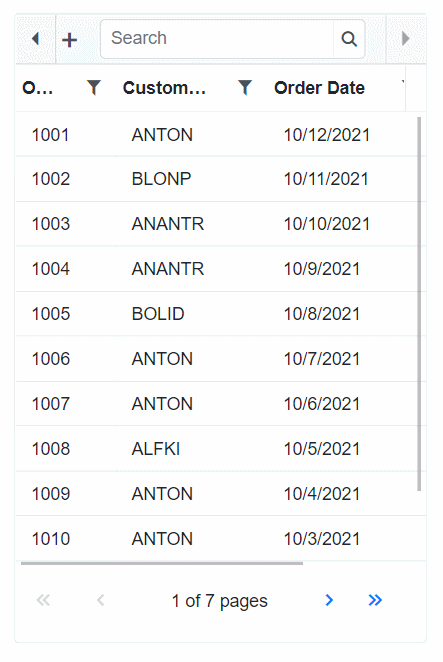
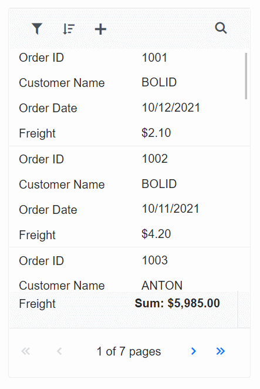

# Adaptive UI Layout in Blazor DataGrid Component

The DataGrid user interface (UI) was redesigned to provide an optimal viewing experience and improve usability on small screens. This interface will render the filter, sort, and edit dialogs adaptively and have an option to render the DataGrid row elements in the vertical direction.

To know about how to **Adaptive UI Layout** in Blazor DataGrid Component, you can check this video.



## Render adaptive dialog

To render adaptive dialog UI in the DataGrid, set the [EnableAdaptiveUI](https://help.syncfusion.com/cr/blazor/Syncfusion.Blazor.Grids.SfGrid-1.html#Syncfusion_Blazor_Grids_SfGrid_1_EnableAdaptiveUI) property to true. The DataGrid will render the filter, sort, and edit dialogs in full screen for a better user experience.

```csharp

@using Syncfusion.Blazor.Grids
@using Syncfusion.Blazor.Buttons

<div style="position:relative; min-height: 500px;">
    <SfGrid DataSource="@Orders" AllowSorting="true" AllowFiltering="true" EnableAdaptiveUI="true" Toolbar="@(new List<string>() { "Add", "Edit", "Delete", "Cancel", "Update", "Search" })" Height="100%" Width="100%" AllowPaging="true">
        <GridFilterSettings Type="@FilterType.Excel"></GridFilterSettings>
        <GridEditSettings AllowAdding="true" AllowEditing="true" AllowDeleting="true" Mode="EditMode.Dialog"></GridEditSettings>
        <GridColumns>
            <GridColumn Field=@nameof(Order.OrderID) HeaderText="Order ID" IsPrimaryKey="true" Width="80" ValidationRules="@(new ValidationRules{ Required= true })"></GridColumn>
            <GridColumn Field=@nameof(Order.CustomerID) HeaderText="Customer Name" Width="120"></GridColumn>
            <GridColumn Field=@nameof(Order.OrderDate) HeaderText=" Order Date" Format="d" Type="ColumnType.Date" Width="130"></GridColumn>
            <GridColumn Field=@nameof(Order.Freight) HeaderText="Freight" Format="C2" Width="120"></GridColumn>
        </GridColumns>
    </SfGrid>
</div>

@code{
    public List<Order> Orders { get; set; }

    protected override void OnInitialized()
    {
        Orders = Enumerable.Range(1, 75).Select(x => new Order()
        {
            OrderID = 1000 + x,
            CustomerID = (new string[] { "ALFKI", "ANANTR", "ANTON", "BLONP", "BOLID" })[new Random().Next(5)],
            Freight = 2.1 * x,
            OrderDate = DateTime.Now.AddDays(-x),
        }).ToList();
    }

    public class Order
    {
        public int? OrderID { get; set; }
        public string CustomerID { get; set; }
        public DateTime? OrderDate { get; set; }
        public double? Freight { get; set; }
    }
}

```



N> 1. This UI is common for both horizontal and vertical mode of rendering when EnableAdaptiveUI is enabled.

## Vertical mode

The DataGrid will render the row elements vertically while setting the [RowRenderingMode](https://help.syncfusion.com/cr/blazor/Syncfusion.Blazor.Grids.SfGrid-1.html#Syncfusion_Blazor_Grids_SfGrid_1_RowRenderingMode) property value as **Vertical**.

```csharp

@using Syncfusion.Blazor.Grids
@using Syncfusion.Blazor.Buttons

@{
    var RenderingMode = RowDirection.Vertical;
}

<div style="position:relative; min-height: 500px;">
    <SfGrid DataSource="@Orders" AllowSorting="true" AllowFiltering="true" EnableAdaptiveUI="true" Toolbar="@(new List<string>() { "Add", "Edit", "Delete", "Cancel", "Update", "Search" })" RowRenderingMode="@RenderingMode" Height="100%" Width="100%" AllowPaging="true">
        <GridFilterSettings Type="@FilterType.Excel"></GridFilterSettings>
        <GridEditSettings AllowAdding="true" AllowEditing="true" AllowDeleting="true" Mode="EditMode.Dialog"></GridEditSettings>
         <GridAggregates>
            <GridAggregate>
                <GridAggregateColumns>
                    <GridAggregateColumn Field=@nameof(Order.Freight) Type="AggregateType.Sum" Format="C2">
                        <FooterTemplate>
                            @{
                                var aggregate = (context as AggregateTemplateContext);
                                <div>
                                    <p>Sum: @aggregate.Sum</p>
                                </div>
                            }
                        </FooterTemplate>
                    </GridAggregateColumn>
                </GridAggregateColumns>
            </GridAggregate>
        </GridAggregates>
        <GridColumns>
            <GridColumn Field=@nameof(Order.OrderID) HeaderText="Order ID" IsPrimaryKey="true" Width="80"></GridColumn>
            <GridColumn Field=@nameof(Order.CustomerID) HeaderText="Customer Name" Width="120"></GridColumn>
            <GridColumn Field=@nameof(Order.OrderDate) HeaderText=" Order Date" Format="d" Type="ColumnType.Date" Width="130"></GridColumn>
            <GridColumn Field=@nameof(Order.Freight) HeaderText="Freight" Format="C2" Width="120"></GridColumn>
        </GridColumns>
    </SfGrid>
</div>

@code{
    public List<Order> Orders { get; set; }

    protected override void OnInitialized()
    {
        Orders = Enumerable.Range(1, 75).Select(x => new Order()
        {
            OrderID = 1000 + x,
            CustomerID = (new string[] { "ALFKI", "ANANTR", "ANTON", "BLONP", "BOLID" })[new Random().Next(5)],
            Freight = 2.1 * x,
            OrderDate = DateTime.Now.AddDays(-x),
        }).ToList();
    }

    public class Order
    {
        public int? OrderID { get; set; }
        public string CustomerID { get; set; }
        public DateTime? OrderDate { get; set; }
        public double? Freight { get; set; }
    }
}

```



### Supported features in vertical mode

The following features are only supported in vertical row rendering:

* Paging
* Sorting
* Filtering
* Selection
* Dialog Editing
* Aggregate
* Virtual scroll
* Toolbar

## Rendering an adaptive layout for smaller screens alone

By default, adaptive UI layout is rendered in both mobile devices and desktop mode too while setting the [EnableAdaptiveUI](https://help.syncfusion.com/cr/blazor/Syncfusion.Blazor.Grids.SfGrid-1.html#Syncfusion_Blazor_Grids_SfGrid_1_EnableAdaptiveUI) property as true. Now the DataGrid component has an option to render an adaptive layout only for mobile screen sizes. This can be achieved by specifying the [AdaptiveUIMode](https://help.syncfusion.com/cr/blazor/Syncfusion.Blazor.Grids.SfGrid-1.html#Syncfusion_Blazor_Grids_SfGrid_1_AdaptiveUIMode) property value as `Mobile`. The default value of the `AdaptiveUIMode` property is "Both".

N> The [RowRenderingMode](https://help.syncfusion.com/cr/blazor/Syncfusion.Blazor.Grids.SfGrid-1.html#Syncfusion_Blazor_Grids_SfGrid_1_RowRenderingMode) property is rendered on the adaptive layout based on the `AdaptiveUIMode` property.

```csharp
@using Syncfusion.Blazor.Grids

<div style="position:relative; min-height: 500px;">
    <SfGrid DataSource="@Orders" AllowSorting="true" AllowFiltering="true" EnableAdaptiveUI="true" AdaptiveUIMode="AdaptiveMode.Mobile" Toolbar="@(new List<string>() { "Add", "Edit", "Delete", "Cancel", "Update", "Search" })" Height="100%" Width="100%" AllowPaging="true">
        <GridFilterSettings Type="@FilterType.Excel"></GridFilterSettings>
        <GridEditSettings AllowAdding="true" AllowEditing="true" AllowDeleting="true" Mode="EditMode.Dialog"></GridEditSettings>
        <GridColumns>
            <GridColumn Field=@nameof(Order.OrderID) HeaderText="Order ID" IsPrimaryKey="true" Width="80"></GridColumn>
            <GridColumn Field=@nameof(Order.CustomerID) HeaderText="Customer Name" Width="120"></GridColumn>
            <GridColumn Field=@nameof(Order.OrderDate) HeaderText=" Order Date" Format="d" Type="ColumnType.Date" Width="130"></GridColumn>
            <GridColumn Field=@nameof(Order.Freight) HeaderText="Freight" Format="C2" Width="120"></GridColumn>
        </GridColumns>
    </SfGrid>
</div>

@code{
    public List<Order> Orders { get; set; }

    protected override void OnInitialized()
    {
        Orders = Enumerable.Range(1, 75).Select(x => new Order()
        {
            OrderID = 1000 + x,
            CustomerID = (new string[] { "ALFKI", "ANANTR", "ANTON", "BLONP", "BOLID" })[new Random().Next(5)],
            Freight = 2.1 * x,
            OrderDate = DateTime.Now.AddDays(-x),
        }).ToList();
    }

    public class Order
    {
        public int? OrderID { get; set; }
        public string CustomerID { get; set; }
        public DateTime? OrderDate { get; set; }
        public double? Freight { get; set; }
    }
}

```

N> [View Sample in GitHub.](https://github.com/SyncfusionExamples/blazor-datagrid-render-adaptive-layout)