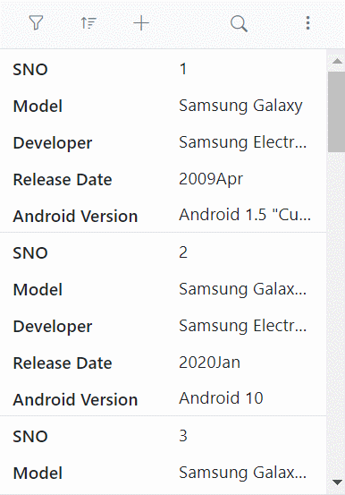
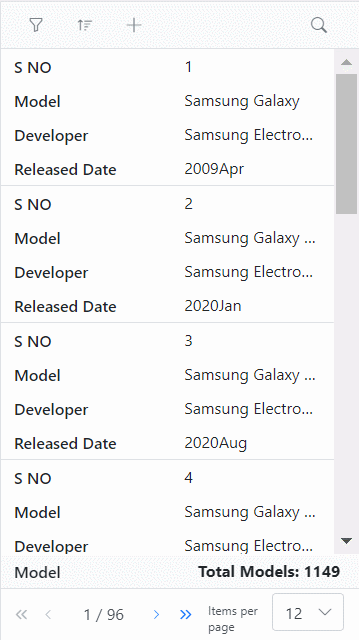

# Adaptive UI Layout in Blazor DataGrid

The Syncfusion&reg; Blazor DataGrid user interface (UI) was redesigned to provide an optimal viewing experience and improve usability on small screens. This interface will render the filter, sort, column chooser, column menu(supports only when the [RowRenderingMode](https://help.syncfusion.com/cr/blazor/Syncfusion.Blazor.Grids.SfGrid-1.html#Syncfusion_Blazor_Grids_SfGrid_1_RowRenderingMode) as Horizontal) and edit dialogs adaptively and have an option to render the Grid row elements in the vertical direction.

To know about how to **Adaptive UI Layout** in Grid, you can check this video.



## Render adaptive dialogs

The Syncfusion&reg; Blazor DataGrid offers a valuable feature for rendering adaptive dialogs, specifically designed to enhance the user experience on smaller screens. This feature proves especially useful for optimizing the interface on devices with limited screen real estate. The functionality is achieved by enabling the [EnableAdaptiveUI](https://help.syncfusion.com/cr/blazor/Syncfusion.Blazor.Grids.SfGrid-1.html#Syncfusion_Blazor_Grids_SfGrid_1_EnableAdaptiveUI) property, allowing the Grid to render filter, sort, and edit dialogs in full-screen mode.

The following sample demonstrates how to enable and utilize adaptive dialogs in the Grid:



@using Syncfusion.Blazor.Grids

    

        

            <SfGrid DataSource="@AdaptiveData" AllowPaging="true" AllowSorting="true" AllowFiltering="true" EnableAdaptiveUI="true" Toolbar="@(new List<string>() { "Add", "Edit", "Delete", "Cancel", "Update", "Search" })" Height="100%">
                <GridFilterSettings Type="@FilterType.Excel"></GridFilterSettings>
                <GridEditSettings AllowAdding="true" AllowEditing="true" AllowDeleting="true" Mode="EditMode.Dialog"></GridEditSettings>
                <GridColumns>
                    <GridColumn Field=@nameof(AdaptiveDetails.SNO) HeaderText="S NO" IsPrimaryKey="true" Width="150" ValidationRules="@(new ValidationRules{ Required= true })"></GridColumn>
                    <GridColumn Field=@nameof(AdaptiveDetails.Model) HeaderText="Model" ValidationRules="@(new ValidationRules{ Required= true })" Width="200"></GridColumn>
                    <GridColumn Field=@nameof(AdaptiveDetails.Developer) HeaderText="Developer" ValidationRules="@(new ValidationRules{ Required= true })" FilterSettings="DeveloperFilterSettings" Width="200"></GridColumn>
                    <GridColumn Field=@nameof(AdaptiveDetails.ReleaseDate) HeaderText="Released Date" EditType="EditType.DatePickerEdit" Format="yyyyMMM" Width="200"></GridColumn>
                    <GridColumn Field=@nameof(AdaptiveDetails.AndroidVersion) HeaderText="Android Version" ValidationRules="@(new ValidationRules{ Required= true })" FilterSettings="VersionFilterSettings" Width="200"></GridColumn>
                </GridColumns>
            </SfGrid>
        

    

@code {
    FilterSettings VersionFilterSettings = new FilterSettings { Type = Syncfusion.Blazor.Grids.FilterType.CheckBox };
    FilterSettings DeveloperFilterSettings = new FilterSettings { Type = Syncfusion.Blazor.Grids.FilterType.Menu };

    SfGrid<AdaptiveDetails> Grid { get; set; }

    public List<AdaptiveDetails> AdaptiveData { get; set; }

    protected override void OnInitialized()
    {
        AdaptiveData = AdaptiveDetails.GetAllModels();
    }
}



public class AdaptiveDetails
{
public static List<AdaptiveDetails> AdaptiveModels = new List<AdaptiveDetails>();

    public AdaptiveDetails() { }

    public AdaptiveDetails(int SNO, string Model, string Developer, DateTime? ReleaseDate, string AndroidVersion)
    {
        this.SNO = SNO;
        this.Model = Model;
        this.Developer = Developer;
        this.ReleaseDate = ReleaseDate;
        this.AndroidVersion = AndroidVersion;
    }

    public static List<AdaptiveDetails> GetAllModels()
    {
        if (AdaptiveModels.Count == 0)
        {
            AdaptiveModels.Add(new AdaptiveDetails(1, "Samsung Galaxy", "Samsung Electronics", new DateTime(2009, 4, 30), "Android 1.5 \"Cupcake\""));
            AdaptiveModels.Add(new AdaptiveDetails(2, "Samsung Galaxy A01", "Samsung Electronics", new DateTime(2020, 1, 31), "Android 10"));
            AdaptiveModels.Add(new AdaptiveDetails(3, "Samsung Galaxy A01 Core", "Samsung Electronics", new DateTime(2020, 8, 31), "Android 10"));
            AdaptiveModels.Add(new AdaptiveDetails(4, "Samsung Galaxy A2 Core", "Samsung Electronics", new DateTime(2021, 1, 31), "Android 8.0 \"Oreo\""));
            AdaptiveModels.Add(new AdaptiveDetails(5, "Samsung Galaxy A3", "Samsung Electronics", new DateTime(2019, 4, 30), "Android 4.4.4 \"KitKat\""));
            AdaptiveModels.Add(new AdaptiveDetails(6, "Samsung Galaxy A5", "Samsung Electronics", new DateTime(2021, 1, 31), "Android 4.4.4 \"KitKat\""));
            AdaptiveModels.Add(new AdaptiveDetails(7, "Samsung Galaxy A5 (2016)", "Samsung Electronics", new DateTime(2015, 12, 31), "Android 5.1.1 \"Lollipop\""));
            AdaptiveModels.Add(new AdaptiveDetails(8, "Samsung Galaxy A5 (2017)", "Samsung Electronics", new DateTime(2017, 1, 31), "Android 6.0.1 \"Marshmallow\""));
            AdaptiveModels.Add(new AdaptiveDetails(9, "Samsung Galaxy A6", "Samsung Electronics", new DateTime(2014, 12, 31), "Android 8.0 \"Oreo\""));
            AdaptiveModels.Add(new AdaptiveDetails(10, "Samsung Galaxy A7", "Samsung Electronics", new DateTime(2014, 12, 31), "Android 4.4.4 \"KitKat\""));
            AdaptiveModels.Add(new AdaptiveDetails(11, "Samsung Galaxy A7 (2016)", "Samsung Electronics", new DateTime(2014, 11, 30), "Android 5.1.1 \"Lollipop\""));
            AdaptiveModels.Add(new AdaptiveDetails(12, "Samsung Galaxy A7 (2017)", "Samsung Electronics", new DateTime(2018, 5, 31), "Android 6.0.1 \"Marshmallow\""));
            AdaptiveModels.Add(new AdaptiveDetails(13, "Samsung Galaxy A7 (2018)", "Samsung Electronics", new DateTime(2018, 11, 30), "Android 8.0 \"Oreo\""));
            AdaptiveModels.Add(new AdaptiveDetails(14, "Samsung Galaxy A8", "Samsung Electronics", new DateTime(2018, 10, 30), "Android 4.4.4 \"KitKat\""));
            AdaptiveModels.Add(new AdaptiveDetails(15, "Samsung Galaxy A8 (2016)", "Samsung Electronics", new DateTime(2015, 2, 28), "Android 6.0.1 \"Marshmallow\""));
            AdaptiveModels.Add(new AdaptiveDetails(16, "Samsung Galaxy A8 (2018)", "Samsung Electronics", new DateTime(2016, 10, 30), "Android 7.1.1 \"Nougat\""));
            AdaptiveModels.Add(new AdaptiveDetails(17, "Samsung Galaxy A8+ (2018)", "Samsung Electronics", new DateTime(2018, 1, 31), "Android 7.1.1 \"Nougat\""));
            AdaptiveModels.Add(new AdaptiveDetails(18, "Samsung Galaxy A8 Star", "Samsung Electronics", new DateTime(2018, 6, 30), "Android 8.0 \"Oreo\""));
            AdaptiveModels.Add(new AdaptiveDetails(19, "Samsung Galaxy A8s", "Samsung Electronics", new DateTime(2015, 8, 30), "Android 9.0 \"Pie\""));
        }
        return AdaptiveModels;
    }

    public int SNO { get; set; }
    public string Model { get; set; }
    public string Developer { get; set; }
    public DateTime? ReleaseDate { get; set; }
    public string AndroidVersion { get; set; }
}





## Vertical row rendering

The Syncfusion&reg; Blazor DataGrid introduces the feature of vertical row rendering, allowing you to display row elements in a vertical order. This is particularly useful for scenarios where a vertical presentation enhances data visibility. This is achieved by setting the [RowRenderingMode](https://help.syncfusion.com/cr/blazor/Syncfusion.Blazor.Grids.SfGrid-1.html#Syncfusion_Blazor_Grids_SfGrid_1_RowRenderingMode) property to the value **Vertical**.

>The default row rendering mode is **Horizontal**.

The following sample demonstrates how to dynamically change the row rendering mode between **Vertical** and **Horizontal** based on a DropDownList selection:



@using Syncfusion.Blazor.DropDowns
@using Syncfusion.Blazor.Grids

<label> Select row rendering mode: </label>
<SfDropDownList TValue="RowDirection" TItem="DropDownOrder" DataSource="@DropDownValue" Width="120px">
    <DropDownListFieldSettings Text="Text" Value="Value"></DropDownListFieldSettings>
    <DropDownListEvents ValueChange="OnChange" TValue="RowDirection" TItem="DropDownOrder"></DropDownListEvents>
</SfDropDownList>

    

        

            <SfGrid @ref="Grid" DataSource="@AdaptiveData" AllowPaging="true" AllowSorting="true" AllowFiltering="true" EnableAdaptiveUI="true" RowRenderingMode="@RowDirectionValue" Toolbar="@(new List<string>() { "Add", "Edit", "Delete", "Cancel", "Update", "Search" })" Height="100%">
                <GridFilterSettings Type="@Syncfusion.Blazor.Grids.FilterType.Excel"></GridFilterSettings>
                <GridEditSettings AllowAdding="true" AllowEditing="true" AllowDeleting="true" Mode="Syncfusion.Blazor.Grids.EditMode.Dialog"></GridEditSettings>
                <GridAggregates>
                    <GridAggregate>
                        <GridAggregateColumns>
                            <GridAggregateColumn Field=@nameof(AdaptiveDetails.Model) Type="AggregateType.Count" Format="C2">
                                <FooterTemplate>
                                    @{
                                        var aggregate = (context as AggregateTemplateContext);
                                        

                                            
Total Models: @aggregate.Count

                                        

                                    }
                                </FooterTemplate>
                            </GridAggregateColumn>
                        </GridAggregateColumns>
                    </GridAggregate>
                </GridAggregates>
                <GridColumns>
                    <GridColumn Field=@nameof(AdaptiveDetails.SNO) HeaderText="S NO" IsPrimaryKey="true" Width="150" ValidationRules="@(new Syncfusion.Blazor.Grids.ValidationRules{ Required= true })"></GridColumn>
                    <GridColumn Field=@nameof(AdaptiveDetails.Model) HeaderText="Model" ValidationRules="@(new Syncfusion.Blazor.Grids.ValidationRules{ Required= true })" Width="200"></GridColumn>
                    <GridColumn Field=@nameof(AdaptiveDetails.Developer) HeaderText="Developer" ValidationRules="@(new Syncfusion.Blazor.Grids.ValidationRules{ Required= true })" FilterSettings="DeveloperFilterSettings" Width="200"></GridColumn>
                    <GridColumn Field=@nameof(AdaptiveDetails.ReleaseDate) HeaderText="Released Date" EditType="EditType.DatePickerEdit" Format="yyyyMMM" Width="200"></GridColumn>
                    <GridColumn Field=@nameof(AdaptiveDetails.AndroidVersion) HeaderText="Android Version" ValidationRules="@(new Syncfusion.Blazor.Grids.ValidationRules{ Required= true })" FilterSettings="VersionFilterSettings" Width="200"></GridColumn>
                </GridColumns>
            </SfGrid>
        

    

@code {
    private SfGrid<AdaptiveDetails> Grid;
    public RowDirection RowDirectionValue { get; set; } = RowDirection.Horizontal;

    FilterSettings VersionFilterSettings = new FilterSettings { Type = Syncfusion.Blazor.Grids.FilterType.CheckBox };
    FilterSettings DeveloperFilterSettings = new FilterSettings { Type = Syncfusion.Blazor.Grids.FilterType.Menu };

    public List<AdaptiveDetails> AdaptiveData { get; set; }

    protected override void OnInitialized()
    {
        AdaptiveData = AdaptiveDetails.GetAllModels();
    }
    public class DropDownOrder
    {
        public string Text { get; set; }
        public RowDirection Value { get; set; }
    }
    List<DropDownOrder> DropDownValue = new List<DropDownOrder>
    {
        new DropDownOrder() { Text = "Horizontal", Value = RowDirection.Horizontal},
        new DropDownOrder() { Text = "Vertical", Value = RowDirection.Vertical },
    };
    public void OnChange(ChangeEventArgs<RowDirection, DropDownOrder> Args)
    {
        RowDirectionValue = Args.Value;
    }
}



public class AdaptiveDetails
{
    public static List<AdaptiveDetails> AdaptiveModels = new List<AdaptiveDetails>();

    public AdaptiveDetails() { }

    public AdaptiveDetails(int SNO, string Model, string Developer, DateTime? ReleaseDate, string AndroidVersion)
    {
        this.SNO = SNO;
        this.Model = Model;
        this.Developer = Developer;
        this.ReleaseDate = ReleaseDate;
        this.AndroidVersion = AndroidVersion;
    }

    public static List<AdaptiveDetails> GetAllModels()
    {
        if (AdaptiveModels.Count == 0)
        {
            AdaptiveModels.Add(new AdaptiveDetails(1, "Samsung Galaxy", "Samsung Electronics", new DateTime(2009, 4, 30), "Android 1.5 \"Cupcake\""));
            AdaptiveModels.Add(new AdaptiveDetails(2, "Samsung Galaxy A01", "Samsung Electronics", new DateTime(2020, 1, 31), "Android 10"));
            AdaptiveModels.Add(new AdaptiveDetails(3, "Samsung Galaxy A01 Core", "Samsung Electronics", new DateTime(2020, 8, 31), "Android 10"));
            AdaptiveModels.Add(new AdaptiveDetails(4, "Samsung Galaxy A2 Core", "Samsung Electronics", new DateTime(2021, 1, 31), "Android 8.0 \"Oreo\""));
            AdaptiveModels.Add(new AdaptiveDetails(5, "Samsung Galaxy A3", "Samsung Electronics", new DateTime(2019, 4, 30), "Android 4.4.4 \"KitKat\""));
            AdaptiveModels.Add(new AdaptiveDetails(6, "Samsung Galaxy A5", "Samsung Electronics", new DateTime(2021, 1, 31), "Android 4.4.4 \"KitKat\""));
            AdaptiveModels.Add(new AdaptiveDetails(7, "Samsung Galaxy A5 (2016)", "Samsung Electronics", new DateTime(2015, 12, 31), "Android 5.1.1 \"Lollipop\""));
            AdaptiveModels.Add(new AdaptiveDetails(8, "Samsung Galaxy A5 (2017)", "Samsung Electronics", new DateTime(2017, 1, 31), "Android 6.0.1 \"Marshmallow\""));
            AdaptiveModels.Add(new AdaptiveDetails(9, "Samsung Galaxy A6", "Samsung Electronics", new DateTime(2014, 12, 31), "Android 8.0 \"Oreo\""));
            AdaptiveModels.Add(new AdaptiveDetails(10, "Samsung Galaxy A7", "Samsung Electronics", new DateTime(2014, 12, 31), "Android 4.4.4 \"KitKat\""));
            AdaptiveModels.Add(new AdaptiveDetails(11, "Samsung Galaxy A7 (2016)", "Samsung Electronics", new DateTime(2014, 11, 30), "Android 5.1.1 \"Lollipop\""));
            AdaptiveModels.Add(new AdaptiveDetails(12, "Samsung Galaxy A7 (2017)", "Samsung Electronics", new DateTime(2018, 5, 31), "Android 6.0.1 \"Marshmallow\""));
            AdaptiveModels.Add(new AdaptiveDetails(13, "Samsung Galaxy A7 (2018)", "Samsung Electronics", new DateTime(2018, 11, 30), "Android 8.0 \"Oreo\""));
            AdaptiveModels.Add(new AdaptiveDetails(14, "Samsung Galaxy A8", "Samsung Electronics", new DateTime(2018, 10, 30), "Android 4.4.4 \"KitKat\""));
            AdaptiveModels.Add(new AdaptiveDetails(15, "Samsung Galaxy A8 (2016)", "Samsung Electronics", new DateTime(2015, 2, 28), "Android 6.0.1 \"Marshmallow\""));
            AdaptiveModels.Add(new AdaptiveDetails(16, "Samsung Galaxy A8 (2018)", "Samsung Electronics", new DateTime(2016, 10, 30), "Android 7.1.1 \"Nougat\""));
            AdaptiveModels.Add(new AdaptiveDetails(17, "Samsung Galaxy A8+ (2018)", "Samsung Electronics", new DateTime(2018, 1, 31), "Android 7.1.1 \"Nougat\""));
            AdaptiveModels.Add(new AdaptiveDetails(18, "Samsung Galaxy A8 Star", "Samsung Electronics", new DateTime(2018, 6, 30), "Android 8.0 \"Oreo\""));
            AdaptiveModels.Add(new AdaptiveDetails(19, "Samsung Galaxy A8s", "Samsung Electronics", new DateTime(2015, 8, 30), "Android 9.0 \"Pie\""));
        }
        return AdaptiveModels;
    }

    public int SNO { get; set; }
    public string Model { get; set; }
    public string Developer { get; set; }
    public DateTime? ReleaseDate { get; set; }
    public string AndroidVersion { get; set; }
}





> [EnableAdaptiveUI](https://help.syncfusion.com/cr/blazor/Syncfusion.Blazor.Grids.SfGrid-1.html#Syncfusion_Blazor_Grids_SfGrid_1_EnableAdaptiveUI) property must be enabled for vertical row rendering.

### Supported features by vertical row rendering

The following features are only supported in vertical row rendering:

* Paging, including Page size dropdown
* Sorting
* Filtering
* Selection
* Dialog Editing
* Aggregate
* Infinite scroll
* Toolbar - Options like **Add**, **Filter**, **Sort**, **Edit**, **Delete**, **Search**, and **Toolbar template** are available when their respective features are enabled. The toolbar dynamically includes a three-dotted icon, containing additional features like **ColumnChooser**, **Print**, **PdfExport**, **ExcelExport**, or **CsvExport**, once these features are enabled. Please refer to the following snapshot.

A snapshot of the adaptive Grid displaying enabled paging along with a pager dropdown.

> The Column Menu feature, which includes grouping, sorting, autofit, filter, and column chooser, is exclusively supported for the Grid in **Horizontal** [RowRenderingMode](https://help.syncfusion.com/cr/blazor/Syncfusion.Blazor.Grids.SfGrid-1.html#Syncfusion_Blazor_Grids_SfGrid_1_RowRenderingMode).

## Rendering an adaptive layout for smaller screens alone

By default, adaptive UI layout is rendered in both mobile devices and desktop mode too while setting the [EnableAdaptiveUI](https://help.syncfusion.com/cr/blazor/Syncfusion.Blazor.Grids.SfGrid-1.html#Syncfusion_Blazor_Grids_SfGrid_1_EnableAdaptiveUI) property as **true**. Now the Grid has an option to render an adaptive layout only for mobile screen sizes. This can be achieved by specifying the [AdaptiveUIMode](https://help.syncfusion.com/cr/blazor/Syncfusion.Blazor.Grids.SfGrid-1.html#Syncfusion_Blazor_Grids_SfGrid_1_AdaptiveUIMode) property value as `Mobile`. The default value of the `AdaptiveUIMode` property is "Both".

> The [RowRenderingMode](https://help.syncfusion.com/cr/blazor/Syncfusion.Blazor.Grids.SfGrid-1.html#Syncfusion_Blazor_Grids_SfGrid_1_RowRenderingMode) property is rendered on the adaptive layout based on the `AdaptiveUIMode` property.



@using Syncfusion.Blazor.Grids

    

        

            <SfGrid @ref="Grid" ID="Grid" DataSource="@Orders" EnableAdaptiveUI="true" RowRenderingMode="RowDirection.Horizontal" AdaptiveUIMode="AdaptiveMode.Mobile" AllowPaging="true" AllowSorting="true" AllowGrouping="true" AllowSelection="true" AllowFiltering="true" AllowExcelExport="true" AllowPdfExport="true" ShowColumnChooser="true" Toolbar="@(new List<string>() { "Add", "Edit", "Delete", "Cancel", "Update", "Search", "ColumnChooser", "ExcelExport", "PdfExport"})" Height="100%">
                <GridEvents OnToolbarClick="ToolbarClickHandler" TValue="OrderData"></GridEvents>
                <GridFilterSettings Type="@Syncfusion.Blazor.Grids.FilterType.Excel"></GridFilterSettings>
                <GridEditSettings AllowAdding="true" AllowEditing="true" AllowDeleting="true" Mode="Syncfusion.Blazor.Grids.EditMode.Dialog"></GridEditSettings>
                <GridSelectionSettings Type="Syncfusion.Blazor.Grids.SelectionType.Multiple"></GridSelectionSettings>                
                <GridColumns>
                    <GridColumn Field=@nameof(OrderData.OrderID) HeaderText="Order ID" IsPrimaryKey="true" ValidationRules="@(new Syncfusion.Blazor.Grids.ValidationRules{ Required= true })" Width="130"></GridColumn>
                    <GridColumn Field=@nameof(OrderData.CustomerID) HeaderText="Customer Name" ValidationRules="@(new Syncfusion.Blazor.Grids.ValidationRules{ Required= true })" MinWidth="50" MaxWidth="300" Width="200"></GridColumn>
                    <GridColumn Field=@nameof(OrderData.Freight) HeaderText="Freight" ValidationRules="@(new Syncfusion.Blazor.Grids.ValidationRules{ Required= true })" EditType="EditType.NumericEdit" Format="C2" MinWidth="50" MaxWidth="300" Width="160"></GridColumn>
                    <GridColumn Field=@nameof(OrderData.OrderDate) HeaderText=" Order Date" Format="MM/dd/yyyy hh:mm tt" Type="Syncfusion.Blazor.Grids.ColumnType.DateTime" EditType="EditType.DateTimePickerEdit" Width="200"></GridColumn>
                    <GridColumn Field=@nameof(OrderData.ShipCountry) HeaderText="ShipCountry" Width="170"></GridColumn>
                </GridColumns>
            </SfGrid>
        

    

    @code {
        private SfGrid<OrderData> Grid;      
        public List<OrderData> Orders { get; set; }
        protected override void OnInitialized()
        {
            Orders = OrderData.GetAllRecords();
        }
        public async Task ToolbarClickHandler(Syncfusion.Blazor.Navigations.ClickEventArgs args)
        {
            if (args.Item.Id == "Grid_pdfexport")  //Id is combination of Grid's ID and itemname
            {
                await this.Grid.ExportToPdfAsync();
            }
            if (args.Item.Id == "Grid_excelexport")  //Id is combination of Grid's ID and itemname
            {
                await this.Grid.ExportToExcelAsync();
            }
        }
    }



public class OrderData
{
    public static List<OrderData> Orders = new List<OrderData>();

    public OrderData() { }

    public OrderData(int OrderID, string CustomerID, string ShipName, double Freight, DateTime? OrderDate, DateTime? ShippedDate, bool? IsVerified, string ShipCity, string ShipCountry, int employeeID)
    {
        this.OrderID = OrderID;
        this.CustomerID = CustomerID;
        this.ShipName = ShipName;
        this.Freight = Freight;
        this.OrderDate = OrderDate;
        this.ShippedDate = ShippedDate;
        this.IsVerified = IsVerified;
        this.ShipCity = ShipCity;
        this.ShipCountry = ShipCountry;
        this.EmployeeID = employeeID; 
    }

    public static List<OrderData> GetAllRecords()
    {
        if (Orders.Count == 0)
        {
            Orders.Add(new OrderData(10248, "VINET", "Vins et alcools Chevalier", 32.38, new DateTime(1996, 7, 4), new DateTime(1996, 08, 07), true, "Reims", "France", 1));
            Orders.Add(new OrderData(10249, "TOMSP", "Toms Spezialitäten", 11.61, new DateTime(1996, 7, 5), new DateTime(1996, 08, 07), false, "Münster", "Germany", 2));
            Orders.Add(new OrderData(10250, "HANAR", "Hanari Carnes", 65.83, new DateTime(1996, 7, 6), new DateTime(1996, 08, 07), true, "Rio de Janeiro", "Brazil", 3));
            Orders.Add(new OrderData(10251, "VINET", "Vins et alcools Chevalier", 41.34, new DateTime(1996, 7, 7), new DateTime(1996, 08, 07), false, "Lyon", "France", 1));
            Orders.Add(new OrderData(10252, "SUPRD", "Suprêmes délices", 151.30, new DateTime(1996, 7, 8), new DateTime(1996, 08, 07), true, "Charleroi", "Belgium", 2));
            Orders.Add(new OrderData(10253, "HANAR", "Hanari Carnes", 58.17, new DateTime(1996, 7, 9), new DateTime(1996, 08, 07), false, "Bern", "Switzerland", 3));
            Orders.Add(new OrderData(10254, "CHOPS", "Chop-suey Chinese", 22.98, new DateTime(1996, 7, 10), new DateTime(1996, 08, 07), true, "Genève", "Switzerland", 2));
            Orders.Add(new OrderData(10255, "VINET", "Vins et alcools Chevalier", 148.33, new DateTime(1996, 7, 11), new DateTime(1996, 08, 07), false, "Resende", "Brazil", 1));
            Orders.Add(new OrderData(10256, "HANAR", "Hanari Carnes", 13.97, new DateTime(1996, 7, 12), new DateTime(1996, 08, 07), true, "Paris", "France", 3));
        }
        return Orders;
    }

    public int OrderID { get; set; }
    public string CustomerID { get; set; }
    public string ShipName { get; set; }
    public double? Freight { get; set; }
    public DateTime? OrderDate { get; set; }
    public DateTime? ShippedDate { get; set; }
    public bool? IsVerified { get; set; }
    public string ShipCity { get; set; }
    public string ShipCountry { get; set; }
    public int EmployeeID { get; set; } 
}





> [View Sample in GitHub.](https://github.com/SyncfusionExamples/blazor-datagrid-render-adaptive-layout)