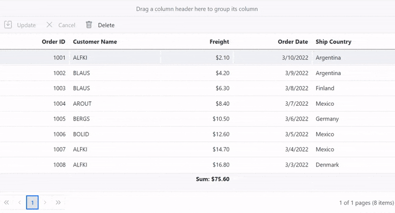

# Aggregates in Blazor DataGrid Component

Aggregate values are displayed in the footer, group footer, or group caption of the Grid. It can be configured through [GridAggregates](https://help.syncfusion.com/cr/blazor/Syncfusion.Blazor.Grids.SfGrid-1.html#Syncfusion_Blazor_Grids_SfGrid_1_Aggregates) component. [Field](https://help.syncfusion.com/cr/blazor/Syncfusion.Blazor.Grids.GridAggregateColumn.html#Syncfusion_Blazor_Grids_GridAggregateColumn_Field) and
  [Type](https://help.syncfusion.com/cr/blazor/Syncfusion.Blazor.Grids.GridAggregateColumn.html#Syncfusion_Blazor_Grids_GridAggregateColumn_Type) are the minimum properties required to represent an aggregate column.

## Built-in aggregate types

The aggregate type should be specified in the [Type](https://help.syncfusion.com/cr/blazor/Syncfusion.Blazor.Grids.GridAggregateColumn.html#Syncfusion_Blazor_Grids_GridAggregateColumn_Type) property to configure an aggregate column.

The built-in aggregates are,

* Sum
* Average
* Min
* Max
* Count
* TrueCount
* FalseCount

N> * Multiple types for a column are supported only when one of the aggregate templates is used.

## Footer aggregate

Footer aggregate value is calculated for all the rows, and it is displayed in the footer cells. Use the **FooterTemplate** tag directive to render the aggregate value in footer cells. **FooterTemplate** should be provided within the **GridAggregateColumn** directive.

To access the aggregate values inside the **FooterTemplate**, you can use the implicit named parameter **context**. You can type cast the **context** as **AggregateTemplateContext** to get aggregate values inside template.

```cshtml
@using Syncfusion.Blazor.Grids

<SfGrid DataSource="@Orders" AllowPaging="true">
    <GridPageSettings PageSize="8"></GridPageSettings>
    <GridAggregates>
        <GridAggregate>
            <GridAggregateColumns>
                <GridAggregateColumn Field=@nameof(Order.Freight) Type="AggregateType.Sum" Format="C2">
                    <FooterTemplate>
                        @{
                            var aggregate = (context as AggregateTemplateContext);
                            <div>
                                <p>Sum: @aggregate.Sum</p>
                            </div>
                        }
                    </FooterTemplate>
                </GridAggregateColumn>
            </GridAggregateColumns>
        </GridAggregate>
        <GridAggregate>
            <GridAggregateColumns>
                <GridAggregateColumn Field=@nameof(Order.Freight) Type="AggregateType.Average" Format="C2">
                    <FooterTemplate>
                        @{
                            var aggregate = (context as AggregateTemplateContext);
                            <div>
                                <p>Average: @aggregate.Average</p>
                            </div>
                        }
                    </FooterTemplate>
                </GridAggregateColumn>
            </GridAggregateColumns>
        </GridAggregate>
    </GridAggregates>
    <GridColumns>
        <GridColumn Field=@nameof(Order.OrderID) HeaderText="Order ID" TextAlign="TextAlign.Right" Width="120"></GridColumn>
        <GridColumn Field=@nameof(Order.CustomerID) HeaderText="Customer Name" Width="150"></GridColumn>
        <GridColumn Field=@nameof(Order.OrderDate) HeaderText=" Order Date" Format="d" Type="ColumnType.Date" TextAlign="TextAlign.Right" Width="130"></GridColumn>
        <GridColumn Field=@nameof(Order.Freight) HeaderText="Freight" Format="C2" TextAlign="TextAlign.Right" Width="120"></GridColumn>
    </GridColumns>
</SfGrid>

@code{
    public List<Order> Orders { get; set; }

    protected override void OnInitialized()
    {
        Orders = Enumerable.Range(1, 75).Select(x => new Order()
        {
            OrderID = 1000 + x,
            CustomerID = (new string[] { "ALFKI", "ANANTR", "ANTON", "BLONP", "BOLID" })[new Random().Next(5)],
            Freight = 2.1 * x,
            OrderDate = DateTime.Now.AddDays(-x),
        }).ToList();
    }

    public class Order
    {
        public int? OrderID { get; set; }
        public string CustomerID { get; set; }
        public DateTime? OrderDate { get; set; }
        public double? Freight { get; set; }
    }
}
```

The following image represents the FooterTemplate with aggregates


N> The aggregate values must be accessed inside the template using their corresponding [Type](https://help.syncfusion.com/cr/blazor/Syncfusion.Blazor.Grids.GridAggregateColumn.html#Syncfusion_Blazor_Grids_GridAggregateColumn_Type) name.

## How to format aggregate value

You can format the aggregate value result by using the [Format](https://help.syncfusion.com/cr/blazor/Syncfusion.Blazor.Grids.GridAggregateColumn.html#Syncfusion_Blazor_Grids_GridAggregateColumn_Format) property.

To access the aggregate values inside the **FooterTemplate**, you can use the implicit named parameter **context**. You can type cast the ***context** as **AggregateTemplateContext** to get aggregate values inside template.

```cshtml
@using Syncfusion.Blazor.Grids

<SfGrid DataSource="@Orders" AllowPaging="true">
    <GridPageSettings PageSize="8"></GridPageSettings>
    <GridAggregates>
        <GridAggregate>
            <GridAggregateColumns>
                <GridAggregateColumn Field=@nameof(Order.Freight) Type="AggregateType.Sum" Format="C2">
                    <FooterTemplate>
                        @{
                            var aggregate = (context as AggregateTemplateContext);
                            <div>
                                <p>Sum: @aggregate.Sum</p>
                            </div>
                        }
                    </FooterTemplate>
                </GridAggregateColumn>
            </GridAggregateColumns>
        </GridAggregate>
        <GridAggregate>
            <GridAggregateColumns>
                <GridAggregateColumn Field=@nameof(Order.Freight) Type="AggregateType.Average" Format="C2">
                    <FooterTemplate>
                        @{
                            var aggregate = (context as AggregateTemplateContext);
                            <div>
                                <p>Average: @aggregate.Average</p>
                            </div>
                        }
                    </FooterTemplate>
                </GridAggregateColumn>
            </GridAggregateColumns>
        </GridAggregate>
    </GridAggregates>
    <GridColumns>
        <GridColumn Field=@nameof(Order.OrderID) HeaderText="Order ID" TextAlign="TextAlign.Right" Width="120"></GridColumn>
        <GridColumn Field=@nameof(Order.CustomerID) HeaderText="Customer Name" Width="150"></GridColumn>
        <GridColumn Field=@nameof(Order.OrderDate) HeaderText=" Order Date" Format="d" Type="ColumnType.Date" TextAlign="TextAlign.Right" Width="130"></GridColumn>
        <GridColumn Field=@nameof(Order.Freight) HeaderText="Freight" Format="C2" TextAlign="TextAlign.Right" Width="120"></GridColumn>
    </GridColumns>
</SfGrid>

@code{
    public List<Order> Orders { get; set; }

    protected override void OnInitialized()
    {
        Orders = Enumerable.Range(1, 75).Select(x => new Order()
        {
            OrderID = 1000 + x,
            CustomerID = (new string[] { "ALFKI", "ANANTR", "ANTON", "BLONP", "BOLID" })[new Random().Next(5)],
            Freight = 2.1 * x,
            OrderDate = DateTime.Now.AddDays(-x),
        }).ToList();
    }

    public class Order
    {
        public int? OrderID { get; set; }
        public string CustomerID { get; set; }
        public DateTime? OrderDate { get; set; }
        public double? Freight { get; set; }
    }
}
```

## Group and caption aggregate

Group and caption aggregate values are calculated from the current group items. If **GroupFooterTemplate** is provided, the aggregate values will be displayed in the group footer cells and if **GroupCaptionTemplate** is provided, aggregate values will be displayed in the group caption cells.

Both **GroupCaptionTemplate** and **GroupFooterTemplate** should be provided within the **GridAggregateColumn** directive.

To access the aggregate values inside the **GroupFooterTemplate** and **GroupCaptionTemplate**, you can use the implicit named parameter **context**. You can type cast the **context** as **AggregateTemplateContext** to get aggregate values inside template.

```cshtml
@using Syncfusion.Blazor.Grids

<SfGrid DataSource="@Products" AllowGrouping="true" AllowPaging="true">
    <GridGroupSettings Columns=@Units></GridGroupSettings>
    <GridAggregates>
        <GridAggregate>
            <GridAggregateColumns>
                <GridAggregateColumn Field=@nameof(Product.UnitsInStock) Type="AggregateType.Sum">
                    <GroupFooterTemplate>
                        @{
                            var aggregate = (context as AggregateTemplateContext);
                            <div>
                                <p>Total units: @aggregate.Sum</p>
                            </div>
                        }
                    </GroupFooterTemplate>
                </GridAggregateColumn>
                <GridAggregateColumn Field=@nameof(Product.Discontinued) Type="AggregateType.TrueCount">
                    <GroupFooterTemplate>
                        @{
                            var aggregate = (context as AggregateTemplateContext);
                            <div>
                                <p>Truecount: @aggregate.TrueCount</p>
                            </div>
                        }
                    </GroupFooterTemplate>
                </GridAggregateColumn>
                <GridAggregateColumn Field=@nameof(Product.UnitsInStock) Type="AggregateType.Max">
                    <GroupCaptionTemplate>
                        @{
                            var aggregate = (context as AggregateTemplateContext);
                            <div>
                                <p>Maximum: @aggregate.Max</p>
                            </div>
                        }
                    </GroupCaptionTemplate>
                </GridAggregateColumn>
            </GridAggregateColumns>
        </GridAggregate>
    </GridAggregates>
    <GridColumns>
        <GridColumn Field=@nameof(Product.ProductName) HeaderText="Product Name" TextAlign="TextAlign.Right" Width="120"></GridColumn>
        <GridColumn Field=@nameof(Product.QuantityPerUnit) HeaderText="Quantity Per Unit" Width="150"></GridColumn>
        <GridColumn Field=@nameof(Product.UnitsInStock) HeaderText="Units In Stock" TextAlign="TextAlign.Right" Width="130"></GridColumn>
        <GridColumn Field=@nameof(Product.Discontinued) HeaderText="Discontinued" TextAlign="TextAlign.Right" DisplayAsCheckBox="true" Type="ColumnType.Boolean"></GridColumn>
    </GridColumns>
</SfGrid>

@code{

    public List<Product> Products { get; set; }
    private string[] Units = (new string[] { "QuantityPerUnit" });
    protected override void OnInitialized()
    {
        Products = Enumerable.Range(1, 10).Select(x => new Product
        {
            ProductName = (new string[] { "Chai", "Chang", "Aniseed Syrup", "Chef Anton's Cajun Seasoning", "Chef Anton's Gumbo Mix" })[new Random().Next(5)],
            QuantityPerUnit = (new string[] { "10 boxes x 20 bags", "24 - 12 oz bottles", "12 - 550 ml bottles", "48 - 6 oz jars", "36 boxes" })[new Random().Next(5)],
            UnitsInStock = x,
            Discontinued = (new bool[] { true, false})[new Random().Next(2)]
        }).ToList();
    }

    public class Product
    {
        public string ProductName { get; set; }
        public string QuantityPerUnit { get; set; }
        public int UnitsInStock { get; set; }
        public bool Discontinued { get; set; }
    }
}
```

The following image represents the Group and Caption template with aggregates.


N> The aggregate values must be accessed inside the template using their corresponding [Type](https://help.syncfusion.com/cr/blazor/Syncfusion.Blazor.Grids.GridAggregateColumn.html#Syncfusion_Blazor_Grids_GridAggregateColumn_Type) name.

## Invoke Async Method in Caption template aggregate 

To calculate the aggregate value by invoke the asynchronous method within the grid caption template

In the following example, this is demonstrated the aggregate values inside the **GroupCaptionTemplate** calculate by asynchronous method.

```cshtml
@using Syncfusion.Blazor.Grids

<SfGrid DataSource="@Products" AllowGrouping="true" AllowPaging="true">
    <GridGroupSettings Columns=@Units></GridGroupSettings>
    <GridAggregates>
        <GridAggregate>
            <GridAggregateColumns>
                <GridAggregateColumn Field=@nameof(Product.UnitsInStock) Type="AggregateType.Max">
                    <GroupCaptionTemplate>
                        @{
                            var aggregate = @GetAggregateMax(context as AggregateTemplateContext);
                            <div>
                                <p>Maximum: @aggregate.Result</p>
                            </div>
                        }
                    </GroupCaptionTemplate>
                </GridAggregateColumn>
            </GridAggregateColumns>
        </GridAggregate>
    </GridAggregates>
    <GridColumns>
        <GridColumn Field=@nameof(Product.ProductName) HeaderText="Product Name" TextAlign="TextAlign.Right" Width="120"></GridColumn>
        <GridColumn Field=@nameof(Product.QuantityPerUnit) HeaderText="Quantity Per Unit" Width="150"></GridColumn>
        <GridColumn Field=@nameof(Product.UnitsInStock) HeaderText="Units In Stock" TextAlign="TextAlign.Right" Width="130"></GridColumn>
        <GridColumn Field=@nameof(Product.Discontinued) HeaderText="Discontinued" TextAlign="TextAlign.Right" DisplayAsCheckBox="true" Type="ColumnType.Boolean"></GridColumn>
    </GridColumns>
</SfGrid>

@code {

    public List<Product> Products { get; set; }
    private string[] Units = (new string[] { "QuantityPerUnit" });
    protected override void OnInitialized()
    {
        Products = Enumerable.Range(1, 10).Select(x => new Product
            {
                ProductName = (new string[] { "Chai", "Chang", "Aniseed Syrup", "Chef Anton's Cajun Seasoning", "Chef Anton's Gumbo Mix" })[new Random().Next(5)],
                QuantityPerUnit = (new string[] { "10 boxes x 20 bags", "24 - 12 oz bottles", "12 - 550 ml bottles", "48 - 6 oz jars", "36 boxes" })[new Random().Next(5)],
                UnitsInStock = x,
                Discontinued = (new bool[] { true, false })[new Random().Next(2)]
            }).ToList();
    }
 
    public async Task<string?> GetAggregateMax(AggregateTemplateContext order)
    {
        var Maxvalue = order.Max;
        return Maxvalue;
      
    }  

    public class Product
    {
        public string ProductName { get; set; }
        public string QuantityPerUnit { get; set; }
        public int UnitsInStock { get; set; }
        public bool Discontinued { get; set; }
    }
}
```




## Custom aggregate

To calculate the aggregate value with your own aggregate functions, use the custom aggregate option.

To use Custom aggregate, specify the **AggregateType** as **Custom** in **GridAggregateColumn** directive and provide custom aggregate function inside the **FooterTemplate** as follows,

```cshtml
@using Syncfusion.Blazor.Grids

<SfGrid @ref="Grid" DataSource="@Products" AllowPaging="true">
    <GridAggregates>
        <GridAggregate>
            <GridAggregateColumns>
                <GridAggregateColumn Field=@nameof(Product.TotalSales) Type="AggregateType.Custom">
                    <FooterTemplate>
                        @{
                            <div>
                                <p>Custom: @GetWeightedAggregate()</p>
                            </div>
                        }
                    </FooterTemplate>
                </GridAggregateColumn>
            </GridAggregateColumns>
        </GridAggregate>
    </GridAggregates>
    <GridColumns>
        <GridColumn Field=@nameof(Product.ProductName) HeaderText="Product Name" TextAlign="TextAlign.Right" Width="150"></GridColumn>
        <GridColumn Field=@nameof(Product.QuantityPerUnit) HeaderText="Quantity Per Unit" Width="150"></GridColumn>
        <GridColumn Field=@nameof(Product.TotalSales) HeaderText="TotalSales" TextAlign="TextAlign.Right" Width="130"></GridColumn>
        <GridColumn Field=@nameof(Product.TotalCosts) HeaderText="TotalCosts" TextAlign="TextAlign.Right" Width="180"></GridColumn>
    </GridColumns>
</SfGrid>

@code{
    SfGrid<Product> Grid { get; set; }
    public List<Product> Products { get; set; }
    public string GetWeightedAggregate()
    {
        // Here, you can calculate custom aggregate operations and return the result.
        return Queryable.Sum(Products.Select(x => (x.TotalSales + x.TotalCosts) / x.TotalSales).AsQueryable()).ToString();
    }
    protected override void OnInitialized()
    {
        Products = Enumerable.Range(1, 5).Select(x => new Product
        {
            ProductName = (new string[] { "Chai", "Chang", "Aniseed Syrup", "Chef Anton's Cajun Seasoning", "Chef Anton's Gumbo Mix" })[new Random().Next(5)],
            QuantityPerUnit = (new string[] { "10 boxes x 20 bags", "24 - 12 oz bottles", "12 - 550 ml bottles", "48 - 6 oz jars", "36 boxes" })[new Random().Next(5)],
            TotalSales = 100 * x,
            TotalCosts = 200 * x,
            Discontinued = (new bool[] { true, false })[new Random().Next(2)]
        }).ToList();
    }

    public class Product
    {
        public string ProductName { get; set; }
        public string QuantityPerUnit { get; set; }
        public int TotalSales { get; set; }
        public int TotalCosts { get; set; }
        public bool Discontinued { get; set; }
    }
}
```

N> You can refer to the [Blazor DataGrid](https://www.syncfusion.com/blazor-components/blazor-datagrid) feature tour page for its groundbreaking feature representations. You can also explore [Blazor DataGrid example](https://blazor.syncfusion.com/demos/datagrid/overview?theme=bootstrap4) to understand how to present and manipulate data.

## Reactive aggregate

When using batch editing, the aggregate values will be refreshed on every cell save. The footer, group footer, and group caption aggregate values will be refreshed.

N> Adding a new record to the grouped DataGrid will not refresh the group summary and group caption aggregate’s value.

```cshtml
@using Syncfusion.Blazor.Grids

<SfGrid DataSource="@Orders" AllowPaging="true" AllowGrouping=true Toolbar="@ToolbarItems">
    <GridEditSettings AllowDeleting="true" AllowEditing="true" Mode="EditMode.Batch"></GridEditSettings>
    <GridAggregates>
        <GridAggregate>
            <GridAggregateColumns>
                <GridAggregateColumn Field=@nameof(Order.Freight) Type="AggregateType.Sum" Format="C2">
                    <GroupFooterTemplate>
                        @{
                            var aggregate = (context as AggregateTemplateContext);
                            <div>
                                <p>Sum: @aggregate.Sum</p>
                            </div>
                        }
                    </GroupFooterTemplate>
                </GridAggregateColumn>
                <GridAggregateColumn Field=@nameof(Order.Freight) Type="AggregateType.Sum" Format="C2">
                    <FooterTemplate>
                        @{
                            var aggregate = (context as AggregateTemplateContext);
                            <div>
                                <p>Sum: @aggregate.Sum</p>
                            </div>
                        }
                    </FooterTemplate>
                </GridAggregateColumn>
               
                <GridAggregateColumn Field=@nameof(Order.Freight) Type="AggregateType.Average" Format="C2">
                    <GroupCaptionTemplate>
                        @{
                            var aggregate = (context as AggregateTemplateContext);
                            <div>
                                <p>Average: @aggregate.Average</p>
                            </div>
                        }
                    </GroupCaptionTemplate>
                </GridAggregateColumn>
            </GridAggregateColumns>
        </GridAggregate>
    </GridAggregates>
    
    <GridColumns>
         <GridColumn Field=@nameof(Order.OrderID) HeaderText="Order ID" IsPrimaryKey=true TextAlign="TextAlign.Right" Width="120"></GridColumn>
         <GridColumn Field=@nameof(Order.CustomerID) HeaderText="Customer Name" Width="150"></GridColumn>
         <GridColumn Field=@nameof(Order.Freight) HeaderText="Freight" Format="C2" TextAlign="TextAlign.Right" Width="120"></GridColumn>
         <GridColumn Field=@nameof(Order.OrderDate) HeaderText=" Order Date" Format="d" Type="ColumnType.Date" TextAlign="TextAlign.Right" Width="130"></GridColumn>
         <GridColumn Field=@nameof(Order.ShipCountry) HeaderText="Ship Country" Width="140"></GridColumn>
   </GridColumns>
</SfGrid>

@code
{
    private List<string> ToolbarItems = new List<string>(){ "Update","Cancel", "Delete"};
    public List<Order> Orders { get; set; }

    protected override void OnInitialized()
    {
        Orders = Enumerable.Range(1, 8).Select(x => new Order()
        {
            OrderID = 1000 + x,
            CustomerID = (new string[] { "ALFKI", "ANANTR", "ANTON", "BLONP", "BOLID", "AROUT", "BERGS", "BLAUS" })[new Random().Next(8)],
            Freight = 2.1 * x,
            OrderDate = DateTime.Now.AddDays(-x),
            ShipCountry = (new string[] { "Sweden", "Germany", "Argentina", "Mexico", "Denmark", "Finland", "Switzerland", "UK" })[new Random().Next(8)],
        }).ToList();
    }

    public class Order 
    {
        public int? OrderID { get; set; }
        public string CustomerID { get; set; }
        public DateTime? OrderDate { get; set; }
        public string ShipCountry {  get;  set; }
        public double? Freight { get; set; }
    }
}
```



## See also

* [Handling Aggregates in Custom Adaptor](https://blazor.syncfusion.com/documentation/datagrid/custom-binding#handling-aggregates-in-custom-adaptor)