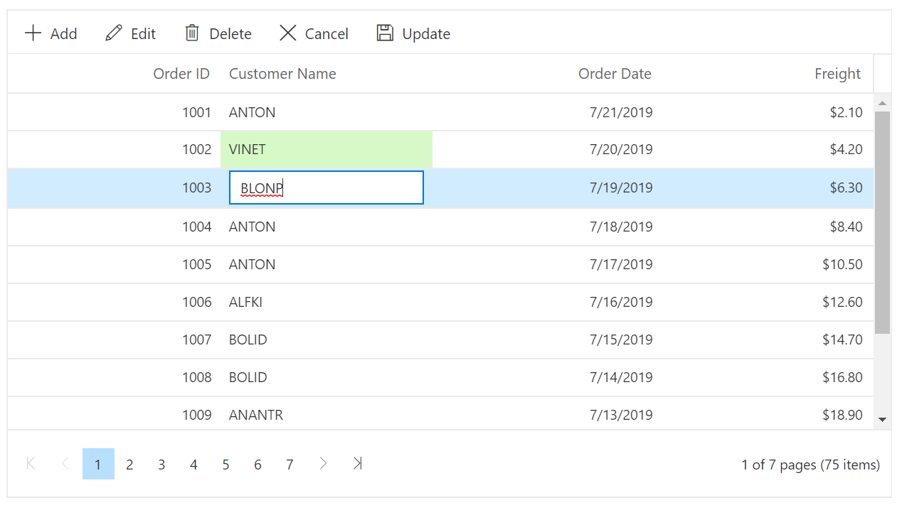
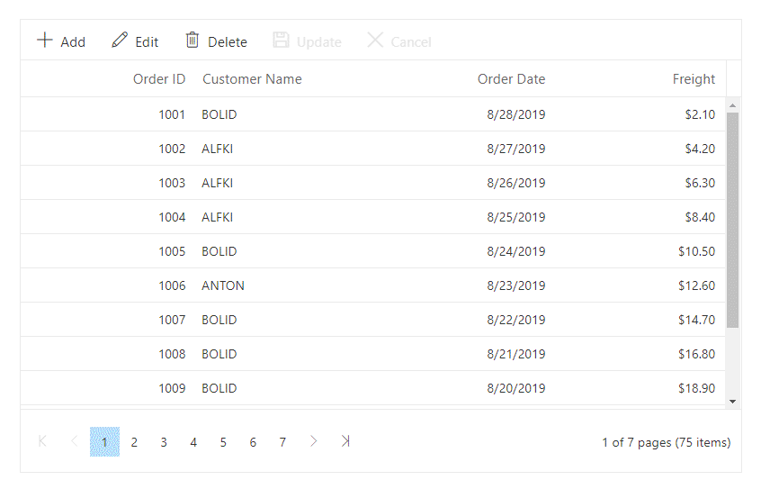

# Batch Editing in Blazor DataGrid Component

In batch edit mode, when you double-click on the datagrid cell, the target cell changes to edit state. You can bulk save (added, changed, and deleted data in the single request) to the data source by clicking on the toolbar's **Update** button  or by externally calling the **EndEdit** method. To enable Batch edit, set the [EditSettings.Mode](https://help.syncfusion.com/cr/blazor/Syncfusion.Blazor.Grids.GridEditSettings.html#Syncfusion_Blazor_Grids_GridEditSettings_Mode) as **Batch**.

```cshtml
@using Syncfusion.Blazor.Grids

<SfGrid DataSource="@Orders" AllowPaging="true" Toolbar="@(new List<string>() { "Add", "Delete", "Update", "Cancel" })" Height="315">
    <GridEditSettings AllowAdding="true" AllowEditing="true" AllowDeleting="true" Mode="EditMode.Batch"></GridEditSettings>
    <GridColumns>
        <GridColumn Field=@nameof(Order.OrderID) HeaderText="Order ID" IsPrimaryKey="true" TextAlign="TextAlign.Right" ValidationRules="@(new ValidationRules { Required = true })" Type="ColumnType.Number" Width="120"></GridColumn>
        <GridColumn Field=@nameof(Order.CustomerID) HeaderText="Customer Name" ValidationRules="@(new ValidationRules{ Required=true})" Width="120"></GridColumn>
        <GridColumn Field=@nameof(Order.OrderDate) HeaderText=" Order Date" EditType="EditType.DatePickerEdit" Format="d" TextAlign="TextAlign.Right" Width="130" Type="ColumnType.Date"></GridColumn>
        <GridColumn Field=@nameof(Order.Freight) HeaderText="Freight" Format="C2" TextAlign="TextAlign.Right" EditType="EditType.NumericEdit" Width="120"></GridColumn>
        <GridColumn Field=@nameof(Order.ShipCountry) HeaderText="Ship Country" EditType="EditType.DropDownEdit" Width="150"></GridColumn>
    </GridColumns>
</SfGrid>

@code{
    public List<Order> Orders { get; set; }

    protected override void OnInitialized()
    {
        Orders = Enumerable.Range(1, 75).Select(x => new Order()
        {
            OrderID = 1000 + x,
            CustomerID = (new string[] { "ALFKI", "ANANTR", "ANTON", "BLONP", "BOLID" })[new Random().Next(5)],
            Freight = 2.1 * x,
            OrderDate = DateTime.Now.AddDays(-x),
            ShipCountry = (new string[] { "USA", "UK", "CHINA", "RUSSIA", "INDIA" })[new Random().Next(5)]
        }).ToList();
    }

    public class Order
    {
        public int? OrderID { get; set; }
        public string CustomerID { get; set; }
        public DateTime? OrderDate { get; set; }
        public double? Freight { get; set; }
        public string ShipCountry { get; set; }
    }
}
```

The following screenshot represents Editing in Batch mode.



## Edit next row or previous row from the current row

You can continue editing the next row or previous row from the current record in batch mode by enabling [EditSettings.AllowNextRowEdit](https://help.syncfusion.com/cr/blazor/Syncfusion.Blazor.Grids.GridEditSettings.html#Syncfusion_Blazor_Grids_GridEditSettings_AllowNextRowEdit) to **true**.

Pressing `TAB` from the last cell of the current row allows editing the next row and Pressing `SHIFT + TAB` from the first cell of the current row allows editing the previous row.

```cshtml
@using Syncfusion.Blazor.Grids

<SfGrid DataSource="@Orders" AllowPaging="true" Toolbar="@(new List<string>() { "Add", "Delete", "Update", "Cancel" })" Height="315">
    <GridEditSettings AllowAdding="true" AllowEditing="true" AllowDeleting="true" Mode="EditMode.Batch"></GridEditSettings>
    <GridColumns>
        <GridColumn Field=@nameof(Order.OrderID) HeaderText="Order ID" IsPrimaryKey="true" TextAlign="TextAlign.Right" ValidationRules="@(new ValidationRules { Required = true })" Type="ColumnType.Number" Width="120"></GridColumn>
        <GridColumn Field=@nameof(Order.CustomerID) HeaderText="Customer Name" ValidationRules="@(new ValidationRules{ Required=true})" Width="120"></GridColumn>
        <GridColumn Field=@nameof(Order.OrderDate) HeaderText=" Order Date" EditType="EditType.DatePickerEdit" Format="d" TextAlign="TextAlign.Right" Width="130" Type="ColumnType.Date"></GridColumn>
        <GridColumn Field=@nameof(Order.Freight) HeaderText="Freight" Format="C2" TextAlign="TextAlign.Right" EditType="EditType.NumericEdit" Width="120"></GridColumn>
        <GridColumn Field=@nameof(Order.ShipCountry) HeaderText="Ship Country" EditType="EditType.DropDownEdit" Width="150"></GridColumn>
    </GridColumns>
</SfGrid>

@code{
    public List<Order> Orders { get; set; }

    protected override void OnInitialized()
    {
        Orders = Enumerable.Range(1, 75).Select(x => new Order()
        {
            OrderID = 1000 + x,
            CustomerID = (new string[] { "ALFKI", "ANANTR", "ANTON", "BLONP", "BOLID" })[new Random().Next(5)],
            Freight = 2.1 * x,
            OrderDate = DateTime.Now.AddDays(-x),
            ShipCountry = (new string[] { "USA", "UK", "CHINA", "RUSSIA", "INDIA" })[new Random().Next(5)]
        }).ToList();
    }

    public class Order
    {
        public int? OrderID { get; set; }
        public string CustomerID { get; set; }
        public DateTime? OrderDate { get; set; }
        public double? Freight { get; set; }
        public string ShipCountry { get; set; }
    }
}
```

The following GIF represents Editing in Batch mode.


## Provide new item or edited item using events

Grid uses `Activator.CreateInstance<TValue>()` to create or clone new record instance during add and edit operations, so it must have parameterless constructors defined for the model class and any referenced complex type classes.

There are cases where custom logic is required for creating new object or new object instance cannot be created using  `Activator.CreateInstance<TValue>()`. In such cases, you can provide model object instance manually using events.

You can use the `OnBatchAdd` and `OnCellEdit` events to provide new object instance during add and cell edit operations respectively.

For add operation, assign new object to the `OnBatchAdd.DefaultData` property. For cell edit, assign cloned object in the `OnCellEdit.Data` property.

In the following example:

* A model class with no parameter-less constructor is bound with grid.
* Enabled batch editing feature in grid.
* `OnBatchAdd` event callback is assigned in which `DefaultData` property is assigned with custom object for add operation.
* `OnCellEdit` event callback is assigned in which the `Data` property is assigned with a custom object for handling edit operation.

```csharp

<SfGrid DataSource="@Orders" Toolbar="@(new List<string>() { "Add", "Update", "Cancel" })">
    <GridEditSettings AllowEditing="true" AllowAdding="true" Mode="EditMode.Batch"></GridEditSettings>
    <GridColumns>
        <GridColumn Field=@nameof(Order.OrderID) HeaderText="Order ID" IsPrimaryKey="true" TextAlign="TextAlign.Right" Width="120"></GridColumn>
        <GridColumn Field=@nameof(Order.CustomerID) HeaderText="Customer Name" Width="150"></GridColumn>
        <GridColumn Field=@nameof(Order.OrderDate) HeaderText=" Order Date" Format="d" Type="ColumnType.Date" TextAlign="TextAlign.Right" Width="130"></GridColumn>
        <GridColumn Field=@nameof(Order.Freight) HeaderText="Freight" Format="C2" TextAlign="TextAlign.Right" Width="120"></GridColumn>
    </GridColumns>
    <GridEvents TValue="Order" OnBatchAdd="BeforeAdd" OnCellEdit="CellEdit"></GridEvents>
</SfGrid>

@code {

    List<Order> Orders { get; set; }

    protected override void OnInitialized()
    {
        Orders = Enumerable.Range(1, 10).Select(x => new Order(1000 + x)
        {
            OrderID = 1000 + x,
            CustomerID = (new string[] { "ALFKI",
                "ANANTR", "ANTON", "BLONP", "BOLID" })[new Random().Next(5)],
            Freight = (new double[] { 2, 1, 4, 5, 3 })[new Random().Next(5)] * x,
            OrderDate = (new DateTime[] { new DateTime(2019, 01, 01), new DateTime(2019, 01, 02) })[new Random().Next(2)]
        }).ToList();
    }

    public void BeforeAdd(BeforeBatchAddArgs<Order> arg)
    {
        arg.DefaultData = new Order(0) { CustomerID = "Customer ID" };
    }

    public void CellEdit(CellEditArgs<Order> arg)
    {
        //Return args.Data if it is not null, so previously edited data will not be lost.
        arg.Data = arg.Data ?? new Order(arg.RowData.OrderID)
        {
            CustomerID = arg.RowData.CustomerID,
            Freight = arg.RowData.Freight,
            OrderDate = arg.RowData.OrderDate
        };
    }

    // This class does not contain any parameter-less constructor, hence this cannot be instantiated using Activator.CreateInstance.
    public class Order
    {
        public Order(int orderid) => OrderID = orderid;
        public int? OrderID { get; set; }
        public string CustomerID { get; set; }
        public DateTime? OrderDate { get; set; }
        public double? Freight { get; set; }
    }
}

```

## Event trace while Batch editing

While Batch editing operation is getting executed the following events will be notified,

* [OnCellEdit](https://help.syncfusion.com/cr/blazor/Syncfusion.Blazor.Grids.GridEvents-1.html#Syncfusion_Blazor_Grids_GridEvents_1_OnCellEdit)
* [OnCellSave](https://help.syncfusion.com/cr/blazor/Syncfusion.Blazor.Grids.GridEvents-1.html#Syncfusion_Blazor_Grids_GridEvents_1_OnCellSave)
* [CellSaved](https://help.syncfusion.com/cr/blazor/Syncfusion.Blazor.Grids.GridEvents-1.html#Syncfusion_Blazor_Grids_GridEvents_1_CellSaved)
* [OnBatchCancel](https://help.syncfusion.com/cr/blazor/Syncfusion.Blazor.Grids.GridEvents-1.html#Syncfusion_Blazor_Grids_GridEvents_1_OnBatchCancel)
* [OnBatchDelete](https://help.syncfusion.com/cr/blazor/Syncfusion.Blazor.Grids.GridEvents-1.html#Syncfusion_Blazor_Grids_GridEvents_1_OnBatchDelete)
* [OnBatchSave](https://help.syncfusion.com/cr/blazor/Syncfusion.Blazor.Grids.GridEvents-1.html#Syncfusion_Blazor_Grids_GridEvents_1_OnBatchSave)
* [OnBatchAdd](https://help.syncfusion.com/cr/blazor/Syncfusion.Blazor.Grids.GridEvents-1.html#Syncfusion_Blazor_Grids_GridEvents_1_OnBatchAdd)

```cshtml
@using Syncfusion.Blazor.Grids

<SfGrid DataSource="@Orders" AllowPaging="true" Toolbar="@(new List<string>() { "Add", "Edit", "Delete", "Cancel", "Update" })" Height="315">
    <GridEditSettings AllowAdding="true" AllowEditing="true" AllowDeleting="true" Mode="EditMode.Batch"></GridEditSettings>
    <GridEvents OnCellEdit="CellEditHandler" OnBatchCancel="OnBatchCancel" OnCellSave="CellSaveHandler" CellSaved="CellSavedHandler" OnBatchDelete="BatchDeleteHandler"
        OnBatchSave="BatchSaveHandler" OnBatchAdd="BatchAddHandler" TValue="Order"></GridEvents>
    <GridColumns>
        <GridColumn Field=@nameof(Order.OrderID) HeaderText="Order ID" IsPrimaryKey="true"  TextAlign="TextAlign.Right" Width="120"></GridColumn>
        <GridColumn Field=@nameof(Order.CustomerID) HeaderText="Customer Name" Width="120"></GridColumn>
        <GridColumn Field=@nameof(Order.OrderDate) HeaderText=" Order Date" EditType="EditType.DatePickerEdit" Format="d" TextAlign="TextAlign.Right" Width="130" Type="ColumnType.Date"></GridColumn>
        <GridColumn Field=@nameof(Order.Freight) HeaderText="Freight" Format="C2" TextAlign="TextAlign.Right" EditType="EditType.NumericEdit" Width="120"></GridColumn>
        <GridColumn Field=@nameof(Order.ShipCountry) HeaderText="Ship Country" EditType="EditType.DropDownEdit" Width="150"></GridColumn>
    </GridColumns>
</SfGrid>

@code {
    public List<Order> Orders { get; set; }

    protected override void OnInitialized()
    {
        Orders = Enumerable.Range(1, 75).Select(x => new Order()
            {
                OrderID = 1000 + x,
                CustomerID = (new string[] { "ALFKI", "ANANTR", "ANTON", "BLONP", "BOLID" })[new Random().Next(5)],
                Freight = 2.1 * x,
                OrderDate = DateTime.Now.AddDays(-x),
                ShipCountry = (new string[] { "USA", "UK", "CHINA", "RUSSIA", "INDIA" })[new Random().Next(5)]
            }).ToList();
    }

    public void OnBatchCancel(BeforeBatchCancelArgs<Order> args)
    {
        // Here, you can customize your code.
    }

    public void CellEditHandler(CellEditArgs<Order> args)
    {
        // Here, you can customize your code.
    }
    public void CellSavedHandler(CellSaveArgs<Order> args)
    {
        // Here, you can customize your code.
    }
    public void CellSaveHandler(CellSaveArgs<Order> args)
    {
        // Here, you can customize your code.
    }
   

    public void BatchDeleteHandler(BeforeBatchDeleteArgs<Order> args)
    {
        // Here, you can customize your code.
    }
    public void BatchSaveHandler(BeforeBatchSaveArgs<Order> args)
    {
        // Here, you can customize your code.
    }
    public void BatchAddHandler(BeforeBatchAddArgs<Order> args)
    {
        // Here, you can customize your code.
    }

   

    public class Order
    {
        public int? OrderID { get; set; }
        public string CustomerID { get; set; }
        public DateTime? OrderDate { get; set; }
        public double? Freight { get; set; }
        public string ShipCountry { get; set; }
    }
}
```

## Confirmation dialog

The confirmation dialog can be enabled for all the batch operations by setting the [ShowConfirmDialog](https://help.syncfusion.com/cr/blazor/Syncfusion.Blazor.Grids.GridEditSettings.html#Syncfusion_Blazor_Grids_GridEditSettings_ShowConfirmDialog) property of the [GridEditSettings](https://help.syncfusion.com/cr/blazor/Syncfusion.Blazor.Grids.GridEditSettings.html) component as **true**.

The following sample code demonstrates enabling confirmation dialog for batch operations in the DataGrid component,

```cshtml
@using Syncfusion.Blazor.Grids

<SfGrid DataSource="@Orders" Height="315" AllowPaging="true" AllowSorting="true" Toolbar="@(new List<string>() { "Add", "Edit", "Delete", "Update", "Cancel" })">
    <GridEditSettings AllowAdding="true" AllowEditing="true" AllowDeleting="true" ShowConfirmDialog="true" ShowDeleteConfirmDialog="true" Mode="EditMode.Batch"></GridEditSettings>
    <GridColumns>
        <GridColumn Field=@nameof(Order.OrderID) HeaderText="Order ID" IsPrimaryKey="true" TextAlign="TextAlign.Right" Width="120"></GridColumn>
        <GridColumn Field=@nameof(Order.CustomerID) HeaderText="Customer Name" Width="120"></GridColumn>
        <GridColumn Field=@nameof(Order.OrderDate) HeaderText=" Order Date" EditType="EditType.DatePickerEdit" Format="d" TextAlign="TextAlign.Right" Width="130" Type="ColumnType.Date"></GridColumn>
        <GridColumn Field=@nameof(Order.Freight) HeaderText="Freight" Format="C2" TextAlign="TextAlign.Right" Width="120"></GridColumn>
    </GridColumns>
</SfGrid>

@code{
    public List<Order> Orders { get; set; }

    protected override void OnInitialized()
    {
        Orders = Enumerable.Range(1, 75).Select(x => new Order()
        {
            OrderID = 1000 + x,
            CustomerID = (new string[] { "ALFKI", "ANANTR", "ANTON", "BLONP", "BOLID" })[new Random().Next(5)],
            Freight = 2.1 * x,
            OrderDate = DateTime.Now.AddDays(-x),
        }).ToList();
    }

    public class Order
    {
        public int? OrderID { get; set; }
        public string CustomerID { get; set; }
        public DateTime? OrderDate { get; set; }
        public double? Freight { get; set; }
    }
}
```

The following GIF represents the confirmation dialog displayed while performing batch operations in DataGrid,



N> Enabling [ShowConfirmDialog](https://help.syncfusion.com/cr/blazor/Syncfusion.Blazor.Grids.GridEditSettings.html#Syncfusion_Blazor_Grids_GridEditSettings_ShowConfirmDialog) requires the [Mode](https://help.syncfusion.com/cr/blazor/Syncfusion.Blazor.Grids.GridEditSettings.html#Syncfusion_Blazor_Grids_GridEditSettings_Mode) property value of the [GridEditSettings](https://help.syncfusion.com/cr/blazor/Syncfusion.Blazor.Grids.GridEditSettings.html) component to be **Batch**.
<br/> If [ShowConfirmDialog](https://help.syncfusion.com/cr/blazor/Syncfusion.Blazor.Grids.GridEditSettings.html#Syncfusion_Blazor_Grids_GridEditSettings_ShowConfirmDialog) is set to false, then confirmation dialog will not be displayed on batch editing.

## How to auto-update the calculative columns while using batch editing

A calculative column can be defined in Grid using the cell or column [Template](https://help.syncfusion.com/cr/blazor/Syncfusion.Blazor.Grids.GridColumn.html#Syncfusion_Blazor_Grids_GridColumn_Template) feature of Grid. Calculative columns can be auto-updated based on respective column value changes. You can update the column value based on another column's edited value in batch mode by using the [CellSaved](https://help.syncfusion.com/cr/blazor/Syncfusion.Blazor.Grids.GridEvents-1.html#Syncfusion_Blazor_Grids_GridEvents_1_CellSaved) event and the [UpdateCell](https://help.syncfusion.com/cr/blazor/Syncfusion.Blazor.Grids.SfGrid-1.html#Syncfusion_Blazor_Grids_SfGrid_1_UpdateCellAsync_System_Double_System_String_System_Object_) method of the Grid.

Also, the add operation is handled while performing batch editing using the boolean variable in [OnBatchAdd](https://help.syncfusion.com/cr/blazor/Syncfusion.Blazor.Grids.GridEvents-1.html#Syncfusion_Blazor_Grids_GridEvents_1_OnBatchAdd) and [OnBatchSave](https://help.syncfusion.com/cr/blazor/Syncfusion.Blazor.Grids.GridEvents-1.html#Syncfusion_Blazor_Grids_GridEvents_1_OnBatchSave) events of the Grid. In the following demo, the **Amount** and **Sum** column values are updated based on the **Quantity** and **UnitPrice** column values while batch editing.

```csharp
@using Syncfusion.Blazor.Grids

<SfGrid @ref="Grid" DataSource="@Orders" AllowPaging="true" Toolbar="@(new List<string>() { "Add", "Delete", "Update", "Cancel" })" Height="315">
    <GridEditSettings AllowAdding="true" AllowEditing="true" AllowDeleting="true" Mode="EditMode.Batch">
    </GridEditSettings>
    <GridEvents CellSaved="CellSavedHandler" OnBatchAdd="BatchAddHandler" OnBatchSave="BatchSaveHandler" TValue="Order"></GridEvents>
    <GridColumns>
        <GridColumn Field=@nameof(Order.OrderID) HeaderText="Order ID" IsPrimaryKey="true" TextAlign="TextAlign.Right" ValidationRules="@(new ValidationRules { Required = true })" Type="ColumnType.Number" Width="120"></GridColumn>
        <GridColumn Field=@nameof(Order.CustomerID) HeaderText="Customer Name" ValidationRules="@(new ValidationRules{ Required=true})" Width="120"></GridColumn>
        <GridColumn Field=@nameof(Order.OrderDate) HeaderText=" Order Date" EditType="EditType.DatePickerEdit" Format="d" TextAlign="TextAlign.Right" Width="130" Type="ColumnType.Date"></GridColumn>
        <GridColumn Field=@nameof(Order.Quantity) HeaderText="Quantity" Format="C2" TextAlign="TextAlign.Right" EditType="EditType.NumericEdit" Width="120"></GridColumn>
        <GridColumn Field=@nameof(Order.UnitPrice) HeaderText="UnitPrice" Format="C2" TextAlign="TextAlign.Right" EditType="EditType.NumericEdit" Width="120"></GridColumn>
        <GridColumn Field=@nameof(Order.Amount) HeaderText="Amount" Format="C2" AllowEditing="false" TextAlign="TextAlign.Right" EditType="EditType.NumericEdit" Width="120">
            <Template>
                @{
                    var value = (context as Order);
                    var res = value.Quantity * value.UnitPrice;
                    value.Amount = value.Quantity * value.UnitPrice;
                    <span>@value.Amount</span>
                }
            </Template>
        </GridColumn>
        <GridColumn Field=@nameof(Order.Sum) HeaderText="Sum" Format="C2" AllowEditing="false" TextAlign="TextAlign.Right" EditType="EditType.NumericEdit" Width="120">
            <Template>
                @{
                    var value = (context as Order);
                    var res = value.Quantity + value.UnitPrice;
                    value.Sum = value.Quantity + value.UnitPrice;
                    <span>@value.Sum</span>
                }
            </Template>
        </GridColumn>
        <GridColumn Field=@nameof(Order.ShipCountry) HeaderText="Ship Country" EditType="EditType.DropDownEdit" Width="150"></GridColumn>
    </GridColumns>
</SfGrid>

@code{
    SfGrid<Order> Grid;
    bool IsAdd { get; set; }
    public List<Order> Orders { get; set; }

    protected override void OnInitialized()
    {
        Orders = Enumerable.Range(1, 75).Select(x => new Order()
        {
            OrderID = 1000 + x,
            CustomerID = (new string[] { "ALFKI", "ANANTR", "ANTON", "BLONP", "BOLID" })[new Random().Next(5)],
            Verified = (new bool[] { true, false })[new Random().Next(2)],
            Quantity = 1 * x,
            UnitPrice = 2 * x,
            OrderDate = DateTime.Now.AddDays(-x),
            ShipCountry = (new string[] { "USA", "UK", "CHINA", "RUSSIA", "INDIA" })[new Random().Next(5)]
        }).ToList();
    }

    public class Order
    {
        public int? OrderID { get; set; }
        public string CustomerID { get; set; }
        public DateTime? OrderDate { get; set; }
        public int? Quantity { get; set; }
        public double? UnitPrice { get; set; }
        public double? Amount { get; set; }
        public double? Sum { get; set; }
        public string ShipCountry { get; set; }
        public bool Verified { get; set; }
    }
    public async Task CellSavedHandler(CellSaveArgs<Order> args)
    {
        var index = await Grid.GetRowIndexByPrimaryKey(args.RowData.OrderID);
        if (args.ColumnName == "Quantity")
        {
            if (IsAdd)
            {
                args.RowData.Quantity = (int?)args.Value;
                await Grid.UpdateCell(index, "Amount", Convert.ToInt32(args.Value) * 1);
                await Grid.UpdateCell(index, "Sum", Convert.ToInt32(args.Value) + 0);
            }
            await Grid.UpdateCell(index, "Amount", Convert.ToInt32(args.Value) * args.RowData.UnitPrice);
            await Grid.UpdateCell(index, "Sum", Convert.ToInt32(args.Value) + args.RowData.UnitPrice);
        }
        else if (args.ColumnName == "UnitPrice")
        {
            if (IsAdd)
            {
                args.RowData.UnitPrice = (double?)args.Value;
                await Grid.UpdateCell(index, "Amount", Convert.ToDouble(args.Value) * 1);
                await Grid.UpdateCell(index, "Sum", Convert.ToDouble(args.Value) + 0);
            }
            await Grid.UpdateCell(index, "Amount", Convert.ToDouble(args.Value) * args.RowData.Quantity);
            await Grid.UpdateCell(index, "Sum", Convert.ToDouble(args.Value) + args.RowData.Quantity);
        }
    }

    public void BatchAddHandler(BeforeBatchAddArgs<Order> args)
    {
        IsAdd = true;
    }
    public void BatchSaveHandler(BeforeBatchSaveArgs<Order> args)
    {
        IsAdd = false;
    }
}

```

## How to perform bulk changes using a method

To perform bulk changes, including adding, editing, and deleting records, you can utilize the [ApplyBatchChangesAsync](https://help.syncfusion.com/cr/blazor/Syncfusion.Blazor.Grids.SfGrid-1.html#Syncfusion_Blazor_Grids_SfGrid_1_ApplyBatchChangesAsync) method. This method streamlines the process of updating new, edited, and deleted records within the current page of the Grid. It is primarily designed to efficiently apply bulk changes all at once.
When you make edits or add new records, these changes will be visually highlighted with green highlighting within the current view page. This visual cue provides you with the choice to either save or cancel the changes, allowing for a seamless and efficient management of bulk modifications.

```csharp

@using Syncfusion.Blazor.Grids

<button @onclick="clickHandler">Apply Batch Changes</button>

<SfGrid DataSource="@Orders" @ref="Grid" AllowPaging="true" Toolbar="@(new List<string>() { "Add", "Edit", "Delete", "Cancel", "Update" })" Height="315">
    <GridEditSettings AllowAdding="true" AllowEditing="true" AllowDeleting="true" Mode="EditMode.Batch"></GridEditSettings>
    <GridColumns>
        <GridColumn Field=@nameof(Order.OrderID) HeaderText="Order ID" IsPrimaryKey="true" ValidationRules="@(new ValidationRules{ Required=true})" TextAlign="TextAlign.Right" Width="120"></GridColumn>
        <GridColumn Field=@nameof(Order.CustomerID) HeaderText="Customer Name" ValidationRules="@(new ValidationRules{ Required=true})" Width="120"></GridColumn>
        <GridColumn Field=@nameof(Order.OrderDate) HeaderText=" Order Date" EditType="EditType.DatePickerEdit" Format="d" TextAlign="TextAlign.Right" Width="130" Type="ColumnType.Date"></GridColumn>
        <GridColumn Field=@nameof(Order.Freight) HeaderText="Freight" Format="C2" TextAlign="TextAlign.Right" EditType="EditType.NumericEdit" Width="120"></GridColumn>
    </GridColumns>
</SfGrid>

@code{
    public List<Order> Orders { get; set; }
    public SfGrid<Order> Grid { get; set; }

    protected override void OnInitialized()
    {
        Orders = GetAllRecords();
    }

    private async void clickHandler()
    {
        var batchChanges = new BatchChanges<Order>()
        {
                AddedRecords = new List<Order>() { new Order() { OrderID = 1000, CustomerID = "ALFKI", Freight = 2.1, OrderDate = new DateTime(1995, 05, 15)}, 
		        new Order() { OrderID = 999, CustomerID = "ALFKI", Freight = 2.1, OrderDate = new DateTime(1995, 05, 15) } },
                DeletedRecords = new List<Order>() { new Order() { OrderID = 1001, CustomerID = "ANANTR", Freight = 3.1, OrderDate = new DateTime(1995, 05, 15)} },
                ChangedRecords = new List<Order>() { new Order() { OrderID = 1002, CustomerID = "ANTON", Freight = 4.1, OrderDate = new DateTime(1995, 05, 15) } }
        };
        await Grid.ApplyBatchChangesAsync(batchChanges);
    }
    public List<Order> GetAllRecords()
    {
        List<Order> data = new List<Order>();
        int count = 1000;

        for (int i = 1; i <= 15; i++)
        {
            data.Add(new Order() { OrderID = count + 1, CustomerID = "ALFKI", OrderDate = new DateTime(1995, 05, 15), Freight = 1 * i });
            data.Add(new Order() { OrderID = count + 2, CustomerID = "ANANTR", OrderDate = new DateTime(1994, 04, 04), Freight = 2 * i });
            data.Add(new Order() { OrderID = count + 3, CustomerID = "BLONP", OrderDate = new DateTime(1993, 03, 10), Freight = 3 * i });
            data.Add(new Order() { OrderID = count + 4, CustomerID = "ANTON", OrderDate = new DateTime(1992, 02, 14), Freight = 4 * i });
            data.Add(new Order() { OrderID = count + 5, CustomerID = "BOLID", OrderDate = new DateTime(1991, 01, 18), Freight = 5 * i });
            count += 5;
        }
        return data;

    }
    public class Order
    {
        public int? OrderID { get; set; }
        public string CustomerID { get; set; }
        public DateTime? OrderDate { get; set; }
        public double? Freight { get; set; }
    }
}
```

## Select the entire text of the cell while editing in batch edit mode

By default, while editing a particular cell in batch edit mode, the cursor will be placed at the end of the text once the cell is changed to an edited state. Instead of this behavior, the entire cell text is selected when the corresponding cell is in an edited state. This can be achieved by the [OnCellEdit](https://help.syncfusion.com/cr/blazor/Syncfusion.Blazor.Grids.GridEvents-1.html#Syncfusion_Blazor_Grids_GridEvents_1_OnCellEdit) and [RowSelected](https://help.syncfusion.com/cr/blazor/Syncfusion.Blazor.Grids.GridEvents-1.html#Syncfusion_Blazor_Grids_GridEvents_1_RowSelected)  events of the Grid.

In the following sample, the select() method is called using the Microsoft.JSInterop in the `RowSelected` event handler to select the content or particular rendered input element.

```csharp
window.selectContent = function () {
    document.getElementById("BatchGrid").getElementsByTagName("input")[0].select(); 
}
```

```csharp
@using Syncfusion.Blazor.Grids
@inject IJSRuntime JSRunTime;

<SfGrid  ID="BatchGrid" DataSource="@Orders"  AllowPaging="true" Toolbar="@(new List<string>() { "Add", "Edit", "Delete", "Cancel", "Update" })" Height="315">
    <GridEvents RowSelected="RowSelected" OnCellEdit="OnCellEdit" TValue="Order"></GridEvents>
    <GridEditSettings AllowAdding="true" AllowEditing="true" AllowDeleting="true" Mode="EditMode.Batch"></GridEditSettings>
    <GridColumns>
        <GridColumn Field=@nameof(Order.OrderID) HeaderText="Order ID" IsPrimaryKey="true" ValidationRules="@(new ValidationRules{ Required=true})" TextAlign="TextAlign.Right" Width="120"></GridColumn>
        <GridColumn Field=@nameof(Order.CustomerID) HeaderText="Customer Name" ValidationRules="@(new ValidationRules{ Required=true})" Width="120"></GridColumn>
        <GridColumn Field=@nameof(Order.OrderDate) HeaderText=" Order Date" EditType="EditType.DatePickerEdit" Format="d" TextAlign="TextAlign.Right" Width="130" Type="ColumnType.Date"></GridColumn>
        <GridColumn Field=@nameof(Order.Freight) HeaderText="Freight"  TextAlign="TextAlign.Right"  Width="120"></GridColumn>
        <GridColumn Field=@nameof(Order.ShipCountry) HeaderText="Ship Country"  Width="150"></GridColumn>
    </GridColumns>
</SfGrid>

@code{
    public List<Order> Orders { get; set; }
    protected override void OnInitialized()
    {
        Orders = Enumerable.Range(1, 75).Select(x => new Order()
        {
            OrderID = 1000 + x,
            CustomerID = (new string[] { "ALFKI", "ANANTR", "ANTON", "BLONP", "BOLID" })[new Random().Next(5)],
            Freight = 2.1 * x,
            OrderDate = DateTime.Now.AddDays(-x),
            ShipCountry = (new string[] { "USA", "UK", "CHINA", "RUSSIA", "INDIA" })[new Random().Next(5)]
        }).ToList();
    }
    public class Order
    {
        public int? OrderID { get; set; }
        public string CustomerID { get; set; }
        public DateTime? OrderDate { get; set; }
        public double? Freight { get; set; }
        public string ShipCountry { get; set; }
    }
    public bool flag = false;
    public async Task OnCellEdit()
    {
        flag = true;
    }
    public async Task RowSelected()
    {
        if (flag)
        {
            await Task.Yield();
            await JSRunTime.InvokeAsync<object>("selectContent");
            flag = false;
        }
    }
}
```

N> [View Sample in GitHub.](https://github.com/SyncfusionExamples/blazor-datagrid-select-text-in-a-cell-when-batch-editing)