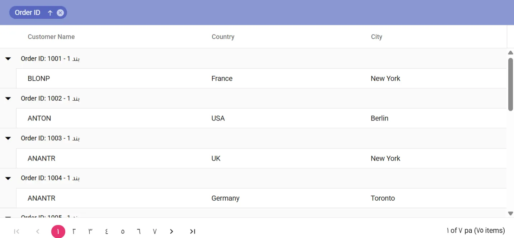

# Caption Template in Blazor Data Grid

The caption template feature in the [Blazor DataGrid](https://www.syncfusion.com/blazor-components/blazor-datagrid) customizes the content of group caption rows. It can display additional information about grouped data (such as the grouped value and record count) and render custom content including images, icons, or other Razor components. This enables clear, informative, and visually rich group captions in the DataGrid.

Use the [CaptionTemplate](https://help.syncfusion.com/cr/blazor/Syncfusion.Blazor.Grids.GridGroupSettings.html#Syncfusion_Blazor_Grids_GridGroupSettings_CaptionTemplate) property to render custom content. Cast the context to [CaptionTemplateContext](https://help.syncfusion.com/cr/blazor/Syncfusion.Blazor.Grids.CaptionTemplateContext.html) to access properties for the current group, some of the commonly used properties are:

- **Field**: Grouped column field name.
- **HeaderText**: Grouped column header text.
- **Key**: Grouped value.
- **Count**: Number of records in the group.




@using Syncfusion.Blazor.Grids

<SfGrid DataSource="@GridData" AllowGrouping="true" Height="315px">
    <GridColumns>
        <GridColumn Field=@nameof(OrderData.OrderID) HeaderText="ID" TextAlign="Syncfusion.Blazor.Grids.TextAlign.Right" Width="90"></GridColumn>
        <GridColumn Field=@nameof(OrderData.CustomerID) HeaderText="Name" Width="100"></GridColumn>
        <GridColumn Field=@nameof(OrderData.ShipCity) HeaderText="City" Width="100"></GridColumn>
        <GridColumn Field=@nameof(OrderData.Freight) HeaderText="value" Width="80"></GridColumn>
    </GridColumns>
    <GridGroupSettings Columns="@Initial">
        <CaptionTemplate>
            @{
                var order = (context as CaptionTemplateContext);
                @order.Key - @order.Count Records : @order.HeaderText
            }
        </CaptionTemplate>
    </GridGroupSettings>
</SfGrid>

@code {
    public List<OrderData> GridData { get; set; }
    public string[] Initial = (new string[] { "ShipCity" });
   
    protected override void OnInitialized()
    {
        GridData = OrderData.GetAllRecords();
    }
}





public class OrderData
{
    public static List<OrderData> Orders = new List<OrderData>();
    public OrderData() {}
    public OrderData(int? orderId, string customerId, string shipCity, double? freight)
    {
        this.OrderID = orderId;
        this.CustomerID = customerId;
        this.ShipCity = shipCity;
        this.Freight = freight;
    }

    public static List<OrderData> GetAllRecords()
    {
        if (Orders.Count() == 0)
        {
            int code = 10;
            for (int i = 1; i < 2; i++)
            {
                Orders.Add(new OrderData(10248, "VINET", "Reims", 3.25));
                Orders.Add(new OrderData(10249, "TOMSP", "Münster", 22.98));
                Orders.Add(new OrderData(10250, "HANAR", "Rio de Janeiro", 140.51));
                Orders.Add(new OrderData(10251, "VICTE", "Lyon", 65.83));
                Orders.Add(new OrderData(10252, "SUPRD", "Charleroi", 58.17));
                Orders.Add(new OrderData(10253, "HANAR", "Lyon", 81.91));
                Orders.Add(new OrderData(10254, "CHOPS", "Rio de Janeiro", 3.05));
                Orders.Add(new OrderData(10255, "RICSU", "Münster", 55.09));
                Orders.Add(new OrderData(10256, "WELLI", "Reims", 48.29));
                code += 5;
            }
        }
        return Orders;
    }

    public int? OrderID { get; set; }
    public string CustomerID { get; set; }
    public string ShipCity { get; set; }
    public double? Freight { get; set; }
}






## Customize group caption text using a locale

The Blazor DataGrid supports customization of group caption text based on locale settings. This feature enables the display of localized or translated content in group captions, allowing the DataGrid to adapt to different languages and regional formats.



@using Syncfusion.Blazor.Grids

<SfGrid DataSource="@Orders" AllowGrouping="true" AllowPaging="true" Height="315px">
    <GridGroupSettings Columns="@Initial"></GridGroupSettings>
    <GridColumns>
        <GridColumn Field=@nameof(Order.OrderID) HeaderText="Order ID" TextAlign="TextAlign.Right" Width="120"></GridColumn>
        <GridColumn Field=@nameof(Order.CustomerID) HeaderText="Customer Name" Width="150"></GridColumn>
        <GridColumn Field=@nameof(Order.Country) HeaderText="Country" Width="130"></GridColumn>
        <GridColumn Field=@nameof(Order.City) HeaderText="City" Width="120"></GridColumn>
    </GridColumns>
</SfGrid>
@code {
    public List<Order> Orders { get; set; }
    public string[] Initial = (new string[] { "Country" });
    protected override void OnInitialized()
    {
        var countries = new[] { "USA", "UK", "Germany", "Canada", "France" };
        var cities = new[] { "New York", "London", "Berlin", "Toronto", "Paris" };
        var random = new Random();
        Orders = Enumerable.Range(1, 75).Select(x => new Order()
        {
            OrderID = 1000 + x,
            CustomerID = (new string[] { "ALFKI", "ANANTR", "ANTON", "BLONP", "BOLID" })[random.Next(5)],
            Country = countries[random.Next(countries.Length)],
            City = cities[random.Next(cities.Length)]
        }).ToList();
    }
    public class Order
    {
        public int? OrderID { get; set; }
        public string CustomerID { get; set; }
        public string Country { get; set; }
        public string City { get; set; }
    }
}



using Syncfusion.Blazor;
namespace LocalizationSample.Client
{
    public class SyncfusionLocalizer : ISyncfusionStringLocalizer
    {
        public string GetText(string key)
        {
            return this.ResourceManager.GetString(key);
        }
        public System.Resources.ResourceManager ResourceManager
        {
            get
            {
                // Replace the ApplicationNamespace with your application name.
                return LocalizationSample.Client.Resources.SfResources.ResourceManager;
            }
        }
    }
}




<?xml version="1.0" encoding="utf-8"?>
<root>
  <xsd:schema id="root" xmlns="" xmlns:xsd="http://www.w3.org/2001/XMLSchema" xmlns:msdata="urn:schemas-microsoft-com:xml-msdata">
    <xsd:import namespace="http://www.w3.org/XML/1998/namespace" />
    <xsd:element name="root" msdata:IsDataSet="true">
      <xsd:complexType>
        <xsd:choice maxOccurs="unbounded">
          <xsd:element name="metadata">
            <xsd:complexType>
              <xsd:sequence>
                <xsd:element name="value" type="xsd:string" minOccurs="0" />
              </xsd:sequence>
              <xsd:attribute name="name" use="required" type="xsd:string" />
              <xsd:attribute name="type" type="xsd:string" />
              <xsd:attribute name="mimetype" type="xsd:string" />
              <xsd:attribute ref="xml:space" />
            </xsd:complexType>
          </xsd:element>
          <xsd:element name="assembly">
            <xsd:complexType>
              <xsd:attribute name="alias" type="xsd:string" />
              <xsd:attribute name="name" type="xsd:string" />
            </xsd:complexType>
          </xsd:element>
          <xsd:element name="data">
            <xsd:complexType>
              <xsd:sequence>
                <xsd:element name="value" type="xsd:string" minOccurs="0" msdata:Ordinal="1" />
                <xsd:element name="comment" type="xsd:string" minOccurs="0" msdata:Ordinal="2" />
              </xsd:sequence>
              <xsd:attribute name="name" type="xsd:string" use="required" msdata:Ordinal="1" />
              <xsd:attribute name="type" type="xsd:string" msdata:Ordinal="3" />
              <xsd:attribute name="mimetype" type="xsd:string" msdata:Ordinal="4" />
              <xsd:attribute ref="xml:space" />
            </xsd:complexType>
          </xsd:element>
          <xsd:element name="resheader">
            <xsd:complexType>
              <xsd:sequence>
                <xsd:element name="value" type="xsd:string" minOccurs="0" msdata:Ordinal="1" />
              </xsd:sequence>
              <xsd:attribute name="name" type="xsd:string" use="required" />
            </xsd:complexType>
          </xsd:element>
        </xsd:choice>
      </xsd:complexType>
    </xsd:element>
  </xsd:schema>
  <resheader name="resmimetype">
    <value>text/microsoft-resx</value>
  </resheader>
  <resheader name="version">
    <value>2.0</value>
  </resheader>
  <resheader name="reader">
    <value>System.Resources.ResXResourceReader, System.Windows.Forms, Version=4.0.0.0, Culture=neutral, PublicKeyToken=b77a5c561934e089</value>
  </resheader>
  <resheader name="writer">
    <value>System.Resources.ResXResourceWriter, System.Windows.Forms, Version=4.0.0.0, Culture=neutral, PublicKeyToken=b77a5c561934e089</value>
  </resheader>
  <data name="Grid_GroupDropArea" xml:space="preserve">
    <value>اسحب رأس العمود هنا لتجميع العمود</value>
  </data>
  <data name="Grid_UnGroupButton" xml:space="preserve">
    <value>انقر هنا لإلغاء التجميع</value>
  </data>
  <data name="Grid_GroupDisable" xml:space="preserve">
    <value>تم تعطيل التجميع لهذا العمود</value>
  </data>
  <data name="Grid_Item" xml:space="preserve">
    <value>بند</value>
  </data>
  <data name="Grid_Items" xml:space="preserve">
    <value>العناصر</value>
  </data>
  <data name="Grid_Group" xml:space="preserve">
    <value>تجميع حسب هذا العمود</value>
  </data>
  <data name="Grid_Ungroup" xml:space="preserve">
    <value>فك تجميع بواسطة هذا العمود</value>
  </data>
</root>




<body>
    ...
    
    
    ...
</body>




> The following `App.razor` snippet targets **Blazor WebAssembly** and uses the `applicationCulture` option to set the runtime culture. For **Blazor Server** apps, configure the culture through `Startup.cs` (`RequestLocalizationOptions`) and a `CulturePicker` component, since `Blazor.start` is not invoked.

## Render a custom component in the group caption

The Blazor DataGrid offers flexibility to render custom components within the group caption row, enabling advanced or interactive functionality. This feature supports the display of custom UI elements such as buttons, icons, or dropdowns, and allows user interactions to be handled directly within the group caption.

Define the custom UI in the [CaptionTemplate](https://help.syncfusion.com/cr/blazor/Syncfusion.Blazor.Grids.GridGroupSettings.html#Syncfusion_Blazor_Grids_GridGroupSettings_CaptionTemplate) and use `CaptionTemplateContext` to access the current group’s details. This feature enables the repllets you replacem component in the group caption, enhancing both customization and interactivity.

The example below demonstrates rendering a Blazor [Chip](https://blazor.syncfusion.com/documentation/chip/getting-started-with-web-app) component displaying the group key.




@using Syncfusion.Blazor.Grids
@using Syncfusion.Blazor.Buttons

<SfGrid DataSource="@GridData" AllowGrouping="true" Height="315px">
    <GridColumns>
        <GridColumn Field=@nameof(OrderData.OrderID) HeaderText="ID" TextAlign="Syncfusion.Blazor.Grids.TextAlign.Right" Width="90"></GridColumn>
        <GridColumn Field=@nameof(OrderData.CustomerID) HeaderText="Name" Width="100"></GridColumn>
        <GridColumn Field=@nameof(OrderData.ShipCity) HeaderText="City" Width="100"></GridColumn>
        <GridColumn Field=@nameof(OrderData.Freight) HeaderText="value" Width="80"></GridColumn>
    </GridColumns>
   <GridGroupSettings Columns="@Initial">
        <CaptionTemplate>
            @{
                var data = (context as CaptionTemplateContext);
                var text = data.Key;
                <SfChip>
                    <ChipItems>
                        <ChipItem Text="@text"></ChipItem>
                    </ChipItems>
                </SfChip>
            }
        </CaptionTemplate>
    </GridGroupSettings>
</SfGrid>

@code {
    public List<OrderData> GridData { get; set; }
    public string[] Initial = (new string[] { "ShipCity" });
   
    protected override void OnInitialized()
    {
        GridData = OrderData.GetAllRecords();
    }
}




public class OrderData
{
    public static List<OrderData> Orders = new List<OrderData>();
    public OrderData() {}
    public OrderData(int? orderId, string customerId, string shipCity, double? freight)
    {
        this.OrderID = orderId;
        this.CustomerID = customerId;
        this.ShipCity = shipCity;
        this.Freight = freight;
    }

    public static List<OrderData> GetAllRecords()
    {
        if (Orders.Count() == 0)
        {
            int code = 10;
            for (int i = 1; i < 2; i++)
            {
                Orders.Add(new OrderData(10248, "VINET", "Reims", 3.25));
                Orders.Add(new OrderData(10249, "TOMSP", "Münster", 22.98));
                Orders.Add(new OrderData(10250, "HANAR", "Rio de Janeiro", 140.51));
                Orders.Add(new OrderData(10251, "VICTE", "Lyon", 65.83));
                Orders.Add(new OrderData(10252, "SUPRD", "Charleroi", 58.17));
                Orders.Add(new OrderData(10253, "HANAR", "Lyon", 81.91));
                Orders.Add(new OrderData(10254, "CHOPS", "Rio de Janeiro", 3.05));
                Orders.Add(new OrderData(10255, "RICSU", "Münster", 55.09));
                Orders.Add(new OrderData(10256, "WELLI", "Reims", 48.29));
                code += 5;
            }
        }
        return Orders;
    }

    public int? OrderID { get; set; }
    public string CustomerID { get; set; }
    public string ShipCity { get; set; }
    public double? Freight { get; set; }
}






## See also

- [Localization and Globalization](https://blazor.syncfusion.com/documentation/datagrid/global-local)
- [Grouping customization](https://blazor.syncfusion.com/documentation/datagrid/style-and-appearance/grouping)