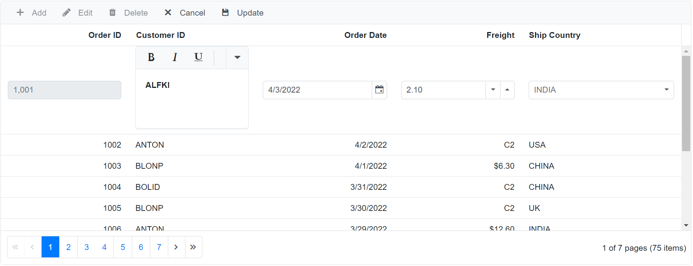

# Cell Edit Types in Blazor DataGrid Component

## Default editors

The [EditType](https://help.syncfusion.com/cr/blazor/Syncfusion.Blazor.Grids.GridColumn.html) property of the [GridColumn](https://help.syncfusion.com/cr/aspnetcore-blazor/Syncfusion.Blazor.Grids.GridColumn.html) component is used for defining the editor component for any particular column. You can set the [EditType](https://help.syncfusion.com/cr/blazor/Syncfusion.Blazor.Grids.GridColumn.html) based on the data type of the column.

The available default edit types are,

* [NumericEdit](https://blazor.syncfusion.com/documentation/numeric-textbox/getting-started) component for integers, double, and decimal data types.

* [DefaultEdit](https://blazor.syncfusion.com/documentation/textbox/getting-started) component for string data type.

* [DropDownEdit](https://blazor.syncfusion.com/documentation/dropdown-list/getting-started) component to show all unique values related to that field.

* [BooleanEdit](https://blazor.syncfusion.com/documentation/check-box/getting-started) component for boolean data type.

* [DatePickerEdit](https://blazor.syncfusion.com/documentation/datepicker/getting-started) component for date data type.

* [DateTimePickerEdit](https://blazor.syncfusion.com/documentation/datetime-picker/getting-started) component for date time data type.

* [TimePickerEdit](https://blazor.syncfusion.com/documentation/timepicker/getting-started)
component for TimeOnly data type.

## Customizing the default editor controls

You can customize the behavior of the editor component through the [EditorSettings](https://help.syncfusion.com/cr/blazor/Syncfusion.Blazor.Grids.GridColumn.html) property of the [GridColumn](https://help.syncfusion.com/cr/aspnetcore-blazor/Syncfusion.Blazor.Grids.GridColumn.html) component.

N> We have limited the properties of editor components that can be customized using [EditorSettings](https://help.syncfusion.com/cr/blazor/Syncfusion.Blazor.Grids.GridColumn.html) in Grid default editor components. Find the list of properties that can be customized the below topics.
<br/> If you want to customize other properties, refer to our [EditTemplate](https://blazor.syncfusion.com/documentation/datagrid/editing/#cell-edit-template) documentation to render the custom components in EditForm along with your customization.

### DefaultEdit

`StringEditCellParams` class helps us to customize the default TextBox component in Grid EditForm. The following table describes properties of TextBox control than can be customized using `EditorSettings` of GridColumn editor component.

| Component | Description |
|--------|----------------|
| CssClass | Specifies the CSS class value that is appended to wrapper of Textbox. |
| EnableRtl | Enable or disable rendering component in right to left direction.  |
| ReadOnly | Specifies the boolean value that indicates whether the TextBox allows user to change the text.   |
| ShowClearButton | Specifies a Boolean value that indicates whether the clear button is displayed in Textbox.   |
| Multiline | Specifies a boolean value that enable or disable the multiline on the TextBox. The TextBox changes from single line to multiline when enable this multiline mode.   |

The following sample code demonstrates the customization applied to TextBox component set for the DataGrid columns,

```cshtml
@using Syncfusion.Blazor.Inputs
@using Syncfusion.Blazor.Grids

<SfGrid DataSource="@OrderData" Toolbar=@ToolbarItems>
    <GridEditSettings AllowEditing="true" AllowAdding="true" AllowDeleting="true"></GridEditSettings>
    <GridColumns>
        <GridColumn Field=@nameof(Order.OrderID) HeaderText="Order ID" IsPrimaryKey="true" TextAlign="TextAlign.Center" Width="120"></GridColumn>
        <GridColumn Field=@nameof(Order.CustomerID) HeaderText="Customer ID" EditType="EditType.DefaultEdit" EditorSettings="@CustomerEditParams" TextAlign="TextAlign.Center" Width="130"></GridColumn>
        <GridColumn Field=@nameof(Order.Freight) HeaderText="Freight" Format="C2" EditType="EditType.NumericEdit" TextAlign="TextAlign.Center" Width="130"></GridColumn>
        <GridColumn Field=@nameof(Order.ShipName) HeaderText="Ship Name" TextAlign="TextAlign.Center" EditType="EditType.DropDownEdit" Width="120"></GridColumn>
        <GridColumn Field=@nameof(Order.Verified) HeaderText="Verified" EditType="EditType.BooleanEdit" TextAlign="TextAlign.Center" DisplayAsCheckBox="true" Width="120"></GridColumn>
    </GridColumns>
</SfGrid>

@code{
    public string[] ToolbarItems = new string[] { "Add", "Edit", "Delete", "Update", "Cancel" };

    public IEditorSettings CustomerEditParams = new StringEditCellParams
    {
        Params = new TextBoxModel() { EnableRtl = true, ShowClearButton = false, Multiline = true }
    };

    List<Order> OrderData = new List<Order>
{
        new Order() { OrderID = 10248, CustomerID = "VINET", Freight = 32.38, ShipName = "Vins et alcools Chevalier", Verified = true },
        new Order() { OrderID = 10249, CustomerID = "TOMSP", Freight = 11.61, ShipName = "Toms Spezialitäten", Verified = false },
        new Order() { OrderID = 10250, CustomerID = "HANAR", Freight = 65.83, ShipName = "Hanari Carnes", Verified = true },
        new Order() { OrderID = 10251, CustomerID = "VICTE", Freight = 41.34, ShipName = "Victuailles en stock", Verified = false },
        new Order() { OrderID = 10252, CustomerID = "SUPRD", Freight = 51.3, ShipName = "Suprêmes délices", Verified = false },
        new Order() { OrderID = 10253, CustomerID = "HANAR", Freight = 58.17, ShipName = "Hanari Carnes", Verified = false },
        new Order() { OrderID = 10254, CustomerID = "CHOPS", Freight = 22.98, ShipName = "Chop-suey Chinese", Verified = true },
        new Order() { OrderID = 10255, CustomerID = "RICSU", Freight = 148.33, ShipName = "Richter Supermarket", Verified = true },
        new Order() { OrderID = 10256, CustomerID = "WELLI", Freight = 13.97, ShipName = "Wellington Importadora", Verified = false },
        new Order() { OrderID = 10257, CustomerID = "HILAA", Freight = 81.91, ShipName = "HILARION-Abastos", Verified = true }
    };

    public class Order
    {
        public int? OrderID { get; set; }
        public string CustomerID { get; set; }
        public double Freight { get; set; }
        public string ShipName { get; set; }
        public bool Verified { get; set; }
    }
}
```

### NumericEdit

`NumericEditCellParams` class helps us to customize the default NumericTextBox component in Grid EditForm. The following table describes properties of NumericTextBox control than can be customized using `EditorSettings` of GridColumn editor component.

| Component | Description |
|--------|----------------|
| CssClass | Gets or Sets the CSS classes to root element of the NumericTextBox which helps to customize the complete UI styles for the NumericTextBox component. |
| Decimals | Specifies the number precision applied to the textbox value when the NumericTextBox is focused.|
| EnableRtl | Enable or disable rendering component in right to left direction.|
| Format | Specifies the number format that indicates the display format for the value of the NumericTextBox |
| PlaceHolder | Gets or sets the string shown as a hint/placeholder when the NumericTextBox is empty. It acts as a label and floats above the NumericTextBox |
| ShowClearButton | Specifies whether to show or hide the clear icon. |
| ShowSpinButton | Specifies whether the up and down spin buttons should be displayed in NumericTextBox. |
| ValidateDecimalOnType | Specifies whether the decimals length should be restricted during typing. |
| Step | Specifies the incremental or decremental step size for the NumericTextBox. |

The following sample code demonstrates the customization applied to NumericTextBox component set for the DataGrid columns,

```cshtml
@using Syncfusion.Blazor.Grids
@using Syncfusion.Blazor.Inputs

<SfGrid DataSource="@OrderData" Toolbar=@ToolbarItems>
    <GridEditSettings AllowEditing="true" AllowAdding="true" AllowDeleting="true"></GridEditSettings>
    <GridColumns>
        <GridColumn Field=@nameof(Order.OrderID) HeaderText="Order ID" IsPrimaryKey="true" TextAlign="TextAlign.Center" Width="120"></GridColumn>
        <GridColumn Field=@nameof(Order.CustomerID) HeaderText="Customer ID" TextAlign="TextAlign.Center" Width="130"></GridColumn>
        <GridColumn Field=@nameof(Order.Freight) HeaderText="Freight" Format="C2" EditType="EditType.NumericEdit" EditorSettings="@FreightEditParams" TextAlign="TextAlign.Center" Width="130"></GridColumn>
        <GridColumn Field=@nameof(Order.ShipName) HeaderText="Ship Name" TextAlign="TextAlign.Center" EditType="EditType.DropDownEdit" Width="120"></GridColumn>
        <GridColumn Field=@nameof(Order.Verified) HeaderText="Verified" EditType="EditType.BooleanEdit" TextAlign="TextAlign.Center" DisplayAsCheckBox="true" Width="120"></GridColumn>
    </GridColumns>
</SfGrid>

@code{
    public string[] ToolbarItems = new string[] { "Add", "Edit", "Delete", "Update", "Cancel" };

    public IEditorSettings FreightEditParams = new NumericEditCellParams
    {
        Params = new NumericTextBoxModel<object>() { ShowClearButton= true, ShowSpinButton = false }
    };

    List<Order> OrderData = new List<Order>
{
        new Order() { OrderID = 10248, CustomerID = "VINET", Freight = 32.38, ShipName = "Vins et alcools Chevalier", Verified = true },
        new Order() { OrderID = 10249, CustomerID = "TOMSP", Freight = 11.61, ShipName = "Toms Spezialitäten", Verified = false },
        new Order() { OrderID = 10250, CustomerID = "HANAR", Freight = 65.83, ShipName = "Hanari Carnes", Verified = true },
        new Order() { OrderID = 10251, CustomerID = "VICTE", Freight = 41.34, ShipName = "Victuailles en stock", Verified = false },
        new Order() { OrderID = 10252, CustomerID = "SUPRD", Freight = 51.3, ShipName = "Suprêmes délices", Verified = false },
        new Order() { OrderID = 10253, CustomerID = "HANAR", Freight = 58.17, ShipName = "Hanari Carnes", Verified = false },
        new Order() { OrderID = 10254, CustomerID = "CHOPS", Freight = 22.98, ShipName = "Chop-suey Chinese", Verified = true },
        new Order() { OrderID = 10255, CustomerID = "RICSU", Freight = 148.33, ShipName = "Richter Supermarket", Verified = true },
        new Order() { OrderID = 10256, CustomerID = "WELLI", Freight = 13.97, ShipName = "Wellington Importadora", Verified = false },
        new Order() { OrderID = 10257, CustomerID = "HILAA", Freight = 81.91, ShipName = "HILARION-Abastos", Verified = true }
    };

    public class Order
    {
        public int? OrderID { get; set; }
        public string CustomerID { get; set; }
        public double Freight { get; set; }
        public string ShipName { get; set; }
        public bool Verified { get; set; }
    }
}
```

### DropDownEdit

`DropDownEditCellParams` class helps us to customize the default DropDownList component in Grid EditForm. The following table describes properties of DropDownList control than can be customized using `EditorSettings` of GridColumn editor component.

| Component | Example |
|--------|----------------|
| Enabled | Specifies a value that indicates whether the component is enabled or not |
| CssClass | Sets CSS classes to the root element of the component that allows customization of appearance.  |
| FilterBarPlaceholder | Accepts the value to be displayed as a watermark text on the filter bar.   |
| AllowFiltering | When allowFiltering is set to true, the filter bar (search box) of the component is displayed. |
| FooterTemplate | Accepts the template design and assigns it to the footer container of the popup list. |
| HeaderTemplate | Accepts the template design and assigns it to the header container of the popup list. |
| PopupHeight | Specifies the height of the popup list |
| PopupWidth | Specifies the width of the popup list. By default, the popup width sets based on the width of the component |
| ReadOnly | When set to true, the user interactions on the component are disabled.   |
| ShowClearButton | Specifies whether to show or hide the clear button. When the clear button is clicked, `Value`, `text`, and `index` properties are reset to null.   |
| ValueTemplate | Accepts the template design and assigns it to the selected list item in the input element of the component.  |
| ActionFailureTemplate | Accepts the template and assigns it to the popup list content of the component when the data fetch request from the remote server fails |
| DataSource | Accepts the list items either through local or remote service and binds it to the component. It can be an array of JSON Objects or an instance of `DataManager`. |

N> `IEnumerable<TItem>` is the type of [DataSource](https://help.syncfusion.com/cr/blazor/Syncfusion.Blazor.DropDowns.DropDownListModel-2.html#Syncfusion_Blazor_DropDowns_DropDownListModel_2_DataSource) property in [DropDownListModel](https://help.syncfusion.com/cr/blazor/Syncfusion.Blazor.DropDowns.DropDownListModel-2.html), so you should not bind `string[]` or `List<string>` type to the [DataSource](https://help.syncfusion.com/cr/blazor/Syncfusion.Blazor.DropDowns.DropDownListModel-2.html#Syncfusion_Blazor_DropDowns_DropDownListModel_2_DataSource) property.

The following sample code demonstrates the customization applied to DropDownList component set for the DataGrid columns,

```cshtml
@using Syncfusion.Blazor.DropDowns
@using Syncfusion.Blazor.Grids

<SfGrid DataSource="@OrderData" Toolbar=@ToolbarItems>
    <GridEditSettings AllowEditing="true" AllowAdding="true" AllowDeleting="true"></GridEditSettings>
    <GridColumns>
        <GridColumn Field=@nameof(Order.OrderID) HeaderText="Order ID" IsPrimaryKey="true" TextAlign="TextAlign.Center" Width="120"></GridColumn>
        <GridColumn Field=@nameof(Order.CustomerID) HeaderText="Customer ID" TextAlign="TextAlign.Center" Width="130"></GridColumn>
        <GridColumn Field=@nameof(Order.Freight) HeaderText="Freight" Format="C2" EditType="EditType.NumericEdit" TextAlign="TextAlign.Center" Width="130"></GridColumn>
        <GridColumn Field=@nameof(Order.ShipName) HeaderText="Ship Name" TextAlign="TextAlign.Center" EditType="EditType.DropDownEdit" EditorSettings="@ShipNameEditParams" Width="120"></GridColumn>
        <GridColumn Field=@nameof(Order.Verified) HeaderText="Verified" EditType="EditType.BooleanEdit" TextAlign="TextAlign.Center" DisplayAsCheckBox="true" Width="120"></GridColumn>
    </GridColumns>
</SfGrid>

@code{
    public string[] ToolbarItems = new string[] { "Add", "Edit", "Delete", "Update", "Cancel" };

    public IEditorSettings ShipNameEditParams = new DropDownEditCellParams
    {
        Params = new DropDownListModel<object, object>() { AllowFiltering = true, ShowClearButton = true }
    };

    List<Order> OrderData = new List<Order>
{
        new Order() { OrderID = 10248, CustomerID = "VINET", Freight = 32.38, ShipName = "Vins et alcools Chevalier", Verified = true },
        new Order() { OrderID = 10249, CustomerID = "TOMSP", Freight = 11.61, ShipName = "Toms Spezialitäten", Verified = false },
        new Order() { OrderID = 10250, CustomerID = "HANAR", Freight = 65.83, ShipName = "Hanari Carnes", Verified = true },
        new Order() { OrderID = 10251, CustomerID = "VICTE", Freight = 41.34, ShipName = "Victuailles en stock", Verified = false },
        new Order() { OrderID = 10252, CustomerID = "SUPRD", Freight = 51.3, ShipName = "Suprêmes délices", Verified = false },
        new Order() { OrderID = 10253, CustomerID = "HANAR", Freight = 58.17, ShipName = "Hanari Carnes", Verified = false },
        new Order() { OrderID = 10254, CustomerID = "CHOPS", Freight = 22.98, ShipName = "Chop-suey Chinese", Verified = true },
        new Order() { OrderID = 10255, CustomerID = "RICSU", Freight = 148.33, ShipName = "Richter Supermarket", Verified = true },
        new Order() { OrderID = 10256, CustomerID = "WELLI", Freight = 13.97, ShipName = "Wellington Importadora", Verified = false },
        new Order() { OrderID = 10257, CustomerID = "HILAA", Freight = 81.91, ShipName = "HILARION-Abastos", Verified = true }
    };

    public class Order
    {
        public int? OrderID { get; set; }
        public string CustomerID { get; set; }
        public double Freight { get; set; }
        public string ShipName { get; set; }
        public bool Verified { get; set; }
    }
}
```

### BooleanEdit

`BooleanEditCellParams` class helps us to customize the default Checkbox component in Grid EditForm. The following table describes properties of CheckBox control that can be customized using `EditorSettings` of GridColumn editor component.

| Component | Description |
|--------|----------------|
| CssClass | Defines class/multiple classes separated by a space in the CheckBox element. You can add custom styles to the CheckBox by using this property. |
| Label | Defines the caption for the CheckBox, that describes the purpose of the CheckBox.  |
| EnableRtl | Enable or disable rendering component in right to left direction.  |
| LabelPosition | Positions label `Before`/`after` the CheckBox. The possible values are: Before - The label is positioned to left of the CheckBox. After - The label is positioned to right of the CheckBox.   |
| Indeterminate | Specifies a value that indicates whether the CheckBox is in `Indeterminate` state or not. When set to `true`, the CheckBox will be in `indeterminate` state.   |
| Disabled | Specifies a value that indicates whether the CheckBox is `Disabled` or not. When set to `true`, the CheckBox will be in `disabled` state. |

The following sample code demonstrates the customization applied to Checkbox component set for the DataGrid columns,

```cshtml
@using Syncfusion.Blazor.Buttons
@using Syncfusion.Blazor.Grids

<SfGrid DataSource="@OrderData" Toolbar=@ToolbarItems>
    <GridEditSettings AllowEditing="true" AllowAdding="true" AllowDeleting="true"></GridEditSettings>
    <GridColumns>
        <GridColumn Field=@nameof(Order.OrderID) HeaderText="Order ID" IsPrimaryKey="true" TextAlign="TextAlign.Center" Width="120"></GridColumn>
        <GridColumn Field=@nameof(Order.CustomerID) HeaderText="Customer ID" TextAlign="TextAlign.Center" Width="130"></GridColumn>
        <GridColumn Field=@nameof(Order.Freight) HeaderText="Freight" Format="C2" EditType="EditType.NumericEdit" TextAlign="TextAlign.Center" Width="130"></GridColumn>
        <GridColumn Field=@nameof(Order.ShipName) HeaderText="Ship Name" TextAlign="TextAlign.Center" EditType="EditType.DropDownEdit" Width="120"></GridColumn>
        <GridColumn Field=@nameof(Order.Verified) HeaderText="Verified" EditType="EditType.BooleanEdit" TextAlign="TextAlign.Center" DisplayAsCheckBox="true" Width="120" EditorSettings="@VerifiedEditParams"></GridColumn>
    </GridColumns>
</SfGrid>

@code{
    public string[] ToolbarItems = new string[] { "Add", "Edit", "Delete", "Update", "Cancel" };

    public IEditorSettings VerifiedEditParams = new BooleanEditCellParams
    {
        Params = new CheckBoxModel<bool>() { Label = "Checked", Disabled = true, LabelPosition = LabelPosition.Before  }
    };

    List<Order> OrderData = new List<Order>
{
        new Order() { OrderID = 10248, CustomerID = "VINET", Freight = 32.38, ShipName = "Vins et alcools Chevalier", Verified = true },
        new Order() { OrderID = 10249, CustomerID = "TOMSP", Freight = 11.61, ShipName = "Toms Spezialitäten", Verified = false },
        new Order() { OrderID = 10250, CustomerID = "HANAR", Freight = 65.83, ShipName = "Hanari Carnes", Verified = true },
        new Order() { OrderID = 10251, CustomerID = "VICTE", Freight = 41.34, ShipName = "Victuailles en stock", Verified = false },
        new Order() { OrderID = 10252, CustomerID = "SUPRD", Freight = 51.3, ShipName = "Suprêmes délices", Verified = false },
        new Order() { OrderID = 10253, CustomerID = "HANAR", Freight = 58.17, ShipName = "Hanari Carnes", Verified = false },
        new Order() { OrderID = 10254, CustomerID = "CHOPS", Freight = 22.98, ShipName = "Chop-suey Chinese", Verified = true },
        new Order() { OrderID = 10255, CustomerID = "RICSU", Freight = 148.33, ShipName = "Richter Supermarket", Verified = true },
        new Order() { OrderID = 10256, CustomerID = "WELLI", Freight = 13.97, ShipName = "Wellington Importadora", Verified = false },
        new Order() { OrderID = 10257, CustomerID = "HILAA", Freight = 81.91, ShipName = "HILARION-Abastos", Verified = true }
    };

    public class Order
    {
        public int? OrderID { get; set; }
        public string CustomerID { get; set; }
        public double Freight { get; set; }
        public string ShipName { get; set; }
        public bool Verified { get; set; }
    }
}
```

### DatePickerEdit

`DateEditCellParams` class helps to customize the default DatePicker and DateTimePicker components in Grid EditForm. The following table describes properties of DatePicker control that can be customized using `EditorSettings` of GridColumn editor component.

| Component | Example |
|--------|----------------|
| CssClass | Specifies the root CSS class of the DatePicker that allows to customize the appearance by overriding the styles.   |
| EnableRtl | Enable or disable rendering component in right to left direction.    |
| ReadOnly | Specifies the component in readonly state. When the Component is readonly it does not allow user input.     |
| ShowClearButton | Specifies whether to show or hide the clear icon in textbox. |

The following sample code demonstrates the customization applied to DatePicker component set for the DataGrid columns,

```cshtml
@using Syncfusion.Blazor.Calendars
@using Syncfusion.Blazor.Grids

<SfGrid DataSource="@OrderData" Toolbar=@ToolbarItems>
    <GridEditSettings AllowEditing="true" AllowAdding="true" AllowDeleting="true"></GridEditSettings>
    <GridColumns>
        <GridColumn Field=@nameof(Order.OrderID) HeaderText="Order ID" IsPrimaryKey="true" TextAlign="TextAlign.Center" Width="120"></GridColumn>
        <GridColumn Field=@nameof(Order.CustomerID) HeaderText="Customer ID" TextAlign="TextAlign.Center" Width="130"></GridColumn>
        <GridColumn Field=@nameof(Order.Freight) HeaderText="Freight" Format="C2" EditType="EditType.NumericEdit" TextAlign="TextAlign.Center" Width="130"></GridColumn>
        <GridColumn Field=@nameof(Order.OrderDate) HeaderText="OrderDate" Format="d" EditType="EditType.DatePickerEdit" EditorSettings="@DateEditParams" Width="130"></GridColumn>
        <GridColumn Field=@nameof(Order.ShipName) HeaderText="Ship Name" TextAlign="TextAlign.Center" EditType="EditType.DropDownEdit" Width="120"></GridColumn>
        <GridColumn Field=@nameof(Order.Verified) HeaderText="Verified" EditType="EditType.BooleanEdit" TextAlign="TextAlign.Center" DisplayAsCheckBox="true" Width="120"></GridColumn>
    </GridColumns>
</SfGrid>

@code{
    public string[] ToolbarItems = new string[] { "Add", "Edit", "Delete", "Update", "Cancel" };

    public IEditorSettings DateEditParams = new DateEditCellParams
    {
        Params = new DatePickerModel() { EnableRtl = true, ShowClearButton = false }
    };

    List<Order> OrderData = new List<Order>
{
        new Order() { OrderID = 10248, CustomerID = "VINET", Freight = 32.38, ShipName = "Vins et alcools Chevalier", Verified = true },
        new Order() { OrderID = 10249, CustomerID = "TOMSP", Freight = 11.61, ShipName = "Toms Spezialitäten", Verified = false },
        new Order() { OrderID = 10250, CustomerID = "HANAR", Freight = 65.83, ShipName = "Hanari Carnes", Verified = true },
        new Order() { OrderID = 10251, CustomerID = "VICTE", Freight = 41.34, ShipName = "Victuailles en stock", Verified = false },
        new Order() { OrderID = 10252, CustomerID = "SUPRD", Freight = 51.3, ShipName = "Suprêmes délices", Verified = false },
        new Order() { OrderID = 10253, CustomerID = "HANAR", Freight = 58.17, ShipName = "Hanari Carnes", Verified = false },
        new Order() { OrderID = 10254, CustomerID = "CHOPS", Freight = 22.98, ShipName = "Chop-suey Chinese", Verified = true },
        new Order() { OrderID = 10255, CustomerID = "RICSU", Freight = 148.33, ShipName = "Richter Supermarket", Verified = true },
        new Order() { OrderID = 10256, CustomerID = "WELLI", Freight = 13.97, ShipName = "Wellington Importadora", Verified = false },
        new Order() { OrderID = 10257, CustomerID = "HILAA", Freight = 81.91, ShipName = "HILARION-Abastos", Verified = true }
    };

    public class Order
    {
        public int? OrderID { get; set; }
        public string CustomerID { get; set; }
        public double Freight { get; set; }
        public DateTime? OrderDate { get; set; } = DateTime.Now;
        public string ShipName { get; set; }
        public bool Verified { get; set; }
    }
}
```

N> Similar way customization can be applied to default DateTimePicker Component using same `DateEditCellParams`

### TimePickerEdit

`TimeEditCellParams` class helps to customize the default TimePicker component in Grid EditForm. The following table describes properties of TimePicker control that can be customized using `EditorSettings` of GridColumn editor component.

| Component | Example |
|--------|----------------|
| CssClass | Specifies the root CSS class of the TimePicker that allows to customize the appearance by overriding the styles.   |
| EnableRtl | Enable or disable rendering component in right to left direction.    |
| ReadOnly | Specifies the component in readonly state. When the Component is readonly it does not allow user input.     |
| ShowClearButton | Specifies whether to show or hide the clear icon in textbox. |
| Step | Specifies the incremental or decremental step size for the TimePicker.   |
| Format | Specifies the time format that indicates the display format for the value of the TimePicker.    |
| Min | Specifies the the minimum time value that can be allowed to select in TimePicker.     |
| Max | Specifies the maximum time value that can be allowed to select in TimePicker. |

The following sample code demonstrates the customization applied to TimePicker component set for the DataGrid columns,

```cshtml
@using Syncfusion.Blazor.Calendars
@using Syncfusion.Blazor.Grids
<SfGrid DataSource="@OrderData" Toolbar=@ToolbarItems>
    <GridEditSettings AllowEditing="true" AllowAdding="true" AllowDeleting="true"></GridEditSettings>
    <GridColumns>
        <GridColumn Field=@nameof(Order.OrderID) HeaderText="Order ID" IsPrimaryKey="true" TextAlign="TextAlign.Center" Width="120"></GridColumn>
        <GridColumn Field=@nameof(Order.CustomerID) HeaderText="Customer ID" TextAlign="TextAlign.Center" Width="130"></GridColumn>
        <GridColumn Field=@nameof(Order.Freight) HeaderText="Freight" Format="C2" EditType="EditType.NumericEdit" TextAlign="TextAlign.Center" Width="130"></GridColumn>
        <GridColumn Field=@nameof(Order.OrderTime) EditorSettings="@TimeEditParams" EditType="EditType.TimePickerEdit" TextAlign="TextAlign.Right" Type="ColumnType.TimeOnly" Width="130"></GridColumn>
        <GridColumn Field=@nameof(Order.ShipName) HeaderText="Ship Name" TextAlign="TextAlign.Center" EditType="EditType.DropDownEdit" Width="120"></GridColumn>
        <GridColumn Field=@nameof(Order.Verified) HeaderText="Verified" EditType="EditType.BooleanEdit" TextAlign="TextAlign.Center" DisplayAsCheckBox="true" Width="120"></GridColumn>
    </GridColumns>
</SfGrid>
@code {
    public string[] ToolbarItems = new string[] { "Add", "Edit", "Delete", "Update", "Cancel" };
    public IEditorSettings TimeEditParams = new TimeEditCellParams
    {
        Params = new TimePickerModel<object>() { ShowClearButton = true }
    };
    List<Order> OrderData = new List<Order>
{
        new Order() { OrderID = 10248, CustomerID = "VINET", Freight = 32.38, ShipName = "Vins et alcools Chevalier", Verified = true, OrderTime = new TimeOnly(1, 00) },
        new Order() { OrderID = 10249, CustomerID = "TOMSP", Freight = 11.61, ShipName = "Toms Spezialitäten", Verified = false , OrderTime = new TimeOnly(2, 00) },
        new Order() { OrderID = 10250, CustomerID = "HANAR", Freight = 65.83, ShipName = "Hanari Carnes", Verified = true, OrderTime = new TimeOnly(3, 00) },
        new Order() { OrderID = 10251, CustomerID = "VICTE", Freight = 41.34, ShipName = "Victuailles en stock", Verified = false , OrderTime = new TimeOnly(4, 00) },
        new Order() { OrderID = 10252, CustomerID = "SUPRD", Freight = 51.3, ShipName = "Suprêmes délices", Verified = false, OrderTime = new TimeOnly(5, 00) },
        new Order() { OrderID = 10253, CustomerID = "HANAR", Freight = 58.17, ShipName = "Hanari Carnes", Verified = false , OrderTime = new TimeOnly(6, 00) },
        new Order() { OrderID = 10254, CustomerID = "CHOPS", Freight = 22.98, ShipName = "Chop-suey Chinese", Verified = true , OrderTime = new TimeOnly(7, 00) },
        new Order() { OrderID = 10255, CustomerID = "RICSU", Freight = 148.33, ShipName = "Richter Supermarket", Verified = true , OrderTime = new TimeOnly(8, 00) },
        new Order() { OrderID = 10256, CustomerID = "WELLI", Freight = 13.97, ShipName = "Wellington Importadora", Verified = false , OrderTime = new TimeOnly(9, 00) },
        new Order() { OrderID = 10257, CustomerID = "HILAA", Freight = 81.91, ShipName = "HILARION-Abastos", Verified = true, OrderTime = new TimeOnly(10, 00) }
    };
    public class Order
    {
        public int? OrderID { get; set; }
        public string CustomerID { get; set; }
        public double Freight { get; set; }
        public DateTime? OrderDate { get; set; } = DateTime.Now;
        public TimeOnly? OrderTime { get; set; }
        public string ShipName { get; set; }
        public bool Verified { get; set; }
    }
}
```

## Custom editors using template/Cell edit template

N> Before adding edit template to the datagrid, it is recommended to go through the [template](./templates/#templates) section topic to configure the template.

The cell edit template is used to add a custom component for a particular column. You can use the **EditTemplate** of the [GridColumn](https://help.syncfusion.com/cr/aspnetcore-blazor/Syncfusion.Blazor.Grids.GridColumn.html) component to add the custom component. You can access the parameters passed to the templates using implicit parameter named **context**.

N> Custom components inside the EditTemplate must be specified with two-way (**@bind-Value**) binding to reflect the changes in DataGrid.

### Using AutoComplete in EditTemplate

You can able to render SfAutoComplete component in EditTemplate. In the below sample we have rendered  **SfAutoComplete** component in **EditTemplate** for Customer ID column.

```cshtml
@using Syncfusion.Blazor.DropDowns
@using Syncfusion.Blazor.Grids

<SfGrid AllowPaging="true" DataSource="@Orders" Toolbar="@(new List<string>() { "Add", "Edit", "Delete", "Cancel", "Update" })">
    <GridEditSettings AllowEditing="true" AllowDeleting="true" AllowAdding="true" Mode="@EditMode.Normal"></GridEditSettings>
    <GridColumns>
        <GridColumn Field=@nameof(Order.OrderID) HeaderText="Order ID" IsPrimaryKey="true" TextAlign="@TextAlign.Center" Width="140"></GridColumn>
        <GridColumn Field=@nameof(Order.CustomerID) HeaderText="Customer Name" Width="150">
            <EditTemplate>
                <SfAutoComplete ID="CustomerID" TItem="Order" TValue="string" @bind-Value="@((context as Order).CustomerID)" DataSource="@Orders">
                    <AutoCompleteFieldSettings Value="CustomerID"></AutoCompleteFieldSettings>
                </SfAutoComplete>
            </EditTemplate>
        </GridColumn>
        <GridColumn Field=@nameof(Order.Freight) HeaderText="Freight" EditType="EditType.NumericEdit" Format="C2" Width="140" TextAlign="@TextAlign.Right"></GridColumn>
        <GridColumn Field=@nameof(Order.OrderDate) HeaderText="Order Date" EditType="EditType.DatePickerEdit" Format="d" Type="ColumnType.Date" Width="160"></GridColumn>
    </GridColumns>
</SfGrid>


@code{
    public List<Order> Orders { get; set; }

    protected override void OnInitialized()
    {
        Orders = Enumerable.Range(1, 75).Select(x => new Order()
        {
            OrderID = 1000 + x,
            CustomerID = (new string[] { "ALFKI", "ANANTR", "ANTON", "BLONP", "BOLID" })[new Random().Next(5)],
            Freight = 2.1 * x,
            OrderDate = DateTime.Now.AddDays(-x),
        }).ToList();
    }

    public class Order
    {
        public int? OrderID { get; set; }
        public string CustomerID { get; set; }
        public DateTime? OrderDate { get; set; }
        public double? Freight { get; set; }
    }
}
```

In the following image, **Autocomplete** component is rendered with **EditTemplate** in Customer ID column


### Using DropDownList in EditTemplate

You can able to render SfDropDownList component in EditTemplate. In the below sample we have rendered  **SfDropDownList** component in **EditTemplate** for ShipCountry column.

```cshtml
@using Syncfusion.Blazor.Grids
@using Syncfusion.Blazor.DropDowns

<SfGrid DataSource="@Orders" AllowPaging="true" Toolbar="@(new List<string>() { "Add", "Edit", "Delete", "Cancel", "Update" })" Height="315">
    <GridEditSettings AllowAdding="true" AllowEditing="true" AllowDeleting="true" Mode="EditMode.Normal"></GridEditSettings>
    <GridColumns>
        <GridColumn Field=@nameof(Order.OrderID) HeaderText="Order ID" IsPrimaryKey="true" ValidationRules="@(new ValidationRules{ Required=true})" TextAlign="TextAlign.Right" Width="120"></GridColumn>
        <GridColumn Field=@nameof(Order.CustomerID) HeaderText="Customer Name" ValidationRules="@(new ValidationRules{ Required=true})" Width="120"></GridColumn>
        <GridColumn Field=@nameof(Order.OrderDate) HeaderText=" Order Date" EditType="EditType.DatePickerEdit" Format="d" TextAlign="TextAlign.Right" Width="130" Type="ColumnType.Date"></GridColumn>
        <GridColumn Field=@nameof(Order.Freight) HeaderText="Freight" Format="C2" TextAlign="TextAlign.Right" EditType="EditType.NumericEdit" Width="120"></GridColumn>
        <GridColumn Field=@nameof(Order.ShipCountry) HeaderText="Ship Country" EditType="EditType.DropDownEdit" Width="150">
            <EditTemplate>
                <SfDropDownList ID="ShipCountry" TItem="Country" TValue="string" @bind-Value="@((context as Order).ShipCountry)" DataSource="@Countries">
                    <DropDownListFieldSettings Value="CountryName" Text="CountryName"></DropDownListFieldSettings>
                </SfDropDownList>
            </EditTemplate>
        </GridColumn>
    </GridColumns>
</SfGrid>

@code{
    public List<Order> Orders { get; set; }

    protected override void OnInitialized()
    {
        Orders = Enumerable.Range(1, 75).Select(x => new Order()
        {
            OrderID = 1000 + x,
            CustomerID = (new string[] { "ALFKI", "ANANTR", "ANTON", "BLONP", "BOLID" })[new Random().Next(5)],
            Freight = 2.1 * x,
            OrderDate = DateTime.Now.AddDays(-x),
            ShipCountry = (new string[] { "USA", "UK", "CHINA", "RUSSIA", "INDIA" })[new Random().Next(5)]
        }).ToList();
    }

    public class Order
    {
        public int? OrderID { get; set; }
        public string CustomerID { get; set; }
        public DateTime? OrderDate { get; set; }
        public double? Freight { get; set; }
        public string ShipCountry { get; set; }
    }
    public List<Country> Countries { get; set; } = new List<Country>()
    {
        new Country(){ CountryName="Brazil", ID=1},
        new Country(){ CountryName="Argentina", ID=2},
        new Country(){ CountryName="Canada", ID=3}
    };
    public class Country
    {
        public string CountryName { get; set; }
        public int ID { get; set; }
    }
}
```

In the following image, **SfDropDownList** component is rendered with **EditTemplate** in ShipCountry column


### Using ComboBox in EditTemplate

You can render the [SfComboBox](https://help.syncfusion.com/cr/blazor/Syncfusion.Blazor.DropDowns.SfComboBox-2.html) component in [EditTemplate](https://help.syncfusion.com/cr/blazor/Syncfusion.Blazor.Grids.GridColumn.html#Syncfusion_Blazor_Grids_GridColumn_EditTemplate). In the following sample, the `SfComboBox` component is rendered in the `EditTemplate` for the ShipCountry column.

```cshtml

@using Syncfusion.Blazor.Grids
@using Syncfusion.Blazor.DropDowns

<SfGrid DataSource="@Orders" AllowPaging="true" Toolbar="@(new List<string>() { "Add", "Edit", "Delete", "Cancel", "Update" })" Height="315">
    <GridEditSettings AllowAdding="true" AllowEditing="true" AllowDeleting="true" Mode="EditMode.Normal"></GridEditSettings>
    <GridColumns>
        <GridColumn Field=@nameof(Order.OrderID) HeaderText="Order ID" IsPrimaryKey="true" ValidationRules="@(new ValidationRules{ Required=true})" TextAlign="TextAlign.Right" Width="120"></GridColumn>
        <GridColumn Field=@nameof(Order.CustomerID) HeaderText="Customer Name" ValidationRules="@(new ValidationRules{ Required=true})" Width="120"></GridColumn>
        <GridColumn Field=@nameof(Order.OrderDate) HeaderText=" Order Date" EditType="EditType.DatePickerEdit" Format="d" TextAlign="TextAlign.Right" Width="130" Type="ColumnType.Date"></GridColumn>
        <GridColumn Field=@nameof(Order.Freight) HeaderText="Freight" Format="C2" TextAlign="TextAlign.Right" EditType="EditType.NumericEdit" Width="120"></GridColumn>
        <GridColumn Field=@nameof(Order.ShipCountry) HeaderText="Ship Country" EditType="EditType.DropDownEdit" Width="150">
            <EditTemplate>
                <SfComboBox ID="ShipCountry" TItem="Country" TValue="string" @bind-Value="@((context as Order).ShipCountry)" DataSource="@Countries">
                    <ComboBoxFieldSettings  Value="CountryName" Text="CountryName"></ComboBoxFieldSettings>
                </SfComboBox>
            </EditTemplate>
        </GridColumn>
    </GridColumns>
</SfGrid>

@code{
    public List<Order> Orders { get; set; }
    protected override void OnInitialized()
    {
        Orders = Enumerable.Range(1, 75).Select(x => new Order()
        {
            OrderID = 1000 + x,
            CustomerID = (new string[] { "ALFKI", "ANANTR", "ANTON", "BLONP", "BOLID" })[new Random().Next(5)],
            Freight = 2.1 * x,
            OrderDate = DateTime.Now.AddDays(-x),
            ShipCountry = (new string[] { "USA", "UK", "CHINA", "RUSSIA", "INDIA" })[new Random().Next(5)]
        }).ToList();
    }
    public class Order
    {
        public int? OrderID { get; set; }
        public string CustomerID { get; set; }
        public DateTime? OrderDate { get; set; }
        public double? Freight { get; set; }
        public string ShipCountry { get; set; }
    }
    public List<Country> Countries { get; set; } = new List<Country>()
    {
        new Country(){ CountryName="Brazil", ID=1},
        new Country(){ CountryName="Argentina", ID=2},
        new Country(){ CountryName="Canada", ID=3}
    };
    public class Country
    {
        public string CountryName { get; set; }
        public int ID { get; set; }
    }
}
```

### Using NumericTextBox in EditTemplate

You can render the [SfNumericTextBox](https://help.syncfusion.com/cr/blazor/Syncfusion.Blazor.Inputs.SfNumericTextBox-1.html) component in [EditTemplate](https://help.syncfusion.com/cr/blazor/Syncfusion.Blazor.Grids.GridColumn.html#Syncfusion_Blazor_Grids_GridColumn_EditTemplate). In the following sample, the `SfNumericTextBox` component is rendered in the `EditTemplate` for the Freight column.

```cshtml

@using Syncfusion.Blazor.Grids
@using Syncfusion.Blazor.Inputs

<SfGrid DataSource="@Orders" AllowPaging="true" Toolbar="@(new List<string>() { "Add", "Edit", "Delete", "Cancel", "Update" })" Height="315">
    <GridEditSettings AllowAdding="true" AllowEditing="true" AllowDeleting="true" Mode="EditMode.Normal"></GridEditSettings>
    <GridColumns>
        <GridColumn Field=@nameof(Order.OrderID) HeaderText="Order ID" IsPrimaryKey="true" ValidationRules="@(new ValidationRules{ Required=true})" TextAlign="TextAlign.Right" Width="120"></GridColumn>
        <GridColumn Field=@nameof(Order.CustomerID) HeaderText="Customer Name" ValidationRules="@(new ValidationRules{ Required=true})" Width="120"></GridColumn>
        <GridColumn Field=@nameof(Order.OrderDate) HeaderText=" Order Date" EditType="EditType.DatePickerEdit" Format="d" TextAlign="TextAlign.Right" Width="130" Type="ColumnType.Date"></GridColumn>
        <GridColumn Field=@nameof(Order.Freight) HeaderText="Freight" Format="C2" TextAlign="TextAlign.Right" EditType="EditType.NumericEdit" Width="120">
            <EditTemplate>
                <SfNumericTextBox TValue="double?" ID="Freight" @bind-Value="@((context as Order).Freight)" ShowClearButton="true">
                </SfNumericTextBox>
            </EditTemplate>
        </GridColumn>
        <GridColumn Field=@nameof(Order.ShipCountry) HeaderText="Ship Country" EditType="EditType.DropDownEdit" Width="150"></GridColumn>
    </GridColumns>
</SfGrid>

@code{
    public List<Order> Orders { get; set; }
    protected override void OnInitialized()
    {
        Orders = Enumerable.Range(1, 75).Select(x => new Order()
        {
            OrderID = 1000 + x,
            CustomerID = (new string[] { "ALFKI", "ANANTR", "ANTON", "BLONP", "BOLID" })[new Random().Next(5)],
            Freight = 2.1 * x,
            OrderDate = DateTime.Now.AddDays(-x),
            ShipCountry = (new string[] { "USA", "UK", "CHINA", "RUSSIA", "INDIA" })[new Random().Next(5)]
        }).ToList();
    }
    public class Order
    {
        public int? OrderID { get; set; }
        public string CustomerID { get; set; }
        public DateTime? OrderDate { get; set; }
        public double? Freight { get; set; }
        public string ShipCountry { get; set; }
    }
```

### Using TimePicker in EditTemplate

You can able to render SfTimePicker component in EditTemplate. In the below sample we have rendered  **SfTimePicker** component in **EditTemplate** for OrderDate column.

```cshtml
@using Syncfusion.Blazor.Grids
@using Syncfusion.Blazor.Calendars

<SfGrid DataSource="@Orders" AllowPaging="true" Toolbar="@(new List<string>() { "Add", "Edit", "Delete", "Cancel", "Update" })" Height="315">
    <GridEditSettings AllowAdding="true" AllowEditing="true" AllowDeleting="true" Mode="EditMode.Normal"></GridEditSettings>
    <GridColumns>
        <GridColumn Field=@nameof(Order.OrderID) HeaderText="Order ID" IsPrimaryKey="true" ValidationRules="@(new ValidationRules{ Required=true})" TextAlign="TextAlign.Right" Width="120"></GridColumn>
        <GridColumn Field=@nameof(Order.CustomerID) HeaderText="Customer Name" ValidationRules="@(new ValidationRules{ Required=true})" Width="120"></GridColumn>
        <GridColumn Field=@nameof(Order.OrderDate) HeaderText=" Order Date" TextAlign="TextAlign.Right" Width="130" Format="hh:mm tt" DefaultValue="DateTime.Now" Type="ColumnType.DateTime">
            <EditTemplate>
                <SfTimePicker TValue="DateTime?" @bind-Value="@((context as Order).OrderDate)"
                              AllowEdit="true" Format="hh:mm:tt" CssClass="CustomDateCSS" ShowClearButton="true"></SfTimePicker>
            </EditTemplate>
        </GridColumn>
        <GridColumn Field=@nameof(Order.Freight) HeaderText="Freight" Format="C2" TextAlign="TextAlign.Right" EditType="EditType.NumericEdit" Width="120"></GridColumn>
        <GridColumn Field=@nameof(Order.ShipCountry) HeaderText="Ship Country" EditType="EditType.DropDownEdit" Width="150">
        </GridColumn>
    </GridColumns>
</SfGrid>

@code{
    public List<Order> Orders { get; set; }

    protected override void OnInitialized()
    {
        Orders = Enumerable.Range(1, 75).Select(x => new Order()
        {
            OrderID = 1000 + x,
            CustomerID = (new string[] { "ALFKI", "ANANTR", "ANTON", "BLONP", "BOLID" })[new Random().Next(5)],
            Freight = 2.1 * x,
            OrderDate = DateTime.Now.AddDays(-x),
            ShipCountry = (new string[] { "USA", "UK", "CHINA", "RUSSIA", "INDIA" })[new Random().Next(5)]
        }).ToList();
    }

    public class Order
    {
        public int? OrderID { get; set; }
        public string CustomerID { get; set; }
        public DateTime? OrderDate { get; set; }
        public double? Freight { get; set; }
        public string ShipCountry { get; set; }
    }
}
```

In the following image, **SfTimePicker** component is rendered with **EditTemplate** in OrderDate column


### Using MultiSelect Dropdown in EditTemplate

You can able to render SfMultiSelect component in EditTemplate. In the below sample we have rendered  **SfMultiSelect** component in **EditTemplate** for ChosenItems column.

```cshtml
@using Syncfusion.Blazor.DropDowns
@using Syncfusion.Blazor.Grids

<SfGrid AllowPaging="true" DataSource="@Orders" Toolbar="@(new List<string>() { "Add", "Edit", "Delete", "Cancel", "Update" })">
    <GridEditSettings AllowEditing="true" AllowDeleting="true" AllowAdding="true" Mode="@EditMode.Normal"></GridEditSettings>
    <GridColumns>
        <GridColumn Field=@nameof(Order.OrderID) HeaderText="Order ID" IsPrimaryKey="true" TextAlign="@TextAlign.Center" Width="80"></GridColumn>
        <GridColumn Field=@nameof(Order.CustomerID) HeaderText="Customer Name" Width="120"></GridColumn>
        <GridColumn Field=@nameof(Order.ChosenItems) HeaderText="Chosen Items" Width="150">
            <EditTemplate>
                <SfMultiSelect ID="ChosenItems" @bind-Value="@((context as Order).ChosenItems)" DataSource="@AvailableChoices" TValue="string[]" TItem="MyChoiceItem">
                    <MultiSelectFieldSettings Value="ChosenItems" Text="ChosenItems"></MultiSelectFieldSettings>
                </SfMultiSelect>
            </EditTemplate>
            <Template>
                @{
                    var d = (context as Order).ChosenItems;
                    <span>@String.Join(",", d)</span>
                }
            </Template>
        </GridColumn>
        <GridColumn Field=@nameof(Order.Freight) HeaderText="Freight" EditType="EditType.NumericEdit" Format="C2" Width="90" TextAlign="@TextAlign.Right"></GridColumn>
        <GridColumn Field=@nameof(Order.OrderDate) HeaderText="Order Date" EditType="EditType.DatePickerEdit" Format="d" Type="ColumnType.Date" Width="100"></GridColumn>
    </GridColumns>
</SfGrid>

@code{
    public List<Order> Orders { get; set; }
    public List<MyChoiceItem> AvailableChoices { get; set; }
    protected override void OnInitialized()
    {
        Orders = Enumerable.Range(1, 75).Select(x => new Order()
        {
            OrderID = 1000 + x,
            CustomerID = (new string[] { "ALFKI", "ANANTR", "ANTON", "BLONP", "BOLID" })[new Random().Next(5)],
            ChosenItems = new string[] { x + "ItemA" },
            Freight = 2.1 * x,
            OrderDate = DateTime.Now.AddDays(-x),
        }).ToList();
        AvailableChoices = Enumerable.Range(1, 75).Select(x => new MyChoiceItem()
        {
            Id = x,
            ChosenItems = x + "ItemA"
        }).ToList();
    }
    public class Order
    {
        public int? OrderID { get; set; }
        public string CustomerID { get; set; }
        public string[] ChosenItems { get; set; }
        public DateTime? OrderDate { get; set; }
        public double? Freight { get; set; }
    }
    public class MyChoiceItem
    {
        public int Id { get; set; }
        public string ChosenItems { get; set; }
    }
}
```

In the following image, **SfMultiSelect** component is rendered with **EditTemplate** in ChosenItems column


### Using RichTextEditor in EditTemplate

You can render the **SfRichTextEditor** component in [EditTemplate](https://help.syncfusion.com/cr/blazor/Syncfusion.Blazor.Grids.GridColumn.html#Syncfusion_Blazor_Grids_GridColumn_EditTemplate). To display the RTE text in the Grid, you can disable the [DisableHtmlEncode](https://help.syncfusion.com/cr/blazor/Syncfusion.Blazor.Grids.GridColumn.html#Syncfusion_Blazor_Grids_GridColumn_DisableHtmlEncode) property of the [GridColumn](https://help.syncfusion.com/cr/blazor/Syncfusion.Blazor.Grids.GridColumn.html). In the following sample, the **SfRichTextEditor** component is rendered in `EditTemplate` for the Customer ID column.

```cshtml
@using Syncfusion.Blazor.Grids
@using Syncfusion.Blazor.RichTextEditor

<SfGrid DataSource="@Orders" AllowPaging="true" Toolbar="@(new List<string>() { "Add", "Edit", "Delete", "Cancel", "Update" })" Height="315">
    <GridEditSettings AllowAdding="true" AllowEditing="true" AllowDeleting="true" Mode="EditMode.Normal"></GridEditSettings> 
    <GridColumns>
        <GridColumn Field=@nameof(Order.OrderID) HeaderText="Order ID" IsPrimaryKey="true" ValidationRules="@(new ValidationRules{ Required=true})" TextAlign="TextAlign.Right" Width="120"></GridColumn>
        <GridColumn Field=@nameof(Order.CustomerID) HeaderText="Customer ID" DisableHtmlEncode="false"  Width="120">
            <EditTemplate>
                <SfRichTextEditor ID="CustomerID" @bind-value="@((context as Order).CustomerID)"/>
            </EditTemplate>
        </GridColumn>
        <GridColumn Field=@nameof(Order.OrderDate) HeaderText=" Order Date" EditType="EditType.DatePickerEdit" Format="d" TextAlign="TextAlign.Right" Width="130" Type="ColumnType.Date"></GridColumn>
        <GridColumn Field=@nameof(Order.Freight) HeaderText="Freight" Format="C2" TextAlign="TextAlign.Right" EditType="EditType.NumericEdit" Width="120"></GridColumn>
        <GridColumn Field=@nameof(Order.ShipCountry) HeaderText="Ship Country" EditType="EditType.DropDownEdit" Width="150">
        </GridColumn>
    </GridColumns>
</SfGrid>

@code{
    public List<Order> Orders { get; set; }

    protected override void OnInitialized()
    {
        Orders = Enumerable.Range(1, 75).Select(x => new Order()
        {
            OrderID = 1000 + x,
            CustomerID = (new string[] { "ALFKI", "ANANTR", "ANTON", "BLONP", "BOLID" })[new Random().Next(5)],
            Freight = 2.1 * x,
            OrderDate = DateTime.Now.AddDays(-x),
            ShipCountry = (new string[] { "USA", "UK", "CHINA", "RUSSIA", "INDIA" })[new Random().Next(5)]
        }).ToList();
    }
    public class Order
    {
        public int? OrderID { get; set; }
        public string CustomerID { get; set; }
        public DateTime? OrderDate { get; set; }
        public double? Freight { get; set; }
        public string ShipCountry { get; set; }
    }
    public List<Country> Countries { get; set; } = new List<Country>()
    {
        new Country(){ CountryName="Brazil", ID=1},
        new Country(){ CountryName="Argentina", ID=2},
        new Country(){ CountryName="Canada", ID=3}
    };
    public class Country
    {
        public string CountryName { get; set; }
        public int ID { get; set; }
    }
}
```

In the following image, **SfRichTextEditor** component is rendered with **EditTemplate** in Customer ID column



### Using SfMaskedTextBox in EditTemplate 

The **SfMaskedTextBox** component in Syncfusion Blazor provides a masked input control that allows you to enforce specific input patterns for text values. This feature can be used within the Syncfusion Blazor Grid component to enable masked input for a specific column in the [EditTemplate](https://help.syncfusion.com/cr/blazor/Syncfusion.Blazor.Grids.GridColumn.html#Syncfusion_Blazor_Grids_GridColumn_EditTemplate).

```cshtml
@using Syncfusion.Blazor.Grids
@using Syncfusion.Blazor.Inputs

<SfGrid DataSource="@Orders" AllowPaging="true" Toolbar="@(new List<string>() { "Add", "Edit", "Delete", "Cancel", "Update" })" Height="315">
    <GridEditSettings AllowAdding="true" AllowEditing="true" AllowDeleting="true" Mode="EditMode.Normal"></GridEditSettings>
    <GridColumns>
        <GridColumn Field=@nameof(Order.OrderID) HeaderText="Order ID" IsPrimaryKey="true" ValidationRules="@(new ValidationRules{ Required=true})" TextAlign="TextAlign.Right" Width="120"></GridColumn>
        <GridColumn Field=@nameof(Order.CustomerID) HeaderText="Customer ID" DisableHtmlEncode="false" Width="120"></GridColumn>
        <GridColumn Field=@nameof(Order.OrderDate) HeaderText=" Order Date" EditType="EditType.DatePickerEdit" Format="d" TextAlign="TextAlign.Right" Width="130" Type="ColumnType.Date"></GridColumn>
        <GridColumn Field=@nameof(Order.Freight) HeaderText="Freight" Format="C2" TextAlign="TextAlign.Right" EditType="EditType.NumericEdit" Width="120"></GridColumn>
        <GridColumn Field="PhoneNumber" HeaderText="Phone Number" Width="120">
            <EditTemplate>
                @{
                    var data = context as Order;
                }

                <SfMaskedTextBox ID="PhoneNumber" Mask="##-###-#####" Placeholder="PhoneNumber" ValueChange="@(args=>OnChanged(args,data))" Value="((context as Order).PhoneNumber.ToString())"></SfMaskedTextBox>
            </EditTemplate>

        </GridColumn>
        <GridColumn Field=@nameof(Order.ShipCountry) HeaderText="Ship Country" EditType="EditType.DropDownEdit" Width="150"></GridColumn>
    </GridColumns>
</SfGrid>

@code {
    public List<Order> Orders { get; set; }
    public string Maskedvalue { get; set; }

    protected override void OnInitialized()
    {
        Orders = Enumerable.Range(1, 75).Select(x => new Order()
            {
                OrderID = 1000 + x,
                CustomerID = (new string[] { "ALFKI", "ANANTR", "ANTON", "BLONP", "BOLID" })[new Random().Next(5)],
                Freight = 2.1 * x,
                OrderDate = DateTime.Now.AddDays(-x),
                PhoneNumber = 9876543210,
                ShipCountry = (new string[] { "USA", "UK", "CHINA", "RUSSIA", "INDIA" })[new Random().Next(5)]
            }).ToList();
    }
    public class Order
    {
        public int? OrderID { get; set; }
        public string CustomerID { get; set; }
        public DateTime? OrderDate { get; set; }
        public double? Freight { get; set; }
        public long PhoneNumber { get; set; }
        public string ShipCountry { get; set; }
    }
    public void OnChanged(MaskChangeEventArgs Args,Order Data)
    {
        if (Args.Value != null)
        {
            // store the value global variable.
            Data.PhoneNumber = long.Parse(Args.Value);
        }
    }
}
```

In the following image, **SfMaskedTextBox** component is rendered with **EditTemplate** in PhoneNumber column .


### DynamicObject data binding with edit template feature

By defining the [EditTemplate](https://help.syncfusion.com/cr/blazor/Syncfusion.Blazor.Grids.GridColumn.html#Syncfusion_Blazor_Grids_GridColumn_EditTemplate) feature of a [GridColumn](https://help.syncfusion.com/cr/blazor/Syncfusion.Blazor.Grids.GridColumn.html), you can render a custom editor component in Grid edit form. Two-way (@bind-Value) binding cannot be defined to the editor component inside `EditTemplate`, since its data type is unknown when Grid is bound by DynamicObject. In this case, you can use the following way to perform a CRUD operation in the DynamicObject bound Grid with `EditTemplate`.

The ComboBox component is defined inside the `EditTemplate` and changes can be saved into the Grid using the [ValueChange](https://help.syncfusion.com/cr/blazor/Syncfusion.Blazor.DropDowns.ComboBoxEvents-2.html#Syncfusion_Blazor_DropDowns_ComboBoxEvents_2_ValueChange) event of the ComboBox and the [OnActionBegin](https://help.syncfusion.com/cr/blazor/Syncfusion.Blazor.Grids.GridEvents-1.html#Syncfusion_Blazor_Grids_GridEvents_1_OnActionBegin) event of the Grid.

```csharp
@using System.Dynamic;
@using Syncfusion.Blazor.Grids
@using Syncfusion.Blazor.Data
@using Syncfusion.Blazor.DropDowns

<SfGrid DataSource="@Orders" AllowGrouping="true" AllowFiltering="true" AllowSorting="true" Toolbar="@(new List<string>() { "Add", "Edit", "Delete", "Update", "Cancel" })">
    <GridEditSettings AllowAdding="true" AllowEditing="true" AllowDeleting="true" Mode="EditMode.Normal"></GridEditSettings>
    <GridEvents OnActionBegin="ActionBeginHandler" TValue="OrdersDetails"></GridEvents>
    <GridColumns>
        <GridColumn IsPrimaryKey="true" Field="OrderID"
                    HeaderText="Order ID"
                    TextAlign="TextAlign.Right"
                    Width="120">
        </GridColumn>
        <GridColumn Field="CustomerID"
                    HeaderText="Customer Name"
                    Width="150">
        </GridColumn>
        <GridColumn Field="OrderDate"
                    HeaderText=" Order Date"
                    EditType="EditType.DatePickerEdit"
                    TextAlign="TextAlign.Right"
                    Format="d"
                    Type="ColumnType.Date"
                    Width="130">
        </GridColumn>
        <GridColumn Field="Freight"
                    HeaderText="Freight"
                    Format="C2"
                    TextAlign="TextAlign.Right"
                    Width="120">
        </GridColumn>
        <GridColumn Field="Account"
                    HeaderText="Account"
                    EditType="EditType.DropDownEdit"
                    TextAlign="TextAlign.Right"
                    Width="120">
            <EditTemplate>
                @{
                    var ord = context as OrdersDetails;
                    ComboBoxValue = (string)DataUtil.GetDynamicValue(ord as DynamicObject, "Account");
                    <SfComboBox ID="Account" Placeholder="Select an Account" Value="@ComboBoxValue" TItem="string" TValue="string" DataSource="@accounts">
                        <ComboBoxEvents TValue="string" TItem="string" ValueChange="ValueChangeHandler"></ComboBoxEvents>
                    </SfComboBox>
                }
            </EditTemplate>
        </GridColumn>
    </GridColumns>
</SfGrid>

@code{
    public List<OrdersDetails> Orders { get; set; } = new List<OrdersDetails>();
    public List<string> accounts { get; set; } = (new List<string> { "pavan", "kumar", "sai", "saketh", "vijaya", "Swaroop" });
    public string ComboBoxValue { get; set; }

    public void ValueChangeHandler(Syncfusion.Blazor.DropDowns.ChangeEventArgs<string, string> args) {
        ComboBoxValue = args.Value;
    }

    protected override void OnInitialized()
    {
        Orders = Enumerable.Range(1, 12).Select((x) =>
        {
            dynamic dynamicObj = new OrdersDetails();
            dynamicObj.OrderID = 1000 + x;
            dynamicObj.CustomerID = (new string[] { "ALFKI", "ANANTR", "ANTON", "BLONP", "BOLID" })
            [new Random().Next(5)];
            dynamicObj.Freight = 2.1 * x;
            dynamicObj.Account = "";
            dynamicObj.OrderDate = DateTime.Now.AddDays(-x);
            return dynamicObj;
        }).Cast<OrdersDetails>().ToList<OrdersDetails>();
    }

    public async void ActionBeginHandler(ActionEventArgs<OrdersDetails> Args)
    {
        if (Args.RequestType.Equals(Syncfusion.Blazor.Grids.Action.Save))
        {
            if (Args.Action == "Add")
            {
                ((OrdersDetails)Args.Data).TrySetMember(new DataSetMemberBinderClone("Account", false), ComboBoxValue);
            }
           else if (Args.Action == "Edit")
            {
                ((OrdersDetails)Args.Data).TrySetMember(new DataSetMemberBinderClone("Account", false), ComboBoxValue);
            }
        }
        await Task.CompletedTask;
    }

    public class OrdersDetails : DynamicObject
    {
        Dictionary<string, object> OrdersDictionary = new Dictionary<string, object>();

        public override bool TryGetMember(GetMemberBinder binder, out object result)
        {
            string name = binder.Name;
            return OrdersDictionary.TryGetValue(name, out result);
        }

        public override bool TrySetMember(SetMemberBinder binder, object value)
        {
            OrdersDictionary[binder.Name] = value;
            return true;
        }

        public override IEnumerable<string> GetDynamicMemberNames()
        {
            return this.OrdersDictionary?.Keys;
        }
    }
    public class DataSetMemberBinderClone : SetMemberBinder
    {
        public DataSetMemberBinderClone(string name, bool ignoreCase)
            : base(name, ignoreCase)
        {
        }

        public override DynamicMetaObject FallbackSetMember(DynamicMetaObject target, DynamicMetaObject value, DynamicMetaObject errorSuggestion)
        {
            throw new NotImplementedException();
        }
    }
}

```

### ExpandoObject data binding with edit template feature

By defining the [EditTemplate](https://help.syncfusion.com/cr/blazor/Syncfusion.Blazor.Grids.GridColumn.html#Syncfusion_Blazor_Grids_GridColumn_EditTemplate) feature of a [GridColumn](https://help.syncfusion.com/cr/blazor/Syncfusion.Blazor.Grids.GridColumn.html), you can render a custom editor component in Grid edit form. Two-way (@bind-Value) binding cannot be defined to the editor component inside EditTemplate, since its data type is unknown when Grid is bound by ExpandoObject. In this case, you can use the following way to perform a CRUD operation in the ExpandoObject data binding Grid with EditTemplate.

The `SfTextBox` component is defined inside the EditTemplate and changes can be saved into the Grid using the ValueChange event of the TextBox and the [OnActionBegin](https://help.syncfusion.com/cr/blazor/Syncfusion.Blazor.Grids.GridEvents-1.html#Syncfusion_Blazor_Grids_GridEvents_1_OnActionBegin) event of the Grid.

```cshtml
@using Syncfusion.Blazor.Grids
@using System.Dynamic
@using Syncfusion.Blazor.Inputs 
@using Action = Syncfusion.Blazor.Grids.Action;

<SfGrid DataSource="@Orders" AllowPaging="true"  Toolbar="@ToolbarItems">
<GridEvents OnActionBegin="OnActionBegin" TValue="ExpandoObject"></GridEvents>
    <GridEditSettings AllowAdding="true" AllowDeleting="true" AllowEditing="true"></GridEditSettings>
    <GridColumns>
        <GridColumn Field="OrderID" HeaderText="Order ID" IsPrimaryKey="true" TextAlign="TextAlign.Right" Width="120"></GridColumn>
        <GridColumn Field="CustomerID" HeaderText="Customer Name" Width="120">
            <EditTemplate>
                @{
                    var employee = (context as IDictionary<string, object>);
                    var edit = (string)employee["CustomerID"];
                    <SfTextBox Value="@edit" ValueChange="ValueChange"></SfTextBox>
                }
            </EditTemplate>
        </GridColumn>
        <GridColumn Field="Freight" HeaderText="Freight" Format="C2" TextAlign="TextAlign.Right" Width="120"></GridColumn>
        <GridColumn Field="OrderDate" HeaderText=" Order Date" Format="d" TextAlign="TextAlign.Right" Width="130" Type="ColumnType.Date"></GridColumn>
        <GridColumn Field="ShipCountry" HeaderText="Ship Country"  Width="150"></GridColumn>
        <GridColumn Field="Verified" HeaderText="Active" DisplayAsCheckBox="true" Width="150"></GridColumn>
    </GridColumns>
</SfGrid>

@code {
    public List<ExpandoObject> Orders { get; set; } = new List<ExpandoObject>();
    private List<string> ToolbarItems = new List<string>() { "Add", "Edit", "Delete", "Update", "Cancel" };
    public object TextBoxValue { get; set; } = "";

    public void ValueChange(ChangedEventArgs args)
    {
        TextBoxValue = args.Value;
    }

    public void OnActionBegin(ActionEventArgs<ExpandoObject> args)
    {
        if (args.RequestType.Equals(Action.Save) || args.RequestType.Equals(Action.Add))
        {
            var data = args.Data as IDictionary<string, object>;
            data["CustomerID"] = TextBoxValue; // Assign the value selected from dropdown to the corresponding column fields
        }
    }

    protected override void OnInitialized()
    {
        Orders = Enumerable.Range(1, 75).Select((x) =>
        {
            dynamic expandObject = new ExpandoObject();
            expandObject.OrderID = 1000 + x;
            expandObject.CustomerID = (new string[] { "ALFKI", "ANANTR", "ANTON", "BLONP", "BOLID" })[new Random().Next(5)];
            expandObject.Freight = (new double[] { 2, 1, 4, 5, 3 })[new Random().Next(5)] * x;
            expandObject.OrderDate = (new DateTime[] { new DateTime(2010, 11, 5), new DateTime(2018, 10, 3), new DateTime(1995, 9, 9), new DateTime(2012, 8, 2), new DateTime(2015, 4, 11) })[new Random().Next(5)];
            expandObject.ShipCountry = (new string[] { "USA", "UK" })[new Random().Next(2)];;
            expandObject.Verified = (new bool[] { true, false })[new Random().Next(2)];
            return expandObject;
        }).Cast<ExpandoObject>().ToList<ExpandoObject>();
    }
}
```

### Prevent the enter key functionality in multiline textbox while editing

While editing a particular row in normal or dialog edit mode, pressing the ENTER key will save the changes made in the specific cell or edit form. Similarly, pressing the ENTER key while performing editing with the multiline textbox will save the changes. But in a multiline textbox, instead of this behavior, it should add a new line break in the text content while pressing the ENTER key. This can be achieved using the `OnFocus` event of the `SfTextBox`.

In the following sample, the multiline textbox is rendered in the Customer ID column. The `stopPropagation()` method is called using Microsoft.JSInterop in the `OnFocus` event of the `SfTextBox` to prevent the ENTER key action when editing the Customer ID column.

```cshtml
function editKeyDown(id) {    
    document.getElementById(id).addEventListener("keydown", function (e) {        
        if (e.key == "Enter") {            
            e.stopPropagation();
        }
    });
}
```

```cshtml
@using Syncfusion.Blazor.Inputs
@using Syncfusion.Blazor.Grids
@inject IJSRuntime Runtime

<SfGrid DataSource="@OrderData" Toolbar=@ToolbarItems>
    <GridEditSettings AllowEditing="true" AllowAdding="true" AllowDeleting="true"></GridEditSettings>
    <GridColumns>
        <GridColumn Field=@nameof(Order.OrderID) HeaderText="Order ID" IsPrimaryKey="true" TextAlign="TextAlign.Center" Width="120"></GridColumn>
        <GridColumn Field=@nameof(Order.CustomerID) HeaderText="Customer ID" EditType="EditType.DefaultEdit" TextAlign="TextAlign.Center" Width="130">
            <EditTemplate>
                <SfTextBox ID="CustomerID" OnFocus="Focus" ShowClearButton="false" Multiline="true" @bind-Value="((context as Order).CustomerID)">
                </SfTextBox>
            </EditTemplate>
        </GridColumn>
        <GridColumn Field=@nameof(Order.Freight) HeaderText="Freight" Format="C2" EditType="EditType.NumericEdit" TextAlign="TextAlign.Center" Width="130"></GridColumn>
        <GridColumn Field=@nameof(Order.ShipName) HeaderText="Ship Name" TextAlign="TextAlign.Center" EditType="EditType.DropDownEdit" Width="120"></GridColumn>
    </GridColumns>
</SfGrid>

@code {
    public string[] ToolbarItems = new string[] { "Add", "Edit", "Delete", "Update", "Cancel" };
    public void Focus()
    {
        Runtime.InvokeVoidAsync("editKeyDown", "CustomerID");
    }
    List<Order> OrderData = new List<Order>
    {
        new Order() { OrderID = 10248, CustomerID = "VINET", Freight = 32.38, ShipName = "Vins et alcools Chevalier", Verified = true },
        new Order() { OrderID = 10249, CustomerID = "TOMSP", Freight = 11.61, ShipName = "Toms Spezialitäten", Verified = false },
        new Order() { OrderID = 10250, CustomerID = "HANAR", Freight = 65.83, ShipName = "Hanari Carnes", Verified = true },
        new Order() { OrderID = 10251, CustomerID = "VICTE", Freight = 41.34, ShipName = "Victuailles en stock", Verified = false },
        new Order() { OrderID = 10252, CustomerID = "SUPRD", Freight = 51.3, ShipName = "Suprêmes délices", Verified = false },
        new Order() { OrderID = 10253, CustomerID = "HANAR", Freight = 58.17, ShipName = "Hanari Carnes", Verified = false },
        new Order() { OrderID = 10254, CustomerID = "CHOPS", Freight = 22.98, ShipName = "Chop-suey Chinese", Verified = true },
        new Order() { OrderID = 10255, CustomerID = "RICSU", Freight = 148.33, ShipName = "Richter Supermarket", Verified = true },
        new Order() { OrderID = 10256, CustomerID = "WELLI", Freight = 13.97, ShipName = "Wellington Importadora", Verified = false },
        new Order() { OrderID = 10257, CustomerID = "HILAA", Freight = 81.91, ShipName = "HILARION-Abastos", Verified = true }
    };
    public class Order
    {
        public int? OrderID { get; set; }
        public string CustomerID { get; set; }
        public double Freight { get; set; }
        public string ShipName { get; set; }
        public Boolean Verified { get; set; }
    }
}
```

N> [View Sample in GitHub.](https://github.com/SyncfusionExamples/blazor-datagrid-prevent-enter-key-functionality-in-multiline-textbox)

## See also

* [Edit one column update the value in another column](https://www.syncfusion.com/forums/151238/edit-one-column-update-the-value-in-another-column)