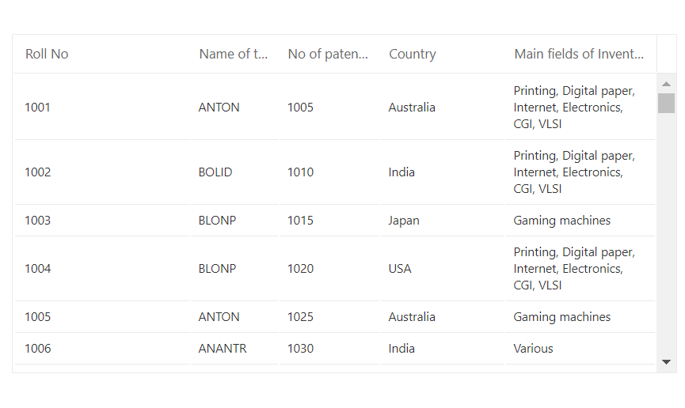

# Cell

## Displaying the HTML content

The HTML tags can be displayed in the DataGrid header and content by enabling the [`DisableHtmlEncode`](https://help.syncfusion.com/cr/blazor/Syncfusion.Blazor.Grids.GridColumn.html#Syncfusion_Blazor_Grids_GridColumn_DisableHtmlEncode) property.

```cshtml
@using Syncfusion.Blazor.Grids

<SfGrid DataSource="@Orders" Height="315">
    <GridColumns>
        <GridColumn Field=@nameof(Order.OrderID) HeaderText="<span> Order ID </span>" DisableHtmlEncode="false" TextAlign="TextAlign.Right" Width="140"></GridColumn>
        <GridColumn Field=@nameof(Order.CustomerID) HeaderText="<span> Customer ID </span>" DisableHtmlEncode="true" Width="120"></GridColumn>
        <GridColumn Field=@nameof(Order.OrderDate) HeaderText="Order Date" Format="d" Type="ColumnType.Date" Width="100"></GridColumn>
        <GridColumn Field=@nameof(Order.ShipCity) HeaderText="Ship City" Width="100"></GridColumn>
    </GridColumns>
</SfGrid>

@code{
    public List<Order> Orders { get; set; }

    protected override void OnInitialized()
    {
        Orders = Enumerable.Range(1, 75).Select(x => new Order()
        {
            OrderID = 1000 + x,
            CustomerID = (new string[] { "ALFKI", "<span>ANANTR</span>", "ANTON", "BLONP", "BOLID" })[new Random().Next(5)],
            ShipCity = (new string[] { "Seattle", "Tacoma", "Redmond", "Kirkland", "London" })[new Random().Next(5)],
            OrderDate = DateTime.Now.AddDays(-x),
        }).ToList();
    }

    public class Order
    {
        public int? OrderID { get; set; }
        public string CustomerID { get; set; }
        public DateTime? OrderDate { get; set; }
        public string ShipCity { get; set; }
    }
}
```

The following screenshot represents a DataGrid displaying the HTML content.


## Customize cell styles

The appearance of cells can be customized by using the [`QueryCellInfo`](https://help.syncfusion.com/cr/blazor/Syncfusion.Blazor.Grids.QueryCellInfoEventArgs-1.html) event.
The [`QueryCellInfo`](https://help.syncfusion.com/cr/blazor/Syncfusion.Blazor.Grids.QueryCellInfoEventArgs-1.html) event triggers for every cell. In that event handler, you can get
[`QueryCellInfoEventArgs`](https://help.syncfusion.com/cr/blazor/Syncfusion.Blazor.Grids.QueryCellInfoEventArgs-1.html) that contains the details of the cell.

```cshtml
@using Syncfusion.Blazor.Grids

<SfGrid DataSource="@Orders" AllowSelection="false" EnableHover="false" Height="315">
    <GridEvents QueryCellInfo="CustomizeCell" TValue="Order"></GridEvents>
    <GridColumns>
        <GridColumn Field=@nameof(Order.OrderID) HeaderText="Order ID" TextAlign="TextAlign.Right" Width="140"></GridColumn>
        <GridColumn Field=@nameof(Order.CustomerID) HeaderText="Customer ID" Width="120"></GridColumn>
        <GridColumn Field=@nameof(Order.OrderDate) HeaderText="Order Date" Format="d" Type="ColumnType.Date" Width="140"></GridColumn>
        <GridColumn Field=@nameof(Order.Freight) HeaderText="Freight" Format="C2" Width="100"></GridColumn>
        <GridColumn Field=@nameof(Order.ShipCity) HeaderText="Ship City" Width="100"></GridColumn>
    </GridColumns>
</SfGrid>

@code{
    public List<Order> Orders { get; set; }

    protected override void OnInitialized()
    {
        Orders = Enumerable.Range(1, 75).Select(x => new Order()
        {
            OrderID = 1000 + x,
            CustomerID = (new string[] { "ALFKI", "ANANTR", "ANTON", "BLONP", "BOLID" })[new Random().Next(5)],
            ShipCity = (new string[] { "Seattle", "Tacoma", "Redmond", "Kirkland", "London" })[new Random().Next(5)],
            OrderDate = DateTime.Now.AddDays(-x),
            Freight = 6.2 * x,
        }).ToList();
    }

    public class Order
    {
        public int? OrderID { get; set; }
        public string CustomerID { get; set; }
        public DateTime? OrderDate { get; set; }
        public double? Freight { get; set; }
        public string ShipCity { get; set; }
    }

    public void CustomizeCell(QueryCellInfoEventArgs<Order> args)
    {
        if (args.Column.Field == "Freight")
        {
            if (args.Data.Freight < 30)
            {
                args.Cell.AddClass(new string[] { "below-30" });
            }
            else if (args.Data.Freight < 80)
            {
                args.Cell.AddClass(new string[] { "below-80" });
            }
            else
            {
                args.Cell.AddClass(new string[] { "above-80" });
            }
        }
    }
}

<style>
    .below-30 {
        background-color: orangered;
    }

    .below-80 {
        background-color: yellow;
    }

    .above-80 {
        background-color: greenyellow
    }
</style>
```

The following screenshot represents a DataGrid with customize cell styles.


## Auto wrap

The auto wrap allows the cell content of the datagrid to wrap to the next line when it exceeds the boundary of the cell width. The Cell Content wrapping works based on the position of white space between words.
To enable auto wrap, set the [`AllowTextWrap`](https://help.syncfusion.com/cr/blazor/Syncfusion.Blazor.Grids.SfGrid-1.html#Syncfusion_Blazor_Grids_SfGrid_1_AllowTextWrap) property to `true`.
You can configure the auto wrap mode by setting the [`TextWrapSettings.WrapMode`](https://help.syncfusion.com/cr/blazor/Syncfusion.Blazor.Charts.ChartSeries.html#Syncfusion_Blazor_Charts_ChartSeries_Type) property.

There are three types of [`WrapMode`](https://help.syncfusion.com/cr/blazor/Syncfusion.Blazor.Grids.GridTextWrapSettings.html#Syncfusion_Blazor_Grids_GridTextWrapSettings_WrapMode). They are:

* **Both**: **Both** value is set by default. Auto wrap will be enabled for both the content and the header.
* **Header**: Auto wrap will be enabled only for the header.
* **Content**: Auto wrap will be enabled only for the content.

> When a column width is not specified, then auto wrap of columns will be adjusted with respect to the datagrid's width.

In the following example, the [`TextWrapSettings.WrapMode`](https://help.syncfusion.com/cr/blazor/Syncfusion.Blazor.Grids.GridTextWrapSettings.html#Syncfusion_Blazor_Grids_GridTextWrapSettings_WrapMode) is set to **Content**.

```cshtml
@using Syncfusion.Blazor.Grids

<SfGrid DataSource="@Orders" GridLines="GridLine.Default" AllowTextWrap="true" Height="315">
    <GridTextWrapSettings WrapMode="WrapMode.Content"></GridTextWrapSettings>
    <GridColumns>
        <GridColumn Field=@nameof(Order.RollNo) HeaderText="Roll No" Width="140"></GridColumn>
        <GridColumn Field=@nameof(Order.Name) HeaderText="Name of the inventor" Width="70"></GridColumn>
        <GridColumn Field=@nameof(Order.PatentFamilies) HeaderText="No of patentfamilies" Width="80"></GridColumn>
        <GridColumn Field=@nameof(Order.Country) HeaderText="Country" Width="100"></GridColumn>
        <GridColumn Field=@nameof(Order.MainFields) HeaderText="Main fields of Invention" Width="120"></GridColumn>
    </GridColumns>
</SfGrid>

@code{
    public List<Order> Orders { get; set; }

    protected override void OnInitialized()
    {
        Orders = Enumerable.Range(1, 75).Select(x => new Order()
        {
            RollNo = 1000 + x,
            Name = (new string[] { "ALFKI", "ANANTR", "ANTON", "BLONP", "BOLID" })[new Random().Next(5)],
            PatentFamilies = 1000 + x * 5,
            Country = (new string[] { "Australia", "Japan", "Canada", "India", "USA" })[new Random().Next(5)],
            MainFields = (new string[] { "Printing, Digital paper, Internet, Electronics,Lab-on-a-chip, MEMS, Mechanical, VLSI", "Various", "Printing, Digital paper, Internet, Electronics, CGI, VLSI", "Automotive, Stainless steel products", "Gaming machines" })[new Random().Next(5)],
        }).ToList();
    }

    public class Order
    {
        public int? RollNo { get; set; }
        public string Name { get; set; }
        public int? PatentFamilies { get; set; }
        public string Country { get; set; }
        public string MainFields { get; set; }
    }
}
```

The following screenshot represents a DataGrid with auto wrap.



## Custom Attributes

You can customize the datagrid cells by adding a CSS class to the [`CustomAttributes`](https://help.syncfusion.com/cr/blazor/Syncfusion.Blazor.Gantt.ColumnModel.html#Syncfusion_Blazor_Gantt_ColumnModel_CustomAttributes) property of the column.

In the below example, we have customized the cells of **OrderID** and **ShipCity** columns.

```cshtml
@using Syncfusion.Blazor.Grids

<SfGrid DataSource="@Orders" Height="315">
    <GridColumns>
        <GridColumn Field=@nameof(Order.OrderID) HeaderText="Order ID" CustomAttributes="@(new Dictionary<string, object>(){ { "class", "e-attr" }})" TextAlign="TextAlign.Right" Width="140"></GridColumn>
        <GridColumn Field=@nameof(Order.CustomerID) HeaderText="Customer ID" Width="120"></GridColumn>
        <GridColumn Field=@nameof(Order.ShipCity) HeaderText="Ship City" CustomAttributes="@(new Dictionary<string, object>(){ { "class", "e-attr" }})" Width="100"></GridColumn>
        <GridColumn Field=@nameof(Order.OrderDate) HeaderText="Order Date" Format="d" Type="ColumnType.Date" Width="100"></GridColumn>
    </GridColumns>
</SfGrid>

@code{
    public List<Order> Orders { get; set; }

    protected override void OnInitialized()
    {
        Orders = Enumerable.Range(1, 75).Select(x => new Order()
        {
            OrderID = 1000 + x,
            CustomerID = (new string[] { "ALFKI", "ANANTR", "ANTON", "BLONP", "BOLID" })[new Random().Next(5)],
            ShipCity = (new string[] { "Seattle", "Tacoma", "Redmond", "Kirkland", "London" })[new Random().Next(5)],
            OrderDate = DateTime.Now.AddDays(-x),
        }).ToList();
    }

    public class Order
    {
        public int? OrderID { get; set; }
        public string CustomerID { get; set; }
        public DateTime? OrderDate { get; set; }
        public string ShipCity { get; set; }
    }
}

<style>
    .e-attr {
        background: #d7f0f4;
    }
</style>
```

## DataGrid Lines

The [`GridLines`](https://help.syncfusion.com/cr/blazor/Syncfusion.Blazor.Grids.SfGrid-1.html#Syncfusion_Blazor_Grids_SfGrid_1_GridLines) have option to display cell border and it can be defined by the
[`GridLines`](https://help.syncfusion.com/cr/blazor/Syncfusion.Blazor.Grids.SfGrid-1.html#Syncfusion_Blazor_Grids_SfGrid_1_GridLines) property.

The available modes of datagrid lines are:

| Modes | Actions |
|-------|---------|
| Both | Displays both the horizontal and vertical datagrid lines.|
| None | No datagrid lines are displayed.|
| Horizontal | Displays the horizontal datagrid lines only.|
| Vertical | Displays the vertical datagrid lines only.|
| Default | Displays datagrid lines based on the theme.|

```cshtml
@using Syncfusion.Blazor.Grids

<SfGrid DataSource="@Orders" GridLines="GridLine.Both" Height="315">
    <GridColumns>
        <GridColumn Field=@nameof(Order.OrderID) HeaderText="Order ID" TextAlign="TextAlign.Right" Width="140"></GridColumn>
        <GridColumn Field=@nameof(Order.CustomerID) HeaderText="Customer ID" Width="120"></GridColumn>
        <GridColumn Field=@nameof(Order.ShipCity) HeaderText="Ship City" Width="100"></GridColumn>
        <GridColumn Field=@nameof(Order.OrderDate) HeaderText="Order Date" Format="d" Type="ColumnType.Date" Width="100"></GridColumn>
    </GridColumns>
</SfGrid>

@code{
    public List<Order> Orders { get; set; }

    protected override void OnInitialized()
    {
        Orders = Enumerable.Range(1, 75).Select(x => new Order()
        {
            OrderID = 1000 + x,
            CustomerID = (new string[] { "ALFKI", "ANANTR", "ANTON", "BLONP", "BOLID" })[new Random().Next(5)],
            ShipCity = (new string[] { "Seattle", "Tacoma", "Redmond", "Kirkland", "London" })[new Random().Next(5)],
            OrderDate = DateTime.Now.AddDays(-x),
        }).ToList();
    }

    public class Order
    {
        public int? OrderID { get; set; }
        public string CustomerID { get; set; }
        public string ShipCity { get; set; }
        public DateTime? OrderDate { get; set; }
    }
}
```

>By default, the datagrid renders with **Default** mode.

## Clip Mode

The clip mode provides options to display its overflow cell content and it can be defined by the [`Columns.ClipMode`](https://help.syncfusion.com/cr/blazor/Syncfusion.Blazor.Grids.GridColumn.html#Syncfusion_Blazor_Grids_GridColumn_ClipMode) property.

There are three types of [`ClipMode`](https://help.syncfusion.com/cr/blazor/Syncfusion.Blazor.Grids.GridColumn.html#Syncfusion_Blazor_Grids_GridColumn_ClipMode). They are:

* **Clip**: Truncates the cell content when it overflows its area.
* **Ellipsis**: Displays ellipsis when the cell content overflows its area.
* **EllipsisWithTooltip**: Displays ellipsis when the cell content overflows its area, also it will display the tooltip while hover on ellipsis is applied.

>By default, [`Columns.ClipMode`](https://help.syncfusion.com/cr/blazor/Syncfusion.Blazor.Grids.GridColumn.html#Syncfusion_Blazor_Grids_GridColumn_ClipMode) value is **Ellipsis**.

```cshtml
@using Syncfusion.Blazor.Grids

<SfGrid DataSource="@Orders" AllowPaging="true" Height="315">
    <GridColumns>
        <GridColumn Field=@nameof(Order.RollNo) HeaderText="Roll No" Width="140"></GridColumn>
        <GridColumn Field=@nameof(Order.Name) HeaderText="Name of the inventor" ClipMode="ClipMode.Clip" Width="70"></GridColumn>
        <GridColumn Field=@nameof(Order.PatentFamilies) HeaderText="No of patent families" ClipMode="ClipMode.Ellipsis" Width="80"></GridColumn>
        <GridColumn Field=@nameof(Order.Country) HeaderText="Country" Width="100"></GridColumn>
        <GridColumn Field=@nameof(Order.MainFields) HeaderText="Main fields of Invention" ClipMode="ClipMode.EllipsisWithTooltip" Width="120"></GridColumn>
    </GridColumns>
</SfGrid>

@code{
    public List<Order> Orders { get; set; }

    protected override void OnInitialized()
    {
        Orders = Enumerable.Range(1, 75).Select(x => new Order()
        {
            RollNo = 1000 + x,
            Name = (new string[] { "ALFKI", "ANANTR", "ANTON", "BLONP", "BOLID" })[new Random().Next(5)],
            PatentFamilies = 1000 + x * 5,
            Country = (new string[] { "Australia", "Japan", "Canada", "India", "USA" })[new Random().Next(5)],
            MainFields = (new string[] { "Printing, Digital paper, Internet, Electronics,Lab-on-a-chip, MEMS, Mechanical, VLSI", "Various", "Printing, Digital paper, Internet, Electronics, CGI, VLSI", "Automotive, Stainless steel products", "Gaming machines" })[new Random().Next(5)],
        }).ToList();
    }

    public class Order
    {
        public int? RollNo { get; set; }
        public string Name { get; set; }
        public int? PatentFamilies { get; set; }
        public string Country { get; set; }
        public string MainFields { get; set; }
    }
}
```

The following screenshot represents a clip mode in DataGrid


> You can refer to our [Blazor DataGrid](https://www.syncfusion.com/blazor-components/blazor-datagrid) feature tour page for its groundbreaking feature representations. You can also explore our [Blazor DataGrid example](https://blazor.syncfusion.com/demos/datagrid/overview?theme=bootstrap4) to understand how to present and manipulate data.