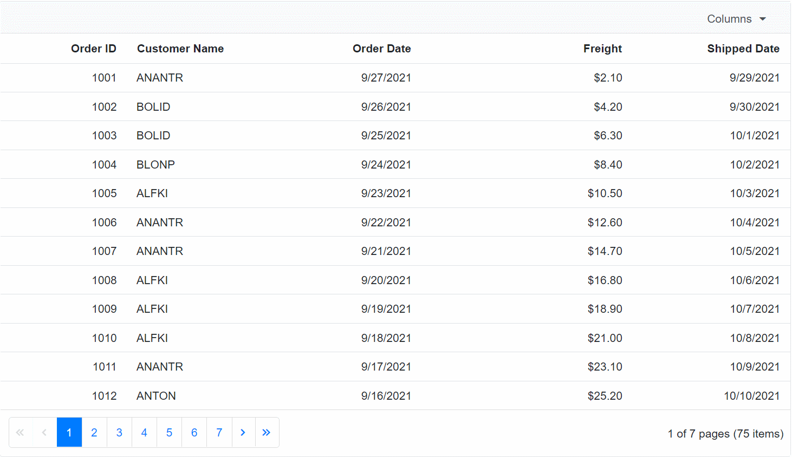

# Column Chooser Template

Using the column chooser template, you can customize the column chooser dialog using <code>Template</code> and <code>FooterTemplate</code> of the [GridColumnChooserSettings](https://help.syncfusion.com/cr/blazor/Syncfusion.Blazor.Grids.GridColumnChooserSettings.html) directive. You can access the parameters passed to the templates using implicit parameter named context.

## Customize the content of column chooser

 The Template tag in the  [GridColumnChooserSettings](https://help.syncfusion.com/cr/blazor/Syncfusion.Blazor.Grids.GridColumnChooserSettings.html) directive is used to customize the content in the column chooser dialog. You can type cast the context as <code>ColumnChooserTemplateContext</code> to get Columns inside content Template.

 ```csharp
<SfGrid ID="Grid" @ref="Grid" AllowReordering="true" AllowPaging="true" DataSource="@Orders" ShowColumnChooser="true" Toolbar="@ToolbarItems">
    <GridColumnChooserSettings>
        <Template>
            @{
                var ct = context as ColumnChooserTemplateContext;
                <CCComp ActionCompleted="AfterCompletion" @key="ct.Columns.Count" ColumnContext="ct"></CCComp>
            }
        </Template>
    </GridColumnChooserSettings>
    <GridColumns>
        <GridColumn Field=@nameof(Order.OrderID) HeaderText="OrderID" TextAlign="TextAlign.Right" Width="120"> </GridColumn>
        <GridColumn Field=@nameof(Order.CustomerID) HeaderText="CustomerID" Width="150"> </GridColumn>
        <GridColumn Field=@nameof(Order.OrderDate) HeaderText="OrderDate" Visible="false" Format="d" Type="ColumnType.Date" TextAlign="TextAlign.Right" Width="130"></GridColumn>
        <GridColumn Field=@nameof(Order.Freight) Visible="false" HeaderText="Freight" Format="C2" TextAlign="TextAlign.Right" Width="120"></GridColumn>
        <GridColumn Field=@nameof(Order.EmployeeID) Visible="false" HeaderText="EmployeeID" TextAlign="TextAlign.Right" Width="120"> </GridColumn>
        <GridColumn Field=@nameof(Order.FirstName) Visible="false" HeaderText="FirstName" Width="150"> </GridColumn>
        <GridColumn Field=@nameof(Order.LastName) HeaderText="LastName" Visible="false" Format="d" Type="ColumnType.Date" TextAlign="TextAlign.Right" Width="130"> </GridColumn>
        <GridColumn Field=@nameof(Order.Title) HeaderText="Title" Visible="false" TextAlign="TextAlign.Right" Width="120"> </GridColumn>
        <GridColumn Field=@nameof(Order.HireDate) HeaderText="HireDate" TextAlign="TextAlign.Right" Width="120"></GridColumn>
    </GridColumns>
</SfGrid>
   
<style>
    #Grid.e-grid .e-ccdlg .e-cc-searchdiv {            
        display: none;
    }
    #Grid.e-grid .e-ccdlg .e-dlg-content{
        margin-top: 0px;
    }
    #Grid_ccdlg div.e-footer-content {
        display: none;
    }

    .e-list-item.e-level-1.e-checklist.e-focused{
        background-color: none;
    }
    #Grid_ccdlg .e-content {
        overflow-y: unset;
    }

    .e-plus-icon::before {
        content: '\e759';
    }
</style>

@code
{
    public SfGrid<Order> Grid { get; set; }
    public string[] ToolbarItems = new string[] { "ColumnChooser" };
    public List<Order> Orders { get; set; }
    public double currentColIndex;

    public async void AfterCompletion(string col)
    {
        await this.Grid.ReorderColumnByTargetIndex(col, currentColIndex);
    }

    protected override void OnInitialized()
    {
        Orders = Enumerable.Range(1, 500).Select(x => new Order()
        {
            OrderID = 1000 + x,
            CustomerID = (new string[] { "ALFKI", "ANANTR", "ANTON", "BLONP", "BOLID" })[new Random().Next(5)],
            Freight = 2.1 * x,
            OrderDate = DateTime.Now.AddDays(-x),
            EmployeeID = x,
            FirstName = (new string[] { "Nancy", "Andrew", "Janet", "Margaret", "Steven" })[new Random().Next(5)],
            LastName = (new string[] { "Davolio", "Fuller", "Leverling", "Peacock", "Buchanan" })[new Random().Next(5)],
            Title = (new string[] { "Sales Representative", "Vice President, Sales", "Sales Manager","Inside Sales Coordinator" })[new Random().Next(4)],
            HireDate = DateTime.Now.AddDays(-x),
        }).ToList();
    }
}

```

Rendering the SfTextBox and SfListView in the column chooser dialog using the external component.

```csharp
<SfTextBox Placeholder="Search" ShowClearButton="true" Input="@OnInput"></SfTextBox>
<SfListView @ref="ListView" Height="100%" ShowCheckBox="true" DataSource="@DataSourceCopy">
    <ListViewFieldSettings TValue="DataModel" Id="Id" Text="Text" ></ListViewFieldSettings>
    <ListViewEvents Clicked="OnClicked" Created="@(()=>OnCreated(ColumnContext.Columns))" TValue="DataModel"></ListViewEvents>
</SfListView>

@code{
    public List<DataModel> DataSourceCopy { get; set; } = new List<DataModel>();

    [CascadingParameter]
    public SfGrid<Order> Grid { get; set; }

    [Parameter]
    public Action<string> ActionCompleted { get; set; }

    [Parameter]
    public ColumnChooserTemplateContext ColumnContext { get; set; }

    public SfListView<DataModel> ListView { get; set; }

    async Task OnInput(InputEventArgs eventArgs)
    {
        DataSourceCopy = DataSource.FindAll(e => e.Text.ToLower().StartsWith(eventArgs.Value.ToLower()));
        await Task.Delay(100);
        await Preselect();
    }

    protected override async Task OnInitializedAsync()
    {
        DataSourceCopy = DataSource;
        await Task.Delay(100);
        await Preselect();
    }

    static List<DataModel> DataSource = new List<DataModel>
    {
        new DataModel() { Text = nameof(Order.OrderID), Id = nameof(Order.OrderID) },
        new DataModel() { Text = nameof(Order.CustomerID), Id =nameof(Order.CustomerID)},
        new DataModel() { Text = nameof(Order.EmployeeID), Id = nameof(Order.EmployeeID) },
        new DataModel() { Text = nameof(Order.FirstName), Id = nameof(Order.FirstName)},
        new DataModel() { Text = nameof(Order.OrderDate), Id = nameof(Order.OrderDate) },
        new DataModel() { Text = nameof(Order.LastName), Id = nameof(Order.LastName) },
        new DataModel() { Text = nameof(Order.HireDate), Id = nameof(Order.HireDate)},
        new DataModel() { Text = nameof(Order.Title), Id = nameof(Order.Title)},
        new DataModel() { Text = nameof(Order.Freight), Id = nameof(Order.Freight)},
    };

    public async Task Preselect()
    {
        var cols = ColumnContext.Columns.FindAll(x => x.Visible == true).ToList();
        var selectlist = new List<DataModel>();
        foreach (var column in cols)
        {
            selectlist.Add(DataSource.Where(x => x.Text == column.Field).FirstOrDefault());
        }
        if (selectlist.Count > 0)
        {
            if (ListView != null)
            {
                await ListView?.CheckItemsAsync(selectlist.AsEnumerable());
            }
        }
    }

    public async Task OnCreated(List<GridColumn> args)
    {
        await Preselect();
    }

    public async Task OnClicked(ClickEventArgs<DataModel> args)
    {
        if (args.IsChecked)
        {
            await Grid.HideColumnAsync(args.Text);
        }
        else
        {
            await Grid.ShowColumnAsync(args.Text);
        }
        await Task.Delay(500);
        ActionCompleted.Invoke(args.Text);
    }
}
```


## Customize the footer of column chooser

 The <code>FooterTemplate</code> tag in the  [GridColumnChooserSettings](https://help.syncfusion.com/cr/blazor/Syncfusion.Blazor.Grids.GridColumnChooserSettings.html) directive is used to customize the footer in the column chooser dialog. You can type cast the context as <code>ColumnChooserFooterTemplateContext</code> to get columns inside FooterTemplate.

```csharp
@using Syncfusion.Blazor.Grids
@using Syncfusion.Blazor.Buttons

<SfGrid @ref="grid" TValue="OrdersDetails" DataSource="@GridData" ShowColumnChooser="true" Toolbar="@( new List<string>() { "ColumnChooser"})" AllowPaging="true">
    <GridColumnChooserSettings>
        <FooterTemplate>
            @{
                var cxt = context as ColumnChooserFooterTemplateContext;
                var visibles = cxt.Columns.Where(x => x.Visible).Select(x => x.HeaderText).ToArray();
                var hiddens = cxt.Columns.Where(x => !x.Visible).Select(x => x.HeaderText).ToArray();
            }
            <SfButton IsPrimary="true" OnClick="@(async () => {
            await grid.ShowColumnsAsync(visibles);
            await grid.HideColumnsAsync(hiddens); })">Enter</SfButton>
            <SfButton @onclick="@(async () => await cxt.CancelAsync())">Abort</SfButton>
        </FooterTemplate>
    </GridColumnChooserSettings>
    <GridColumns>
        <GridColumn Field=@nameof(OrdersDetails.OrderID) HeaderText="Order ID" TextAlign="TextAlign.Right" IsPrimaryKey="true" Width="120"></GridColumn>
        <GridColumn Field=@nameof(OrdersDetails.CustomerID) HeaderText="Customer Name" Width="150"></GridColumn>
        <GridColumn Field=@nameof(OrdersDetails.OrderDate) HeaderText="Order Date" Format="d" Type="ColumnType.Date" TextAlign="TextAlign.Right" Width="130"></GridColumn>
        <GridColumn Field=@nameof(OrdersDetails.Freight) HeaderText="Freight" Format="C2" TextAlign="TextAlign.Right" Width="200"></GridColumn>
        <GridColumn Field=@nameof(OrdersDetails.ShippedDate) HeaderText="Shipped Date" Format="d" Type="ColumnType.Date" TextAlign="TextAlign.Right" Width="150"></GridColumn>
        <GridColumn Field=@nameof(OrdersDetails.ShipCountry) HeaderText="Ship Country" Visible="false" Width="150"></GridColumn>
        <GridColumn Field=@nameof(OrdersDetails.ShipCity) HeaderText="Ship City" Visible="false" Width="150"></GridColumn>
    </GridColumns>
</SfGrid>

@code{
    public List<OrdersDetails> GridData { get; set; }
    SfGrid<OrdersDetails> grid { get; set; }

    protected override void OnInitialized()
    {
        GridData = Enumerable.Range(1, 75).Select(x => new OrdersDetails()
        {
            OrderID = 1000 + x,
            CustomerID = (new string[] { "ALFKI", "ANANTR", "ANTON", "BLONP", "BOLID" })[new Random().Next(5)],
            Freight = 2.1 * x,
            OrderDate = DateTime.Now.AddDays(-x),
            ShippedDate = DateTime.Now.AddDays(+x),
            ShipCountry = (new string[] { "Denmark", "Brazil", "Germany", "Austria" })[new Random().Next(4)],
            ShipCity = (new string[] { "Berlin", "Madrid", "Marseille" })[new Random().Next(3)]
        }).ToList();
    }

    public class OrdersDetails
    {
        public int? OrderID { get; set; }
        public string CustomerID { get; set; }
        public DateTime? OrderDate { get; set; }
        public double? Freight { get; set; }
        public DateTime? ShippedDate { get; set; }
        public string ShipCountry { get; set; }
        public string ShipCity { get; set; }
    }
}
```



## How to group the column chooser items

The <code>GridColumnChooserItemGroup</code> component helps to segregate the column chooser items as group. You can define column's group name by using the <code>Title</code> property of GridColumnChooserItemGroup directive.

The following code example demonstrates the default column chooser items as group.

```csharp
@using Syncfusion.Blazor.Grids
@using Syncfusion.Blazor.Buttons

<SfGrid @ref="grid" TValue="OrdersDetails" DataSource="@GridData" ShowColumnChooser="true" Toolbar="@( new List<string>() { "ColumnChooser"})" AllowPaging="true">
    <GridColumnChooserSettings>
        <Template>
            @{
                var cxt = context as ColumnChooserTemplateContext;
            }
            @if (ShouldRenderGroup("Order Details", cxt.Columns))
            {
                <GridColumnChooserItemGroup Title="Order Details">
                    @foreach (var column in GetGroupColumns("Order Details", cxt.Columns))
                    {
                        <GridColumnChooserItem Column="column"></GridColumnChooserItem>
                    }
                </GridColumnChooserItemGroup>
            }
            @if (ShouldRenderGroup("Ship Details", cxt.Columns))
            {
                <GridColumnChooserItemGroup Title="Ship Details">
                    @foreach (var column in GetGroupColumns("Ship Details", cxt.Columns))
                    {
                        <GridColumnChooserItem Column="column"></GridColumnChooserItem>
                    }
                </GridColumnChooserItemGroup>
            }
            @if (ShouldRenderGroup("Date Details", cxt.Columns))
            {
                <GridColumnChooserItemGroup Title="Date Details">
                    @foreach (var column in GetGroupColumns("Date Details", cxt.Columns))
                    {
                        <GridColumnChooserItem Column="column"></GridColumnChooserItem>
                    }
                </GridColumnChooserItemGroup>
            }
        </Template>
        <FooterTemplate>
            @{
                var cxt = context as ColumnChooserFooterTemplateContext;
                var visibles = cxt.Columns.Where(x => x.Visible).Select(x => x.HeaderText).ToArray();
                var hiddens = cxt.Columns.Where(x => !x.Visible).Select(x => x.HeaderText).ToArray();
            }
            <SfButton IsPrimary="true" OnClick="@(async () => {
            await grid.ShowColumnsAsync(visibles);
            await grid.HideColumnsAsync(hiddens); })">Enter
            </SfButton>
            <SfButton @onclick="@(async () => await cxt.CancelAsync())">Abort</SfButton>
        </FooterTemplate>
    </GridColumnChooserSettings>
    <GridColumns>
        <GridColumn Field=@nameof(OrdersDetails.OrderID) HeaderText="Order ID" TextAlign="TextAlign.Right" IsPrimaryKey="true" Width="120"></GridColumn>
        <GridColumn Field=@nameof(OrdersDetails.CustomerID) HeaderText="Customer Name" Width="150"></GridColumn>
        <GridColumn Field=@nameof(OrdersDetails.OrderDate) HeaderText="Order Date" Format="d" Type="ColumnType.Date" TextAlign="TextAlign.Right" Width="130"></GridColumn>
        <GridColumn Field=@nameof(OrdersDetails.Freight) HeaderText="Freight" Format="C2" TextAlign="TextAlign.Right" Width="200"></GridColumn>
        <GridColumn Field=@nameof(OrdersDetails.ShippedDate) HeaderText="Shipped Date" Format="d" Type="ColumnType.Date" TextAlign="TextAlign.Right" Width="150"></GridColumn>
        <GridColumn Field=@nameof(OrdersDetails.ShipCountry) HeaderText="Ship Country" Visible="false" Width="150"></GridColumn>
        <GridColumn Field=@nameof(OrdersDetails.ShipCity) HeaderText="Ship City" Visible="false" Width="150"></GridColumn>
    </GridColumns>
</SfGrid>

@code
{
    public List<OrdersDetails> GridData { get; set; }
    SfGrid<OrdersDetails> grid { get; set; }
    IDictionary<string, string[]> groups = new Dictionary<string, string[]>()
    {
        { "Order Details", new string[] { "OrderID", "CustomerID", "Freight" } }, { "Ship Details", new string[]{ "ShipCountry", "ShipCity" } }, {"Date Details", new string[]{"OrderDate", "ShippedDate"}}
    };
    private GridColumn GetColumn(string field, List<GridColumn> columns)
    {
        GridColumn column = null;
        if (columns.Any(x => { column = x; return x.Field == field; }))
        {
            return column;
        }
        return null;
    }
    private bool ShouldRenderGroup(string title, List<GridColumn> columns)
    {
        return groups[title].Any(x => columns.Any(y => y.Field == x));
    }
    private List<GridColumn> GetGroupColumns(string title, List<GridColumn> columns)
    {
        return columns.Where(x => groups[title].Contains(x.Field)).ToList();
    }

    protected override void OnInitialized()
    {
        GridData = Enumerable.Range(1, 75).Select(x => new OrdersDetails()
        {
            OrderID = 1000 + x,
            CustomerID = (new string[] { "ALFKI", "ANANTR", "ANTON", "BLONP", "BOLID" })[new Random().Next(5)],
            Freight = 2.1 * x,
            OrderDate = DateTime.Now.AddDays(-x),
            ShippedDate = DateTime.Now.AddDays(+x),
            ShipCountry = (new string[] { "Denmark", "Brazil", "Germany", "Austria" })[new Random().Next(4)],
            ShipCity = (new string[] { "Berlin", "Madrid", "Marseille" })[new Random().Next(3)]
        }).ToList();
    }

    public class OrdersDetails
    {
        public int? OrderID { get; set; }
        public string CustomerID { get; set; }
        public DateTime? OrderDate { get; set; }
        public double? Freight { get; set; }
        public DateTime? ShippedDate { get; set; }
        public string ShipCountry { get; set; }
        public string ShipCity { get; set; }
    }
}

```

