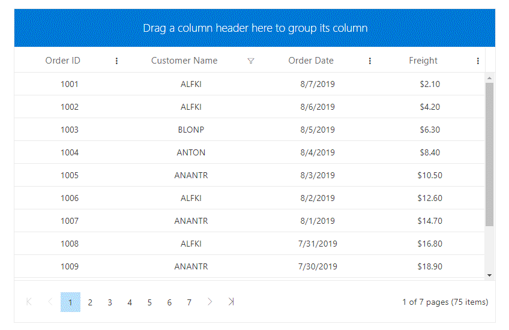

# Column Menu in Blazor DataGrid

The column menu has options to integrate features like sorting, grouping, filtering, column chooser, and autofit in it. When the user clicks on multiple icon of the column this menu gets displayed. To enable column menu, you need to define the [ShowColumnMenu](https://help.syncfusion.com/cr/blazor/Syncfusion.Blazor.Grids.GridColumn.html#Syncfusion_Blazor_Grids_GridColumn_ShowColumnMenu) property as true.

The default menu items are displayed in the following table,

| Item | Description |
|-----|-----|
| **SortAscending** | Sort the current column in ascending order. |
| **SortDescending** | Sort the current column in descending order. |
| **Group** | Group the current column. |
| **Ungroup** | Ungroup the current column. |
| **AutoFit** | Auto fit the current column. |
| **AutoFitAll** | Auto fit all columns. |
| **ColumnChooser** | Choose the column visibility. |
| **Filter** | Show the filter option as given in filterSettings [Type](https://help.syncfusion.com/cr/blazor/Syncfusion.Blazor.Grids.GridFilterSettings.html#Syncfusion_Blazor_Grids_GridFilterSettings_Type) property |

```cshtml
@using Syncfusion.Blazor.Grids

<SfGrid DataSource="@Orders" Height="315" AllowGrouping="true" ColumnMenuItems=@MenuItems AllowFiltering="true" ShowColumnMenu="true" AllowPaging="true">
    <GridFilterSettings Type="FilterType.CheckBox"></GridFilterSettings>
    <GridGroupSettings ShowGroupedColumn="true"></GridGroupSettings>
    <GridColumns>
        <GridColumn Field=@nameof(Order.OrderID) HeaderText="Order ID" TextAlign="TextAlign.Center" Width="120"></GridColumn>
        <GridColumn Field=@nameof(Order.CustomerID) HeaderText="Customer Name" Width="150" TextAlign="TextAlign.Center" ShowColumnMenu="false"></GridColumn>
        <GridColumn Field=@nameof(Order.OrderDate) HeaderText="Order Date" Format="d" Type="ColumnType.Date" TextAlign="TextAlign.Center" Width="130"></GridColumn>
        <GridColumn Field=@nameof(Order.Freight) HeaderText="Freight" Format="C2" TextAlign="TextAlign.Center" Width="120"></GridColumn>
    </GridColumns>
</SfGrid>

@code{
    public string[] MenuItems = new string[] { "Group", "Ungroup", "ColumnChooser", "Filter" };

    public List<Order> Orders { get; set; }

    protected override void OnInitialized()
    {
        Orders = Enumerable.Range(1, 75).Select(x => new Order()
        {
            OrderID = 1000 + x,
            CustomerID = (new string[] { "ALFKI", "ANANTR", "ANTON", "BLONP", "BOLID" })[new Random().Next(5)],
            Freight = 2.1 * x,
            OrderDate = DateTime.Now.AddDays(-x),
        }).ToList();
    }

    public class Order
    {
        public int? OrderID { get; set; }
        public string CustomerID { get; set; }
        public DateTime? OrderDate { get; set; }
        public double? Freight { get; set; }
    }
}
```

> * You can disable column menu for a particular column by defining the column's [ShowColumnMenu](https://help.syncfusion.com/cr/blazor/Syncfusion.Blazor.Grids.GridColumn.html#Syncfusion_Blazor_Grids_GridColumn_ShowColumnMenu) property as false.
> * You can customize the default menu items by defining the [ColumnMenuItems](https://help.syncfusion.com/cr/blazor/Syncfusion.Blazor.Charts.ChartSeries.html#Syncfusion_Blazor_Charts_ChartSeries_Type) with the required items.

The following image represents DataGrid with column menu property enabled,


<!-- Column menu events

The grid component triggers the below events when column menu operations are performed,

1. [`ColumnMenuOpen`]   -  Triggers before the column menu opens
2. [`ColumnMenuItemClicked`]  -  Triggers when a column menu is clicked

```cshtml
@using Syncfusion.Blazor.Grids

<SfGrid DataSource="@Orders" ShowColumnMenu="true" AllowGrouping="true" AllowFiltering="true" AllowPaging="true" Height ="315">
<GridEvents ColumnMenuOpen="OnMenuOpen" ColumnMenuItemClicked="OnMenuClick" TValue="Order"></GridEvents>
    <GridColumns>
        <GridColumn Field=@nameof(Order.OrderID) HeaderText="Order ID" IsPrimaryKey="true" TextAlign="TextAlign.Right" Width="120"></GridColumn>
        <GridColumn Field=@nameof(Order.CustomerName) HeaderText="Customer Name" Width="120"></GridColumn>
        <GridColumn Field=@nameof(Order.Freight) HeaderText="Freight" Format="C2" TextAlign="TextAlign.Right" MinWidth="10" Width="120" MaxWidth="200"></GridColumn>
        <GridColumn Field=@nameof(Order.OrderDate) HeaderText="Order Date" Format="d" TextAlign="TextAlign.Right" Width="130" Type="ColumnType.Date"></GridColumn>
    </GridColumns>
</SfGrid>

@code{

    public List<Order> Orders { get; set; }

    protected override void OnInitialized()
    {
        Orders = Enumerable.Range(1, 75).Select(x => new Order()
        {
            OrderID = 1000 + x,
            CustomerName = (new string[] { "ALFKI", "ANANTR", "ANTON", "BLONP", "BOLID" })[new Random().Next(5)],
            Freight = 2.1 * x,
            OrderDate = DateTime.Now.AddDays(-x),
        }).ToList();
    }

    public void OnMenuOpen() {
        // Perform required operations here
    }

    public void OnMenuClick() {
        // Perform required operations here
    }

    public class Order {
        public int? OrderID { get; set; }
        public string CustomerName { get; set; }
        public DateTime? OrderDate { get; set; }
        public double? Freight { get; set; }
    }
}
``` -->

<!-- Custom column menu item

Custom column menu items can be added by defining the [`ColumnMenuItems`](https://help.syncfusion.com/cr/blazor/Syncfusion.Blazor.Charts.ChartSeries.html#Syncfusion_Blazor_Charts_ChartSeries_Type) as a collection of the [`ColumnMenuItemModel`](https://help.syncfusion.com/cr/aspnetcore-blazor/Syncfusion.Blazor.Grids.ColumnMenuItemModel.html).

Actions for the customized items can be defined in the [`ColumnMenuItemClicked`] event.

```cshtml
@using Syncfusion.Blazor.Grids
@using Syncfusion.Blazor.Navigations

<SfGrid @ref="Grid" DataSource="@Orders" Height="315" ColumnMenuItems=@MenuItems AllowSorting="true" ShowColumnMenu="true" AllowPaging="true">
    <GridEvents ColumnMenuItemClicked="OnMenuClick" TValue="Order"></GridEvents>
    <GridSortSettings Columns=@SortSettings></GridSortSettings>
    <GridColumns>
        <GridColumn Field=@nameof(Order.OrderID) HeaderText="Order ID" TextAlign="TextAlign.Center" Width="120"></GridColumn>
        <GridColumn Field=@nameof(Order.CustomerID) HeaderText="Customer Name" Width="150" TextAlign="TextAlign.Center" ShowColumnMenu="false"></GridColumn>
        <GridColumn Field=@nameof(Order.OrderDate) HeaderText="Order Date" Format="d" Type="ColumnType.Date" TextAlign="TextAlign.Center" Width="130"></GridColumn>
        <GridColumn Field=@nameof(Order.Freight) HeaderText="Freight" Format="C2" TextAlign="TextAlign.Center" Width="120"></GridColumn>
    </GridColumns>
</SfGrid>

@code{

    private SfGrid<Order> Grid;

    public List<ColumnMenuItemModel> MenuItems = new List<ColumnMenuItemModel>()
    {
        new ColumnMenuItemModel() { Text = "Clear Sorting", Id = "gridclearsorting" }
    };

    public List<SortDescriptorModel> SortSettings = new List<SortDescriptorModel>()
    {
        new SortDescriptorModel() { Direction = SortDirection.Ascending, Field = "OrderID" }
    };

    public class SortSetting
    {
        public string Direction { get; set; }
        public string Field { get; set; }
    }

    public List<Order> Orders { get; set; }

    protected override void OnInitialized()
    {
        Orders = Enumerable.Range(1, 75).Select(x => new Order()
        {
            OrderID = 1000 + x,
            CustomerID = (new string[] { "ALFKI", "ANANTR", "ANTON", "BLONP", "BOLID" })[new Random().Next(5)],
            Freight = 2.1 * x,
            OrderDate = DateTime.Now.AddDays(-x),
        }).ToList();
    }

    public class Order
    {
        public int? OrderID { get; set; }
        public string CustomerID { get; set; }
        public DateTime? OrderDate { get; set; }
        public double? Freight { get; set; }
    }

    public void OnMenuClick(MenuEventArgs args)
    {
        if (args.Item.Id == "gridclearsorting") {
            this.Grid.ClearSorting();
        }
    }

}
``` 

The following GIF shows the sorting cleared on clicking the custom column menu item in Grid
-->

<!-- Customize menu items for particular columns

Sometimes, you have a scenario where you need to hide an item from column menu for particular columns alone. For this case, you need to set the [`Hide`] property of the [`ColumnMenuOpenEventArgs`](https://help.syncfusion.com/cr/blazor/Syncfusion.Blazor.Grids.ColumnMenuOpenEventArgs.html#Syncfusion_Blazor_Grids_ColumnMenuOpenEventArgs__ctor) as true in the [`ColumnMenuOpen`] event.

In the following sample code, Filter item is hidden in column menu for the OrderID column.

```cshtml
@using Syncfusion.Blazor.Grids

<SfGrid DataSource="@Orders" Height="315" AllowSorting="true" AllowFiltering="true" AllowGrouping="true"  ShowColumnMenu="true" AllowPaging="true">
    <GridEvents ColumnMenuOpen="OnMenuOpen" TValue="Order"></GridEvents>
    <GridFilterSettings Type=FilterType.Menu></GridFilterSettings>
    <GridColumns>
        <GridColumn Field=@nameof(Order.OrderID) HeaderText="Order ID" TextAlign="TextAlign.Center" Width="120"></GridColumn>
        <GridColumn Field=@nameof(Order.CustomerID) HeaderText="Customer Name" Width="150" TextAlign="TextAlign.Center" ShowColumnMenu="false"></GridColumn>
        <GridColumn Field=@nameof(Order.OrderDate) HeaderText="Order Date" Format="d" Type="ColumnType.Date" TextAlign="TextAlign.Center" Width="130"></GridColumn>
        <GridColumn Field=@nameof(Order.Freight) HeaderText="Freight" Format="C2" TextAlign="TextAlign.Center" Width="120"></GridColumn>
    </GridColumns>
</SfGrid>

@code{
    public List<Order> Orders { get; set; }

    protected override void OnInitialized()
    {
        Orders = Enumerable.Range(1, 75).Select(x => new Order()
        {
            OrderID = 1000 + x,
            CustomerID = (new string[] { "ALFKI", "ANANTR", "ANTON", "BLONP", "BOLID" })[new Random().Next(5)],
            Freight = 2.1 * x,
            OrderDate = DateTime.Now.AddDays(-x),
        }).ToList();
    }

    public class Order
    {
        public int? OrderID { get; set; }
        public string CustomerID { get; set; }
        public DateTime? OrderDate { get; set; }
        public double? Freight { get; set; }
    }

    public void OnMenuOpen(MenuEventArgs args)
    {
        foreach (ColumnMenuItemModel Item in args.Items) {
            if (Item.Text == "Filter" && args.Column.Field == "OrderID") {
                Item.Hide = true;
            } else {
                Item.Hide = false;
            }
        }
    }
}
``` 

The following GIF shows the customized column menu item for particular column in Grid -->

<!-- Column spanning

The grid has option to span the adjacent cells. To achieve this, define the [`ColSpan`](https://help.syncfusion.com/cr/blazor/Syncfusion.Blazor.Grids.QueryCellInfoEventArgs-1.html#Syncfusion_Blazor_Grids_QueryCellInfoEventArgs_1_ColSpan) attribute in the [`QueryCellInfo`](https://help.syncfusion.com/cr/blazor/Syncfusion.Blazor.Grids.GridEvents-1.html#Syncfusion_Blazor_Grids_GridEvents_1_QueryCellInfo) event.

In the following demo, the cells have been spanned based on the employees schedule

```cshtml
@using Syncfusion.Blazor.Grids

<SfGrid DataSource="@MergeData" GridLines=GridLine.Both AllowTextWrap="true">
        <GridEvents TValue="@Merge" QueryCellInfo="QueryCellEvent"></GridEvents>
    <GridColumns>
        <GridColumn Field=@nameof(Merge.EmployeeID) TextAlign="TextAlign.Right" HeaderText="Employee ID" Width="120"></GridColumn>
        <GridColumn Field=@nameof(Merge.EmployeeName) HeaderText="Employee Name" Width="200"></GridColumn>
        <GridColumn Field=@nameof(Merge.Time900) HeaderText="9.00 AM" Width="100"></GridColumn>
        <GridColumn Field=@nameof(Merge.Time930) HeaderText="9.30 AM" Width="100"></GridColumn>
        <GridColumn Field=@nameof(Merge.Time1000) HeaderText="10.00 AM" Width="100"></GridColumn>
        <GridColumn Field=@nameof(Merge.Time1030) HeaderText="10.30 AM" Width="100"></GridColumn>
        <GridColumn Field=@nameof(Merge.Time1100) HeaderText="11.00 AM" Width="100"></GridColumn>
        <GridColumn Field=@nameof(Merge.Time1130) HeaderText="11.30 AM" Width="100"></GridColumn>
        <GridColumn Field=@nameof(Merge.Time1200) HeaderText="12.00 PM" Width="100"></GridColumn>
        <GridColumn Field=@nameof(Merge.Time1230) HeaderText="12.30 PM" Width="100"></GridColumn>
        <GridColumn Field=@nameof(Merge.Time100) HeaderText="1.00 PM" Width="100"></GridColumn>
        <GridColumn Field=@nameof(Merge.Time130) HeaderText="1.30 PM" Width="100"></GridColumn>
        <GridColumn Field=@nameof(Merge.Time200) HeaderText="2.00 PM" Width="100"></GridColumn>
        <GridColumn Field=@nameof(Merge.Time230) HeaderText="2.30 PM" Width="100"></GridColumn>
        <GridColumn Field=@nameof(Merge.Time300) HeaderText="3.00 PM" Width="100"></GridColumn>
        <GridColumn Field=@nameof(Merge.Time330) HeaderText="3.30 PM" Width="100"></GridColumn>
        <GridColumn Field=@nameof(Merge.Time400) HeaderText="4.00 PM" Width="100"></GridColumn>
        <GridColumn Field=@nameof(Merge.Time430) HeaderText="4.30 PM" Width="100"></GridColumn>
        <GridColumn Field=@nameof(Merge.Time500) HeaderText="5.00 PM" Width="100"></GridColumn>
    </GridColumns>
</SfGrid>

@code{
    List<Merge> MergeData = new List<Merge>
    {
        new Merge() { Time900 = "Analysis Tasks", Time930 = "Analysis Tasks", Time1000 = "Team Meeting", Time1030 = "Testing", Time1100 = "Development", Time1130 = "Development", Time1200 = "Development", Time1230 = "Support", Time100 = "Lunch Break", Time130 = "Lunch Break", Time200 = "Lunch Break", Time230 = "Testing", Time300 = "Testing", Time330 = "Development", Time400 = "Conference", Time430 = "Team Meeting", Time500 = "Team Meeting", EmployeeID = 10001, EmployeeName = "Davolio" },
        new Merge() { Time900 = "Task Assign", Time930 = "Support", Time1000 = "Support", Time1030 = "Support", Time1100 = "Testing", Time1130 = "Testing", Time1200 = "Testing", Time1230 = "Testing", Time100 = "Lunch Break", Time130 = "Lunch Break", Time200 = "Lunch Break", Time230 = "Development", Time300 = "Development", Time330 = "Check Mail", Time400 = "Check Mail", Time430 = "Team Meeting", Time500 = "Team Meeting", EmployeeID = 10002, EmployeeName = "Buchanan" },
        new Merge() { Time900 = "Check Mail", Time930 = "Check Mail", Time1000 = "Check Mail", Time1030 = "Analysis Tasks", Time1100 = "Analysis Tasks", Time1130 = "Support", Time1200 = "Support", Time1230 = "Support", Time100 = "Lunch Break", Time130 = "Lunch Break", Time200 = "Lunch Break", Time230 = "Development", Time300 = "Development", Time330 = "Team Meeting", Time400 = "Team Meeting", Time430 = "Development", Time500 = "Development", EmployeeID = 10003, EmployeeName = "Fuller" },
        new Merge() { Time900 = "Testing", Time930 = "Check Mail", Time1000 = "Check Mail", Time1030 = "Support", Time1100 = "Testing", Time1130 = "Testing", Time1200 = "Testing", Time1230 = "Testing", Time100 = "Lunch Break", Time130 = "Lunch Break", Time200 = "Lunch Break", Time230 = "Development", Time300 = "Development", Time330 = "Check Mail", Time400 = "Conference", Time430 = "Conference", Time500 = "Team Meeting", EmployeeID = 10004, EmployeeName = "Leverling" },
        new Merge() { Time900 = "Task Assign", Time930 = "Task Assign", Time1000 = "Task Assign", Time1030 = "Task Assign", Time1100 = "Check Mail", Time1130 = "Support", Time1200 = "Support", Time1230 = "Support", Time100 = "Lunch Break", Time130 = "Lunch Break", Time200 = "Lunch Break", Time230 = "Development", Time300 = "Development", Time330 = "Team Meeting", Time400 = "Team Meeting", Time430 = "Testing", Time500 = "Testing", EmployeeID = 10005, EmployeeName = "Peacock" },
        new Merge() { Time900 = "Testing", Time930 = "Testing", Time1000 = "Support", Time1030 = "Support", Time1100 = "Support", Time1130 = "Team Meeting", Time1200 = "Team Meeting", Time1230 = "Team Meeting", Time100 = "Lunch Break", Time130 = "Lunch Break", Time200 = "Lunch Break", Time230 = "Development", Time300 = "Development", Time330 = "Team Meeting", Time400 = "Team Meeting", Time430 = "Development", Time500 = "Development", EmployeeID = 10006, EmployeeName = "Janet" },
        new Merge() { Time900 = "Analysis Tasks", Time930 = "Analysis Tasks", Time1000 = "Testing", Time1030 = "Development", Time1100 = "Development", Time1130 = "Testing", Time1200 = "Testing", Time1230 = "Testing", Time100 = "Lunch Break", Time130 = "Lunch Break", Time200 = "Lunch Break", Time230 = "Support", Time300 = "Build", Time330 = "Build", Time400 = "Check Mail", Time430 = "Check Mail", Time500 = "Check Mail", EmployeeID = 10007, EmployeeName = "Suyama" },
        new Merge() { Time900 = "Task Assign", Time930 = "Task Assign", Time1000 = "Task Assign", Time1030 = "Development", Time1100 = "Development", Time1130 = "Development", Time1200 = "Testing", Time1230 = "Support", Time100 = "Lunch Break", Time130 = "Lunch Break", Time200 = "Lunch Break", Time230 = "Check Mail", Time300 = "Check Mail", Time330 = "Check Mail", Time400 = "Team Meeting", Time430 = "Team Meeting", Time500 = "Build", EmployeeID = 10008, EmployeeName = "Robert" },
        new Merge() { Time900 = "Check Mail", Time930 = "Team Meeting", Time1000 = "Team Meeting", Time1030 = "Support", Time1100 = "Testing", Time1130 = "Development", Time1200 = "Development", Time1230 = "Development", Time100 = "Lunch Break", Time130 = "Lunch Break", Time200 = "Lunch Break", Time230 = "Check Mail", Time300 = "Check Mail", Time330 = "Check Mail", Time400 = "Team Meeting", Time430 = "Development", Time500 = "Development", EmployeeID = 10009, EmployeeName = "Andrew" },
        new Merge() { Time900 = "Task Assign", Time930 = "Task Assign", Time1000 = "Task Assign", Time1030 = "Analysis Tasks", Time1100 = "Analysis Tasks", Time1130 = "Development", Time1200 = "Development", Time1230 = "Development", Time100 = "Lunch Break", Time130 = "Lunch Break", Time200 = "Lunch Break", Time230 = "Testing", Time300 = "Testing", Time330 = "Testing", Time400 = "Build", Time430 = "Build", Time500 = "Build", EmployeeID = 10010, EmployeeName = "Michael" }
    };

    public class Merge
    {
        public int EmployeeID { get; set; }
        public string EmployeeName { get; set; }
        public string Time900 { get; set; }
        public string Time930 { get; set; }
        public string Time1000 { get; set; }
        public string Time1030 { get; set; }
        public string Time1100 { get; set; }
        public string Time1130 { get; set; }
        public string Time1200 { get; set; }
        public string Time1230 { get; set; }
        public string Time100 { get; set; }
        public string Time130 { get; set; }
        public string Time200 { get; set; }
        public string Time230 { get; set; }
        public string Time300 { get; set; }
        public string Time330 { get; set; }
        public string Time400 { get; set; }
        public string Time430 { get; set; }
        public string Time500 { get; set; }
    }

    public void QueryCellEvent(QueryCellInfoEventArgs<Merge> args)
    {
        var Data = args.Data;
        switch (Data.EmployeeID) {
            case 10001:
                if(args.Column.Field == "Time900" || args.Column.Field == "Time230" || args.Column.Field == "Time430") {
                    args.ColSpan = 2;
                    StateHasChanged();
                } else if(args.Column.Field == "Time1100") {
                    args.ColSpan = 3;
                    StateHasChanged();
                }
                break;
            case 10002:
                if(args.Column.Field == "Time930" || args.Column.Field == "Time230" || args.Column.Field == "Time430") {
                    args.ColSpan = 3;
                    StateHasChanged();
                } else if(args.Column.Field == "Time1100") {
                    args.ColSpan = 4;
                    StateHasChanged();
                }
                break;
            case 10003:
                if(args.Column.Field == "Time900" || args.Column.Field == "Time1130") {
                    args.ColSpan = 3;
                    StateHasChanged();
                } else if(args.Column.Field == "Time1030" || args.Column.Field == "Time230" || args.Column.Field == "Time330" || args.Column.Field == "Time430") {
                    args.ColSpan = 2;
                    StateHasChanged();
                }
                break;
            case 10004:
                if(args.Column.Field == "Time900") {
                    args.ColSpan = 3;
                    StateHasChanged();
                } else if(args.Column.Field == "Time1100") {
                    args.ColSpan = 4;
                    StateHasChanged();
                } else if(args.Column.Field == "Time230" || args.Column.Field == "Time400") {
                    args.ColSpan = 2;
                    StateHasChanged();
                }
                break;
            case 10005:
                if(args.Column.Field == "Time900") {
                    args.ColSpan = 4;
                    StateHasChanged();
                } else if(args.Column.Field == "Time1130") {
                    args.ColSpan = 3;
                    StateHasChanged();
                } else if(args.Column.Field == "Time230" || args.Column.Field == "Time330" || args.Column.Field == "Time430") {
                    args.ColSpan = 2;
                    StateHasChanged();
                }
                break;
            case 10006:
                if(args.Column.Field == "Time900" || args.Column.Field == "Time230" || args.Column.Field == "Time330" || args.Column.Field == "Time430") {
                    args.ColSpan = 2;
                    StateHasChanged();
                } else if(args.Column.Field == "Time1000" || args.Column.Field == "Time1130") {
                    args.ColSpan = 3;
                    StateHasChanged();
                }
                break;
            case 10007:
                if(args.Column.Field == "Time900" || args.Column.Field == "Time1030" || args.Column.Field == "Time300") {
                    args.ColSpan = 2;
                    StateHasChanged();
                } else if(args.Column.Field == "Time1130" || args.Column.Field == "Time400") {
                    args.ColSpan = 3;
                    StateHasChanged();
                }
                break;
            case 10008:
                if(args.Column.Field == "Time900" || args.Column.Field == "Time1030" || args.Column.Field == "Time230") {
                    args.ColSpan = 3;
                    StateHasChanged();
                } else if(args.Column.Field == "Time400") {
                    args.ColSpan = 2;
                    StateHasChanged();
                }
                break;
            case 10009:
                if(args.Column.Field == "Time900" || args.Column.Field == "Time1130") {
                    args.ColSpan = 3;
                    StateHasChanged();
                } else if(args.Column.Field == "Time230" || args.Column.Field == "Time430") {
                    args.ColSpan = 2;
                    StateHasChanged();
                }
                break;
            case 100010:
                if(args.Column.Field == "Time900" || args.Column.Field == "Time1130" || args.Column.Field == "Time230" || args.Column.Field == "Time400") {
                    args.ColSpan = 3;
                    StateHasChanged();
                } else if(args.Column.Field == "Time1030") {
                    args.ColSpan = 2;
                    StateHasChanged();
                }
                break;
        }
    }
}
``` 

The following GIF shows the column spanning in Grid -->