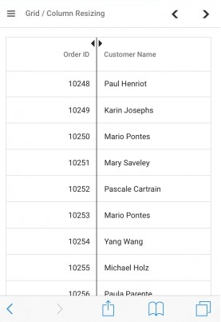

# Column Resizing in Blazor DataGrid

Column resizing in the Syncfusion&reg; Blazor DataGrid allows adjusting column widths dynamically to fit content and improve data readability. This feature provides flexibility in customizing the DataGrid layout based on data requirements and screen size.

To enable column resizing, set the [AllowResizing](https://help.syncfusion.com/cr/blazor/Syncfusion.Blazor.Grids.SfGrid-1.html#Syncfusion_Blazor_Grids_SfGrid_1_AllowResizing) property of the [Grid](https://help.syncfusion.com/cr/blazor/Syncfusion.Blazor.Grids.SfGrid-1.html) to **true**. Once enabled, columns can be resized by clicking and dragging the right edge of the column header. The column width updates immediately during the drag operation, providing real-time visual feedback.

**Key features:**

- Interactive resizing via mouse drag or touch.
- Minimum and maximum width constraints.
- Column-specific resize control.
- Multiple resizing modes (**Normal** and **Auto**).
- External programmatic resizing.
- Touch device support.



@using Syncfusion.Blazor.Grids

<SfGrid DataSource="@Orders" AllowResizing="true">
    <GridColumns>
        <GridColumn Field=@nameof(OrderDetails.OrderID) HeaderText="Order ID" TextAlign="TextAlign.Right" Width="100"></GridColumn>
        <GridColumn Field=@nameof(OrderDetails.CustomerID) HeaderText="Customer ID" Width="120"></GridColumn>
        <GridColumn Field=@nameof(OrderDetails.ShipCity) HeaderText="Ship City" Width="120"></GridColumn>
        <GridColumn Field=@nameof(OrderDetails.ShipName) HeaderText="Ship Name" Width="130"></GridColumn>
        <GridColumn Field=@nameof(OrderDetails.ShipCountry) HeaderText="Ship Country" Width="120"></GridColumn>
        <GridColumn Field=@nameof(OrderDetails.ShipAddress) HeaderText="Ship Address" Width="130"></GridColumn>
        <GridColumn Field=@nameof(OrderDetails.Freight) HeaderText="Freight" Format="C2" TextAlign="TextAlign.Right" Width="100"></GridColumn>
    </GridColumns>
</SfGrid>
@code {
    private SfGrid<OrderDetails> Grid;
    public List<OrderDetails> Orders { get; set; }   
    protected override void OnInitialized()
    {
        Orders = OrderDetails.GetAllRecords();       
    }
}


public class OrderDetails
{
    public static List<OrderDetails> order = new List<OrderDetails>();
    public OrderDetails(int OrderID, string CustomerId, double Freight, string ShipCity, string ShipName, string ShipCountry, string ShipAddress)
    {
        this.OrderID = OrderID;
        this.CustomerID = CustomerId;
        this.Freight = Freight;
        this.ShipCity = ShipCity;
        this.ShipName = ShipName;
        this.ShipCountry = ShipCountry;
        this.ShipAddress = ShipAddress;      
    }
    public static List<OrderDetails> GetAllRecords()
    {
        if (order.Count == 0)
        {
            order.Add(new OrderDetails(10248, "VINET", 32.38, "Reims", "Vins et alcools Chevalier", "Australia", "59 rue de l Abbaye"));
            order.Add(new OrderDetails(10249, "TOMSP", 11.61, "Münster", "Toms Spezialitäten", "Australia", "Luisenstr. 48"));
            order.Add(new OrderDetails(10250, "HANAR", 65.83, "Rio de Janeiro", "Hanari Carnes", "United States", "Rua do Paço, 67"));
            order.Add(new OrderDetails(10251, "VICTE", 41.34, "Lyon", "Victuailles en stock", "Australia", "2, rue du Commerce"));
            order.Add(new OrderDetails(10252, "SUPRD", 51.3, "Charleroi", "Suprêmes délices", "United States", "Boulevard Tirou, 255"));
            order.Add(new OrderDetails(10253, "HANAR", 58.17, "Rio de Janeiro", "Hanari Carnes", "United States", "Rua do Paço, 67"));
            order.Add(new OrderDetails(10254, "CHOPS", 22.98, "Bern", "Chop-suey Chinese", "Switzerland", "Hauptstr. 31"));
            order.Add(new OrderDetails(10255, "RICSU", 148.33, "Genève", "Richter Supermarkt", "Switzerland", "Starenweg 5"));
            order.Add(new OrderDetails(10256, "WELLI", 13.97, "Resende", "Wellington Importadora", "Brazil", "Rua do Mercado, 12"));
            order.Add(new OrderDetails(10257, "HILAA", 81.91, "San Cristóbal", "HILARION-Abastos", "Venezuela", "Carrera 22 con Ave. Carlos Soublette #8-35"));
            order.Add(new OrderDetails(10258, "ERNSH", 140.51, "Graz", "Ernst Handel", "Austria", "Kirchgasse 6"));
            order.Add(new OrderDetails(10259, "CENTC", 3.25, "México D.F.", "Centro comercial Moctezuma", "Mexico", "Sierras de Granada 9993"));
            order.Add(new OrderDetails(10260, "OTTIK", 55.09, "Köln", "Ottilies Käseladen", "Germany", "Mehrheimerstr. 369"));
            order.Add(new OrderDetails(10261, "QUEDE", 3.05, "Rio de Janeiro", "Que Delícia", "Brazil", "Rua da Panificadora, 12"));
            order.Add(new OrderDetails(10262, "RATTC", 48.29, "Albuquerque", "Rattlesnake Canyon Grocery", "USA", "2817 Milton Dr."));
        }
        return order;
    }
    public int OrderID { get; set; }
    public string CustomerID { get; set; }
    public double Freight { get; set; }
    public string ShipCity { get; set; }
    public string ShipName { get; set; }
    public string ShipCountry { get; set; }
    public string ShipAddress { get; set; }
}





> * To disable resizing for a specific column, set the `AllowResizing` property of the `GridColumn`(https://help.syncfusion.com/cr/blazor/Syncfusion.Blazor.Grids.GridColumn.html) to **false**.
> * In RTL mode, column resizing is performed by dragging the left edge of the header cell.
> * The [Width](https://help.syncfusion.com/cr/blazor/Syncfusion.Blazor.Grids.SfGrid-1.html#Syncfusion_Blazor_Grids_SfGrid_1_Width) property of the `GridColumn` can be set to define the initial column width. When resizing is enabled, this value can be overridden by manual adjustments.
> * If the `Width` property of a `GridColumn` is explicitly set to **0** and resizing is enabled, the DataGrid automatically assigns a default width of **200px** to that column.

## Set column resizing limits

Column resizing can be limited to a specific range by defining minimum and maximum widths. This ensures that columns remain readable and do not shrink too small or expand too wide during resize actions. The [MinWidth](https://help.syncfusion.com/cr/blazor/Syncfusion.Blazor.Grids.GridColumn.html#Syncfusion_Blazor_Grids_GridColumn_MinWidth) and [MaxWidth](https://help.syncfusion.com/cr/blazor/Syncfusion.Blazor.Grids.GridColumn.html#Syncfusion_Blazor_Grids_GridColumn_MaxWidth) properties of the `GridColumn` control these boundaries. Both properties accept numeric values that represent pixel widths.

**Behavior:**

| Property | Description | Example |
|----------|-------------|---------|
| `MinWidth` | Defines the minimum width (in pixels or percentage). The column cannot be resized smaller than this value. | `MinWidth="100"` keeps the column width at 100px or more. |
| `MaxWidth` | Defines the maximum width (in pixels or percentage). The column cannot be resized larger than this value. | `MaxWidth="250"` keeps the column width at 250px or less. |

In the following example, resize constraints are applied to multiple columns:

- **Order ID** column: minimum width of **100px**, maximum width of **250px**.
- **Ship Name** column: minimum width of **150px**, maximum width of **300px**.
- **Ship Country** column: minimum width of **120px**, maximum width of **280px**.



@using Syncfusion.Blazor.Grids

<SfGrid DataSource="@Orders" AllowResizing="true">
    <GridColumns>
        <GridColumn Field=@nameof(OrderDetails.OrderID) HeaderText="Order ID" TextAlign="TextAlign.Right" MinWidth="100" MaxWidth="250" Width="120"></GridColumn>
        <GridColumn Field=@nameof(OrderDetails.CustomerID) HeaderText="Customer ID" Width="120"></GridColumn>
        <GridColumn Field=@nameof(OrderDetails.ShipCity) HeaderText="Ship City" Width="100"></GridColumn>
        <GridColumn Field=@nameof(OrderDetails.ShipName) HeaderText="Ship Name" MinWidth="150" MaxWidth="300" Width="200"></GridColumn>
        <GridColumn Field=@nameof(OrderDetails.ShipCountry) HeaderText="Ship Country" MinWidth="120" MaxWidth="280" Width="150"></GridColumn>
        <GridColumn Field=@nameof(OrderDetails.ShipAddress) HeaderText="Ship Address" Width="130"></GridColumn>
        <GridColumn Field=@nameof(OrderDetails.Freight) HeaderText="Freight" Format="C2" TextAlign="TextAlign.Right" Width="100"></GridColumn>
    </GridColumns>
</SfGrid>

@code {
    public List<OrderDetails> Orders { get; set; }   
    protected override void OnInitialized()
    {
        Orders = OrderDetails.GetAllRecords();       
    }
}


public class OrderDetails
{
    public static List<OrderDetails> order = new List<OrderDetails>();
    public OrderDetails(int OrderID, string CustomerId, double Freight, string ShipCity, string ShipName, string ShipCountry, string ShipAddress)
    {
        this.OrderID = OrderID;
        this.CustomerID = CustomerId;
        this.Freight = Freight;
        this.ShipCity = ShipCity;
        this.ShipName = ShipName;
        this.ShipCountry = ShipCountry;
        this.ShipAddress = ShipAddress;      
    }
    public static List<OrderDetails> GetAllRecords()
    {
        if (order.Count == 0)
        {
            order.Add(new OrderDetails(10248, "VINET", 32.38, "Reims", "Vins et alcools Chevalier", "Australia", "59 rue de l Abbaye"));
            order.Add(new OrderDetails(10249, "TOMSP", 11.61, "Münster", "Toms Spezialitäten", "Australia", "Luisenstr. 48"));
            order.Add(new OrderDetails(10250, "HANAR", 65.83, "Rio de Janeiro", "Hanari Carnes", "United States", "Rua do Paço, 67"));
            order.Add(new OrderDetails(10251, "VICTE", 41.34, "Lyon", "Victuailles en stock", "Australia", "2, rue du Commerce"));
            order.Add(new OrderDetails(10252, "SUPRD", 51.3, "Charleroi", "Suprêmes délices", "United States", "Boulevard Tirou, 255"));
            order.Add(new OrderDetails(10253, "HANAR", 58.17, "Rio de Janeiro", "Hanari Carnes", "United States", "Rua do Paço, 67"));
            order.Add(new OrderDetails(10254, "CHOPS", 22.98, "Bern", "Chop-suey Chinese", "Switzerland", "Hauptstr. 31"));
            order.Add(new OrderDetails(10255, "RICSU", 148.33, "Genève", "Richter Supermarkt", "Switzerland", "Starenweg 5"));
            order.Add(new OrderDetails(10256, "WELLI", 13.97, "Resende", "Wellington Importadora", "Brazil", "Rua do Mercado, 12"));
            order.Add(new OrderDetails(10257, "HILAA", 81.91, "San Cristóbal", "HILARION-Abastos", "Venezuela", "Carrera 22 con Ave. Carlos Soublette #8-35"));
            order.Add(new OrderDetails(10258, "ERNSH", 140.51, "Graz", "Ernst Handel", "Austria", "Kirchgasse 6"));
            order.Add(new OrderDetails(10259, "CENTC", 3.25, "México D.F.", "Centro comercial Moctezuma", "Mexico", "Sierras de Granada 9993"));
            order.Add(new OrderDetails(10260, "OTTIK", 55.09, "Köln", "Ottilies Käseladen", "Germany", "Mehrheimerstr. 369"));
            order.Add(new OrderDetails(10261, "QUEDE", 3.05, "Rio de Janeiro", "Que Delícia", "Brazil", "Rua da Panificadora, 12"));
            order.Add(new OrderDetails(10262, "RATTC", 48.29, "Albuquerque", "Rattlesnake Canyon Grocery", "USA", "2817 Milton Dr."));
        }
        return order;
    }
    public int OrderID { get; set; }
    public string CustomerID { get; set; }
    public double Freight { get; set; }
    public string ShipCity { get; set; }
    public string ShipName { get; set; }
    public string ShipCountry { get; set; }
    public string ShipAddress { get; set; }
}





> * The `MinWidth` and `MaxWidth` properties are enforced only during manual column resizing operations. Window or container resizing does not apply these constraints as columns are not re-rendered during window resize events.
> * Choose appropriate `MinWidth` and `MaxWidth` values based on data content and layout requirements to ensure optimal display.
> * Specified `MinWidth` and `MaxWidth` values take precedence over any resize attempts that fall outside the defined range, providing reliable column size control.

## Prevent resizing for specific columns

In some scenarios, certain columns may need to maintain a fixed width to preserve data consistency or layout structure. The DataGrid provides column-level control to prevent resizing for specific columns while allowing others to be resized freely. To disable resizing for a particular column, set the [AllowResizing](https://help.syncfusion.com/cr/blazor/Syncfusion.Blazor.Grids.GridColumn.html#Syncfusion_Blazor_Grids_GridColumn_AllowResizing) property of that [GridColumn](https://help.syncfusion.com/cr/blazor/Syncfusion.Blazor.Grids.GridColumn.html) to **false**. This property overrides the DataGrid-level `AllowResizing` setting for the specified column.

The following example demonstrates disabling resize functionality for the **Customer ID** column while keeping other columns resizable:



@using Syncfusion.Blazor.Grids

<SfGrid DataSource="@Orders" AllowResizing="true">
    <GridColumns>
        <GridColumn Field=@nameof(OrderDetails.OrderID) HeaderText="Order ID" TextAlign="TextAlign.Right" Width="100"></GridColumn>
        <GridColumn Field=@nameof(OrderDetails.CustomerID) HeaderText="Customer ID" AllowResizing="false" Width="120"></GridColumn>
        <GridColumn Field=@nameof(OrderDetails.ShipCity) HeaderText="Ship City" Width="120"></GridColumn>
        <GridColumn Field=@nameof(OrderDetails.Freight) HeaderText="Freight" Format="C2" TextAlign="TextAlign.Right" Width="100"></GridColumn>
    </GridColumns>
</SfGrid>
@code {
    public List<OrderDetails> Orders { get; set; }   
    protected override void OnInitialized()
    {
        Orders = OrderDetails.GetAllRecords();       
    }  
}


public class OrderDetails
{
    public static List<OrderDetails> order = new List<OrderDetails>();
    public OrderDetails(int OrderID, string CustomerId, double Freight, string ShipCity)
    {
        this.OrderID = OrderID;
        this.CustomerID = CustomerId;
        this.Freight = Freight;
        this.ShipCity = ShipCity;      
    }
    public static List<OrderDetails> GetAllRecords()
    {
        if (order.Count == 0)
        {
            order.Add(new OrderDetails(10248, "VINET", 32.38, "Reims"));
            order.Add(new OrderDetails(10249, "TOMSP", 11.61, "Münster"));
            order.Add(new OrderDetails(10250, "HANAR", 65.83, "Rio de Janeiro"));
            order.Add(new OrderDetails(10251, "VICTE", 41.34, "Lyon"));
            order.Add(new OrderDetails(10252, "SUPRD", 51.3, "Charleroi"));
            order.Add(new OrderDetails(10253, "HANAR", 58.17, "Rio de Janeiro"));
            order.Add(new OrderDetails(10254, "CHOPS", 22.98, "Bern"));
            order.Add(new OrderDetails(10255, "RICSU", 148.33, "Genève"));
            order.Add(new OrderDetails(10256, "WELLI", 13.97, "Resende"));
            order.Add(new OrderDetails(10257, "HILAA", 81.91, "San Cristóbal"));
            order.Add(new OrderDetails(10258, "ERNSH", 140.51, "Graz"));
            order.Add(new OrderDetails(10259, "CENTC", 3.25, "México D.F."));
            order.Add(new OrderDetails(10260, "OTTIK", 55.09, "Köln"));
            order.Add(new OrderDetails(10261, "QUEDE", 3.05, "Rio de Janeiro"));
            order.Add(new OrderDetails(10262, "RATTC", 48.29, "Albuquerque"));
        }
        return order;
    }
    public int OrderID { get; set; }
    public string CustomerID { get; set; }
    public double Freight { get; set; }
    public string ShipCity { get; set; }
}





> Resizing can also be prevented dynamically by setting **args.Cancel** to **true** in the [OnResizeStart](https://help.syncfusion.com/cr/blazor/Syncfusion.Blazor.Grids.GridEvents-1.html#Syncfusion_Blazor_Grids_GridEvents_1_OnResizeStart) event.

## Resize stacked header columns

The Syncfusion&reg; Blazor DataGrid supports resizing stacked header columns, which are columns grouped under a parent header. When resizing a stacked column, the behavior differs from standard column resizing.

**Stacked column resize behavior:**

- Dragging the right edge of a stacked header resizes all child columns together.
- The total width of the child columns adjusts to match the new stacked header width.
- Each child column keeps its proportional width during the resize.
- Resizing can be disabled for specific child columns by setting their `AllowResizing` property to **false**.



@using Syncfusion.Blazor.Grids

<SfGrid DataSource="@Orders" AllowResizing="true"  Height="315">
    <GridColumns>
        <GridColumn Field=@nameof(OrderDetails.OrderID) HeaderText="Order ID" TextAlign="TextAlign.Right" Width="120"></GridColumn>
        <GridColumn HeaderText=" Order Details">
            <GridColumns>
                <GridColumn Field=@nameof(OrderDetails.OrderDate) Width="130" HeaderText="Order Date" Format="d" TextAlign="TextAlign.Right" MinWidth="10"></GridColumn>
                <GridColumn Field=@nameof(OrderDetails.Freight) Width="135" HeaderText="Freight($)" Format="C2" TextAlign="TextAlign.Right" MinWidth="10"></GridColumn>
            </GridColumns>
        </GridColumn>
        <GridColumn HeaderText=" Ship Details">
            <GridColumns>
                <GridColumn Field=@nameof(OrderDetails.ShipCity) Width="130" HeaderText="Ship City" AllowResizing="false" MinWidth="10"></GridColumn>
                <GridColumn Field=@nameof(OrderDetails.ShipCountry) Width="135" HeaderText="Ship Country" MinWidth="10"></GridColumn>
            </GridColumns>
        </GridColumn>
    </GridColumns>
</SfGrid>
@code {
    public List<OrderDetails> Orders { get; set; }   
    protected override void OnInitialized()
    {
        Orders = OrderDetails.GetAllRecords();       
    }  
}


public class OrderDetails
{
    public static List<OrderDetails> order = new List<OrderDetails>();
    public OrderDetails(int OrderID, double Freight, DateTime OrderDate, string ShipCity, string ShipCountry)
    {
        this.OrderID = OrderID;
        this.Freight = Freight;
        this.ShipCity = ShipCity;
        this.OrderDate = OrderDate;
        this.ShipCountry = ShipCountry;
    }
    public static List<OrderDetails> GetAllRecords()
    {
        if (order.Count == 0)
        {
            order.Add(new OrderDetails(10248, 32.38, new DateTime(1996, 7, 4), "Reims", "Australia"));
            order.Add(new OrderDetails(10249, 11.61, new DateTime(1996, 7, 5), "Münster", "Australia"));
            order.Add(new OrderDetails(10250, 65.83, new DateTime(1996, 7, 8), "Rio de Janeiro", "United States"));
            order.Add(new OrderDetails(10251, 41.34, new DateTime(1996, 7, 8), "Lyon", "Australia"));
            order.Add(new OrderDetails(10252, 51.3, new DateTime(1996, 7, 9), "Charleroi","United States"));
            order.Add(new OrderDetails(10253, 58.17, new DateTime(1996, 7, 10), "Rio de Janeiro","United States"));
            order.Add(new OrderDetails(10254, 22.98, new DateTime(1996, 7, 11), "Bern", "Switzerland"));
            order.Add(new OrderDetails(10255, 148.33, new DateTime(1996, 7, 12), "Genève", "Switzerland"));
            order.Add(new OrderDetails(10256, 13.97, new DateTime(1996, 7, 15), "Resende", "Brazil"));
            order.Add(new OrderDetails(10257, 81.91, new DateTime(1996, 7, 16), "San Cristóbal", "Venezuela"));
            order.Add(new OrderDetails(10258, 140.51, new DateTime(1996, 7, 17), "Graz", "Austria"));
            order.Add(new OrderDetails(10259, 3.25, new DateTime(1996, 7, 18), "México D.F.", "Mexico"));
            order.Add(new OrderDetails(10260, 55.09, new DateTime(1996, 7, 19), "Köln", "Germany"));
            order.Add(new OrderDetails(10261, 3.05, new DateTime(1996, 7, 19), "Rio de Janeiro", "Brazil"));
            order.Add(new OrderDetails(10262, 48.29, new DateTime(1996, 7, 22), "Albuquerque", "USA"));
        }
        return order;
    }
    public int OrderID { get; set; }
    public double Freight { get; set; }
    public string ShipCity { get; set; }
    public DateTime OrderDate { get; set; }
    public string ShipCountry { get; set; }
}





## Touch interaction

The Syncfusion&reg; Blazor DataGrid provides full touch support for column resizing on mobile and tablet devices. Touch-based resizing offers an intuitive interface for adjusting column widths on touchscreen devices.

**Resizing columns on touch devices:**

Touch-based column resizing follows a slightly different interaction pattern compared to mouse-based resizing to accommodate touch precision:

1. **Tap the column edge**: Tap the right edge of the header cell for the column to resize.
2. **Handler appears**: A floating resize handler appears over the right border of the column, making it easier to grab with touch.
3. **Drag to resize**: Tap and drag the floating handler left or right to adjust the column width to the desired size.
4. **Release to apply**: Release finger to apply the new column width.

**Additional touch features:**

- The floating handler provides a larger touch target for better usability.
- Column menu on touch devices includes an autofit option to automatically size columns.
- Smooth scrolling during resize operations.
- Visual feedback during the resize process.

The following screenshot illustrates column resizing on a touch device:

> * Touch resizing works identically across iOS, Android, and Windows touch devices.
> * In RTL mode, the floating handler appears on the left edge of columns.

## Resizing columns programmatically

The Syncfusion&reg; Blazor DataGrid supports programmatic column resizing through external controls or application logic. This enables creating custom interfaces for column width management, implementing preset column layouts, or responding to application state changes.

**How to resize columns externally:**

Programmatic column resizing involves two steps:

1. **Update column width**: Modify the [Width](https://help.syncfusion.com/cr/blazor/Syncfusion.Blazor.Grids.GridColumn.html#Syncfusion_Blazor_Grids_GridColumn_Width) property of the target `GridColumn` using the [GetColumnByFieldAsync](https://help.syncfusion.com/cr/blazor/Syncfusion.Blazor.Grids.SfGrid-1.html#Syncfusion_Blazor_Grids_SfGrid_1_GetColumnByFieldAsync_System_String_) method.

2. **Refresh display**: Call the [RefreshColumnsAsync](https://help.syncfusion.com/cr/blazor/Syncfusion.Blazor.Grids.SfGrid-1.html#Syncfusion_Blazor_Grids_SfGrid_1_RefreshColumnsAsync) method to apply the width changes and update the DataGrid display.

The following example demonstrates implementing external controls for column resizing. A `SfDropDownList` selects the column to resize, a `SfTextBox` inputs the desired width, and a `SfButton` applies the changes:



@using Syncfusion.Blazor.Grids
@using Syncfusion.Blazor.DropDowns
@using Syncfusion.Blazor.Inputs
@using Syncfusion.Blazor.Buttons

    <label style="margin: 5px 5px 0 0"> Select column name:</label>
    <SfDropDownList TValue="string" TItem="Columns" Width="120px" Placeholder="Select a Column" DataSource="@LocalData" @bind-Value="@DropDownValue">
        <DropDownListEvents TItem="Columns" TValue="string"></DropDownListEvents>
        <DropDownListFieldSettings Value="ID" Text="Value"></DropDownListFieldSettings>
    </SfDropDownList>

    <label style="margin: 5px 5px 0 0"> Enter the width:</label>
    <SfTextBox CssClass="e-outline" @bind-Value="@ModifiedWidth" PlaceHolder="@PlaceHolder" Width="150px"></SfTextBox>
    <SfButton OnClick="onExternalResize">Resize</SfButton>

<SfGrid @ref="Grid" AllowResizing="true" DataSource="@Orders">                
    <GridColumns>
        <GridColumn Field=@nameof(OrderDetails.OrderID) HeaderText="Order ID" TextAlign="TextAlign.Right" Width="@IdWidth"></GridColumn>
        <GridColumn Field=@nameof(OrderDetails.CustomerID) HeaderText="Customer ID"  Width="@CustomerWidth"></GridColumn>
        <GridColumn Field=@nameof(OrderDetails.Freight) HeaderText="Freight" Format="C2" TextAlign="TextAlign.Right" Width="@FreightWidth"></GridColumn>
        <GridColumn Field=@nameof(OrderDetails.ShipCountry) HeaderText="Ship Country" Width="@CountryWidth"></GridColumn>
    </GridColumns>
</SfGrid>
@code {
    public SfGrid<OrderDetails> Grid { get; set; }
    public List<OrderDetails> Orders { get; set; }
    protected override void OnInitialized()
    {
        Orders = OrderDetails.GetAllRecords();
    }
    public string ModifiedWidth;
    public string IdWidth = "100";
    public string CustomerWidth = "120";
    public string FreightWidth = "80";
    public string CountryWidth = "100";
    public string PlaceHolder { get; set; } = "Enter new width";
    public string DropDownValue { get; set; } = "OrderID";    
    public class Columns
    {
        public string ID { get; set; }
        public string Value { get; set; }
    }    
    List<Columns> LocalData = new List<Columns>    {
        new Columns() { ID= "OrderID", Value= "OrderID" },
        new Columns() { ID= "CustomerID", Value= "CustomerID" },
        new Columns() { ID= "Freight", Value= "Freight" },
        new Columns() { ID= "ShipCountry", Value= "ShipCountry" },
    };   
    public async Task onExternalResize()
    {        
        var selectedColumn = await Grid.GetColumnByFieldAsync(DropDownValue); 
        if(selectedColumn.Field == "OrderID") {
            IdWidth = ModifiedWidth;
        }
        if(selectedColumn.Field == "CustomerID") {
            CustomerWidth = ModifiedWidth;
        }         
        if(selectedColumn.Field == "Freight") {
            FreightWidth = ModifiedWidth;
        } 
        if(selectedColumn.Field == "ShipCountry") {
            CountryWidth = ModifiedWidth;
        }      
        await Grid.RefreshColumnsAsync();        
    }
}


public class OrderDetails
{
    public static List<OrderDetails> order = new List<OrderDetails>();
    public OrderDetails(int OrderID, string CustomerId, double Freight, string ShipCountry)
    {
        this.OrderID = OrderID;
        this.CustomerID = CustomerId;
        this.Freight = Freight;
        this.ShipCountry = ShipCountry; 
    }
    public static List<OrderDetails> GetAllRecords()
    {
        if (order.Count == 0)
        {
            order.Add(new OrderDetails(10248, "VINET", 32.38, "Australia"));
            order.Add(new OrderDetails(10249, "TOMSP", 11.61, "Australia"));
            order.Add(new OrderDetails(10250, "HANAR", 65.83, "United States"));
            order.Add(new OrderDetails(10251, "VICTE", 41.34, "Australia"));
            order.Add(new OrderDetails(10252, "SUPRD", 51.3, "United States"));
            order.Add(new OrderDetails(10253, "HANAR", 58.17, "United States"));
            order.Add(new OrderDetails(10254, "CHOPS", 22.98,"Switzerland"));
            order.Add(new OrderDetails(10255, "RICSU", 148.33,"Switzerland"));
            order.Add(new OrderDetails(10256, "WELLI", 13.97, "Brazil"));
            order.Add(new OrderDetails(10257, "HILAA", 81.91, "Venezuela"));
            order.Add(new OrderDetails(10258, "ERNSH", 140.51, "Austria"));
            order.Add(new OrderDetails(10259, "CENTC", 3.2, "Mexico"));
            order.Add(new OrderDetails(10260, "OTTIK", 55.09, "Germany"));
            order.Add(new OrderDetails(10261, "QUEDE", 3.0, "Brazil"));
            order.Add(new OrderDetails(10262, "RATTC", 48.29, "USA"));
        }
        return order;
    }
    public int OrderID { get; set; }
    public string CustomerID { get; set; }
    public double Freight { get; set; }
    public string ShipCountry { get; set; }
}





> The `RefreshColumnsAsync` method is essential for applying width changes made through the column object. Without calling this method, width changes will not be reflected in the DataGrid display.

## Resizing events

The Syncfusion&reg; Blazor DataGrid provides events that trigger during column resize operations. These events enable custom logic, validation, and status updates throughout the resize process, giving complete control over the resizing lifecycle.

**Available resize events:**

| Event | Timing | Usage | Cancelable |
|-------|--------|-------|------------|
| [OnResizeStart](https://help.syncfusion.com/cr/blazor/Syncfusion.Blazor.Grids.GridEvents-1.html#Syncfusion_Blazor_Grids_GridEvents_1_OnResizeStart) | Triggered when column resize begins (on initial mouse/touch down) | Validate resize action, prevent specific columns from resizing, initialize custom logic | Yes (set `args.Cancel = true`) |
| [ResizeStopped](https://help.syncfusion.com/cr/blazor/Syncfusion.Blazor.Grids.GridEvents-1.html#Syncfusion_Blazor_Grids_GridEvents_1_ResizeStopped) | Triggered when column resize ends (on mouse/touch release) | Save resize preferences, apply post-resize styles, log resize actions | Yes (set `args.Cancel = true`) |

The following example demonstrates practical use of resize events:

- `OnResizeStart`: Prevents resizing of the **Order ID** column.
- `ResizeStopped`: Displays a message indicating the column resizing has completed.



@using Syncfusion.Blazor.Grids

    @ResizeMessage

<SfGrid @ref="Grid" DataSource="@OrderData" AllowResizing="true">
    <GridEvents TValue="OrderDetails" OnResizeStart="OnResizeStart" ResizeStopped="ResizeStopped"></GridEvents>
    <GridColumns>
        <GridColumn Field=@nameof(OrderDetails.OrderID) HeaderText="Order ID" TextAlign="TextAlign.Right" Width="120"></GridColumn>
        <GridColumn Field=@nameof(OrderDetails.CustomerID) HeaderText="Customer ID" Width="150"></GridColumn>
        <GridColumn Field=@nameof(OrderDetails.ShipCity) HeaderText="Ship City" Width="150"></GridColumn>
        <GridColumn Field=@nameof(OrderDetails.ShipName) HeaderText="Ship Name" Width="150"></GridColumn>
        <GridColumn Field=@nameof(OrderDetails.ShipCountry) HeaderText="Ship Country" Width="150"></GridColumn>
        <GridColumn Field=@nameof(OrderDetails.ShipAddress) HeaderText="Ship Address" Width="150"></GridColumn>
        <GridColumn Field=@nameof(OrderDetails.Freight) HeaderText="Freight" Format="C2" TextAlign="TextAlign.Right" Width="120"></GridColumn>
    </GridColumns>
</SfGrid>
@code {
    private SfGrid<OrderDetails> Grid;
    public List<OrderDetails> OrderData { get; set; }   
    protected override void OnInitialized()
    {
        OrderData = OrderDetails.GetAllRecords();       
    }
    public string ResizeMessage;
    public void OnResizeStart(ResizeArgs args)
    {
        if (args.Column.Field == "OrderID")
        {
            args.Cancel = true;
            ResizeMessage = "OnResizeStart event is triggered. Column Resizing cancelled for " + args.Column.HeaderText + " column ";
        }
    }
    public void ResizeStopped(ResizeArgs args)
    {
        ResizeMessage = "ResizeStopped event is triggered. " + args.Column.HeaderText + " column resizing completed.";
    }
}


public class OrderDetails
    {
        public static List<OrderDetails> order = new List<OrderDetails>();
        public OrderDetails(int OrderID, string CustomerId, double Freight, string ShipCity, string ShipName, string ShipCountry, string ShipAddress)
        {
            this.OrderID = OrderID;
            this.CustomerID = CustomerId;
            this.Freight = Freight;
            this.ShipCity = ShipCity;
            this.ShipName = ShipName;
            this.ShipCountry = ShipCountry;
            this.ShipAddress = ShipAddress;      
        }
        public static List<OrderDetails> GetAllRecords()
        {
            if (order.Count == 0)
            {
                order.Add(new OrderDetails(10248, "VINET", 32.38, "Reims", "Vins et alcools Chevalier", "Australia", "59 rue de l Abbaye"));
                order.Add(new OrderDetails(10249, "TOMSP", 11.61, "Münster", "Toms Spezialitäten", "Australia", "Luisenstr. 48"));
                order.Add(new OrderDetails(10250, "HANAR", 65.83, "Rio de Janeiro", "Hanari Carnes", "United States", "Rua do Paço, 67"));
                order.Add(new OrderDetails(10251, "VICTE", 41.34, "Lyon", "Victuailles en stock", "Australia", "2, rue du Commerce"));
                order.Add(new OrderDetails(10252, "SUPRD", 51.3, "Charleroi", "Suprêmes délices", "United States", "Boulevard Tirou, 255"));
                order.Add(new OrderDetails(10253, "HANAR", 58.17, "Rio de Janeiro", "Hanari Carnes", "United States", "Rua do Paço, 67"));
                order.Add(new OrderDetails(10254, "CHOPS", 22.98, "Bern", "Chop-suey Chinese", "Switzerland", "Hauptstr. 31"));
                order.Add(new OrderDetails(10255, "RICSU", 148.33, "Genève", "Richter Supermarkt", "Switzerland", "Starenweg 5"));
                order.Add(new OrderDetails(10256, "WELLI", 13.97, "Resende", "Wellington Importadora", "Brazil", "Rua do Mercado, 12"));
                order.Add(new OrderDetails(10257, "HILAA", 81.91, "San Cristóbal", "HILARION-Abastos", "Venezuela", "Carrera 22 con Ave. Carlos Soublette #8-35"));
                order.Add(new OrderDetails(10258, "ERNSH", 140.51, "Graz", "Ernst Handel", "Austria", "Kirchgasse 6"));
                order.Add(new OrderDetails(10259, "CENTC", 3.25, "México D.F.", "Centro comercial Moctezuma", "Mexico", "Sierras de Granada 9993"));
                order.Add(new OrderDetails(10260, "OTTIK", 55.09, "Köln", "Ottilies Käseladen", "Germany", "Mehrheimerstr. 369"));
                order.Add(new OrderDetails(10261, "QUEDE", 3.05, "Rio de Janeiro", "Que Delícia", "Brazil", "Rua da Panificadora, 12"));
                order.Add(new OrderDetails(10262, "RATTC", 48.29, "Albuquerque", "Rattlesnake Canyon Grocery", "USA", "2817 Milton Dr."));
           }
            return order;
        }
        public int OrderID { get; set; }
        public string CustomerID { get; set; }
        public double Freight { get; set; }
        public string ShipCity { get; set; }
        public string ShipName { get; set; }
        public string ShipCountry { get; set; }
        public string ShipAddress { get; set; }
    }



