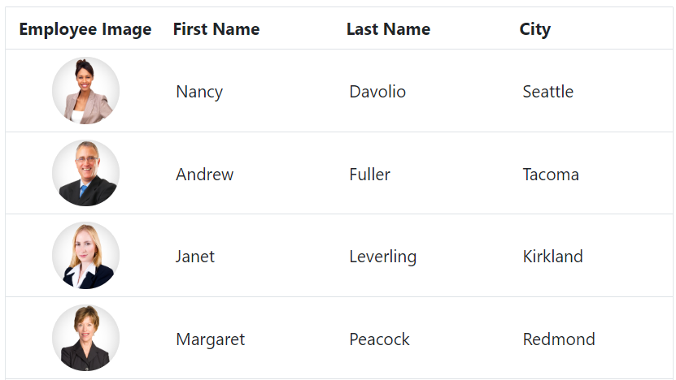
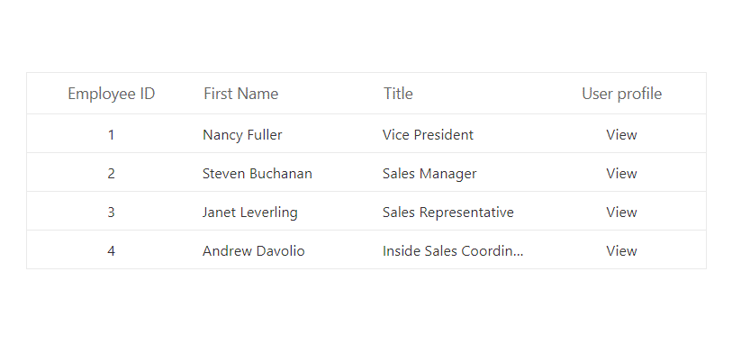

# Column Template in Blazor DataGrid

Syncfusion<sup style="font-size:70%">&reg;</sup> Blazor DataGrid provides a [Template](https://help.syncfusion.com/cr/blazor/Syncfusion.Blazor.Grids.GridColumn.html#Syncfusion_Blazor_Grids_GridColumn_Template) option that allows you to display custom elements in a column instead of the field value. This can be useful when you need to display images, buttons, or other custom content within a column.

> Before adding column template to the Grid, it is recommended to go through the [template](./templates/#templates) section topic to configure the template.

To know about **Column Template** in Grid, you can check this video.



> When using template columns, they are primarily meant for rendering custom content and may not provide built-in support for Grid actions like sorting, filtering, editing. It is must to define the `Field` property of the column to perform any Grid actions.

## Render image in a column

To render an image in a Grid column, you need to define a [Template](https://help.syncfusion.com/cr/blazor/Syncfusion.Blazor.Grids.GridColumn.html#Syncfusion_Blazor_Grids_GridColumn_Template) for the column using the template property.The `Template` property expects an HTML string or a function that returns an HTML string.

The following example demonstrates how to define a `Template` for the **Employee Image** field that displays an image element.The `Template` property is set to an HTML string that contains an image tag. You have utilized the `src` and `alt` attributes to the image tag:



@using Syncfusion.Blazor.Grids

<SfGrid DataSource="@Orders">
    <GridColumns>
    <GridColumn HeaderText="Employee Image" TextAlign="TextAlign.Center" Width="120">
            <Template>
                @{
                    var employee = (context as OrderData);
                        <div class="image">
                            
                        </div>
                }
            </Template>
        </GridColumn>
        <GridColumn Field=@nameof(OrderData.FirstName) HeaderText="First Name" Width="130"></GridColumn>
        <GridColumn Field=@nameof(OrderData.LastName) HeaderText="Last Name" Width="130"></GridColumn>
        <GridColumn Field=@nameof(OrderData.City) HeaderText="City" Width="120"></GridColumn>
    </GridColumns>
</SfGrid>
<style>
    .image img {
        height: 55px;
        width: 55px;
        border-radius: 50px;
        box-shadow: inset 0 0 1px #e0e0e0, inset 0 0 14px rgba(0, 0, 0, 0.2);
    }
</style>
@code {
    public List<OrderData> Orders { get; set; }
    
    protected override void OnInitialized()
    {
        Orders = OrderData.GetAllRecords();
    }
}


    public class OrderData
    {
        public static List<OrderData> Orders = new List<OrderData>();
        public OrderData()
        {

        }
        public OrderData(int EmployeeID, string FirstName, string LastName, string City,DateTime? HireDate)
        {
           this.EmployeeID = EmployeeID;
           this.FirstName = FirstName;
           this.LastName = LastName;
           this.City = City;
           this.HireDate = HireDate;            
        }
        public static List<OrderData> GetAllRecords()
        {
            if (Orders.Count() == 0)
            {
                int code = 10;
                for (int i = 1; i < 2; i++)
                {
                    Orders.Add(new OrderData(10248, "Nancy", "Davolio", "Seattle", new DateTime(1996,07,08)));
                    Orders.Add(new OrderData(10249, "Andrew", "Fuller", "Tacoma", new DateTime(1996, 07, 18)));
                    Orders.Add(new OrderData(10250, "Janet", "Leverling", "Kirkland", new DateTime(1996, 07, 05)));
                    Orders.Add(new OrderData(10251, "Margaret", "Peacock", "Redmond", new DateTime(1996, 07, 23)));
                    Orders.Add(new OrderData(10252, "Steven", "Buchanan", "London", new DateTime(1996, 07, 16)));
                    Orders.Add(new OrderData(10253, "Michael", "Suyama", "London", new DateTime(1996, 07, 12)));
                    Orders.Add(new OrderData(10254, "Robert", "King", "London", new DateTime(1996, 07, 18)));
                    Orders.Add(new OrderData(10255, "Anne", "Callahan", "London", new DateTime(1996, 07, 05)));
                    Orders.Add(new OrderData(10256, "Laura", "Dodsworth", "London", new DateTime(1996, 07, 01)));
                    code += 5;
                }
            }
            return Orders;
        }
        public int EmployeeID { get; set; }
        public string FirstName { get; set; }
        public string LastName { get; set; }
        public string City { get; set; }
        public DateTime? HireDate { get; set; }
    }



<!--  -->


> The [Template](https://help.syncfusion.com/cr/blazor/Syncfusion.Blazor.Grids.GridColumn.html#Syncfusion_Blazor_Grids_GridColumn_Template) option allows to define any HTML content within a column.

## Render hyperlink in a column

The Syncfusion<sup style="font-size:70%">&reg;</sup> Blazor DataGrid provides support for rendering hyperlink columns and performing routing on click using the [Template](https://help.syncfusion.com/cr/blazor/Syncfusion.Blazor.Grids.GridColumn.html#Syncfusion_Blazor_Grids_GridColumn_Template) property. This feature is useful when displaying data that requires a link to another page or website.

The following example demonstrates, how to render hyperlink column in the Grid using the [Template](https://help.syncfusion.com/cr/blazor/Syncfusion.Blazor.Grids.GridColumn.html#Syncfusion_Blazor_Grids_GridColumn_Template) property of the `GridColumn` tag. To define a `Template` for the column,  you can use the `Template` with the `a` tag to create the hyperlink:



@using Syncfusion.Blazor.Grids

<SfGrid DataSource="@EmployeeData">
    <GridColumns>
        <GridColumn Field=@nameof(EmployeeDetails.EmployeeID) HeaderText="Employee ID" TextAlign="TextAlign.Right" Width="120"></GridColumn>
        <GridColumn Field=@nameof(EmployeeDetails.LastName) HeaderText="Last Name" Width="150"></GridColumn>
        <GridColumn Field=@nameof(EmployeeDetails.FirstName) HeaderText="First Name" Width="150">
            <Template>
                @{
                    var Data = (context as EmployeeDetails);
                    <div>
                        <a href="https://www.google.com/search?q=@Data.FirstName" target="_blank">@Data.FirstName</a>
                    </div>
                }
            </Template>
        </GridColumn>
    </GridColumns>
</SfGrid>
@code {
    public List<EmployeeDetails> EmployeeData { get; set; }

    protected override void OnInitialized()
    {
    EmployeeData = EmployeeDetails.GetAllRecords();        
    }       
}


public class EmployeeDetails
{
    public static List<EmployeeDetails> employee = new List<EmployeeDetails>();

    public EmployeeDetails() { }

    public EmployeeDetails(int employeeID, string lastName, string firstName)
    {
        this.EmployeeID = employeeID;
        this.LastName = lastName;
        this.FirstName = firstName;
    }

    public static List<EmployeeDetails> GetAllRecords()
    {
        if (employee.Count == 0)
        {
            employee.Add(new EmployeeDetails(1, "Davolio", "Nancy"));
            employee.Add(new EmployeeDetails(2, "Fuller", "Andrew"));
            employee.Add(new EmployeeDetails(3, "Leverling", "Janet"));
            employee.Add(new EmployeeDetails(4, "Peacock", "Margaret"));
            employee.Add(new EmployeeDetails(5, "Buchanan", "Steven"));
            employee.Add(new EmployeeDetails(6, "Suyama", "Michael"));
            employee.Add(new EmployeeDetails(7, "King", "Robert"));
            employee.Add(new EmployeeDetails(8, "Callahan", "Laura"));
            employee.Add(new EmployeeDetails(9, "Dodsworth", "Anne"));
        }
        return employee;
    }

    public int EmployeeID { get; set; }
    public string LastName { get; set; }
    public string FirstName { get; set; }
}







## Render other components in a column

The column template has options to render a custom component in a Syncfusion<sup style="font-size:70%">&reg;</sup> Blazor DataGrid column instead of a field value.

### Render LineChart in a column

The [LineChart](https://blazor.syncfusion.com/documentation/sparkline/getting-started-webapp) of Syncfusion<sup style="font-size:70%">&reg;</sup> provides an elegant way to represent and compare data over time. It displays data points connected by straight line segments to visualize trends in data.

In the following example, we rendered the Sparkline Chart in the Grid column by defining the [Template](https://help.syncfusion.com/cr/blazor/Syncfusion.Blazor.Grids.GridColumn.html#Syncfusion_Blazor_Grids_GridColumn_Template) property:



@using Syncfusion.Blazor.Grids
@using Syncfusion.Blazor.Charts

<SfGrid DataSource="@EmployeeData">
    <GridColumns>
        <GridColumn Field=@nameof(EmployeeDetails.EmployeeID) HeaderText="Employee ID" Width="150">
        </GridColumn>
        <GridColumn Field=@nameof(EmployeeDetails.FirstName) HeaderText="First Name" Width="150">
        </GridColumn>
        <GridColumn HeaderText="Employee Performance Rating" Width="280">
            <Template>
                @{
                    var Data = (context as EmployeeDetails);
                    <SfSparkline Height="50px" Width="90%" Fill="#3C78EF" DataSource="@GetSparkData("line", (Data).EmployeeID + 1)">
                    </SfSparkline>
                }
            </Template>
        </GridColumn>
    </GridColumns>
</SfGrid>
@code {
    public List<EmployeeDetails> EmployeeData { get; set; }

    protected override void OnInitialized()
    {
    EmployeeData = EmployeeDetails.GetAllRecords();        
    } 
     // Line data
    private List<List<int>> lineData = new List<List<int>>
    {
        new List<int> { 0, 6, -4, 1, -3, 2, 5 },
        new List<int> { 5, -4, 6, 3, -1, 2, 0 },
        new List<int> { 6, 4, 0, 3, -2, 5, 1 },
        new List<int> { 4, -6, 3, 0, 1, -2, 5 },
        new List<int> { 3, 5, -6, -4, 0, 1, 2 },
        new List<int> { 1, -3, 4, -2, 5, 0, 6 },
        new List<int> { 2, 4, 0, -3, 5, -6, 1 },
        new List<int> { 5, 4, -6, 3, 1, -2, 0 },
        new List<int> { 0, -6, 4, 1, -3, 2, 5 },
        new List<int> { 6, 4, 0, -3, 2, -5, 1 }
    };

    // Function to get sparkline data
    private List<int> GetSparkData(string type, int count)
    {
        if (type == "line" && count > 0 && count <= lineData.Count)
        {
            return lineData[count - 1];
        }
        return new List<int>();
    }            
}


public class EmployeeDetails
{
    public static List<EmployeeDetails> employee = new List<EmployeeDetails>();

    public EmployeeDetails() { }

    public EmployeeDetails(int employeeID, string lastName, string firstName)
    {
        this.EmployeeID = employeeID;
        this.LastName = lastName;
        this.FirstName = firstName;
    }

    public static List<EmployeeDetails> GetAllRecords()
    {
        if (employee.Count == 0)
        {
            employee.Add(new EmployeeDetails(1, "Davolio", "Nancy"));
            employee.Add(new EmployeeDetails(2, "Fuller", "Andrew"));
            employee.Add(new EmployeeDetails(3, "Leverling", "Janet"));
            employee.Add(new EmployeeDetails(4, "Peacock", "Margaret"));
            employee.Add(new EmployeeDetails(5, "Buchanan", "Steven"));
            employee.Add(new EmployeeDetails(6, "Suyama", "Michael"));
            employee.Add(new EmployeeDetails(7, "King", "Robert"));
            employee.Add(new EmployeeDetails(8, "Callahan", "Laura"));
            employee.Add(new EmployeeDetails(9, "Dodsworth", "Anne"));
        }
        return employee;
    }

    public int EmployeeID { get; set; }
    public string LastName { get; set; }
    public string FirstName { get; set; }
}





### Render DropDownList in a column

To render a custom component in a Syncfusion<sup style="font-size:70%">&reg;</sup> Blazor DataGrid column, you need to define a [Template](https://help.syncfusion.com/cr/blazor/Syncfusion.Blazor.Grids.GridColumn.html#Syncfusion_Blazor_Grids_GridColumn_Template) for the column using the column `Template` property. In the following code, we rendered the [DropDownList](https://blazor.syncfusion.com/documentation/dropdown-list/getting-started-with-web-app) in the **Order Status** column by defining the `Template` property.

```csharp
<SfDropDownList TValue="string" Placeholder="Order Placed" PopupWidth="150" PopupHeight="150" TItem="EmployeeNames" @bind-Value="@Data.OrderStatus" DataSource="@EmployeeDetails">
    <DropDownListFieldSettings Value="Status"></DropDownListFieldSettings>
</SfDropDownList>
```



@using Syncfusion.Blazor.Grids
@using Syncfusion.Blazor.DropDowns

<SfGrid DataSource="@Orders">
    <GridColumns>
        <GridColumn Field=@nameof(OrderDetails.OrderID) TextAlign="TextAlign.Right" HeaderText="Employee ID" Width="120"></GridColumn>
        <GridColumn Field=@nameof(OrderDetails.CustomerID) HeaderText="Customer ID"></GridColumn>
        <GridColumn Field=@nameof(OrderDetails.Freight) HeaderText="Freight" Format="C2"></GridColumn>
        <GridColumn Field=@nameof(OrderDetails.OrderStatus) HeaderText="Order Status" TextAlign="TextAlign.Right" Width="150">
            <Template>
                @{
                    var Data = (context as OrderDetails);
                    <SfDropDownList TValue="string" Placeholder="Order Placed" PopupWidth="150" PopupHeight="150" TItem="EmployeeNames" @bind-Value="@Data.OrderStatus" DataSource="@EmployeeDetails">
                        <DropDownListFieldSettings Value="Status"></DropDownListFieldSettings>
                    </SfDropDownList>
                }
            </Template>
        </GridColumn>
    </GridColumns>
</SfGrid>
@code {
    public List<OrderDetails> Orders { get; set; }
    public List<EmployeeNames> EmployeeDetails { get; set; }
    
    protected override void OnInitialized()
    {
        Orders = OrderDetails.GetAllRecords();

        EmployeeDetails = Enumerable.Range(1, 3).Select(x => new EmployeeNames()
            {
                Id = x,
                Status = (new string[] { "Order Placed", "Processing", "Delivered" })[new Random().Next(3)]
            }).ToList();
    }
    public class EmployeeNames
    {
        public int Id { get; set; }
        public string Status { get; set; }
    }
}


public class OrderDetails
{
    public static List<OrderDetails> order = new List<OrderDetails>();
    public OrderDetails(int OrderID, string CustomerId, double Freight, string Orderstatus)
    {
        this.OrderID = OrderID;
        this.CustomerID = CustomerId;
        this.Freight = Freight;
        this.OrderStatus = Orderstatus;
    }
    public static List<OrderDetails> GetAllRecords()
    {
        if (order.Count == 0)
        {
            order.Add(new OrderDetails(10248, "VINET", 32.38, "Order Placed"));
            order.Add(new OrderDetails(10249, "TOMSP", 11.61, "Processing"));
            order.Add(new OrderDetails(10250, "HANAR", 65.83, "Order Placed"));
            order.Add(new OrderDetails(10251, "VICTE", 41.34, "Order Placed"));
            order.Add(new OrderDetails(10252, "SUPRD", 51.3, "Processing"));
            order.Add(new OrderDetails(10253, "HANAR", 58.17, "Processing"));
            order.Add(new OrderDetails(10254, "CHOPS", 22.98, "Order Placed"));
            order.Add(new OrderDetails(10255, "RICSU", 148.33, "Processing"));
            order.Add(new OrderDetails(10256, "WELLI", 13.97, "Order Placed"));
            order.Add(new OrderDetails(10257, "HILAA", 81.91, "Processing"));
            order.Add(new OrderDetails(10258, "ERNSH", 140.51, "Order Placed"));
            order.Add(new OrderDetails(10259, "CENTC", 3.25, "Processing"));
            order.Add(new OrderDetails(10260, "OTTIK", 55.09, "Order Placed"));
            order.Add(new OrderDetails(10261, "QUEDE", 3.05, "Order Placed"));
            order.Add(new OrderDetails(10262, "RATTC", 48.29, "Processing"));
        }
        return order;
    }
    public int OrderID { get; set; }
    public string CustomerID { get; set; }
    public double Freight { get; set; }
    public string OrderStatus { get; set; } 
}  





### Render Chip in a column

The Syncfusion<sup style="font-size:70%">&reg;</sup> Blazor DataGrid provides support for rendering [Chips](https://blazor.syncfusion.com/documentation/chip/getting-started-with-web-app) in a column using the [Template](https://help.syncfusion.com/cr/blazor/Syncfusion.Blazor.Grids.GridColumn.html#Syncfusion_Blazor_Grids_GridColumn_Template) property. This feature is useful when displaying data that requires a chip to be rendered in a column.

In the following code, we rendered the Chips in the Grid **First Name** column by defining the [Template](https://help.syncfusion.com/cr/blazor/Syncfusion.Blazor.Grids.GridColumn.html#Syncfusion_Blazor_Grids_GridColumn_Template) property:

```
<SfChip ID="chip">
    <ChipItems>
        <ChipItem Text="@Data.FirstName"></ChipItem>
    </ChipItems>
</SfChip>
```



@using Syncfusion.Blazor.Grids
@using Syncfusion.Blazor.Buttons

<SfGrid DataSource="@EmployeeData">
    <GridColumns>
        <GridColumn Field=@nameof(EmployeeDetails.LastName) HeaderText="Last Name" Width="150"></GridColumn>
        <GridColumn Field=@nameof(EmployeeDetails.City) HeaderText="City" Width="150"></GridColumn>
        <GridColumn Field=@nameof(EmployeeDetails.FirstName) HeaderText="First Name" Width="150">
             <Template>
                @{
                    var Data = (context as EmployeeDetails);                    
                    <SfChip ID="chip">
                        <ChipItems>
                            <ChipItem Text="@Data.FirstName"></ChipItem>
                        </ChipItems>
                    </SfChip>
                }
            </Template>
        </GridColumn>
    </GridColumns>
</SfGrid>
@code {
    public List<EmployeeDetails> EmployeeData { get; set; }

    protected override void OnInitialized()
    {
    EmployeeData = EmployeeDetails.GetAllRecords();        
    }       
}


public class EmployeeDetails
{
    public static List<EmployeeDetails> employee = new List<EmployeeDetails>();

    public EmployeeDetails() { }

    public EmployeeDetails(int employeeID, string lastName, string firstName, string city)
    {
        this.EmployeeID = employeeID;
        this.LastName = lastName;
        this.FirstName = firstName;
        this.City = city;
    }

    public static List<EmployeeDetails> GetAllRecords()
    {
        if (employee.Count == 0)
        {
            employee.Add(new EmployeeDetails(1, "Davolio", "Nancy", "Seattle"));
            employee.Add(new EmployeeDetails(2, "Fuller", "Andrew", "Tacoma"));
            employee.Add(new EmployeeDetails(3, "Leverling", "Janet", "Kirkland"));
            employee.Add(new EmployeeDetails(4, "Peacock", "Margaret", "Redmond"));
            employee.Add(new EmployeeDetails(5, "Buchanan", "Steven", "London"));
            employee.Add(new EmployeeDetails(6, "Suyama", "Michael", "London"));
            employee.Add(new EmployeeDetails(7, "King", "Robert", "London"));
            employee.Add(new EmployeeDetails(8, "Callahan", "Laura", "Seattle"));
            employee.Add(new EmployeeDetails(9, "Dodsworth", "Anne", "London"));
        }
        return employee;
    }

    public int EmployeeID { get; set; }
    public string LastName { get; set; }
    public string FirstName { get; set; }
    public string City { get; set; }
}





### Render ProgressBar in a column

The Syncfusion<sup style="font-size:70%">&reg;</sup> Blazor DataGrid supports rendering the [Progress Bar](https://blazor.syncfusion.com/documentation/progress-bar/getting-started-webapp) within a column using the [Template](https://help.syncfusion.com/cr/blazor/Syncfusion.Blazor.Grids.GridColumn.html#Syncfusion_Blazor_Grids_GridColumn_Template) property. Displaying the `Progress Bar` in a Grid column allows users to visually track the progress of tasks or operations associated with specific records. This feature is particularly useful for applications involving processes such as data loading, task completion, or other progressive activities.

In the following code, the `Progress Bar` render in the Grid **Freight** column by defining the [Template](https://help.syncfusion.com/cr/blazor/Syncfusion.Blazor.Grids.GridColumn.html#Syncfusion_Blazor_Grids_GridColumn_Template) property:

```
<SfProgressBar Type="ProgressType.Linear" Value="data.Freight" CornerRadius="CornerType.Square" Height="60" TrackThickness="24" ProgressThickness="20">
</SfProgressBar>
```



@using Syncfusion.Blazor.Grids
@using Syncfusion.Blazor.ProgressBar

<SfGrid DataSource="@OrderData">                
    <GridColumns>
        <GridColumn Field=@nameof(OrderDetails.OrderID) HeaderText="Order ID" TextAlign="TextAlign.Right" Width="100"></GridColumn>
        <GridColumn Field=@nameof(OrderDetails.CustomerID) HeaderText="Customer ID"  Width="100"></GridColumn>
        <GridColumn Field=@nameof(OrderDetails.Freight) HeaderText="Freight" Width="150">
            <Template>
                @{
                    var Data = (context as OrderDetails);
                    <SfProgressBar Type="ProgressType.Linear" Value="Data.Freight" CornerRadius="CornerType.Square" Height="60" TrackThickness="24" ProgressThickness="20">
                    </SfProgressBar>
                }
            </Template>
        </GridColumn>
    </GridColumns>
</SfGrid>

@code {
    public List<OrderDetails> OrderData { get; set; }
    protected override void OnInitialized()
    {
        OrderData = OrderDetails.GetAllRecords();
    }
}


public class OrderDetails
{
    public static List<OrderDetails> order = new List<OrderDetails>();
    public OrderDetails(int OrderID, string CustomerId, int EmployeeId, double Freight)
    {
        this.OrderID = OrderID;
        this.CustomerID = CustomerId;
        this.EmployeeID = EmployeeId;
        this.Freight = Freight; 

    }
    public static List<OrderDetails> GetAllRecords()
    {
        if (order.Count == 0)
        {
            order.Add(new OrderDetails(10248, "VINET",  5,  32.38));
            order.Add(new OrderDetails(10249, "TOMSP",  6,  11.61));
            order.Add(new OrderDetails(10250, "HANAR",  4,  65.83));
            order.Add(new OrderDetails(10251, "VICTE",  3, 41.34));
            order.Add(new OrderDetails(10252, "SUPRD",  4, 51.3));
            order.Add(new OrderDetails(10253, "HANAR",  3,  58.17));
            order.Add(new OrderDetails(10254, "CHOPS",  5,  22.98));
            order.Add(new OrderDetails(10255, "RICSU",  9,  48.33));
            order.Add(new OrderDetails(10256, "WELLI",  3,  13.97));
            order.Add(new OrderDetails(10257, "HILAA",  4,  81.91));
            order.Add(new OrderDetails(10258, "ERNSH",  1,  40.51));
            order.Add(new OrderDetails(10259, "CENTC",  7, 3.25));
            order.Add(new OrderDetails(10260, "OTTIK",  2, 55.09));
            order.Add(new OrderDetails(10261, "QUEDE",  4, 3.05));
            order.Add(new OrderDetails(10262, "RATTC", 8, 48.29));
        }
        return order;
    }
    public int OrderID { get; set; }
    public string CustomerID { get; set; }
    public int EmployeeID { get; set; }
    public double Freight { get; set; } 
}





### Render RadioButton in a column

The Syncfusion<sup style="font-size:70%">&reg;</sup> Blazor DataGrid supports rendering a [RadioButton](https://blazor.syncfusion.com/documentation/radio-button/getting-started-webapp) within a column using the [Template](https://help.syncfusion.com/cr/blazor/Syncfusion.Blazor.Grids.GridColumn.html#Syncfusion_Blazor_Grids_GridColumn_Template) property. This feature is particularly useful for displaying selection options such as order statuses, payment methods, or approval choices directly within the Grid.

In the following example, a `RadioButton` is rendered in the **Order Status** column of the Grid by defining the `Template` property:

```
<SfRadioButton Label="Pending" Name="@radioID" Value="0" Checked="order.Freight"></SfRadioButton>
<SfRadioButton Label="Confirmed" Name="@radioID" Value="1" Checked="order.Freight"></SfRadioButton>
<SfRadioButton Label="Shipped" Name="@radioID" Value="2" Checked="order.Freight"></SfRadioButton>
```



@using Syncfusion.Blazor.Grids
@using Syncfusion.Blazor.Buttons

<SfGrid DataSource="@OrderData" AllowPaging="true" Height="350">
    <GridColumns>
        <GridColumn Field=@nameof(OrderDetails.OrderID) HeaderText="Order ID" TextAlign="Syncfusion.Blazor.Grids.TextAlign.Right" Width="100"></GridColumn>
        <GridColumn Field=@nameof(OrderDetails.CustomerID) HeaderText="Customer ID" Width="100"></GridColumn>
        <GridColumn Field=@nameof(OrderDetails.FreightStatus) HeaderText="Order Status" Width="250">
            <Template>
                @{
                    var order = context as OrderDetails;
                    var radioID = $"OrderStatus_{order.OrderID}";
                }
                <SfRadioButton Label="Pending" Name="@radioID" Value="0" Checked="order.FreightStatus"></SfRadioButton>
                <SfRadioButton Label="Confirmed" Name="@radioID" Value="1" Checked="order.FreightStatus"></SfRadioButton>
                <SfRadioButton Label="Shipped" Name="@radioID" Value="2" Checked="order.FreightStatus"></SfRadioButton>
            </Template>
        </GridColumn>
    </GridColumns>
</SfGrid>

@code {
    public List<OrderDetails> OrderData { get; set; }
    protected override void OnInitialized()
    {
        OrderData = OrderDetails.GetAllRecords();
    }
}


using System.Collections.Generic;
public class OrderDetails
{
    public static List<OrderDetails> Orders = new List<OrderDetails>();
    public OrderDetails(int orderID, string customerId, int employeeId, double freight, int freightStatus)
    {
        this.OrderID = orderID;
        this.CustomerID = customerId;
        this.EmployeeID = employeeId;
        this.Freight = freight;
        this.FreightStatus = freightStatus;
    }
    public static List<OrderDetails> GetAllRecords()
    {
        if (Orders.Count == 0)
        {
            Orders.Add(new OrderDetails(10248, "VINET", 5, 32.38, 0));
            Orders.Add(new OrderDetails(10249, "TOMSP", 6, 11.61, 1));
            Orders.Add(new OrderDetails(10250, "HANAR", 4, 65.83, 2));
            Orders.Add(new OrderDetails(10251, "VICTE", 3, 41.34, 0));
            Orders.Add(new OrderDetails(10252, "SUPRD", 4, 51.3, 1));
            Orders.Add(new OrderDetails(10253, "HANAR", 3, 58.17, 2));
            Orders.Add(new OrderDetails(10254, "CHOPS", 5, 22.98, 0));
        }
        return Orders;
    }
    public int OrderID { get; set; }
    public string CustomerID { get; set; }
    public int EmployeeID { get; set; }
    public double Freight { get; set; }
    public int FreightStatus { get; set; } // 0: Pending, 1: Confirmed, 2: Shipped
}






## Using condition template

The conditional column [Template](https://help.syncfusion.com/cr/blazor/Syncfusion.Blazor.Grids.GridColumn.html#Syncfusion_Blazor_Grids_GridColumn_Template) allows you to display template elements based on specific conditions.

In the following code, checkbox is rendered based on **Discontinued** field value in the datasource. This data can be accessed inside the [Template](https://help.syncfusion.com/cr/blazor/Syncfusion.Blazor.Grids.GridColumn.html#Syncfusion_Blazor_Grids_GridColumn_Template) using the implicit named parameter **context**:



@using Syncfusion.Blazor.Grids

<SfGrid DataSource="@Orders">
    <GridColumns>
        <GridColumn HeaderText="Discontinued" TextAlign="TextAlign.Center" Width="120">
            <Template>
                @{
                    var employee = (context as OrderData);
                    <div class="template_checkbox">
                        @if (employee.Discontinued)
                        {
                            <input type="checkbox" checked>
                        }
                        else
                        {
                            <input type="checkbox">
                        }
                    </div>
                }
            </Template>
        </GridColumn>
        <GridColumn Field=@nameof(OrderData.ProductID) TextAlign="TextAlign.Center" HeaderText="Employee ID" Width="120"></GridColumn>
        <GridColumn Field=@nameof(OrderData.CategoryName) HeaderText="Category Name" Width="130"></GridColumn>
        <GridColumn Field=@nameof(OrderData.ProductName) HeaderText="Product Name" Width="130"></GridColumn>
    </GridColumns>
</SfGrid>
@code {
    public List<OrderData> Orders { get; set; }     
    protected override void OnInitialized()
    {
        Orders = OrderData.GetAllRecords();      
    }  
}


    public class OrderData
    {
        public static List<OrderData> Orders = new List<OrderData>();
        public OrderData()
        {

        }
        public OrderData(int? ProductID, string CategoryName, string ProductName, bool Discontinued)
        {
           this.ProductID = ProductID;
           this.CategoryName = CategoryName;
           this.ProductName = ProductName;
           this.Discontinued = Discontinued;            
        }
        public static List<OrderData> GetAllRecords()
        {
            if (Orders.Count() == 0)
            {
                int code = 10;
                for (int i = 1; i < 2; i++)
                {
                    Orders.Add(new OrderData(1, "Beverages", "Chai", true));
                    Orders.Add(new OrderData(2, "Beverages", "Chang", true));
                    Orders.Add(new OrderData(3, "Beverages", "Aniseed Syrup", false));
                    Orders.Add(new OrderData(4, "Beverages", "Mishi Kobe Niku",false));
                    Orders.Add(new OrderData(5, "Beverages", "Chai", true));
                    Orders.Add(new OrderData(6, "Beverages", "Aniseed Syrup", true));
                    Orders.Add(new OrderData(7, "Beverages", "Chai", false));
                    Orders.Add(new OrderData(8, "Beverages", "Mishi Kobe Niku", true));
                    Orders.Add(new OrderData(9, "Beverages", "Aniseed Syrup", true));
                    code += 5;
                }
            }
            return Orders;
        }
        public int? ProductID { get; set; }
        public string CategoryName { get; set; }
        public string ProductName { get; set; }
        public Boolean Discontinued { get; set; }
    }





### Calculate column value based on other columns in Blazor DataGrid

In the Syncfusion<sup style="font-size:70%">&reg;</sup> Blazor DataGrid, it is often necessary to display a value that is not directly available in the underlying data source but is instead derived from existing column values. For example, in financial or inventory applications, users may want to show a total or calculated value such as the sum of two cost fields in a separate column. This can be done using the [Template](https://help.syncfusion.com/cr/blazor/Syncfusion.Blazor.Grids.GridColumn.html#Syncfusion_Blazor_Grids_GridColumn_Template) property.

The `Template` allows customizing how a column's content is rendered, and it provides access to the current row's data through the **context** parameter. This makes it possible to define inline expressions or logic that compute values based on other fields in the same row.

In the example below, a new column called **FinalCost** is created to display the sum of the **ManfCost** and **LabCost** columns. This column does not bind to a field in the model but instead calculates the value dynamically within the template. The **context** is cast to the appropriate model type (Order), and the sum is computed and displayed in a <div> element.



@using Syncfusion.Blazor.Grids

<SfGrid DataSource="@Orders" AllowPaging="true">
    <GridPageSettings PageSize="8"></GridPageSettings>
    <GridColumns>
        <GridColumn Field=@nameof(Order.OrderID) HeaderText="Order ID" TextAlign="TextAlign.Center" Width="120"></GridColumn>
        <GridColumn Field=@nameof(Order.CustomerID) HeaderText="Customer Name" TextAlign="TextAlign.Center" Width="120"></GridColumn>
        <GridColumn Field=@nameof(Order.OrderDate) HeaderText=" Order Date" Format="d" Type=ColumnType.Date TextAlign="TextAlign.Center" Width="120"></GridColumn>
        <GridColumn Field=@nameof(Order.ManfCost) HeaderText="Manufacturing Cost" Format="C2" TextAlign="TextAlign.Center" Width="120"></GridColumn>
        <GridColumn Field=@nameof(Order.LabCost) HeaderText="Labor Cost" Format="C2" TextAlign="TextAlign.Center" Width="120"></GridColumn>
        <GridColumn Field=@nameof(Order.FinalCost) HeaderText="Final price" Format="C2" TextAlign="TextAlign.Center" Width="120">
            <Template>
                @{
                    var value = (context as Order);
                    var finalAmount = value.ManfCost + value.LabCost;
                    <div>$@finalAmount</div>
                }
            </Template>
        </GridColumn>
    </GridColumns>
</SfGrid>

@code{
    public List<Order> Orders { get; set; }
    protected override void OnInitialized()
    {
        Orders = Enumerable.Range(1, 25).Select(x => new Order()
        {
            OrderID = 1000 + x,
            CustomerID = (new string[] { "ALFKI", "ANANTR", "ANTON", "BLONP", "BOLID" })[new Random().Next(5)],
            ManfCost = 10 * x,
            LabCost = 3 * x,
            OrderDate = DateTime.Now.AddDays(-x),
        }).ToList();
    }
    public class Order
    {
        public int? OrderID { get; set; }
        public string CustomerID { get; set; }
        public DateTime? OrderDate { get; set; }
        public int? ManfCost { get; set; }
        public int? LabCost { get; set; }
        public double? FinalCost { get; set; }
    }
}





## How to get the row object by clicking on the template element

The Syncfusion<sup style="font-size:70%">&reg;</sup> Blazor DataGrid allows you to retrieve the row object of the selected record when clicking on a [Template](https://help.syncfusion.com/cr/blazor/Syncfusion.Blazor.Grids.GridColumn.html#Syncfusion_Blazor_Grids_GridColumn_Template) element. This feature can be useful when you need to perform custom actions based on the selected record.

In the following code, the button is rendered in the **Employee Data** column and [OnClick](https://help.syncfusion.com/cr/blazor/Syncfusion.Blazor.Buttons.SfButton.html#Syncfusion_Blazor_Buttons_SfButton_OnClick) event binding is used to call the showDetails method when the template element is clicked and the [RowSelected](https://help.syncfusion.com/cr/blazor/Syncfusion.Blazor.Grids.GridEvents-1.html#Syncfusion_Blazor_Grids_GridEvents_1_RowSelected) event of the Grid used to access the selected row object and display it in the dialog popup.



@using Syncfusion.Blazor.Grids
@using Syncfusion.Blazor.Popups
@using Syncfusion.Blazor.Buttons

<SfGrid @ref="Grid" ID="Grid" DataSource="@EmployeeData">
    <GridEvents TValue="EmployeeDetails" RowSelected="OnRowSelected"></GridEvents>
    <GridColumns>
        <GridColumn Field=@nameof(EmployeeDetails.EmployeeID) HeaderText="Employee ID" TextAlign="TextAlign.Right" Width="130"></GridColumn>
        <GridColumn Field=@nameof(EmployeeDetails.FirstName) HeaderText="First Name" Width="120"></GridColumn>
        <GridColumn HeaderText="Employee Data" TextAlign="TextAlign.Right" Width="150">
            <Template>
                <SfButton CssClass="empData" OnClick="ShowDetails">View</SfButton>
                <SfDialog @ref="Dialog" Visible="false" Width="50%" ShowCloseIcon="true" Header="Selected Row Details">
                    <DialogTemplates>
                        <Content>
                            @if (selectedRecord !=null)
                            {
                                <p><b>Employee ID:</b> @selectedRecord.EmployeeID</p>
                                <p><b>First Name:</b> @selectedRecord.FirstName</p>
                                <p><b>Last Name:</b> @selectedRecord.LastName</p>
                            }
                        </Content>
                    </DialogTemplates>
                </SfDialog>
            </Template>
        </GridColumn>
    </GridColumns>
</SfGrid>

@code {
    public SfGrid<EmployeeDetails> Grid { get; set; }  
    public List<EmployeeDetails> EmployeeData { get; set; }
    protected override void OnInitialized()
    {
        EmployeeData = EmployeeDetails.GetAllRecords();
    }
    private SfDialog Dialog;
    private EmployeeDetails selectedRecord;

    private void OnRowSelected(RowSelectEventArgs<EmployeeDetails> args)
    {
        selectedRecord = args.Data; 
    }
    private void ShowDetails()
    {
        Dialog.ShowAsync();
    }
}


public class EmployeeDetails
{
    public static List<EmployeeDetails> employee = new List<EmployeeDetails>();

    public EmployeeDetails(int employeeID, string lastName, string firstName)
    {
        this.EmployeeID = employeeID;
        this.LastName = lastName;
        this.FirstName = firstName;
    }

    public static List<EmployeeDetails> GetAllRecords()
    {
        if (employee.Count == 0)
        {
            employee.Add(new EmployeeDetails(1, "Davolio", "Nancy"));
            employee.Add(new EmployeeDetails(2, "Fuller", "Andrew"));
            employee.Add(new EmployeeDetails(3, "Leverling", "Janet"));
            employee.Add(new EmployeeDetails(4, "Peacock", "Margaret"));
            employee.Add(new EmployeeDetails(5, "Buchanan", "Steven"));
            employee.Add(new EmployeeDetails(6, "Suyama", "Michael"));
            employee.Add(new EmployeeDetails(7, "King", "Robert"));
            employee.Add(new EmployeeDetails(8, "Callahan", "Laura"));
            employee.Add(new EmployeeDetails(9, "Dodsworth", "Anne"));
        }
        return employee;
    }

    public int EmployeeID { get; set; }
    public string LastName { get; set; }
    public string FirstName { get; set; }
}





## Use custom helper inside the template

The Syncfusion<sup style="font-size:70%">&reg;</sup> Blazor DataGrid allows you to use custom helpers inside the `Template` directive of a column. This feature allows you to create complex templates that can incorporate additional helper functions that are not available through the default [Template](https://help.syncfusion.com/cr/blazor/Syncfusion.Blazor.Grids.GridColumn.html#Syncfusion_Blazor_Grids_GridColumn_Template) syntax.

To use the custom helper function inside a column template, you must first add the function to the template's context.

The following example demonstrates how to use a custom helper function inside the [Template](https://help.syncfusion.com/cr/blazor/Syncfusion.Blazor.Grids.GridColumn.html#Syncfusion_Blazor_Grids_GridColumn_Template) property, using the `Template` element for the Freight column:



@using Syncfusion.Blazor.Grids

<SfGrid DataSource="@OrderData">                    
    <GridColumns>
        <GridColumn Field=@nameof(OrderDetails.OrderID) HeaderText="Order ID" TextAlign="TextAlign.Right" Width="100"></GridColumn>
        <GridColumn Field=@nameof(OrderDetails.CustomerID) HeaderText="Customer ID" Width="120"></GridColumn>
        <GridColumn Field=@nameof(OrderDetails.Freight) HeaderText="Freight" TextAlign="TextAlign.Right" Width="90">
            <Template Context="data">
                @formatCurrency(((OrderDetails)data).Freight)
            </Template>
        </GridColumn>
        <GridColumn Field=@nameof(OrderDetails.OrderDate) HeaderText="Order Date" Format="d" TextAlign="TextAlign.Right" Width="120"></GridColumn>
    </GridColumns>
</SfGrid>

@code {
    public List<OrderDetails> OrderData { get; set; }

    protected override void OnInitialized()
    {
        OrderData = OrderDetails.GetAllRecords();
    }
    public string formatCurrency(double value)
    {
        return "₹ " + value.ToString("F3"); // Format currency with 3 decimals
    }
}


public class OrderDetails
{
    public static List<OrderDetails> order = new List<OrderDetails>();
    
    public OrderDetails(int OrderID, string CustomerId, DateTime Orderdate, double Freight)
    {
        this.OrderID = OrderID;
        this.CustomerID = CustomerId;
        this.OrderDate = Orderdate;
        this.Freight = Freight; 
    }
    public static List<OrderDetails> GetAllRecords()
    {
        if (order.Count == 0)
        {
            order.Add(new OrderDetails(10248, "VINET", new DateTime(1996, 7, 4), 32.38));
            order.Add(new OrderDetails(10249, "TOMSP", new DateTime(1996, 7, 5), 11.61));
            order.Add(new OrderDetails(10250, "HANAR", new DateTime(1996, 7, 8), 65.83));
            order.Add(new OrderDetails(10251, "VICTE", new DateTime(1996, 7, 8), 41.34));
            order.Add(new OrderDetails(10252, "SUPRD", new DateTime(1996, 7, 9), 51.3));
            order.Add(new OrderDetails(10253, "HANAR", new DateTime(1996, 7, 10), 58.17));
            order.Add(new OrderDetails(10254, "CHOPS", new DateTime(1996, 7, 11), 22.98));
            order.Add(new OrderDetails(10255, "RICSU", new DateTime(1996, 7, 12), 148.33));
            order.Add(new OrderDetails(10256, "WELLI", new DateTime(1996, 7, 15), 13.97));
            order.Add(new OrderDetails(10257, "HILAA", new DateTime(1996, 7, 16), 81.91));
            order.Add(new OrderDetails(10258, "ERNSH", new DateTime(1996, 7, 17), 140.51));
            order.Add(new OrderDetails(10259, "CENTC", new DateTime(1996, 7, 18), 3.25));
            order.Add(new OrderDetails(10260, "OTTIK", new DateTime(1996, 7, 19), 55.09));
            order.Add(new OrderDetails(10261, "QUEDE", new DateTime(1996, 7, 19), 3.05));
            order.Add(new OrderDetails(10262, "RATTC", new DateTime(1996, 7, 22), 48.29));
        }
        return order;
    }
    public int OrderID { get; set; }
    public string CustomerID { get; set; }
    public DateTime OrderDate { get; set; }
    public double Freight { get; set; } 
}





> Custom helpers can only be used inside the `Template` property of a column.

## Dynamically adding template column

The Syncfusion<sup style="font-size:70%">&reg;</sup> Blazor DataGrid allows you to dynamically add template columns at runtime. This capability is particularly useful when the structure of the Grid needs to be modified based on individual interactions or other dynamic conditions.

Dynamically adding template columns involves creating and inserting columns with custom templates after the Grid has been initialized. This approach provides flexibility in presenting data in a highly customizable manner.

The following example demonstrates how to add template column using external button click. In this example, the **ShipCountry** column with a [DropDownList](https://blazor.syncfusion.com/documentation/dropdown-list/getting-started-with-web-app) is added in column [Template](https://help.syncfusion.com/cr/blazor/Syncfusion.Blazor.Grids.GridColumn.html#Syncfusion_Blazor_Grids_GridColumn_Template), and an icon is displayed using the [HeaderTemplate](https://help.syncfusion.com/cr/blazor/Syncfusion.Blazor.Grids.GridColumn.html#Syncfusion_Blazor_Grids_GridColumn_HeaderTemplate) for the **ShipCountry** column:



@using Syncfusion.Blazor.Grids
@using Syncfusion.Blazor.DropDowns
@using Syncfusion.Blazor.Buttons

<SfButton CssClass="e-outline" OnClick="AddTemplateColumn">Add Column</SfButton>
<SfGrid @ref="Grid" ID="Grid" DataSource="@OrderData" AllowPaging="true">                    
    <GridColumns>
        <GridColumn Field=@nameof(OrderDetails.OrderID) HeaderText="Order ID" Width="100"></GridColumn>
        <GridColumn Field=@nameof(OrderDetails.CustomerID) HeaderText="Customer ID"  Width="100"></GridColumn>
        <GridColumn Field=@nameof(OrderDetails.Freight) HeaderText="Freight" Format="C2" Width="100"></GridColumn>
    </GridColumns>
</SfGrid>

@code {
    public SfGrid<OrderDetails> Grid { get; set; }
    public List<string> ShipCountryList { get; set; } = new();
    public List<OrderDetails> OrderData { get; set; }

    protected override void OnInitialized()
    {
        OrderData = OrderDetails.GetAllRecords();
        ShipCountryList = OrderData.Select(o => o.ShipCountry).Distinct().ToList();
    }
    private void AddTemplateColumn()
    {
        List<GridColumn> NewColumns = new List<GridColumn> { 
            new GridColumn { 
                Field = "ShipCountry", 
                Template= data =>
                {                
                    return @<div>
                        <SfDropDownList DataSource="@ShipCountryList" PopupWidth="150" PopupHeight="150" @bind-Value="((OrderDetails)data).ShipCountry">
                        </SfDropDownList>
                    </div>;
                },
                HeaderTemplate = data => {return @<div><span class="e-icons e-location"></span> Ship Country</div>;},
                Width = "120" 
            }
        };
        foreach (GridColumn column in NewColumns)
        {
            Grid.Columns.Add(column);
        }
        Grid.RefreshColumnsAsync();
    }  
}


public class OrderDetails
{
    public static List<OrderDetails> order = new List<OrderDetails>();
    
    public OrderDetails(int OrderID, string CustomerId, string Shipcountry, double Freight)
    {
        this.OrderID = OrderID;
        this.CustomerID = CustomerId;
        this.ShipCountry = Shipcountry;
        this.Freight = Freight; 
    }
    public static List<OrderDetails> GetAllRecords()
    {
        if (order.Count == 0)
        {
            order.Add(new OrderDetails(10248, "VINET",  "France",  32.38));
            order.Add(new OrderDetails(10249, "TOMSP",  "Germany",  11.61));
            order.Add(new OrderDetails(10250, "HANAR",  "Brazil",  65.83));
            order.Add(new OrderDetails(10251, "VICTE",  "France", 41.34));
            order.Add(new OrderDetails(10252, "SUPRD",  "Belgium", 51.3));
            order.Add(new OrderDetails(10253, "HANAR",  "Brazil",  58.17));
            order.Add(new OrderDetails(10254, "CHOPS",  "Switzerland",  22.98));
            order.Add(new OrderDetails(10255, "RICSU",  "Switzerland",  148.33));
            order.Add(new OrderDetails(10256, "WELLI",  "Brazil",  13.97));
            order.Add(new OrderDetails(10257, "HILAA",  "Venezuela",  81.91));
            order.Add(new OrderDetails(10258, "ERNSH",  "Austria",  140.51));
            order.Add(new OrderDetails(10259, "CENTC",  "Mexico", 3.25));
            order.Add(new OrderDetails(10260, "OTTIK",  "Germany", 55.09));
            order.Add(new OrderDetails(10261, "QUEDE",  "Brazil", 3.05));
            order.Add(new OrderDetails(10262, "RATTC", "USA", 48.29));
        }
        return order;
    }
    public int OrderID { get; set; }
    public string CustomerID { get; set; }
    public string ShipCountry { get; set; }
    public double Freight { get; set; } 
}





## Using hyperlink column and performing routing on click

The Column template property can be used to provide routing links inside the [Template](https://help.syncfusion.com/cr/blazor/Syncfusion.Blazor.Grids.GridColumn.html#Syncfusion_Blazor_Grids_GridColumn_Template) property of the [GridColumn](https://help.syncfusion.com/cr/blazor/Syncfusion.Blazor.Grids.GridColumn.html). For routing, [UriHelper](https://learn.microsoft.com/en-us/aspnet/core/blazor/fundamentals/routing?view=aspnetcore-7.0&viewFallbackFrom=aspnetcore-3.0#uri-and-navigation-state-helpers) can be utilized.

This can be achieved by initially defining an anchor tag inside the column template and binding click event to it. In this event, the Grid data **context** is passed on to its function.



@inject NavigationManager UriHelper
@using Syncfusion.Blazor.Grids

<SfGrid DataSource="@Orders">
    <GridColumns>
        <GridColumn Field=@nameof(OrderData.EmployeeID) TextAlign="TextAlign.Center" HeaderText="Employee ID" Width="120"></GridColumn>
        <GridColumn Field=@nameof(OrderData.Name) HeaderText="First Name" Width="130"></GridColumn>
        <GridColumn Field=@nameof(OrderData.Title) HeaderText="Title" Width="120"></GridColumn>
        <GridColumn HeaderText="User profile" TextAlign="TextAlign.Center" Width="120">
            <Template>
                @{
                    var Employee = (context as OrderData);
                    <div><a href="#" @onclick="@(() => Navigate(Employee))">View</a></div>
                }
            </Template>
        </GridColumn>
    </GridColumns>
</SfGrid>


@code {
    public List<OrderData> Orders { get; set; }
     
    protected override void OnInitialized()
    {
        Orders = OrderData.GetAllRecords();
      
    }
    private void Navigate(OrderData Orders)
    {
        UriHelper.NavigateTo($"{Orders.Link}/{Orders.EmployeeID.ToString()}/{Orders.Name}/{Orders.Title}");
    }

}


   public class OrderData
    {
        public static List<OrderData> Orders = new List<OrderData>();
        public OrderData()
        {

        }
        public OrderData(int EmployeeID, string Name, string Title, string Link)
        {
           this.EmployeeID = EmployeeID;
           this.Name = Name;
           this.Title = Title;
           this.Link = Link;            
        }
        public static List<OrderData> GetAllRecords()
        {
            if (Orders.Count() == 0)
            {
                int code = 10;
                for (int i = 1; i < 2; i++)
                {
                    Orders.Add(new OrderData(1, "Nancy Fuller", "Vice President", "nancy_fuller"));
                    Orders.Add(new OrderData(2, "Steven Buchanan", "Sales Manager", "steven_buchanan"));
                    Orders.Add(new OrderData(3, "Steven Buchanan", "Sales Representative", "steven_buchanan"));
                    Orders.Add(new OrderData(4, "Janet Leverling", "Inside Sales Coordinator", "janet_leverling"));
                    Orders.Add(new OrderData(5, "Andrew Davolio", "Vice President", "andrew_davolio"));
                    Orders.Add(new OrderData(6, "Andrew Davolio", "Inside Sales Coordinator", "andrew_davolio"));
                    Orders.Add(new OrderData(7, "Janet Leverling", "Sales Representative", "janet_leverling"));
                    Orders.Add(new OrderData(8, "Steven Buchanan", "Sales Manager", "steven_buchanan"));
                    Orders.Add(new OrderData(9, "Nancy Fuller", "Vice President", "nancy_fuller"));
                    code += 5;
                }
            }
            return Orders;
        }
        public int EmployeeID { get; set; }
        public string Name { get; set; }
        public string Title { get; set; }
        public string Link { get; set; }
    } 



In the above code, the url to be navigated is specified in the Link variable of the Grid data. Based on this, the page is routed to the corresponding url.

After that, add new razor page for routing with routing url along with the parameters to be received, and initialize it with the required details.



@page "/nancy_fuller/{EmpID}/{Name}/{Title}"

<h2>Hello @Name!</h2>
<br>
<h4><u>Employee Details</u></h4>
<br>
<div><b>Employee ID:</b><div class="details">@EmpID</div></div>
<div><b>Position:</b><div class="details">@Title</div></div>

@code {
    [Parameter]
    public string EmpID { get; set; }
    [Parameter]
    public string Name { get; set; }
    [Parameter]
    public string Title { get; set; }
}  



The following GIF represents template routing in Grid


## See also

* [FileUpload in Grid Column Template](https://www.syncfusion.com/forums/151021/fileupload-in-grid-column-template)