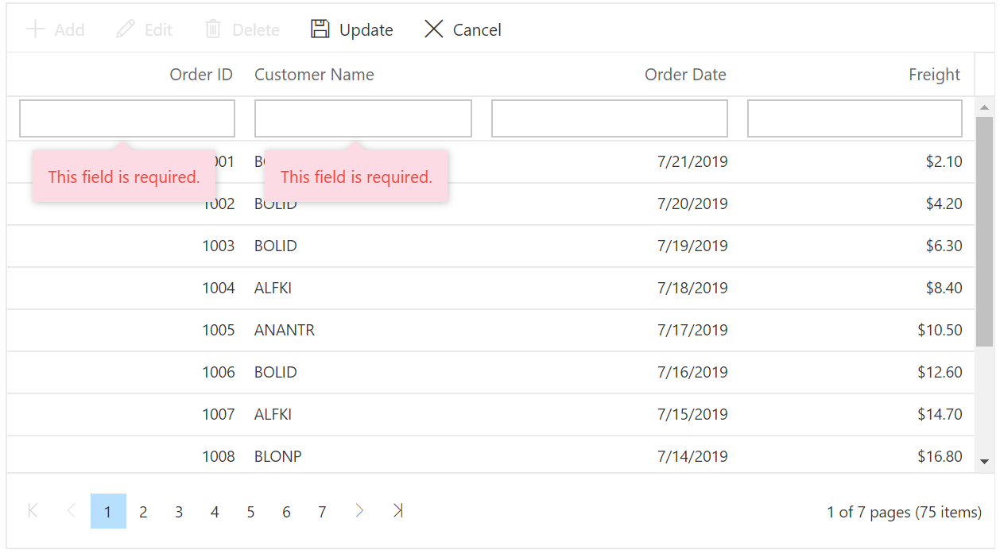
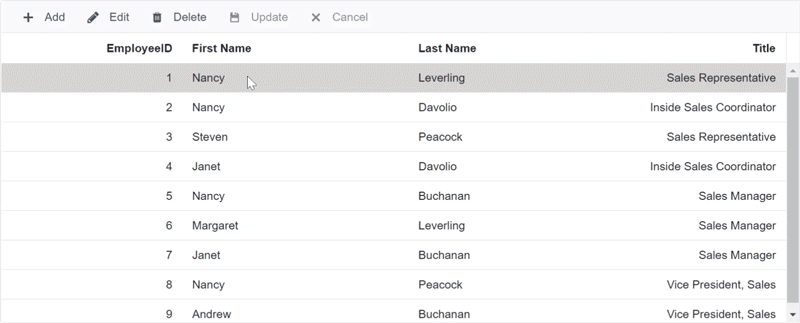
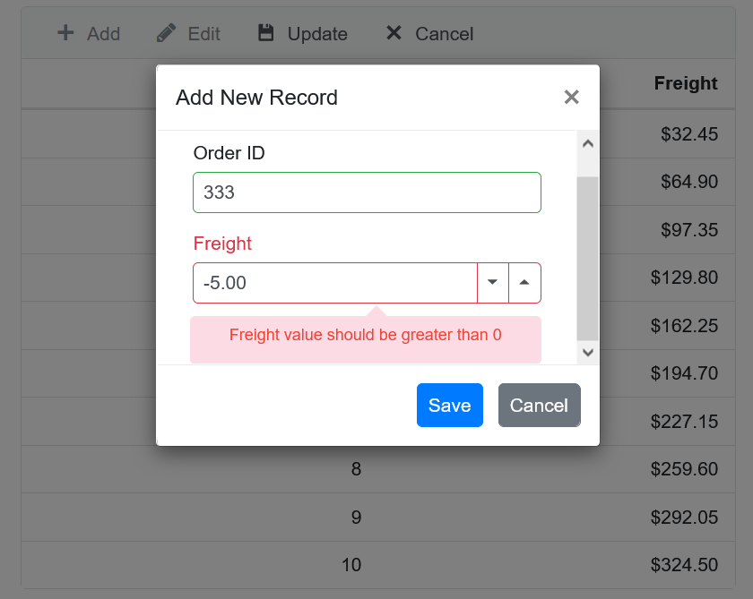
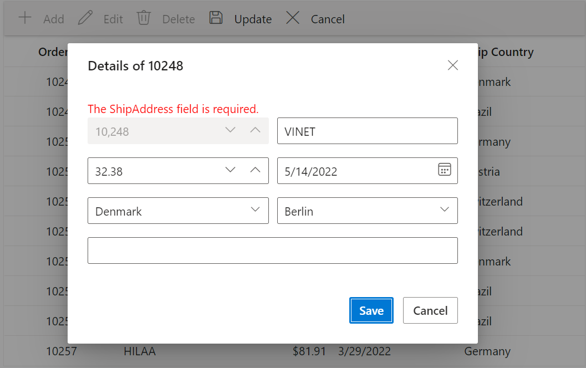

# Column Validation in Blazor DataGrid Component

Column validation allows you to validate the edited or added row data and it display errors for invalid fields before saving data. DataGrid uses **Form Validator** library for column validation. You can set validation rules by defining the [ValidationRules](https://help.syncfusion.com/cr/blazor/Syncfusion.Blazor.Grids.GridColumn.html#Syncfusion_Blazor_Grids_GridColumn_ValidationRules).

N> Validation in datagrid works based on the Microsoft Blazor EditForm behavior. So once the validation message is shown then it will be again validated only during the form submit or when you focus out from that particular field. Refer the [Microsoft Validation](https://learn.microsoft.com/en-us/aspnet/core/blazor/forms-and-input-components?view=aspnetcore-5.0#data-annotations-validator-component-and-custom-validation) for further reference.

```cshtml
@using Syncfusion.Blazor.Grids

<SfGrid DataSource="@Orders" Height="315" AllowPaging="true" Toolbar="@(new List<string>() { "Add", "Edit", "Delete", "Update", "Cancel" })">
    <GridEditSettings AllowAdding="true" AllowEditing="true" AllowDeleting="true"></GridEditSettings>
    <GridColumns>
        <GridColumn Field=@nameof(Order.OrderID) HeaderText="Order ID" IsPrimaryKey="true" ValidationRules="@(new ValidationRules{ Required= true })" TextAlign="TextAlign.Right" Width="120"></GridColumn>
        <GridColumn Field=@nameof(Order.CustomerID) HeaderText="Customer Name" Width="120" ValidationRules="@(new ValidationRules{ Required= true, MinLength = 3 })"></GridColumn>
        <GridColumn Field=@nameof(Order.OrderDate) HeaderText=" Order Date" EditType="EditType.DatePickerEdit" Format="d" TextAlign="TextAlign.Right" Width="130" Type="ColumnType.Date"></GridColumn>
        <GridColumn Field=@nameof(Order.Freight) HeaderText="Freight" Format="C2" TextAlign="TextAlign.Right" Width="120"></GridColumn>
    </GridColumns>
</SfGrid>

@code{
    public List<Order> Orders { get; set; }

    protected override void OnInitialized()
    {
        Orders = Enumerable.Range(1, 75).Select(x => new Order()
        {
            OrderID = 1000 + x,
            CustomerID = (new string[] { "ALFKI", "ANANTR", "ANTON", "BLONP", "BOLID" })[new Random().Next(5)],
            Freight = 2.1 * x,
            OrderDate = DateTime.Now.AddDays(-x),
        }).ToList();
    }

    public class Order
    {
        public int? OrderID { get; set; }
        public string CustomerID { get; set; }
        public DateTime? OrderDate { get; set; }
        public double? Freight { get; set; }
    }
}
```

The following screenshot represents the Column Validation in Normal Editing.



## Data annotation

Data Annotation validation attributes are used to validate the fields in the DataGrid. The validation attributes that are supported in the DataGrid are listed below.

| Attribute Name | Functionality |
|-------|---------|
| Validations are,<br><br>1. RequiredAttribute<br>2. StringLengthAttribute<br>3. RangeAttribute<br>4. RegularExpressionAttribute<br>5. MinLengthAttribute<br>6. MaxLengthAttribute<br>7. EmailAddressAttribute<br>8. CompareAttribute<br>9. DataTypeAttribute<br>10.  DataType.Custom<br>11. DataType.Date<br>12. DataType.DateTime<br>13. DataType.EmailAddress<br>14. DataType.ImageUrl<br>15. DataType.Url | The data annotation validation attributes are used as `validation rules` in the DataGrid CRUD operations |

More information on the data annotation can be found in this [documentation](https://blazor.syncfusion.com/documentation/datagrid/data-annotation) section.

## Custom validation

Custom Validation allows the users to customize the validations manually according to the user's criteria.

Custom Validation can be used by overriding the IsValid method inside the class inherits the Validation Attribute. All the validations are done inside the IsValid method.

The following sample code demonstrates custom validations implemented in the fields EmployeeID and Freight.

```cshtml
@using Syncfusion.Blazor.Grids;
@using System.ComponentModel.DataAnnotations;
@using System.Text.RegularExpressions;

<SfGrid DataSource="EmployeeList" AllowPaging="true" Toolbar="toolbar">
    <GridEditSettings AllowAdding="true" AllowDeleting="true" AllowEditing="true"></GridEditSettings>
    <GridColumns>
        <GridColumn Field="@nameof(EmployeeDetails.OrderID)" HeaderText="Order ID" TextAlign="TextAlign.Right" IsPrimaryKey="true" > </GridColumn>
        <GridColumn Field="@nameof(EmployeeDetails.CustomerName)" HeaderText="Customer Name" TextAlign="TextAlign.Left"> </GridColumn>
        <GridColumn Field="@nameof(EmployeeDetails.EmployeeID)" HeaderText="Employee ID" TextAlign="TextAlign.Right"> </GridColumn>
        <GridColumn Field="@nameof(EmployeeDetails.Freight)" HeaderText="Freight" TextAlign="TextAlign.Right" Format="C2"> </GridColumn>
        <GridColumn Field="@nameof(EmployeeDetails.ShipCity)" HeaderText="Ship City" TextAlign="TextAlign.Left"> </GridColumn>
        <GridColumn Field="@nameof(EmployeeDetails.ShipName)" HeaderText="Ship Name" TextAlign="TextAlign.Left"> </GridColumn>
    </GridColumns>
</SfGrid>

@code
{
    List<EmployeeDetails> EmployeeList;
    string[] toolbar = new string[] { "Add", "Edit", "Delete", "Update", "Cancel" };
    protected override void OnInitialized()
    {
        base.OnInitialized();
        EmployeeList = Enumerable.Range(1, 20).Select(x => new EmployeeDetails()
        {
            OrderID = 10240 + x,
            CustomerName = new string[] { "VINET", "TOSMP", "HANAR", "VICTE" }[new Random().Next(4)],
            EmployeeID = x,
            Freight = new float[] { 32.28f, 22.90f, 30.99f, 50.52f }[new Random().Next(4)],
            ShipCity = new string[] { "Reims", "Munster", "Rio de Janeir", "Lyon" }[new Random().Next(4)],
            ShipName = new string[] { "Vins et alocools chevalie", "Toms Spezialitaten", "Hanari Carnes", "Supremes delices" }[new Random().Next(4)]
        }).ToList();
    }
    public class EmployeeDetails
    {
        [Required]
        public int? OrderID { get; set; }
        public string CustomerName { get; set; }
        [CustomValidationEmployeeID]
        public int EmployeeID { get; set; }
        [CustomValidationFreight]
        public float Freight { get; set; }
        public string ShipCity { get; set; }
        public string ShipName { get; set; }
    }
    public class CustomValidationEmployeeID : ValidationAttribute
    {
        protected override ValidationResult IsValid(object value, ValidationContext validationContext)
        {
            if (value != null)
            {
                int employeeID = Convert.ToInt16(value);
                if (employeeID >= 1)
                {
                    return ValidationResult.Success;
                }
                else
                {
                    return new ValidationResult("Employee ID value should be greater than zero");
                }
            }
            else
            {
                return new ValidationResult("Employee ID value is required");
            }
        }
    }
    public class CustomValidationFreight : ValidationAttribute
    {
        protected override ValidationResult IsValid(object value, ValidationContext validationContext)
        {
            if (value != null)
            {
                float freight = (float)value;
                if (freight >= 1 && freight <= 10000)
                {
                    return ValidationResult.Success;
                }
                else
                {
                    return new ValidationResult("Freight value should between 1 and 10,000");
                }
            }
            else
            {
                return new ValidationResult("Freight value  is required");
            }
        }
    }
}
```

### Validate complex column using data annotation attribute

You can perform validation for complex data binding columns using the [ValidateComplexType](https://learn.microsoft.com/en-us/aspnet/core/blazor/forms-and-input-components?view=aspnetcore-5.0#data-annotations-validator-component-and-custom-validation) attribute of data annotation.

In the following sample, you must use the `ValidateComplexType` attribute for the EmployeeName class and display custom message in the "First Name" column using the `RequiredAttribute` of data annotation.

```cshtml
@using Syncfusion.Blazor.Grids
@using System.ComponentModel.DataAnnotations;

<SfGrid DataSource="@Employees" Height="315" AllowSorting=true Toolbar="@(new List<string>() { "Add", "Edit", "Delete", "Update", "Cancel" })">
     <GridEditSettings AllowAdding="true" AllowEditing="true" AllowDeleting="true"></GridEditSettings>
    <GridColumns>
        <GridColumn Field=@nameof(EmployeeData.EmployeeID) HeaderText="EmployeeID" IsPrimaryKey="true" TextAlign="TextAlign.Right" Width="120"></GridColumn>
        <GridColumn Field="Name.FirstName" HeaderText="First Name" Width="150"></GridColumn>
        <GridColumn Field="Name.LastName" HeaderText="Last Name"Width="130"></GridColumn>
        <GridColumn Field=@nameof(EmployeeData.Title) HeaderText="Title" Format="C2" TextAlign="TextAlign.Right" Width="120"></GridColumn>
    </GridColumns>
</SfGrid>

@code{
    public List<EmployeeData> Employees { get; set; }

    protected override void OnInitialized()
    {
    Employees = Enumerable.Range(1, 9).Select(x => new EmployeeData()
    {
        EmployeeID = x,
        Name = new EmployeeName() {
            FirstName = (new string[] { "Nancy", "Andrew", "Janet", "Margaret", "Steven" })[new Random().Next(5)],
            LastName =(new string[] { "Davolio", "Fuller", "Leverling", "Peacock", "Buchanan" })[new Random().Next(5)]
        },
        Title = (new string[] { "Sales Representative", "Vice President, Sales", "Sales Manager",
                                              "Inside Sales Coordinator" })[new Random().Next(4)],
    }).ToList();
    }

    public class EmployeeData
    {
        [Required]
        public int? EmployeeID { get; set; }
        [ValidateComplexType]
        public EmployeeName Name { get; set; }
        public string Title { get; set; }
    }

    public class EmployeeName
    {
        [Required(ErrorMessage ="First name should not be empty")]
        public string FirstName { get; set; }
        public string LastName { get; set; }
    }
}
```



## Custom validator component

Apart from using default validation and custom validation, there are cases where you might want to use your validator component to validate the grid edit form. Such cases can be achieved using the **Validator** property of the **GridEditSettings** component which accepts a validation component and inject it inside the **EditForm** of the grid. Inside the **Validator**, you can access the data using the implicit named parameter context which is of type [ValidatorTemplateContext](https://help.syncfusion.com/cr/blazor/Syncfusion.Blazor.Grids.ValidatorTemplateContext.html).

For creating a form validator component you can refer [here](https://learn.microsoft.com/en-us/aspnet/core/blazor/forms-and-input-components?view=aspnetcore-5.0#validator-components).

In the below code example, the following things have been done.

* Created a form validator component named `MyCustomValidator` which accepts [ValidatorTemplateContext](https://help.syncfusion.com/cr/blazor/Syncfusion.Blazor.Grids.ValidatorTemplateContext.html) value as parameter.
* Used the `MyCustomValidator` component inside the **Validator** property.
* This validator component will check whether Freight value is in between 0 to 100.
* Displayed the validation error messages using **ValidationMessage** component.

```csharp
[MyCustomValidator.cs]

    using Microsoft.AspNetCore.Components;
    using Microsoft.AspNetCore.Components.Forms;
    using Syncfusion.Blazor.Grids;

    public class MyCustomValidator : ComponentBase
    {
        [Parameter]
        public ValidatorTemplateContext context { get; set; }

        private ValidationMessageStore messageStore;

        [CascadingParameter]
        private EditContext CurrentEditContext { get; set; }

        protected override void OnInitialized()
        {
            messageStore = new ValidationMessageStore(CurrentEditContext);

            CurrentEditContext.OnValidationRequested += ValidateRequested;
            CurrentEditContext.OnFieldChanged += ValidateField;
        }

        protected void HandleValidation(FieldIdentifier identifier)
        {
            if (identifier.FieldName.Equals("Freight"))
            {
                messageStore.Clear(identifier);
                if ((context.Data as OrdersDetails).Freight < 0)
                {
                    messageStore.Add(identifier, "Freight value should be greater than 0");
                }
                else if ((context.Data as OrdersDetails).Freight > 100)
                {
                    messageStore.Add(identifier, "Freight value should be lesser than 100");
                }
                else
                {
                    messageStore.Clear(identifier);
                }
            }
        }

        protected void ValidateField(object editContext, FieldChangedEventArgs fieldChangedEventArgs)
        {
            HandleValidation(fieldChangedEventArgs.FieldIdentifier);
        }

        private void ValidateRequested(object editContext, ValidationRequestedEventArgs validationEventArgs)
        {
            HandleValidation(CurrentEditContext.Field("Field"));
        }

    }
```

```csharp
[Index.razor]

<SfGrid TValue="OrdersDetails" DataSource="GridData"
        Toolbar="@(new List<string>() { "Add", "Edit", "Update", "Cancel" })">
        <GridEditSettings AllowAdding="true" AllowEditing="true" Mode="EditMode.Dialog">
            <Validator>
                @{
                    ValidatorTemplateContext txt = context as ValidatorTemplateContext;
                }
                <MyCustomValidator context="@txt"></MyCustomValidator>

                <ValidationMessage For="@(() => (txt.Data as OrdersDetails).Freight)"></ValidationMessage>

            </Validator>
        </GridEditSettings>
        <GridColumns>
            <GridColumn Field=@nameof(OrdersDetails.OrderID) HeaderText="Order ID" TextAlign="TextAlign.Right" Width="120" IsPrimaryKey="true"></GridColumn>
            <GridColumn Field=@nameof(OrdersDetails.Freight) HeaderText="Freight" Format="C2" TextAlign="TextAlign.Right" Width="120"></GridColumn>
        </GridColumns>
    </SfGrid>
@code{

    private List<OrdersDetails> GridData;

    protected override void OnInitialized()
    {
        Random r = new Random();
        GridData = Enumerable.Range(1, 10).Select(x => new OrdersDetails()
        {
            OrderID = x,
            Freight = 32.45 * x
        }).ToList();
    }
}
```


## Display validation message using in-built tooltip

In the above code example, you can see that **ValidationMessage** component is used, this might be not suitable when using Inline editing or batch editing. In such cases, you can use the in-built validation tooltip to show those error messages by using `ValidatorTemplateContext.ShowValidationMessage(fieldName, IsValid, Message)` method.

Now the HandleValidation method of the MyCustomValidator component would be changed like below.

```csharp

        protected void HandleValidation(FieldIdentifier identifier)
        {
            if (identifier.FieldName.Equals("Freight"))
            {
                messageStore.Clear(identifier);
                if ((context.Data as OrdersDetails).Freight < 0)
                {
                    messageStore.Add(identifier, "Freight value should be greater than 0");
                    context.ShowValidationMessage("Freight", false, "Freight value should be greater than 0");
                }
                else if ((context.Data as OrdersDetails).Freight > 100)
                {
                    messageStore.Add(identifier, "Freight value should be lesser than 100");
                    context.ShowValidationMessage("Freight", false, "Freight value should be lesser than 100");
                }
                else
                {
                    messageStore.Clear(identifier);
                    context.ShowValidationMessage("Freight", true, null);
                }
            }
        }

```




## Disable in-built validator component

**Validator** property can also be used to disable the in-built validator component used by the grid. For instance, by default, the grid uses two validator components, **DataAnnotationValidator** and an internal [ValidationRules](https://help.syncfusion.com/cr/blazor/Syncfusion.Blazor.Grids.GridColumn.html#Syncfusion_Blazor_Grids_GridColumn_ValidationRules) property handling validator, for handling edit form validation. If you are willing to use only the **DataAnnotationValidator** component, then it could be simply achieved by using the below code.

```cshtml
<SfGrid TValue="OrdersDetails" DataSource="GridData"
        Toolbar="@(new List<string>() { "Add", "Edit", "Update", "Cancel" })">
        <GridEditSettings AllowAdding="true" AllowEditing="true" Mode="EditMode.Dialog">
            <Validator>
               <DataAnnotationsValidator></DataAnnotationsValidator>
            </Validator>
        </GridEditSettings>
        <GridColumns>
            <GridColumn Field=@nameof(OrdersDetails.OrderID) HeaderText="Order ID" TextAlign="TextAlign.Right" Width="120" IsPrimaryKey="true"></GridColumn>
            <GridColumn Field=@nameof(OrdersDetails.Freight) HeaderText="Freight" Format="C2" TextAlign="TextAlign.Right" Width="120"></GridColumn>
        </GridColumns>
    </SfGrid>
@code{

    private List<OrdersDetails> GridData;

    protected override void OnInitialized()
    {
        Random r = new Random();
        GridData = Enumerable.Range(1, 10).Select(x => new OrdersDetails()
        {
            OrderID = x,
            Freight = 32.45 * x
        }).ToList();
    }
}
```

## Display validation message in dialog template

Use the form validation to display a validation message for a column that is not defined in the grid.

Use the **Validator** property to display a validation message for one of the fields in the dialog template that is not defined in the Grid column. The validation message for the **ShipAddress** is displayed in the dialog template in the following example. In the grid column, the **ShipAddress** field is not defined.

N> The validation message for fields that are not defined in the grid column will be shown as the validation summary (top of the dialog edit form) in the dialog edit form.

N> You can find the fully working sample [here](https://github.com/SyncfusionExamples/blazor-datagrid-display-validation-message-in-dialog-template).

```cshtml
@using Syncfusion.Blazor.Grids
@using Syncfusion.Blazor.Calendars
@using Syncfusion.Blazor.DropDowns
@using Syncfusion.Blazor.Inputs
@using System.ComponentModel.DataAnnotations

<SfGrid DataSource="@GridData" Toolbar="@(new string[] {"Add", "Edit" ,"Delete","Update","Cancel" })">
    <GridEditSettings AllowAdding="true" AllowEditing="true" AllowDeleting="true" Mode="@EditMode.Dialog">
        <Validator>
            <DataAnnotationsValidator></DataAnnotationsValidator>
        </Validator>
        <Template>
            @{
                var Order = (context as OrdersDetails);
                <div>
                    <ValidationMessage For="() => Order.ShipCountry" />
                    <ValidationMessage For="() => Order.ShipAddress" />
                    <div class="form-row">
                        <div class="form-group col-md-6">
                            <label class="e-float-text e-label-top">Order ID</label>
                            <SfNumericTextBox ID="OrderID" @bind-Value="@(Order.OrderID)" Enabled="@((Order.OrderID == null) ? true : false)"></SfNumericTextBox>
                        </div>
                        <div class="form-group col-md-6">
                            <label class="e-float-text e-label-top">Customer Name</label>
                            <SfAutoComplete ID="customerID" TItem="OrdersDetails" @bind-Value="@(Order.CustomerID)" TValue="string" DataSource="@GridData">
                                <AutoCompleteFieldSettings Value="CustomerID"></AutoCompleteFieldSettings>
                            </SfAutoComplete>
                        </div>
                    </div>
                    <div class="form-row">
                        <div class="form-group col-md-6">
                            <label class="e-float-text e-label-top">Freight</label>
                            <SfNumericTextBox ID="Freight" @bind-Value="@(Order.Freight)" TValue="double?"></SfNumericTextBox>
                        </div>
                        <div class="form-group col-md-6">
                            <label class="e-float-text e-label-top">Order Date</label>
                            <SfDatePicker ID="OrderDate" @bind-Value="@(Order.OrderDate)"></SfDatePicker>
                        </div>
                    </div>
                    <div class="form-row">
                        <div class="form-group col-md-6">
                            <label class="e-float-text e-label-top">Ship Country</label>
                            <SfDropDownList ID="ShipCountry" @bind-Value="@(Order.ShipCountry)" TItem="OrdersDetails" TValue="string" DataSource="@GridData">
                                <DropDownListFieldSettings Value="ShipCountry" Text="ShipCountry"></DropDownListFieldSettings>
                            </SfDropDownList>
                        </div>
                        <div class="form-group col-md-6">
                            <label class="e-float-text e-label-top">Ship City</label>
                            <SfDropDownList ID="ShipCity" @bind-Value="@(Order.ShipCity)" TItem="OrdersDetails" TValue="string" DataSource="@GridData">
                                <DropDownListFieldSettings Value="ShipCity" Text="ShipCity"></DropDownListFieldSettings>
                            </SfDropDownList>
                        </div>
                    </div>
                    <div class="form-row">
                        <div class="form-group col-md-12">
                            <label class="e-float-text e-label-top">Ship Address</label>
                            <SfTextBox ID="ShipAddress" @bind-Value="@(Order.ShipAddress)"></SfTextBox>
                        </div>
                    </div>
                </div>
            }
        </Template>
    </GridEditSettings>
    <GridColumns>
        <GridColumn Field=@nameof(OrdersDetails.OrderID) HeaderText="Order ID" IsPrimaryKey="true" TextAlign="@TextAlign.Center" HeaderTextAlign="@TextAlign.Center" Width="140"></GridColumn>
        <GridColumn Field=@nameof(OrdersDetails.CustomerID) HeaderText="Customer Name" Width="150"></GridColumn>
        <GridColumn Field=@nameof(OrdersDetails.Freight) HeaderText="Freight" Format="C2" Width="140" TextAlign="@TextAlign.Right" HeaderTextAlign="@TextAlign.Right"></GridColumn>
        <GridColumn Field=@nameof(OrdersDetails.OrderDate) HeaderText="Order Date" Format="d" Type="ColumnType.Date" Width="160"></GridColumn>
        <GridColumn Field=@nameof(OrdersDetails.ShipCountry) HeaderText="Ship Country" Width="150"></GridColumn>
    </GridColumns>
</SfGrid>

@code{
    public List<OrdersDetails> GridData = new List<OrdersDetails>
    {
        new OrdersDetails() { OrderID = 10248, CustomerID = "VINET", Freight = 32.38, ShipCity = "Berlin", OrderDate = DateTime.Now.AddDays(-2), ShipName = "Vins et alcools Chevalier", ShipCountry = "Denmark", ShipAddress = "Kirchgasse 6" },
        new OrdersDetails() { OrderID = 10249, CustomerID = "TOMSP", Freight = 11.61, ShipCity = "Madrid", OrderDate = DateTime.Now.AddDays(-5), ShipName = "Toms Spezialitäten", ShipCountry = "Brazil", ShipAddress = "Avda. Azteca 123" },
        new OrdersDetails() { OrderID = 10250, CustomerID = "HANAR", Freight = 65.83, ShipCity = "Cholchester", OrderDate = DateTime.Now.AddDays(-12), ShipName = "Hanari Carnes", ShipCountry = "Germany", ShipAddress = "Carrera 52 con Ave. Bolívar #65-98 Llano Largo" },
        new OrdersDetails() { OrderID = 10251, CustomerID = "VICTE", Freight = 41.34, ShipCity = "Marseille", OrderDate = DateTime.Now.AddDays(-18), ShipName = "Victuailles en stock", ShipCountry = "Austria", ShipAddress = "Magazinweg 7" },
        new OrdersDetails() { OrderID = 10252, CustomerID = "SUPRD", Freight = 51.3, ShipCity = "Tsawassen", OrderDate = DateTime.Now.AddDays(-22), ShipName = "Suprêmes délices", ShipCountry = "Switzerland", ShipAddress = "1029 - 12th Ave. S." },
        new OrdersDetails() { OrderID = 10253, CustomerID = "HANAR", Freight = 58.17, ShipCity = "Tsawassen", OrderDate = DateTime.Now.AddDays(-26), ShipName = "Hanari Carnes", ShipCountry = "Switzerland", ShipAddress = "1029 - 12th Ave. S." },
        new OrdersDetails() { OrderID = 10254, CustomerID = "CHOPS", Freight = 22.98, ShipCity = "Berlin", OrderDate = DateTime.Now.AddDays(-34), ShipName = "Chop-suey Chinese", ShipCountry = "Denmark", ShipAddress = "Kirchgasse 6" },
        new OrdersDetails() { OrderID = 10255, CustomerID = "RICSU", Freight = 148.33, ShipCity = "Madrid", OrderDate = DateTime.Now.AddDays(-39), ShipName = "Richter Supermarket", ShipCountry = "Brazil", ShipAddress = "Avda. Azteca 123" },
        new OrdersDetails() { OrderID = 10256, CustomerID = "WELLI", Freight = 13.97, ShipCity = "Madrid", OrderDate = DateTime.Now.AddDays(-43), ShipName = "Wellington Importadora", ShipCountry = "Brazil", ShipAddress = "Avda. Azteca 123" },
        new OrdersDetails() { OrderID = 10257, CustomerID = "HILAA", Freight = 81.91, ShipCity = "Cholchester", OrderDate = DateTime.Now.AddDays(-48), ShipName = "HILARION-Abastos", ShipCountry = "Germany", ShipAddress = "Carrera 52 con Ave. Bolívar #65-98 Llano Largo" }
    };

    public class OrdersDetails
    {
        public int? OrderID { get; set; }
        public string CustomerID { get; set; }
        public double? Freight { get; set; }
        public string ShipCity { get; set; }
        public DateTime OrderDate { get; set; }
        public string ShipName { get; set; }
        [Required]
        public string ShipCountry { get; set; }
        [Required]
        public string ShipAddress { get; set; }
    }
}

```


