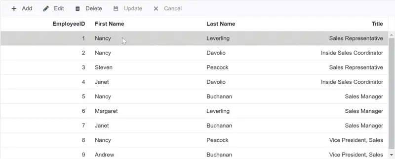
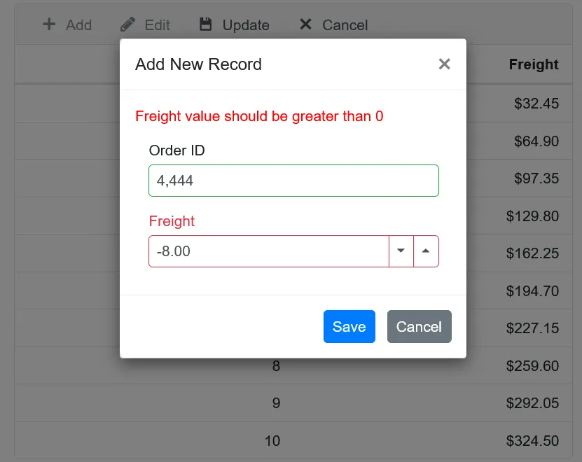
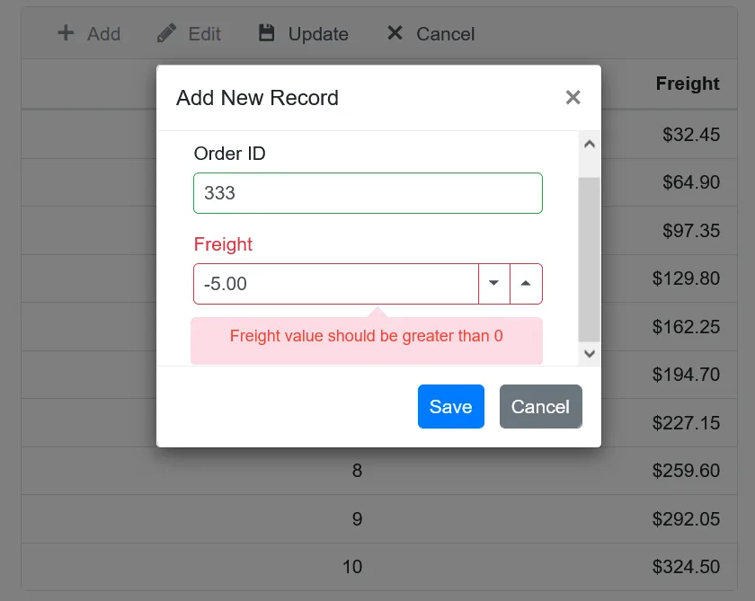

# Column validation in Blazor Data Grid

Validation is essential for maintaining data integrity in applications. The [Blazor Data Grid](https://www.syncfusion.com/blazor-components/blazor-datagrid) provides built-in support for reliable data validation. The feature ensures that entered or modified data adheres to predefined rules, helping prevent errors and maintain the accuracy of displayed information.

## Column validation

Column validation rules ensure that edited or newly added row data meets specific criteria before saving. Validation rules enforce constraints on individual columns and maintain data integrity.

Validation rules are defined using the [GridColumn.ValidationRules](https://help.syncfusion.com/cr/blazor/Syncfusion.Blazor.Grids.GridColumn.html#Syncfusion_Blazor_Grids_GridColumn_ValidationRules) property, which specifies rules that validate column values. The validation mechanism uses the built-in `FormValidator` component.

> Validation in the Data Grid is based on the Microsoft Blazor `EditForm` component. Once a validation message is displayed, the field is revalidated only during form submission or when focus is moved away from the field. Refer to the [Microsoft Validation](https://learn.microsoft.com/en-us/aspnet/core/blazor/forms/validation#data-annotations-validator-component-and-custom-validation) documentation for additional details.



@using Syncfusion.Blazor.Grids

<SfGrid DataSource="@OrderData" Toolbar="@(new List<string>() { "Add", "Edit","Delete", "Update", "Cancel" })">
    <GridEditSettings AllowAdding="true" AllowEditing="true" AllowDeleting="true" Mode="EditMode.Normal"></GridEditSettings>
    <GridColumns>
        <GridColumn Field=@nameof(OrderDetails.OrderID) HeaderText="Order ID" IsPrimaryKey="true" ValidationRules="@(new ValidationRules{ Required=true, Min=1})" TextAlign="TextAlign.Right" Width="120"></GridColumn>
        <GridColumn Field=@nameof(OrderDetails.CustomerID) HeaderText="Customer Name" ValidationRules="@(new ValidationRules{ Required=true, MinLength=3})" Width="120"></GridColumn>
        <GridColumn Field=@nameof(OrderDetails.Freight) HeaderText="Freight" ValidationRules="@(new ValidationRules{ Required=true, Min=1, Max=1000})" Format="C2" TextAlign="TextAlign.Right" EditType="EditType.NumericEdit" Width="120"></GridColumn>
        <GridColumn Field=@nameof(OrderDetails.OrderDate) HeaderText="Order Date" EditType="EditType.DatePickerEdit" Format="d" TextAlign="TextAlign.Right" Width="120"></GridColumn>
        <GridColumn Field=@nameof(OrderDetails.ShipCountry) HeaderText="Ship Country" EditType="EditType.DropDownEdit" Width="150"></GridColumn>
    </GridColumns>
</SfGrid>
@code {
    public List<OrderDetails> OrderData { get; set; }
    protected override void OnInitialized()
    {
        OrderData = OrderDetails.GetAllRecords();
    }
}


public class OrderDetails
{
    public static List<OrderDetails> Order = new List<OrderDetails>();
    public OrderDetails(int OrderID, string CustomerID, double Freight, string ShipCountry, DateTime OrderDate)
    {
        this.OrderID = OrderID;
        this.CustomerID = CustomerID;
        this.Freight = Freight;
        this.ShipCountry = ShipCountry;
        this.OrderDate = OrderDate;
    }
    public static List<OrderDetails> GetAllRecords()
    {
        if (Order.Count == 0)
        {
            Order.Add(new OrderDetails(10248, "VINET", 32.38, "France", new DateTime(1996, 7, 4)));
            Order.Add(new OrderDetails(10249, "TOMSP", 11.61, "Germany", new DateTime(1996, 7, 5)));
            Order.Add(new OrderDetails(10250, "HANAR", 65.83, "Brazil", new DateTime(1996, 7, 8)));
            Order.Add(new OrderDetails(10251, "VICTE", 41.34, "France", new DateTime(1996, 7, 8)));
            Order.Add(new OrderDetails(10252, "SUPRD", 51.3, "Belgium", new DateTime(1996, 7, 9)));
            Order.Add(new OrderDetails(10253, "HANAR", 58.17, "Brazil", new DateTime(1996, 7, 10)));
            Order.Add(new OrderDetails(10254, "CHOPS", 22.98, "Switzerland", new DateTime(1996, 7, 11)));
            Order.Add(new OrderDetails(10255, "RICSU", 148.33, "Switzerland", new DateTime(1996, 7, 12)));
            Order.Add(new OrderDetails(10256, "WELLI", 13.97, "Brazil", new DateTime(1996, 7, 15)));
            Order.Add(new OrderDetails(10257, "HILAA", 81.91, "Venezuela", new DateTime(1996, 7, 16)));
            Order.Add(new OrderDetails(10258, "ERNSH", 140.51, "Austria", new DateTime(1996, 7, 17)));
            Order.Add(new OrderDetails(10259, "CENTC", 3.25, "Mexico", new DateTime(1996, 7, 18)));
            Order.Add(new OrderDetails(10260, "OTTIK", 55.09, "Germany", new DateTime(1996, 7, 19)));
            Order.Add(new OrderDetails(10261, "QUEDE", 3.05, "Brazil", new DateTime(1996, 7, 19)));
            Order.Add(new OrderDetails(10262, "RATTC", 48.29, "USA", new DateTime(1996, 7, 22)));
        }
        return Order;
    }
    public int OrderID { get; set; }
    public string CustomerID { get; set; }
    public double Freight { get; set; }
    public string ShipCountry { get; set; }
    public DateTime OrderDate { get; set; }
}





## Data annotation

Data annotation attributes define validation rules for fields in the Blazor Data Grid. These rules are applied during CRUD operations to ensure data integrity.

| Attribute Name | Functionality |
|---------------|--------------|
| 1. RequiredAttribute<br>2. StringLengthAttribute<br>3. RangeAttribute<br>4. RegularExpressionAttribute<br>5. MinLengthAttribute<br>6. MaxLengthAttribute<br>7. EmailAddressAttribute<br>8. CompareAttribute<br>9. DataTypeAttribute<br>10. DataType.Custom<br>11. DataType.Date<br>12. DataType.DateTime<br>13. DataType.EmailAddress<br>14. DataType.ImageUrl<br>15. DataType.Url | The data annotation attributes are used as `validation rules` in Data Grid CRUD operations. |

> For more details, refer to the [Data Annotation](https://blazor.syncfusion.com/documentation/datagrid/data-annotation) documentation.

## Custom validation

Custom validation lets you define validation logic for specific application requirements.

To implement custom validation, define a class that inherits from the `ValidationAttribute` class and override the **IsValid** method. All validation logic should be placed within the **IsValid** method.

Custom validation applies to the **EmployeeID** and **Freight** fields.



@using Syncfusion.Blazor.Grids;
@using System.ComponentModel.DataAnnotations

<SfGrid DataSource="OrderData" Toolbar="@(new List<string>() { "Add", "Edit","Delete", "Update", "Cancel" })">
    <GridEditSettings AllowAdding="true" AllowDeleting="true" AllowEditing="true" Mode="EditMode.Normal"></GridEditSettings>
    <GridColumns>
        <GridColumn Field=@nameof(OrderDetails.OrderID) HeaderText="Order ID" TextAlign="TextAlign.Right" IsPrimaryKey="true" ></GridColumn>
        <GridColumn Field=@nameof(OrderDetails.CustomerID) HeaderText="Customer Name"> </GridColumn>
        <GridColumn Field=@nameof(OrderDetails.EmployeeID) HeaderText="Employee ID" TextAlign="TextAlign.Right"></GridColumn>
        <GridColumn Field=@nameof(OrderDetails.Freight) HeaderText="Freight" TextAlign="TextAlign.Right" Format="C2"></GridColumn>
        <GridColumn Field=@nameof(OrderDetails.ShipCountry) HeaderText="Ship Country" EditType="EditType.DropDownEdit" Width="150"></GridColumn>
    </GridColumns>
</SfGrid>

@code{
    public List<OrderDetails> OrderData { get; set; }
    protected override void OnInitialized()
    {
        OrderData = OrderDetails.GetAllRecords();
    }
}


using System.ComponentModel.DataAnnotations;
public class OrderDetails
{
    public static List<OrderDetails> Order = new List<OrderDetails>();
    public OrderDetails(int OrderID, string CustomerID, double Freight, string ShipCountry, int EmployeeID)
    {
        this.OrderID = OrderID;
        this.CustomerID = CustomerID;
        this.Freight = Freight;
        this.ShipCountry = ShipCountry;
        this.EmployeeID = EmployeeID;
    }
    public static List<OrderDetails> GetAllRecords()
    {
        if (Order.Count == 0)
        {
            Order.Add(new OrderDetails(10248, "VINET", 32.38, "France", 5));
            Order.Add(new OrderDetails(10249, "TOMSP", 11.61, "Germany", 6));
            Order.Add(new OrderDetails(10250, "HANAR", 65.83, "Brazil", 4));
            Order.Add(new OrderDetails(10251, "VICTE", 41.34, "France", 3));
            Order.Add(new OrderDetails(10252, "SUPRD", 51.3, "Belgium", 4));
            Order.Add(new OrderDetails(10253, "HANAR", 58.17, "Brazil", 3));
            Order.Add(new OrderDetails(10254, "CHOPS", 22.98, "Switzerland", 5));
            Order.Add(new OrderDetails(10255, "RICSU", 148.33, "Switzerland", 9));
            Order.Add(new OrderDetails(10256, "WELLI", 13.97, "Brazil", 3));
            Order.Add(new OrderDetails(10257, "HILAA", 81.91, "Venezuela", 4));
            Order.Add(new OrderDetails(10258, "ERNSH", 140.51, "Austria", 1));
            Order.Add(new OrderDetails(10259, "CENTC", 3.25, "Mexico", 4));
            Order.Add(new OrderDetails(10260, "OTTIK", 55.09, "Germany", 4));
            Order.Add(new OrderDetails(10261, "QUEDE", 3.05, "Brazil", 4));
            Order.Add(new OrderDetails(10262, "RATTC", 48.29, "USA", 8));
        }
        return Order;
    }
    [Required]
    public int OrderID { get; set; }
    public string CustomerID { get; set; }
    [CustomValidationFreight]
    public double Freight { get; set; }
    public string ShipCountry { get; set; }
    [CustomValidationEmployeeID]
    public int EmployeeID { get; set; }
}

public class CustomValidationEmployeeID : ValidationAttribute
{
    protected override ValidationResult? IsValid(object? value, ValidationContext validationContext)
    {
        if (value != null)
        {
            int EmployeeIdValue = Convert.ToInt32(value);
            if (EmployeeIdValue >= 1)
            {
                return ValidationResult.Success;
            }
            else
            {
                return new ValidationResult("Employee ID value should be greater than zero");
            }
        }
        else
        {
            return new ValidationResult("Employee ID value is required");
        }
    }
}

public class CustomValidationFreight : ValidationAttribute
{
    protected override ValidationResult? IsValid(object? value, ValidationContext validationContext)
    {
        if (value != null)
        {
            double FreightValue = Convert.ToDouble(value);
            if (FreightValue >= 1 && FreightValue <= 10000)
            {
                return ValidationResult.Success;
            }
            else
            {
                return new ValidationResult("Freight value should be between 1 and 10,000");
            }
        }
        else
        {
            return new ValidationResult("Freight value is required");
        }
    }
}





### Validate complex column using data annotation attribute

Complex data binding columns can be validated using the [ValidateComplexType](https://learn.microsoft.com/en-us/aspnet/core/blazor/forms/validation?view=aspnetcore-5.0#data-annotations-validator-component-and-custom-validation) attribute from data annotations.

The `ValidateComplexType` attribute enables validation of nested properties in the **EmployeeInfo** class. A custom validation message for the **FirstName** property uses `RequiredAttribute`.



@using Syncfusion.Blazor.Grids
@using Syncfusion.Blazor.Inputs

<SfGrid DataSource="@EmployeeData" Height="315" AllowSorting=true Toolbar="@(new List<string>() { "Add", "Edit", "Delete", "Update", "Cancel" })">
    <GridEditSettings AllowAdding="true" AllowEditing="true" AllowDeleting="true"></GridEditSettings>
    <GridColumns>
        <GridColumn Field=@nameof(EmployeeDetails.EmployeeID) HeaderText="EmployeeID" IsPrimaryKey="true" TextAlign="TextAlign.Right" Width="120"></GridColumn>
        <GridColumn Field="EmpDetails.FirstName" HeaderText="First Name" Width="150">
            <EditTemplate>
                <SfTextBox ID="EmpDetails___FirstName" Name="EmpDetails___FirstName" @bind-Value="@((context as EmployeeDetails).EmpDetails.FirstName)"></SfTextBox>
            </EditTemplate>
        </GridColumn>
        <GridColumn Field="EmpDetails.LastName" HeaderText="Last Name" Width="130">
            <EditTemplate>
                <SfTextBox ID="EmpDetails___LastName" Name="EmpDetails___LastName" @bind-Value="@((context as EmployeeDetails).EmpDetails.LastName)"></SfTextBox>
            </EditTemplate>
        </GridColumn>
        <GridColumn Field=@nameof(EmployeeDetails.Title) HeaderText="Title" Format="C2" TextAlign="TextAlign.Right" Width="120"></GridColumn>
    </GridColumns>
</SfGrid>

@code {
    public List<EmployeeDetails> EmployeeData { get; set; }
    protected override void OnInitialized()
    {
        EmployeeData = EmployeeDetails.GetAllRecords();
    } 
}


using System.ComponentModel.DataAnnotations;

public class EmployeeDetails
{
    public static List<EmployeeDetails> Employees = new List<EmployeeDetails>();
    public EmployeeDetails(int employeeID, string firstName, string lastName, string title)
    {
        EmployeeID = employeeID;
        EmpDetails = new EmployeeInfo
        {
            FirstName = firstName,
            LastName = lastName
        };
        Title = title;
    }
    public static List<EmployeeDetails> GetAllRecords()
    {
        if (Employees.Count == 0)
        {
            Employees.Add(new EmployeeDetails(1, "Nancy", "Davolio", "Sales Representative"));
            Employees.Add(new EmployeeDetails(2, "Andrew", "Fuller", "Vice President, Sales"));
            Employees.Add(new EmployeeDetails(3, "Janet", "Leverling", "Sales Representative"));
            Employees.Add(new EmployeeDetails(4, "Margaret", "Peacock", "Sales Representative"));
            Employees.Add(new EmployeeDetails(5, "Steven", "Buchanan", "Sales Manager"));
            Employees.Add(new EmployeeDetails(6, "Michael", "Suyama", "Sales Representative"));
            Employees.Add(new EmployeeDetails(7, "Robert", "King", "Sales Representative"));
            Employees.Add(new EmployeeDetails(8, "Laura", "Callahan", "Inside Sales Coordinator"));
            Employees.Add(new EmployeeDetails(9, "Anne", "Dodsworth", "Sales Representative"));
        }
        return Employees;
    }
    [Required]
    public int EmployeeID { get; set; }
    [ValidateComplexType]
    public EmployeeInfo EmpDetails { get; set; }
    public string Title { get; set; }
}
public class EmployeeInfo
{
    [Required(ErrorMessage = "First name should not be empty")]
    public string FirstName { get; set; }
    public string LastName { get; set; }
}



> Reference the package **Microsoft.AspNetCore.Components.DataAnnotations.Validation** to support complex type validation. Use the declaration below:

```csharp
<PackageReference Include="Microsoft.AspNetCore.Components.DataAnnotations.Validation" Version="3.2.0-rc1.20223.4" />

```



## Custom validator component

In scenarios where built-in or attribute-based validation is insufficient, a custom validator component can be used to validate the Grid edit form. The [Validator](https://help.syncfusion.com/cr/blazor/Syncfusion.Blazor.Grids.GridEditSettings.html#Syncfusion_Blazor_Grids_GridEditSettings_Validator) property of the [GridEditSettings](https://help.syncfusion.com/cr/blazor/Syncfusion.Blazor.Grids.GridEditSettings.html) accepts a validation component and injects the component into the EditForm of the Blazor Data Grid.

Within the custom validator component, data can be accessed using the implicit context parameter of type [ValidatorTemplateContext](https://help.syncfusion.com/cr/blazor/Syncfusion.Blazor.Grids.ValidatorTemplateContext.html).

The custom validator includes four behaviors:

- A form validator component named **MyCustomValidator** is created, accepting a `ValidatorTemplateContext` value as a parameter.
- The **MyCustomValidator** component is rendered inside the `Validator` template.
- **Freight** values must fall in the range from **0** to **100** inclusive.
- The component displays validation error messages using the **ValidationMessage** component.

> For guidance on creating a form validator component, refer to the [Microsoft validator components documentation](https://learn.microsoft.com/en-us/aspnet/core/blazor/forms-and-input-components?view=aspnetcore-5.0#validator-components).

```csharp
[MyCustomValidator.cs]
using Microsoft.AspNetCore.Components;
using Microsoft.AspNetCore.Components.Forms;
using Syncfusion.Blazor.Grids;

public class MyCustomValidator : ComponentBase
{
    [Parameter]
    public ValidatorTemplateContext context { get; set; }
    private ValidationMessageStore messageStore;
    [CascadingParameter]
    private EditContext CurrentEditContext { get; set; }
    protected override void OnInitialized()
    {
        messageStore = new ValidationMessageStore(CurrentEditContext);

        CurrentEditContext.OnValidationRequested += ValidateRequested;
        CurrentEditContext.OnFieldChanged += ValidateField;
    }
    protected void HandleValidation(FieldIdentifier identifier)
    {
        if (identifier.FieldName.Equals("Freight"))
        {
            messageStore.Clear(identifier);
            if ((context.Data as OrdersDetails).Freight < 0)
            {
                messageStore.Add(identifier, "Freight value should be greater than 0");
            }
            else if ((context.Data as OrdersDetails).Freight > 100)
            {
                messageStore.Add(identifier, "Freight value should be lesser than 100");
            }
            else
            {
                messageStore.Clear(identifier);
            }
        }
    }
    protected void ValidateField(object editContext, FieldChangedEventArgs fieldChangedEventArgs)
    {
        HandleValidation(fieldChangedEventArgs.FieldIdentifier);
    }
    private void ValidateRequested(object editContext, ValidationRequestedEventArgs validationEventArgs)
    {
        HandleValidation(CurrentEditContext.Field("Freight"));
    }
}
```

```razor
[Index.razor]

<SfGrid TValue="OrdersDetails" DataSource="GridData" Toolbar="@(new List<string>() { "Add", "Edit", "Update", "Cancel" })">
    <GridEditSettings AllowAdding="true" AllowEditing="true" Mode="EditMode.Dialog">
        <Validator>
            @{
                ValidatorTemplateContext txt = context as ValidatorTemplateContext;
            }
            <MyCustomValidator context="@txt"></MyCustomValidator>
            <ValidationMessage For="@(() => (txt.Data as OrdersDetails).Freight)"></ValidationMessage>
        </Validator>
    </GridEditSettings>
    <GridColumns>
        <GridColumn Field=@nameof(OrdersDetails.OrderID) HeaderText="Order ID" TextAlign="TextAlign.Right" Width="120" IsPrimaryKey="true"></GridColumn>
        <GridColumn Field=@nameof(OrdersDetails.Freight) HeaderText="Freight" Format="C2" TextAlign="TextAlign.Right" Width="120"></GridColumn>
    </GridColumns>
</SfGrid>
@code{
    private List<OrdersDetails> GridData;
    protected override void OnInitialized()
    {
        Random r = new Random();
        GridData = Enumerable.Range(1, 10).Select(x => new OrdersDetails()
        {
            OrderID = x,
            Freight = 32.45 * x
        }).ToList();
    }
}
```



## Display validation message using built-in tooltip

When using [Inline](https://blazor.syncfusion.com/documentation/datagrid/in-line-editing) or [Batch](https://blazor.syncfusion.com/documentation/datagrid/batch-editing) editing modes in the Blazor Data Grid, the **ValidationMessage** component may not be suitable for displaying error messages. The built-in validation tooltip can be used by invoking the [ShowValidationMessage](https://help.syncfusion.com/cr/blazor/Syncfusion.Blazor.Grids.ValidatorTemplateContext.html#Syncfusion_Blazor_Grids_ValidatorTemplateContext_ShowValidationMessage) method.

Update the **HandleValidation** method in the **MyCustomValidator** component to display validation messages using tooltips:

```csharp
protected void HandleValidation(FieldIdentifier identifier)
{
    if (identifier.FieldName.Equals("Freight"))
    {
        messageStore.Clear(identifier);
        if ((context.Data as OrdersDetails).Freight < 0)
        {
            messageStore.Add(identifier, "Freight value should be greater than 0");
            context.ShowValidationMessage("Freight", false, "Freight value should be greater than 0");
        }
        else if ((context.Data as OrdersDetails).Freight > 100)
        {
            messageStore.Add(identifier, "Freight value should be lesser than 100");
            context.ShowValidationMessage("Freight", false, "Freight value should be lesser than 100");
        }
        else
        {
            messageStore.Clear(identifier);
            context.ShowValidationMessage("Freight", true, null);
        }
    }
}
```



## Disable built-in validator component

The [Validator](https://help.syncfusion.com/cr/blazor/Syncfusion.Blazor.Grids.GridEditSettings.html#Syncfusion_Blazor_Grids_GridEditSettings_Validator) property of the [GridEditSettings](https://help.syncfusion.com/cr/blazor/Syncfusion.Blazor.Grids.GridEditSettings.html) component can be used to disable the built-in `Validator` component in the Blazor Data Grid.

The Data Grid uses two validator components by default:

- DataAnnotationsValidator
- An internal validator that processes the [ValidationRules](https://help.syncfusion.com/cr/blazor/Syncfusion.Blazor.Grids.GridColumn.html#Syncfusion_Blazor_Grids_GridColumn_ValidationRules) property

To use only the **DataAnnotationsValidator** component and disable the internal validator, configure the `Validator` property with the declaration below:

```razor
<SfGrid TValue="OrdersDetails" DataSource="GridData" Toolbar="@(new List<string>() { "Add", "Edit", "Update", "Cancel" })">
    <GridEditSettings AllowAdding="true" AllowEditing="true" Mode="EditMode.Dialog">
        <Validator>
            <DataAnnotationsValidator></DataAnnotationsValidator>
        </Validator>
    </GridEditSettings>
    <GridColumns>
        <GridColumn Field=@nameof(OrdersDetails.OrderID) HeaderText="Order ID" TextAlign="TextAlign.Right" Width="120" IsPrimaryKey="true"></GridColumn>
        <GridColumn Field=@nameof(OrdersDetails.Freight) HeaderText="Freight" Format="C2" TextAlign="TextAlign.Right" Width="120"></GridColumn>
    </GridColumns>
</SfGrid>
@code{
    private List<OrdersDetails> GridData;
    protected override void OnInitialized()
    {
        Random r = new Random();
        GridData = Enumerable.Range(1, 10).Select(x => new OrdersDetails()
        {
            OrderID = x,
            Freight = 32.45 * x
        }).ToList();
    }
}
```

## Display validation message in dialog template

The Blazor Data Grid supports form validation for fields that are not defined as columns. The [Validator](https://help.syncfusion.com/cr/blazor/Syncfusion.Blazor.Grids.GridEditSettings.html#Syncfusion_Blazor_Grids_GridEditSettings_Validator) property can be used to display a validation message for fields not defined as columns within the [dialog template](https://blazor.syncfusion.com/documentation/datagrid/template-editing#dialog-template-editing).

In the dialog-template configuration, the validation message for **ShipAddress** is displayed in the dialog template, although the **ShipAddress** field is not defined as a Grid column.

> Validation messages for fields not defined in the Grid columns will appear as a validation summary at the top of the dialog edit form.



@using Syncfusion.Blazor.Grids
@using Syncfusion.Blazor.Calendars
@using Syncfusion.Blazor.DropDowns
@using Syncfusion.Blazor.Inputs
@using System.ComponentModel.DataAnnotations

<SfGrid DataSource="@OrderData" Toolbar="@(new string[] {"Add", "Edit" ,"Delete","Update","Cancel" })">
    <GridEditSettings AllowAdding="true" AllowEditing="true" AllowDeleting="true" Mode="EditMode.Dialog">
        <Validator>
            <DataAnnotationsValidator></DataAnnotationsValidator>
        </Validator>
        <Template>
            @{
                var Order = (context as OrderDetails);
                <div>
                    <ValidationMessage For="() => Order.OrderID" />
                    <ValidationMessage For="() => Order.CustomerID" />
                    <ValidationMessage For="() => Order.Freight" />
                    <ValidationMessage For="() => Order.OrderDate" />
                    <ValidationMessage For="() => Order.ShipCountry" />
                    <ValidationMessage For="() => Order.ShipCity" />
                    <ValidationMessage For="() => Order.ShipAddress" />
                    <div class="form-row">
                        <div class="form-group col-md-6">
                            <SfNumericTextBox ID="OrderID" @bind-Value="@(Order.OrderID)" Enabled="@((Order.OrderID == 0) ? true : false)" FloatLabelType="FloatLabelType.Always" Placeholder="Order ID"></SfNumericTextBox>
                        </div>
                        <div class="form-group col-md-6">
                            <SfTextBox ID="CustomerID" @bind-Value="@(Order.CustomerID)" TValue="string" FloatLabelType="FloatLabelType.Always" Placeholder="Customer Name">
                            </SfTextBox>
                        </div>
                    </div>
                    <div class="form-row">
                        <div class="form-group col-md-6">
                            <SfNumericTextBox ID="Freight" @bind-Value="@(Order.Freight)" TValue="double" FloatLabelType="FloatLabelType.Always" Placeholder="Freight"></SfNumericTextBox>
                        </div>
                        <div class="form-group col-md-6">
                            <SfDatePicker ID="OrderDate" @bind-Value="@(Order.OrderDate)" FloatLabelType="FloatLabelType.Always" Placeholder="Order Date">
                            </SfDatePicker>
                        </div>
                    </div>
                    <div class="form-row">
                        <div class="form-group col-md-6">
                            <SfDropDownList ID="ShipCountry" TItem="Country" @bind-Value="@(Order.ShipCountry)" TValue="string" DataSource="@CountryName" FloatLabelType="FloatLabelType.Always" Placeholder="Ship Country">
                                <DropDownListFieldSettings Value="ShipCountry" Text="ShipCountry"></DropDownListFieldSettings>
                            </SfDropDownList>
                        </div>
                        <div class="form-group col-md-6">
                            <SfDropDownList ID="ShipCity" TItem="City" @bind-Value="@(Order.ShipCity)" TValue="string" DataSource="@CityName" FloatLabelType="FloatLabelType.Always" Placeholder="Ship City">
                                <DropDownListFieldSettings Value="ShipCity" Text="ShipCity"></DropDownListFieldSettings>
                            </SfDropDownList>
                        </div>
                    </div>
                    <div class="form-row">
                        <div class="form-group col-md-12">
                            <SfTextBox ID="ShipAddress" Multiline="true" @bind-Value="@(Order.ShipAddress)" FloatLabelType="FloatLabelType.Always" Placeholder="Ship Address"></SfTextBox>
                        </div>
                    </div>                    
                </div>
            }
        </Template>
    </GridEditSettings>
    <GridColumns>
        <GridColumn Field=@nameof(OrderDetails.OrderID) HeaderText="Order ID" IsPrimaryKey="true" TextAlign="TextAlign.Center" HeaderTextAlign="TextAlign.Center" Width="140"></GridColumn>
        <GridColumn Field=@nameof(OrderDetails.CustomerID) HeaderText="Customer Name" Width="150"></GridColumn>
        <GridColumn Field=@nameof(OrderDetails.Freight) HeaderText="Freight" Format="C2" Width="140" TextAlign="TextAlign.Right" HeaderTextAlign="TextAlign.Right"></GridColumn>
        <GridColumn Field=@nameof(OrderDetails.OrderDate) HeaderText="Order Date" Format="d" Type="ColumnType.Date" Width="160"></GridColumn>
        <GridColumn Field=@nameof(OrderDetails.ShipCountry) HeaderText="Ship Country" Width="150"></GridColumn>
    </GridColumns>
</SfGrid>

@code{
    public List<OrderDetails> OrderData { get; set; }
    protected override void OnInitialized()
    {
        OrderData = OrderDetails.GetAllRecords();
    }
    public class City
    {
        public string ShipCity { get; set; }
    }
    List<City> CityName = new List<City>
    {
        new City() { ShipCity= "Reims" },
        new City() { ShipCity= "Münster" },
        new City() { ShipCity = "Rio de Janeiro" },
        new City() { ShipCity = "Lyon" },
        new City() { ShipCity = "Charleroi" },
        new City() { ShipCity = "Genève" },
        new City() { ShipCity = "Resende" },
        new City() { ShipCity = "San Cristóbal" },
        new City() { ShipCity = "Graz" },
        new City() { ShipCity = "México D.F." },
        new City() { ShipCity = "Köln" },
        new City() { ShipCity = "Albuquerque" },
    };
    public class Country
    {
        public string ShipCountry { get; set; }
    }
    List<Country> CountryName = new List<Country>
    {
        new Country() { ShipCountry= "France"},
        new Country() { ShipCountry= "Brazil"},
        new Country() { ShipCountry= "Germany"},
        new Country() { ShipCountry= "Belgium"},
        new Country() { ShipCountry= "Austria"},
        new Country() { ShipCountry= "Switzerland"},
        new Country() { ShipCountry= "Venezuela"},
        new Country() { ShipCountry= "Mexico"},
        new Country() { ShipCountry= "USA"},
    };
}


public class OrderDetails
{
    public static List<OrderDetails> Order = new List<OrderDetails>();
    public OrderDetails(int orderID, string customerId, double freight, string shipCountry, string shipName, string shipCity, string shipAddress, DateTime orderDate)
    {
        OrderID = orderID;
        CustomerID = customerId;
        Freight = freight;
        ShipCountry = shipCountry;
        ShipName = shipName;
        ShipCity = shipCity;
        ShipAddress = shipAddress;
        OrderDate = orderDate;
    }
    public static List<OrderDetails> GetAllRecords()
    {
        if (Order.Count == 0)
        {
            Order.Add(new OrderDetails(10248, "VINET", 32.38, "France", "Vins et alcools Chevalier", "Reims", "59 rue de l'Abbaye", new DateTime(1996, 7, 4)));
            Order.Add(new OrderDetails(10249, "TOMSP", 11.61, "Germany", "Toms Spezialitäten", "Münster", "Luisenstr. 48", new DateTime(1996, 7, 5)));
            Order.Add(new OrderDetails(10250, "HANAR", 65.83, "Brazil", "Hanari Carnes", "Rio de Janeiro", "Rua do Paço, 67", new DateTime(1996, 7, 8)));
            Order.Add(new OrderDetails(10251, "VICTE", 41.34, "France", "Victuailles en stock", "Lyon", "2, rue du Commerce", new DateTime(1996, 7, 8)));
            Order.Add(new OrderDetails(10252, "SUPRD", 51.3, "Belgium", "Suprêmes délices", "Charleroi", "Boulevard Tirou, 255", new DateTime(1996, 7, 9)));
            Order.Add(new OrderDetails(10253, "HANAR", 58.17, "Brazil", "Hanari Carnes", "Rio de Janeiro", "Rua do Paço, 67", new DateTime(1996, 7, 10)));
            Order.Add(new OrderDetails(10254, "CHOPS", 22.98, "Switzerland", "Chop-suey Chinese", "Bern", "Hauptstr. 31", new DateTime(1996, 7, 11)));
            Order.Add(new OrderDetails(10255, "RICSU", 148.33, "Switzerland", "Richter Supermarkt", "Genève", "Starenweg 5", new DateTime(1996, 7, 12)));
            Order.Add(new OrderDetails(10256, "WELLI", 13.97, "Brazil", "Wellington Importadora", "Resende", "Rua do Mercado, 12", new DateTime(1996, 7, 15)));
            Order.Add(new OrderDetails(10257, "HILAA", 81.91, "Venezuela", "HILARION-Abastos", "San Cristóbal", "Carrera 22 con Ave. Carlos Soublette #8-35", new DateTime(1996, 7, 16)));
            Order.Add(new OrderDetails(10258, "ERNSH", 140.51, "Austria", "Ernst Handel", "Graz", "Kirchgasse 6", new DateTime(1996, 7, 17)));
            Order.Add(new OrderDetails(10259, "CENTC", 3.25, "Mexico", "Centro comercial Moctezuma", "México D.F.", "Sierras de Granada 9993", new DateTime(1996, 7, 18)));
            Order.Add(new OrderDetails(10260, "OTTIK", 55.09, "Germany", "Ottilies Käseladen", "Köln", "Mehrheimerstr. 369", new DateTime(1996, 7, 19)));
            Order.Add(new OrderDetails(10261, "QUEDE", 3.05, "Brazil", "Que Delícia", "Rio de Janeiro", "Rua da Panificadora, 12", new DateTime(1996, 7, 19)));
            Order.Add(new OrderDetails(10262, "RATTC", 48.29, "USA", "Rattlesnake Canyon Grocery", "Albuquerque", "2817 Milton Dr.", new DateTime(1996, 7, 22)));
        }
        return Order;
    }
    [Range(1, int.MaxValue, ErrorMessage = "Order ID must be greater than 0")]
    public int OrderID { get; set; }
    [StringLength(5, MinimumLength = 3, ErrorMessage = "CustomerID must be between 3 and 5 characters long.")]
    public string CustomerID { get; set; }
    [Range(0, double.MaxValue, ErrorMessage = "Freight must be a positive value")]
    public double Freight { get; set; }
    [Required]
    public string ShipCountry { get; set; }
    [Required]
    public string ShipName { get; set; }
    [Required]
    public string ShipCity { get; set; }
    [Required]
    public string ShipAddress { get; set; }
    [Required]
    public DateTime OrderDate { get; set; }
}





> A fully working sample is available [here](https://github.com/SyncfusionExamples/blazor-datagrid-display-validation-message-in-dialog-template).

N> Refer to the [Blazor Data Grid](https://www.syncfusion.com/blazor-components/blazor-datagrid) feature tour for a broad overview. Explore the [Blazor Data Grid example](https://blazor.syncfusion.com/demos/datagrid/overview?theme=fluent2) to understand data presentation and manipulation.