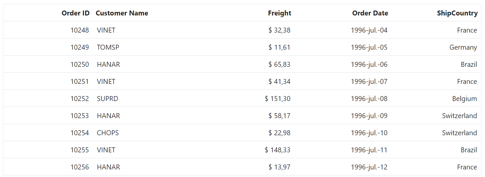

# Columns in Blazor DataGrid

Columns are the core structural elements in the Syncfusion<sup style="font-size:70%">&reg;</sup> Blazor DataGrid.
Each column defines:

* The data field to display.
* Formatting and style information.
* Interactive features such as editing, filtering, and sorting.

Effective column configuration ensures data is presented clearly, remains accessible, and supports all required Grid interactions.

## Column Types

The Syncfusion<sup style="font-size:70%">&reg;</sup> Blazor DataGrid utilizes columns to organize and display diverse data. Each column can be assigned a specific data type using the [Type](https://help.syncfusion.com/cr/blazor/Syncfusion.Blazor.Grids.GridColumn.html#Syncfusion_Blazor_Grids_GridColumn_Type) property of the [GridColumn](https://help.syncfusion.com/cr/blazor/Syncfusion.Blazor.Grids.GridColumn.html) component. This property accepts values from the [ColumnType](https://help.syncfusion.com/cr/blazor/Syncfusion.Blazor.Grids.ColumnType.html) enumeration, which is crucial for determining how data is displayed and formatted (e.g., numeric, date, or string).

The DataGrid supports the following column types:

| Column Type | Description |
|---|---|
| `String` | Represents text data. This is the default type when `Type` is not explicitly defined. |
| `Decimal` | Displays decimal numeric values. |
| `Double` | Displays double-precision floating-point values. |
| `Integer` | Represents integer numeric values. |
| `Long` | Represents long integer values. |
| `None` | Indicates no specific data type. |
| `Boolean` | Displays boolean values, typically rendered by default as text (true/false) or as checkboxes when `DisplayAsCheckBox` is enabled. |
| `Date` | Displays date values with comprehensive formatting support. |
| `DateTime` | Displays date and time values, offering various formatting options. |
| `DateOnly` | Represents `DateOnly` values (available in .NET 7 and later). |
| `TimeOnly` | Represents `TimeOnly` values (available in .NET 7 and later). |
| `CheckBox` | Renders a checkbox within the column, primarily used for row selection. |




@using Syncfusion.Blazor.Grids

<SfGrid DataSource="@Orders" AllowPaging="true" Toolbar="@(new List<string>() { "Add", "Edit", "Delete", "Cancel", "Update" })" Height="315">
    <GridEditSettings AllowAdding="true" AllowEditing="true" AllowDeleting="true"></GridEditSettings>
    <GridColumns>
        <GridColumn Type="ColumnType.CheckBox" Width="50"></GridColumn>
        <GridColumn Field="@nameof(OrderData.OrderID)" HeaderText="Order ID" Type="ColumnType.Integer" IsPrimaryKey="true" Width="120"></GridColumn>
        <GridColumn Field="@nameof(OrderData.CustomerID)" HeaderText="Customer ID" Type="ColumnType.String" Width="120"></GridColumn>
        <GridColumn Field="@nameof(OrderData.Freight)" HeaderText="Freight" Format="C2" Type="ColumnType.Double" Width="120"></GridColumn>
        <GridColumn Field="@nameof(OrderData.OrderDate)" HeaderText="Order Date" Format="d" Width="130" Type="ColumnType.Date"></GridColumn>
        <GridColumn Field="@nameof(OrderData.ShippedDate)" HeaderText="Shipped Date" Format="dd/MM/yyyy hh:mm" Width="130" Type="ColumnType.DateTime"></GridColumn>
        <GridColumn Field="@nameof(OrderData.IsVerified)" HeaderText="Verified" Width="130" DisplayAsCheckBox="true" Type="ColumnType.Boolean"></GridColumn>
    </GridColumns>
</SfGrid>

@code {
    public List<OrderData> Orders { get; set; }
   
    protected override void OnInitialized()
    {
        Orders = OrderData.GetAllRecords();
    }    
}


    public class OrderData
    {
        public static List<OrderData> Orders = new List<OrderData>();
        public OrderData()
        {

        }
        public OrderData(int? OrderID, string CustomerID, double Freight,DateTime? OrderDate, DateTime? ShippedDate,bool? IsVerified)
        {
            this.OrderID = OrderID;
            this.CustomerID = CustomerID;   
            this.Freight = Freight;  
            this.OrderDate = OrderDate;
            this.ShippedDate = ShippedDate;
            this.IsVerified = IsVerified;
        }

        public static List<OrderData> GetAllRecords()
        {
            if (Orders.Count() == 0)
            {
                int code = 10;
                for (int i = 1; i < 2; i++)
                {
                    Orders.Add(new OrderData(10248, "VINET", 32.38,new DateTime(1996,7,4),new DateTime(1996,08,07),true));
                    Orders.Add(new OrderData(10249, "TOMSP", 11.61, new DateTime(1996, 7, 5), new DateTime(1996, 08, 07),false));
                    Orders.Add(new OrderData(10250, "HANAR", 65.83, new DateTime(1996, 7, 6), new DateTime(1996, 08, 07),true));
                    Orders.Add(new OrderData(10251, "VINET", 41.34, new DateTime(1996, 7, 7), new DateTime(1996, 08, 07),false));
                    Orders.Add(new OrderData(10252, "SUPRD", 51.30, new DateTime(1996, 7, 8), new DateTime(1996, 08, 07),true));
                    Orders.Add(new OrderData(10253, "HANAR", 58.17, new DateTime(1996, 7, 9), new DateTime(1996, 08, 07),false));
                    Orders.Add(new OrderData(10254, "CHOPS", 22.98, new DateTime(1996, 7, 10), new DateTime(1996, 08, 07),true));
                    Orders.Add(new OrderData(10255, "VINET", 148.33, new DateTime(1996, 7, 11), new DateTime(1996, 08, 07),false));
                    Orders.Add(new OrderData(10256, "HANAR", 13.97, new DateTime(1996, 7, 12), new DateTime(1996, 08, 07),true));
                    code += 5;
                }
            }
            return Orders;
        }

        public int? OrderID { get; set; }
        public string CustomerID { get; set; }
        public double? Freight { get; set; }
        public DateTime? OrderDate { get; set; }
        public DateTime? ShippedDate { get; set; }
        public bool? IsVerified { get; set; }
    }





> *  When the `Type` property is not defined, the column's data type is inferred from the first record present in the [DataSource](https://help.syncfusion.com/cr/blazor/Syncfusion.Blazor.Grids.SfGrid-1.html#Syncfusion_Blazor_Grids_SfGrid_1_DataSource).
> *  If the first record of the `DataSource` contains a `null` or empty `value` for a specific column, explicitly defining the `Type` for that column is necessary. This ensures the Grid accurately determines the appropriate filter dialog to display.

### Difference Between Boolean and CheckBox Column Types

The Syncfusion<sup style="font-size:70%">®</sup> Blazor DataGrid provides two distinct column types for handling boolean values and row selection:

* [Boolean](https://help.syncfusion.com/cr/blazor/Syncfusion.Blazor.Grids.ColumnType.html#Syncfusion_Blazor_Grids_ColumnType_Boolean): Binds to boolean data fields and supports editing of boolean property values.
* [Checkbox](https://help.syncfusion.com/cr/blazor/Syncfusion.Blazor.Grids.ColumnType.html#Syncfusion_Blazor_Grids_ColumnType_CheckBox): Enables row selection and deselection. When a column is set to `ColumnType.CheckBox`, the Grid uses **multiple** selection mode by default.

If multiple CheckBox columns are defined, selecting a checkbox in one column automatically selects the corresponding checkboxes in other CheckBox columns.

## Column Width

The Syncfusion Blazor DataGrid allows adjustment of column width using the [Width](https://help.syncfusion.com/cr/blazor/Syncfusion.Blazor.Grids.GridColumn.html#Syncfusion_Blazor_Grids_GridColumn_Width)  property of [GridColumn](https://help.syncfusion.com/cr/blazor/Syncfusion.Blazor.Grids.GridColumn.html). This property accepts values in **pixels** or **percentages**. For example, set `100` for 100 pixels or `25%` for 25% of the available width.

**Key behaviors**

1. Column width is determined by the sum of all column widths. For example, a Grid with four columns and a total width of 800 pixels will allocate 200 pixels to each column by default.

2. If some columns have specified widths and others do not, any remaining width is distributed equally among columns without explicit width definitions.

3. Percentage widths are responsive and adjust based on the Grid container's size.

4. When columns are resized manually, a **minimum width** is enforced to maintain readability. By default, this minimum width is 10 pixels.

5. If the total width of all columns exceeds the Grid container's width, a horizontal scrollbar appears.

6. When columns are hidden using the column chooser, their width is removed, and the remaining visible columns expand to fill the available space.

7. If the parent element has a fixed width, the Grid inherits it; otherwise, the Grid adjusts dynamically.

8. When `AllowResizing` is enabled, columns without a specified width default to 200 pixels.

**Supported types for column width**

The Syncfusion<sup style="font-size:70%">&reg;</sup> Blazor DataGrid supports the following three types of column width:

**1. Auto**

The column width is automatically calculated based on the content within its cells. If the content exceeds the `Width` setting, it is truncated with an ellipsis (...).

```cshtml
 <GridColumn Field=@nameof(Order.OrderID) HeaderText="Order ID" TextAlign="TextAlign.Right" Width="auto"></GridColumn>
```

**2. Percentage**

The column width is specified as a **percentage** of the Grid container's total width. For example, `25%` occupies 25% of the Grid `Width`.

```cshtml
 <GridColumn Field=@nameof(Order.OrderID) HeaderText="Order ID" TextAlign="TextAlign.Right" Width="25%"></GridColumn>
```

**3. Pixel**

The column width is specified as an absolute **pixel** value. For example, a column width of `100px` will have a fixed width of 100 pixels, regardless of the Grid container's size.

```cshtml
 <GridColumn Field=@nameof(Order.OrderID) HeaderText="Order ID" TextAlign="TextAlign.Right" Width="100"></GridColumn>
```


@using Syncfusion.Blazor.Grids

<SfGrid DataSource="@Orders" Height="315">
    <GridColumns>
        <GridColumn Field=@nameof(OrderData.OrderID) HeaderText="Order ID" Width="auto"></GridColumn>
        <GridColumn Field=@nameof(OrderData.CustomerID) HeaderText="Customer Name" Width="150"></GridColumn>
        <GridColumn Field=@nameof(OrderData.OrderDate) HeaderText="Order Date" Format="d" Type="ColumnType.Date" Width="130"></GridColumn>
        <GridColumn Field=@nameof(OrderData.Freight) HeaderText="Freight" Format="C2" Width="30%"></GridColumn>
    </GridColumns>
</SfGrid>
@code {
    public List<OrderData> Orders { get; set; }
   
    protected override void OnInitialized()
    {
        Orders = OrderData.GetAllRecords();
    }  
}


public class OrderData
{
    public static List<OrderData> Orders = new List<OrderData>();
    public OrderData()
    {

    }
    public OrderData(int? OrderID, string CustomerID, double Freight,DateTime? OrderDate)
    {
        this.OrderID = OrderID;
        this.CustomerID = CustomerID;   
        this.Freight = Freight;  
        this.OrderDate = OrderDate;           
    }
    public static List<OrderData> GetAllRecords()
    {
        if (Orders.Count() == 0)
        {
            int code = 10;
            for (int i = 1; i < 2; i++)
            {
                Orders.Add(new OrderData(10248, "VINET", 32.38,new DateTime(1996,7,4)));
                Orders.Add(new OrderData(10249, "TOMSP", 11.61, new DateTime(1996, 7, 5)));
                Orders.Add(new OrderData(10250, "HANAR", 65.83, new DateTime(1996, 7, 6)));
                Orders.Add(new OrderData(10251, "VINET", 41.34, new DateTime(1996, 7, 7)));
                Orders.Add(new OrderData(10252, "SUPRD", 51.30, new DateTime(1996, 7, 8)));
                Orders.Add(new OrderData(10253, "HANAR", 58.17, new DateTime(1996, 7, 9)));
                Orders.Add(new OrderData(10254, "CHOPS", 22.98, new DateTime(1996, 7, 10)));
                Orders.Add(new OrderData(10255, "VINET", 148.33, new DateTime(1996, 7, 11)));
                Orders.Add(new OrderData(10256, "HANAR", 13.97, new DateTime(1996, 7, 12)));
                code += 5;
            }
        }
        return Orders;
    }
    public int? OrderID { get; set; }
    public string CustomerID { get; set; }
    public double? Freight { get; set; }
    public DateTime? OrderDate { get; set; }       
}





## Column Formatting

Column formatting is a powerful feature in the Syncfusion<sup style="font-size:70%">&reg;</sup> Blazor DataGrid that allows customization of data display within Grid columns. Various formatting options are available to meet specific requirements, such as displaying numbers with particular formats, formatting dates according to a specific locale, and using templates to format column values.

The [Format](https://help.syncfusion.com/cr/blazor/Syncfusion.Blazor.Grids.GridColumn.html#Syncfusion_Blazor_Grids_GridColumn_Format) property can be used to specify the format for column values.

**Key Points**

* Formatting uses the **internalization** library for culture-specific display.
* Default formatting applies **en-US** locale for numbers and dates.
* Custom format strings or functions can be assigned to `Format`.



@using Syncfusion.Blazor.Grids

<SfGrid DataSource="@Orders" Height="315">
    <GridColumns>
        <GridColumn Field=@nameof(OrderData.OrderID) HeaderText="Order ID" Width="90"></GridColumn>
        <GridColumn Field=@nameof(OrderData.CustomerID) HeaderText="Customer ID" Width="150"></GridColumn>
        <GridColumn Field=@nameof(OrderData.Freight) HeaderText="Freight" Format="C2" Width="130"></GridColumn>
        <GridColumn Field=@nameof(OrderData.OrderDate) HeaderText="Order Date" Format="d" Type="ColumnType.Date" Width="130"></GridColumn>
    </GridColumns>
</SfGrid>
@code {
    public List<OrderData> Orders { get; set; }
   
    protected override void OnInitialized()
    {
        Orders = OrderData.GetAllRecords();
    }    
}


    public class OrderData
    {
        public static List<OrderData> Orders = new List<OrderData>();
        public OrderData()
        {

        }
        public OrderData(int? OrderID, string CustomerID, double Freight,DateTime? OrderDate)
        {
            this.OrderID = OrderID;
            this.CustomerID = CustomerID;   
            this.Freight = Freight;  
            this.OrderDate = OrderDate;           
        }

        public static List<OrderData> GetAllRecords()
        {
            if (Orders.Count() == 0)
            {
                int code = 10;
                for (int i = 1; i < 2; i++)
                {
                    Orders.Add(new OrderData(10248, "VINET", 32.38,new DateTime(1996,7,4)));
                    Orders.Add(new OrderData(10249, "TOMSP", 11.61, new DateTime(1996, 7, 5)));
                    Orders.Add(new OrderData(10250, "HANAR", 65.83, new DateTime(1996, 7, 6)));
                    Orders.Add(new OrderData(10251, "VINET", 41.34, new DateTime(1996, 7, 7)));
                    Orders.Add(new OrderData(10252, "SUPRD", 51.30, new DateTime(1996, 7, 8)));
                    Orders.Add(new OrderData(10253, "HANAR", 58.17, new DateTime(1996, 7, 9)));
                    Orders.Add(new OrderData(10254, "CHOPS", 22.98, new DateTime(1996, 7, 10)));
                    Orders.Add(new OrderData(10255, "VINET", 148.33, new DateTime(1996, 7, 11)));
                    Orders.Add(new OrderData(10256, "HANAR", 13.97, new DateTime(1996, 7, 12)));
                    code += 5;
                }
            }
            return Orders;
        }
        public int? OrderID { get; set; }
        public string CustomerID { get; set; }
        public double? Freight { get; set; }
        public DateTime? OrderDate { get; set; }       
    }  





### Number formatting

The Syncfusion<sup style="font-size:70%">&reg;</sup> Blazor DataGrid allows customizing the display of numeric values in columns using the [Format](https://help.syncfusion.com/cr/blazor/Syncfusion.Blazor.Grids.GridColumn.html#Syncfusion_Blazor_Grids_GridColumn_Format) property. This property supports both standard numeric format strings and custom numeric format strings.

| Format | Description       | Remarks                                                    |
|--------|-------------------|------------------------------------------------------------|
| **N**  | Numeric format    | Use N2, N3, etc., to specify the number of decimal places. |
| **C**  | currency format   | Use C2, C3, etc., for currency with specified precision.   |
| **P**  | Percentage format | Use C2, C3, etc., for currency with specified precision.   |




@using Syncfusion.Blazor.Grids

<SfGrid DataSource="@Orders" Height="315">
    <GridColumns>
        <GridColumn Field=@nameof(OrderData.RollNo) HeaderText="Roll No" Width="90"></GridColumn>
        <GridColumn Field=@nameof(OrderData.Mark1) HeaderText="Mark1" Width="100"></GridColumn>
        <GridColumn Field=@nameof(OrderData.Mark2) HeaderText="Mark2" Format="N" Width="100"></GridColumn>
        <GridColumn Field=@nameof(OrderData.Average) HeaderText="Average" Format="N2" Width="90"></GridColumn>
        <GridColumn Field=@nameof(OrderData.Percentage) HeaderText="Percentage of Marks" Format="P" Width="130"></GridColumn>
        <GridColumn Field=@nameof(OrderData.Fees) HeaderText="Fees" Format="C" Width="130"></GridColumn>
    </GridColumns>
</SfGrid>
@code {
   private SfGrid<OrderData> Grid;
    public List<OrderData> Orders { get; set; }
       
    protected override void OnInitialized()
    {
        Orders = OrderData.GetAllRecords();
    }     
}


public class OrderData
{
    public static List<OrderData> Orders = new List<OrderData>();
    public OrderData()
    {

    }
    public OrderData( int? RollNo, double? Mark1,double? Mark2,double? Average,double? Percentage,double? Fees)
    {
        this.RollNo=RollNo;
        this.Mark1=Mark1;
        this.Mark2=Mark2;
        this.Average=Average;
        this.Percentage=Percentage;
        this.Fees=Fees;
    }
    public static List<OrderData> GetAllRecords()
    {
        if (Orders.Count() == 0)
        {
            int code = 10;
            for (int i = 1; i < 2; i++)
            {
                Orders.Add(new OrderData(10248, 70.0, 60.0,10.67,0.5,400.00));
                Orders.Add(new OrderData(10249, 71.0, 61.0,10.68,0.95,800.00));
                Orders.Add(new OrderData(10248, 72.0, 62.0,10.61,0.7,1200.00));
                Orders.Add(new OrderData(10248, 73.0, 63.0,10.62,0.8,1600.00));
                Orders.Add(new OrderData(10248, 74.0, 64.0,10.63,0.8,3200.00));
                Orders.Add(new OrderData(10248, 75.0, 65.0,10.64,0.9,6400.00));
                Orders.Add(new OrderData(10248, 77.0, 66.0,10.68,0.10,12800.00));
                Orders.Add(new OrderData(10248, 76.0, 67.0,10.57,0.12,26000.00));
                Orders.Add(new OrderData(10248, 78.0, 68.0,10.66,0.15,52000.00));                                                                                    
                code += 5;
            }
        }
        return Orders;
    }
    public int? RollNo { get; set; }
    public double? Mark1 { get; set; }
    public double? Mark2 { get; set; }
    public double? Average { get; set; }
    public double? Percentage { get; set; }
    public double? Fees { get; set; }
}





> To learn more about number formatting, refer to the [Number](https://blazor.syncfusion.com/documentation/datagrid/columns#number-formatting) section.

### Date formatting

Date formatting in Syncfusion<sup style="font-size:70%">®</sup> Blazor DataGrid columns customizes how date values appear. Standard date format strings such as **"d"**, **"D"**, **"MMM dd, yyyy"**, or custom formats can be applied using the [Format](https://help.syncfusion.com/cr/blazor/Syncfusion.Blazor.Grids.GridColumn.html#Syncfusion_Blazor_Grids_GridColumn_Format) property.

The following table shows examples of custom date formats and their output:

| Format                                         | Formatted Value          |
|-----------------------------------------------|---------------------------|
| `Type="ColumnType.Date" Format="dd/MM/yyyy"` | 04/07/1996               |
| `Type="ColumnType.Date" Format="dd.MM.yyyy"` | 04.07.1996               |
| `Type="ColumnType.Date" Format="MM/dd/yyyy hh:mm tt"` | 04/07/1996 12:00 AM      |
| `Type="ColumnType.Date" Format="MM/dd/yyyy hh:mm:ss tt"` | 04/07/1996 12:00:00 AM   |

Custom format strings allow full control over date presentation, including separators, time components, and locale-specific patterns.



@using Syncfusion.Blazor.Grids

<SfGrid DataSource="@Orders" AllowPaging="true" Height="315">
    <GridColumns>
        <GridColumn Field=@nameof(OrderData.OrderID) HeaderText="Order ID" IsPrimaryKey="true" Width="120"></GridColumn>
        <GridColumn Field=@nameof(OrderData.Freight) HeaderText="Freight" Format="c2" Width="120"></GridColumn>
        <GridColumn Field=@nameof(OrderData.OrderDate) HeaderText="Order Date" Format="dd/MM/yyyy" Width="130" Type="ColumnType.Date"></GridColumn>
        <GridColumn Field=@nameof(OrderData.OrderDate) HeaderText="Shipped Date" Format="dd/MM/yyyy hh:mm tt" Width="130" Type="ColumnType.DateTime"></GridColumn>
    </GridColumns>
</SfGrid>
@code {
    public List<OrderData> Orders { get; set; }
   
    protected override void OnInitialized()
    {
        Orders = OrderData.GetAllRecords();
    } 
}


public class OrderData
{
    public static List<OrderData> Orders = new List<OrderData>();
    public OrderData()
    {

    }
    public OrderData(int? OrderID, string CustomerID, double Freight,DateTime? OrderDate)
    {
        this.OrderID = OrderID;
        this.CustomerID = CustomerID;   
        this.Freight = Freight;  
        this.OrderDate = OrderDate;           
    }

    public static List<OrderData> GetAllRecords()
    {
        if (Orders.Count() == 0)
        {
            int code = 10;
            for (int i = 1; i < 2; i++)
            {
                Orders.Add(new OrderData(10248, 32.38,new DateTime(1996,7,4)));
                Orders.Add(new OrderData(10249, 11.61, new DateTime(1996, 7, 5)));
                Orders.Add(new OrderData(10250, 65.83, new DateTime(1996, 7, 6)));
                Orders.Add(new OrderData(10251, 41.34, new DateTime(1996, 7, 7)));
                Orders.Add(new OrderData(10252, 51.30, new DateTime(1996, 7, 8)));
                Orders.Add(new OrderData(10253, 58.17, new DateTime(1996, 7, 9)));
                Orders.Add(new OrderData(10254, 22.98, new DateTime(1996, 7, 10)));
                Orders.Add(new OrderData(10255, 148.33,"", new DateTime(1996, 7, 11)));
                Orders.Add(new OrderData(10256, 13.97,"", new DateTime(1996, 7, 12)));
                code += 5;
            }
        }
        return Orders;
    }
    public int? OrderID { get; set; }
    public double? Freight { get; set; }
    public DateTime? OrderDate { get; set; }       
}





> To learn more about date formatting, refer to [Date formatting](https://help.syncfusion.com/cr/blazor/Syncfusion.Blazor.Grids.ColumnType.html#Syncfusion_Blazor_Grids_ColumnType_Date).

### Format the date column based on localization

In Syncfusion<sup style="font-size:70%">&reg;</sup>  Blazor DataGrid, date columns can be formatted according to the application’s locale settings. By configuring localization and using the [Format](https://help.syncfusion.com/cr/blazor/Syncfusion.Blazor.Grids.GridColumn.html#Syncfusion_Blazor_Grids_GridColumn_Format) property, dates are displayed in a format appropriate for the selected culture.

**Steps to Enable Localization**

To enable localization in a Blazor application:

1. **Download Locale Files**

    Obtain locale files from the [Syncfusion Blazor Locale Repository](https://github.com/syncfusion/blazor-locale).

2. **Register Locale Files**

    Follow the localization setup guidelines in the [Syncfusion Localization Documentation](https://blazor.syncfusion.com/documentation/common/localization) to register and configure the locale files in the project.

3. **Set Application Culture**

    Configure culture settings in **Program.cs** or **_Host.cshtml** to match the desired locale. For example, to use Spanish (Argentina):

    ```cs
    using System.Globalization;

    CultureInfo.DefaultThreadCurrentCulture = new CultureInfo("es-AR");
    CultureInfo.DefaultThreadCurrentUICulture = new CultureInfo("es-AR");
    ```

Once localization is enabled, apply a custom date format using the `Format` property.



@page "/counter"
@using Syncfusion.Blazor.Grids

<SfGrid DataSource="@Orders" Height="315">
    <GridColumns>
        <GridColumn Field=@nameof(OrderData.OrderID) HeaderText="Order ID" TextAlign="TextAlign.Right" Width="120"></GridColumn>
        <GridColumn Field=@nameof(OrderData.CustomerID) HeaderText="Customer Name" Width="150"></GridColumn>
        <GridColumn Field=@nameof(OrderData.Freight) HeaderText="Freight" Format="C2" TextAlign="TextAlign.Right" Width="120"></GridColumn>
        <GridColumn Field=@nameof(OrderData.OrderDate) HeaderText=" Order Date" Format="yyyy-MMM-dd" Type="ColumnType.Date" TextAlign="TextAlign.Right" Width="130"></GridColumn>
        <GridColumn Field=@nameof(OrderData.ShipCountry) HeaderText="ShipCountry" TextAlign="TextAlign.Right" Width="120"></GridColumn>
    </GridColumns>
</SfGrid>

@code {
    public List<OrderData> Orders { get; set; }

    protected override void OnInitialized ()
    {
        Orders = OrderData.GetAllRecords();
    }
}



namespace LocalizationSample.Client
{
    public class OrderData
    {
        public static List<OrderData> Orders = new List<OrderData>();

        public OrderData() { }

        public OrderData(int? OrderID, string CustomerID, string ShipName, double Freight, DateTime? OrderDate, DateTime? ShippedDate, bool? IsVerified, string ShipCity, string ShipCountry, int employeeID)
        {
            this.OrderID = OrderID;
            this.CustomerID = CustomerID;
            this.ShipName = ShipName;
            this.Freight = Freight;
            this.OrderDate = OrderDate;
            this.ShippedDate = ShippedDate;
            this.IsVerified = IsVerified;
            this.ShipCity = ShipCity;
            this.ShipCountry = ShipCountry;
            this.EmployeeID = employeeID;
        }

        public static List<OrderData> GetAllRecords()
        {
            if (Orders.Count == 0)
            {
                Orders.Add(new OrderData(10248, "VINET", "Vins et alcools Chevalier", 32.38, new DateTime(1996, 7, 4), new DateTime(1996, 08, 07), true, "Reims", "France", 1));
                Orders.Add(new OrderData(10249, "TOMSP", "Toms Spezialitäten", 11.61, new DateTime(1996, 7, 5), new DateTime(1996, 08, 07), false, "Münster", "Germany", 2));
                Orders.Add(new OrderData(10250, "HANAR", "Hanari Carnes", 65.83, new DateTime(1996, 7, 6), new DateTime(1996, 08, 07), true, "Rio de Janeiro", "Brazil", 3));
                Orders.Add(new OrderData(10251, "VINET", "Vins et alcools Chevalier", 41.34, new DateTime(1996, 7, 7), new DateTime(1996, 08, 07), false, "Lyon", "France", 1));
                Orders.Add(new OrderData(10252, "SUPRD", "Suprêmes délices", 151.30, new DateTime(1996, 7, 8), new DateTime(1996, 08, 07), true, "Charleroi", "Belgium", 2));
                Orders.Add(new OrderData(10253, "HANAR", "Hanari Carnes", 58.17, new DateTime(1996, 7, 9), new DateTime(1996, 08, 07), false, "Bern", "Switzerland", 3));
                Orders.Add(new OrderData(10254, "CHOPS", "Chop-suey Chinese", 22.98, new DateTime(1996, 7, 10), new DateTime(1996, 08, 07), true, "Genève", "Switzerland", 2));
                Orders.Add(new OrderData(10255, "VINET", "Vins et alcools Chevalier", 148.33, new DateTime(1996, 7, 11), new DateTime(1996, 08, 07), false, "Resende", "Brazil", 1));
                Orders.Add(new OrderData(10256, "HANAR", "Hanari Carnes", 13.97, new DateTime(1996, 7, 12), new DateTime(1996, 08, 07), true, "Paris", "France", 3));
            }
            return Orders;
        }

        public int? OrderID { get; set; }
        public string CustomerID { get; set; }
        public string ShipName { get; set; }
        public double? Freight { get; set; }
        public DateTime? OrderDate { get; set; }
        public DateTime? ShippedDate { get; set; }
        public bool? IsVerified { get; set; }
        public string ShipCity { get; set; }
        public string ShipCountry { get; set; }
        public int EmployeeID { get; set; }
    }
}






> [Syncfusion<sup style="font-size:70%">&reg;</sup> GitHub Sample for Blazor Localization](https://github.com/SyncfusionExamples/blazor-localization)

### Format template column value

In Syncfusion<sup style="font-size:70%">&reg;</sup>  Blazor DataGrid, template columns provide flexibility to customize how data is displayed. This approach is useful for improving readability and presenting values such as dates or numbers in a specific format.



@page "/"
@using Syncfusion.Blazor.Grids

<SfGrid DataSource="@Orders">
    <GridPageSettings PageSize="5"></GridPageSettings>
    <GridColumns>
        <GridColumn Field=@nameof(OrderData.OrderID) HeaderText="Order ID" TextAlign="TextAlign.Right" Width="120"></GridColumn>
        <GridColumn Field=@nameof(OrderData.Freight) HeaderText="Freight" Format="C2" TextAlign="TextAlign.Right" Width="120"></GridColumn>
        <GridColumn Field=@nameof(OrderData.OrderDate) HeaderText="Order Date" Type="ColumnType.Date" TextAlign="TextAlign.Right" Width="130">
            <Template>
                @{
                    var values = context as OrderData;
                    if (values?.OrderDate == null)
                    {
                        <div></div>  <!-- Display blank if OrderDate is null -->
                    }
                    else
                    {
                        var day = values.OrderDate.Value.Day.ToString("00");  // Ensures two-digit day
                        var month = values.OrderDate.Value.ToString("MMM");  // Short month format
                        var year = values.OrderDate.Value.Year;
                        <div>@($"{day}/{month}/{year}")</div> <!-- Display formatted date -->
                    }
                }
            </Template>
        </GridColumn>
        <GridColumn Field=@nameof(OrderData.ShipCountry) HeaderText="ShipCountry" TextAlign="TextAlign.Right" Width="120"></GridColumn>

    </GridColumns>
</SfGrid>

@code {
    public List<OrderData> Orders { get; set; }

    protected override void OnInitialized()
    {
        Orders = OrderData.GetAllRecords();
    }
}


public class OrderData
{
    public static List<OrderData> Orders = new List<OrderData>();

    public OrderData() { }

    public OrderData(int OrderID, string CustomerID, string ShipName, double Freight, DateTime? OrderDate, DateTime? ShippedDate, bool? IsVerified, string ShipCity, string ShipCountry, int employeeID)
    {
        this.OrderID = OrderID;
        this.CustomerID = CustomerID;
        this.ShipName = ShipName;
        this.Freight = Freight;
        this.OrderDate = OrderDate;
        this.ShippedDate = ShippedDate;
        this.IsVerified = IsVerified;
        this.ShipCity = ShipCity;
        this.ShipCountry = ShipCountry;
        this.EmployeeID = employeeID; 
    }

    public static List<OrderData> GetAllRecords()
    {
        if (Orders.Count == 0)
        {
            Orders.Add(new OrderData(10248, "VINET", "Vins et alcools Chevalier", 32.38, new DateTime(1996, 7, 4), new DateTime(1996, 08, 07), true, "Reims", "France", 1));
            Orders.Add(new OrderData(10249, "TOMSP", "Toms Spezialitäten", 11.61, new DateTime(1996, 7, 5), new DateTime(1996, 08, 07), false, "Münster", "Germany", 2));
            Orders.Add(new OrderData(10250, "HANAR", "Hanari Carnes", 65.83, new DateTime(1996, 7, 6), new DateTime(1996, 08, 07), true, "Rio de Janeiro", "Brazil", 3));
            Orders.Add(new OrderData(10251, "VINET", "Vins et alcools Chevalier", 41.34, new DateTime(1996, 7, 7), new DateTime(1996, 08, 07), false, "Lyon", "France", 1));
            Orders.Add(new OrderData(10252, "SUPRD", "Suprêmes délices", 151.30, new DateTime(1996, 7, 8), new DateTime(1996, 08, 07), true, "Charleroi", "Belgium", 2));
            Orders.Add(new OrderData(10253, "HANAR", "Hanari Carnes", 58.17, new DateTime(1996, 7, 9), new DateTime(1996, 08, 07), false, "Bern", "Switzerland", 3));
            Orders.Add(new OrderData(10254, "CHOPS", "Chop-suey Chinese", 22.98, new DateTime(1996, 7, 10), new DateTime(1996, 08, 07), true, "Genève", "Switzerland", 2));
            Orders.Add(new OrderData(10255, "VINET", "Vins et alcools Chevalier", 148.33, new DateTime(1996, 7, 11), new DateTime(1996, 08, 07), false, "Resende", "Brazil", 1));
            Orders.Add(new OrderData(10256, "HANAR", "Hanari Carnes", 13.97, new DateTime(1996, 7, 12), new DateTime(1996, 08, 07), true, "Paris", "France", 3));
        }
        return Orders;
    }

    public int OrderID { get; set; }
    public string CustomerID { get; set; }
    public string ShipName { get; set; }
    public double? Freight { get; set; }
    public DateTime? OrderDate { get; set; }
    public DateTime? ShippedDate { get; set; }
    public bool? IsVerified { get; set; }
    public string ShipCity { get; set; }
    public string ShipCountry { get; set; }
    public int EmployeeID { get; set; } 
}





### Custom formatting

The Syncfusion<sup style="font-size:70%">&reg;</sup>  Blazor DataGrid supports custom formatting for numeric and date columns, allowing data to be displayed in a specific format based on application requirements. The Format property can be assigned a custom format string or a variable containing the format pattern.

In this configuration, **numberFormatOptions** is used to format the **Freight** column with four decimal places, and **dateFormatOptions** is used to format the **OrderDate** column to display the day of the week, month abbreviation, day, and two-digit year (e.g., Sun, May 8, 23).



@page "/"
@using Syncfusion.Blazor.Grids

<SfGrid DataSource="@Orders">
    <GridPageSettings PageSize="5"></GridPageSettings>
    <GridColumns>
        <GridColumn Field=@nameof(OrderData.OrderID) HeaderText="Order ID" TextAlign="Syncfusion.Blazor.Grids.TextAlign.Right" Width="120"></GridColumn>
        <GridColumn Field=@nameof(OrderData.CustomerID) HeaderText="Customer ID" TextAlign="Syncfusion.Blazor.Grids.TextAlign.Right" Width="120"></GridColumn>
        <GridColumn Field=@nameof(OrderData.Freight) HeaderText="Freight" Format="@numberFormatOptions" TextAlign="Syncfusion.Blazor.Grids.TextAlign.Right" Width="120"></GridColumn>
        <GridColumn Field=@nameof(OrderData.OrderDate) HeaderText="Order Date" Type="Syncfusion.Blazor.Grids.ColumnType.Date" Format="@dateFormatOptions" TextAlign="Syncfusion.Blazor.Grids.TextAlign.Right" Width="130">
        </GridColumn>
    </GridColumns>
</SfGrid>

@code {
    public List<OrderData> Orders { get; set; }
    public string numberFormatOptions = "##.0000";
    public string dateFormatOptions = "ddd, MMM d, ''yy";

    protected override void OnInitialized()
    {
        Orders = OrderData.GetAllRecords();

    }
}


public class OrderData
{
    public static List<OrderData> Orders = new List<OrderData>();

    public OrderData() { }

    public OrderData(int OrderID, string CustomerID, string ShipName, double Freight, DateTime? OrderDate, DateTime? ShippedDate, bool? IsVerified, string ShipCity, string ShipCountry, int employeeID)
    {
        this.OrderID = OrderID;
        this.CustomerID = CustomerID;
        this.ShipName = ShipName;
        this.Freight = Freight;
        this.OrderDate = OrderDate;
        this.ShippedDate = ShippedDate;
        this.IsVerified = IsVerified;
        this.ShipCity = ShipCity;
        this.ShipCountry = ShipCountry;
        this.EmployeeID = employeeID; 
    }

    public static List<OrderData> GetAllRecords()
    {
        if (Orders.Count == 0)
        {
            Orders.Add(new OrderData(10248, "VINET", "Vins et alcools Chevalier", 32.38, new DateTime(1996, 7, 4), new DateTime(1996, 08, 07), true, "Reims", "France", 1));
            Orders.Add(new OrderData(10249, "TOMSP", "Toms Spezialitäten", 11.61, new DateTime(1996, 7, 5), new DateTime(1996, 08, 07), false, "Münster", "Germany", 2));
            Orders.Add(new OrderData(10250, "HANAR", "Hanari Carnes", 65.83, new DateTime(1996, 7, 6), new DateTime(1996, 08, 07), true, "Rio de Janeiro", "Brazil", 3));
            Orders.Add(new OrderData(10251, "VINET", "Vins et alcools Chevalier", 41.34, new DateTime(1996, 7, 7), new DateTime(1996, 08, 07), false, "Lyon", "France", 1));
            Orders.Add(new OrderData(10252, "SUPRD", "Suprêmes délices", 151.30, new DateTime(1996, 7, 8), new DateTime(1996, 08, 07), true, "Charleroi", "Belgium", 2));
            Orders.Add(new OrderData(10253, "HANAR", "Hanari Carnes", 58.17, new DateTime(1996, 7, 9), new DateTime(1996, 08, 07), false, "Bern", "Switzerland", 3));
            Orders.Add(new OrderData(10254, "CHOPS", "Chop-suey Chinese", 22.98, new DateTime(1996, 7, 10), new DateTime(1996, 08, 07), true, "Genève", "Switzerland", 2));
            Orders.Add(new OrderData(10255, "VINET", "Vins et alcools Chevalier", 148.33, new DateTime(1996, 7, 11), new DateTime(1996, 08, 07), false, "Resende", "Brazil", 1));
            Orders.Add(new OrderData(10256, "HANAR", "Hanari Carnes", 13.97, new DateTime(1996, 7, 12), new DateTime(1996, 08, 07), true, "Paris", "France", 3));
        }
        return Orders;
    }

    public int OrderID { get; set; }
    public string CustomerID { get; set; }
    public string ShipName { get; set; }
    public double? Freight { get; set; }
    public DateTime? OrderDate { get; set; }
    public DateTime? ShippedDate { get; set; }
    public bool? IsVerified { get; set; }
    public string ShipCity { get; set; }
    public string ShipCountry { get; set; }
    public int EmployeeID { get; set; } 
}





## Text and Header Alignment

The Syncfusion<sup style="font-size:70%">&reg;</sup> Blazor DataGrid provides options to align both column content and header text for better readability and presentation.

### Text Alignment

The Syncfusion<sup style="font-size:70%">&reg;</sup>  Blazor DataGrid allows aligning text within columns using the [TextAlign](https://help.syncfusion.com/cr/blazor/Syncfusion.Blazor.Grids.GridColumn.html#Syncfusion_Blazor_Grids_GridColumn_TextAlign) property of the [GridColumn](https://help.syncfusion.com/cr/blazor/Syncfusion.Blazor.Grids.GridColumn.html). This property supports below options:

* **None** – No specific alignment; defaults to **Left**.
* **Left** – Aligns text to the left side of the column.
* **Right** – Aligns text to the right side of the column.
* **Center** – Aligns text to the center of the column.
* **Justify** – Aligns text evenly across the column width.

Text alignment is useful for improving readability, especially for numeric or date values that are commonly right-aligned.

### Header Text Alignment

The Syncfusion<sup style="font-size:70%">&reg;</sup> Blazor DataGrid allows aligning header text using the [HeaderTextAlign](https://help.syncfusion.com/cr/blazor/Syncfusion.Blazor.Grids.GridColumn.html#Syncfusion_Blazor_Grids_GridColumn_HeaderTextAlign) property of the [GridColumn](https://help.syncfusion.com/cr/blazor/Syncfusion.Blazor.Grids.GridColumn.html). This property also accepts values from the [TextAlign](https://help.syncfusion.com/cr/blazor/Syncfusion.Blazor.Grids.GridColumn.html#Syncfusion_Blazor_Grids_GridColumn_TextAlign) enum:

* **None** – No specific alignment; defaults to **Left**.
* **Left** – Aligns header text to the left.
* **Right** – Aligns header text to the right.
* **Center** – Aligns header text to the center.
* **Justify** – Aligns header text evenly across the header width.



@page "/"

@using Syncfusion.Blazor.Grids
@using Syncfusion.Blazor.DropDowns

<div style="display:flex; margin:3px">
    <label style="padding:  10px 10px 12px 0">Align the text for columns :</label>
    <SfDropDownList style='margin-top:5px' Width="100px" TValue="string" TItem="ColumnAlignmentOption" DataSource="@DropDownData" Value="@SelectedAlignment">
        <DropDownListFieldSettings Value="Text" Text="Text"></DropDownListFieldSettings>
        <DropDownListEvents TValue="string" TItem="ColumnAlignmentOption" ValueChange="OnValueChange"></DropDownListEvents>
    </SfDropDownList>
</div>

<SfGrid DataSource="@Orders" Height="315" @ref="grid">
    <GridColumns>
        <GridColumn Field="OrderID" HeaderText="Order ID" IsPrimaryKey="true" Width="100" TextAlign="@SelectedAlignmentEnum"></GridColumn>
        <GridColumn Field="CustomerID" HeaderText="Customer ID" TextAlign="@SelectedAlignmentEnum" Width="120"></GridColumn>
        <GridColumn Field="ShipCountry" HeaderText="Ship Country" TextAlign="@SelectedAlignmentEnum" Width="80"></GridColumn>
        <GridColumn Field="OrderDate" HeaderText="Order Date" TextAlign="@SelectedAlignmentEnum" Format="yMd" Width="80"></GridColumn>
    </GridColumns>
</SfGrid>

@code {
    public List<OrderData> Orders { get; set; }
    public string SelectedAlignment  { get; set; } = "Left";
    public TextAlign SelectedAlignmentEnum { get; set; } = TextAlign.Left;

    public class ColumnAlignmentOption
    {
        public string Text { get; set; }
    }

    List<ColumnAlignmentOption> DropDownData = new List<ColumnAlignmentOption> {
        new ColumnAlignmentOption() { Text= "Left" },
        new ColumnAlignmentOption() { Text= "Right" },
        new ColumnAlignmentOption() { Text= "Center" },
    };

    // Reference to the Grid
    private SfGrid<OrderData> grid;
    public void OnValueChange(ChangeEventArgs<string, ColumnAlignmentOption> args)
    {
        SelectedAlignment  = args.Value;
        SelectedAlignmentEnum = SelectedAlignment  switch
        {
            "Left" => TextAlign.Left,
            "Right" => TextAlign.Right,
            "Center" => TextAlign.Center,
            _ => TextAlign.Left
        };
        grid.Refresh();
    }

    protected override void OnInitialized()
    {
        Orders = OrderData.GetAllRecords();
    }
}



    public class OrderData
    {
        public static List<OrderData> Orders = new List<OrderData>();

        public OrderData() { }

        public OrderData(int OrderID, string CustomerID, string ShipName, double Freight, DateTime? OrderDate, DateTime? ShippedDate, bool? IsVerified, string ShipCity, string ShipCountry, int employeeID)
        {
            this.OrderID = OrderID;
            this.CustomerID = CustomerID;
            this.ShipName = ShipName;
            this.Freight = Freight;
            this.OrderDate = OrderDate;
            this.ShippedDate = ShippedDate;
            this.IsVerified = IsVerified;
            this.ShipCity = ShipCity;
            this.ShipCountry = ShipCountry;
            this.EmployeeID = employeeID; 
        }

        public static List<OrderData> GetAllRecords()
        {
            if (Orders.Count == 0)
            {
                Orders.Add(new OrderData(10248, "VINET", "Vins et alcools Chevalier", 32.38, new DateTime(1996, 7, 4), new DateTime(1996, 08, 07), true, "Reims", "France", 1));
                Orders.Add(new OrderData(10249, "TOMSP", "Toms Spezialitäten", 11.61, new DateTime(1996, 7, 5), new DateTime(1996, 08, 07), false, "Münster", "Germany", 2));
                Orders.Add(new OrderData(10250, "HANAR", "Hanari Carnes", 65.83, new DateTime(1996, 7, 6), new DateTime(1996, 08, 07), true, "Rio de Janeiro", "Brazil", 3));
                Orders.Add(new OrderData(10251, "VINET", "Vins et alcools Chevalier", 41.34, new DateTime(1996, 7, 7), new DateTime(1996, 08, 07), false, "Lyon", "France", 1));
                Orders.Add(new OrderData(10252, "SUPRD", "Suprêmes délices", 151.30, new DateTime(1996, 7, 8), new DateTime(1996, 08, 07), true, "Charleroi", "Belgium", 2));
                Orders.Add(new OrderData(10253, "HANAR", "Hanari Carnes", 58.17, new DateTime(1996, 7, 9), new DateTime(1996, 08, 07), false, "Bern", "Switzerland", 3));
                Orders.Add(new OrderData(10254, "CHOPS", "Chop-suey Chinese", 22.98, new DateTime(1996, 7, 10), new DateTime(1996, 08, 07), true, "Genève", "Switzerland", 2));
                Orders.Add(new OrderData(10255, "VINET", "Vins et alcools Chevalier", 148.33, new DateTime(1996, 7, 11), new DateTime(1996, 08, 07), false, "Resende", "Brazil", 1));
                Orders.Add(new OrderData(10256, "HANAR", "Hanari Carnes", 13.97, new DateTime(1996, 7, 12), new DateTime(1996, 08, 07), true, "Paris", "France", 3));
            }
            return Orders;
        }

        public int OrderID { get; set; }
        public string CustomerID { get; set; }
        public string ShipName { get; set; }
        public double? Freight { get; set; }
        public DateTime? OrderDate { get; set; }
        public DateTime? ShippedDate { get; set; }
        public bool? IsVerified { get; set; }
        public string ShipCity { get; set; }
        public string ShipCountry { get; set; }
        public int EmployeeID { get; set; } 
    }






N >* The `TextAlign` property only changes the alignment of cell content, not the column header. To align both the column header and content, use the `HeaderTextAlign` property along with `TextAlign`.

>* If only `HeaderTextAlign` is specified, the header will align as expected, but the cell content will remain at its default alignment.
>* To achieve consistent alignment for both header and cell content, specify both properties.

## Render boolean values as checkbox

Boolean values in the Syncfusion<sup style="font-size:70%">&reg;</sup> Blazor DataGrid can be displayed as checkboxes instead of text. This is achieved by enabling the [DisplayAsCheckBox](https://help.syncfusion.com/cr/blazor/Syncfusion.Blazor.Grids.GridColumn.html#Syncfusion_Blazor_Grids_GridColumn_DisplayAsCheckBox) property in the [GridColumn](https://help.syncfusion.com/cr/blazor/Syncfusion.Blazor.Grids.GridColumn.html) configuration.



@using Syncfusion.Blazor.Grids

<SfGrid DataSource="@Orders">
    <GridColumns>
        <GridColumn Field=@nameof(OrderData.OrderID) HeaderText="Order ID" TextAlign="TextAlign.Center" Width="120"></GridColumn>
        <GridColumn Field=@nameof(OrderData.CustomerID) HeaderText="Customer ID" TextAlign="TextAlign.Center" Width="130"></GridColumn>
        <GridColumn Field=@nameof(OrderData.Freight) HeaderText="Freight" TextAlign="TextAlign.Center" Width="130"></GridColumn>
        <GridColumn Field=@nameof(OrderData.Verified) HeaderText="Verified" TextAlign="TextAlign.Center" DisplayAsCheckBox="true" Width="120"></GridColumn>
    </GridColumns>
</SfGrid>
@code {
    public List<OrderData> Orders { get; set; }
   
    protected override void OnInitialized()
    {
        Orders = OrderData.GetAllRecords();
    }    
}


    public class OrderData
    {
        public static List<OrderData> Orders = new List<OrderData>();
        public OrderData()
        {

        }
        public OrderData(int? OrderID, string CustomerID,double Freight,bool verified)
        {
            this.OrderID = OrderID;
            this.CustomerID = CustomerID;   
            this.Freight = Freight;
            this.Verified = verified;           
        }

        public static List<OrderData> GetAllRecords()
        {
            if (Orders.Count() == 0)
            {
                int code = 10;
                for (int i = 1; i < 2; i++)
                {
                    Orders.Add(new OrderData(10248, "VINET", 32.38,true));
                    Orders.Add(new OrderData(10249, "TOMSP",  11.26,false));
                    Orders.Add(new OrderData(10250, "HANAR", 65.83,true));
                    Orders.Add(new OrderData(10251, "VINET", 41.34,true));
                    Orders.Add(new OrderData(10252, "SUPRD", 51.30,true));
                    Orders.Add(new OrderData(10253, "HANAR", 58.17,true));
                    Orders.Add(new OrderData(10254, "CHOPS", 22.98,false));
                    Orders.Add(new OrderData(10255, "VINET", 148.33,true));
                    Orders.Add(new OrderData(10256, "HANAR", 13.97,true));
                    code += 5;
                }
            }
            return Orders;
        }
        public int? OrderID { get; set; }
        public string CustomerID { get; set; }
        public double Freight { get; set; }
        public bool Verified { get; set; }       
    }   





>* The `DisplayAsCheckBox` property renders a checkbox for Boolean values.
>* This property works with columns bound to bool or nullable bool fields.
>* Checkboxes are read-only by default unless editing is enabled. To render a checkbox while editing a Boolean value, define the [EditType](https://help.syncfusion.com/cr/blazor/Syncfusion.Blazor.Grids.ColumnModel.html#Syncfusion_Blazor_Grids_ColumnModel_EditType) property as **EditType.BooleanEdit** in the column configuration.

## AutoFit columns

AutoFit in the Syncfusion<sup style="font-size:70%">&reg;</sup> Blazor DataGrid automatically adjusts column widths so that the content is fully visible without wrapping. This feature ensures a clean layout and improves readability without manual width adjustments.

AutoFit is useful when:

- Column content varies in length and needs to be fully visible.
- Dynamic data updates require columns to resize automatically.
- Columns should maintain a clean layout without manual width configuration.

**Options to Apply AutoFit**

The Syncfusion<sup style="font-size:70%">&reg;</sup> Blazor DataGrid provides multiple options to automatically adjust column widths based on content or predefined settings.

1. AutoFit on double-click
2. AutoFit via Programmatically
3. AutoFit with Empty Space
4. AutoFit on Column Visibility Change

### AutoFit on double-click

The Syncfusion<sup style="font-size:70%">&reg;</sup> Blazor DataGrid allows columns to automatically adjust their width based on the maximum content width when you double-click the resizer symbol in the column header. This ensures that all data in the grid rows is displayed without wrapping.

To enable this feature, Set the [AllowResizing](https://help.syncfusion.com/cr/blazor/Syncfusion.Blazor.Grids.SfGrid-1.html#Syncfusion_Blazor_Grids_SfGrid_1_AllowResizing) property to **true** in the grid.



@using Syncfusion.Blazor.Grids

<SfGrid DataSource="@Orders" Height="315" AllowResizing="true">
    <GridColumns>
        <GridColumn Field=@nameof(OrderData.OrderID) HeaderText="Order ID" TextAlign="TextAlign.Right" Width="150"></GridColumn>
        <GridColumn Field=@nameof(OrderData.CustomerID) HeaderText="Customer ID" Width="150"></GridColumn>
        <GridColumn Field=@nameof(OrderData.ShipName) HeaderText="Ship Name" Width="150"></GridColumn>
        <GridColumn Field=@nameof(OrderData.ShipAddress) HeaderText="Ship Address" Width="150"></GridColumn>
        <GridColumn Field=@nameof(OrderData.ShipCity) HeaderText="Ship City" Width="150"></GridColumn>
    </GridColumns>
</SfGrid>

@code {
    public List<OrderData> Orders { get; set; }
   
    protected override void OnInitialized()
    {
        Orders = OrderData.GetAllRecords();
    }     

}


public class OrderData
{
    public static List<OrderData> Orders = new List<OrderData>();
    public OrderData()
    {

    }
    public OrderData(int? OrderID, string CustomerID,string ShipName,string ShipAddress, string ShipCity)
    {
        this.OrderID = OrderID;
        this.CustomerID = CustomerID;   
        this.ShipName= ShipName; 
        this.ShipAddress=ShipAddress;
        this.ShipCity=ShipCity;
        
    }

    public static List<OrderData> GetAllRecords()
    {
        if (Orders.Count() == 0)
        {
            int code = 10;
            for (int i = 1; i < 2; i++)
            {
                Orders.Add(new OrderData(10248, "VINET", "Vins et alcools Chevalier", "59 rue de l Abbaye", "Reims"));
                Orders.Add(new OrderData(10249, "TOMSP", "Toms Spezialitäten", "Luisenstr. 48", "Münster"));
                Orders.Add(new OrderData(10250, "HANAR", "Hanari Carnes", "Rua do Paço, 67", "Rio de Janei"));
                Orders.Add(new OrderData(10251, "VINET", "Victuailles en stock", "2, rue du Commerce", "Lyon"));
                Orders.Add(new OrderData(10252, "SUPRD", "Suprêmes délices", "Boulevard Tirou, 255", "Charleroi"));
                Orders.Add(new OrderData(10253, "HANAR", "Hanari Carnes", "Rua do Paço, 67", "Rio de Janei"));
                Orders.Add(new OrderData(10254, "CHOPS", "Chop-suey Chinese", "Hauptstr. 31", "Bern"));
                Orders.Add(new OrderData(10255, "VINET", "Richter Supermarkt", "Starenweg 5", "Genève"));
                Orders.Add(new OrderData(10256, "HANAR", "Wellington Importadora", "Rua do Mercado, 12", "Resende"));
                code += 5;
            }
        }
        return Orders;
    }

    public int? OrderID { get; set; }
    public string CustomerID { get; set; }
    public string ShipName { get; set; }
    public string ShipAddress { get; set; }
    public string ShipCity { get; set; }
    
}





### AutoFit via Programmatically

The Syncfusion<sup style="font-size:70%">&reg;</sup> Blazor DataGrid provides the `AutoFitColumnsAsync` method to resize columns based on content.

- Autofit specific columns by passing their field names.
- Autofit all columns by calling the method without parameters.

**1. Autofit specific columns**

The [AutoFitColumnsAsync](https://help.syncfusion.com/cr/blazor/Syncfusion.Blazor.Grids.SfGrid-1.html#Syncfusion_Blazor_Grids_SfGrid_1_AutoFitColumnsAsync_System_String___) method automatically adjusts the width of specified columns so that their content is fully visible without wrapping or hiding. This method can be invoked in the [DataBound](https://help.syncfusion.com/cr/blazor/Syncfusion.Blazor.Grids.SfGrid-1.html) event to autofit columns during initial rendering.

| Parameter Name | Type       | Description                                                                 |
|----------------|-----------|-----------------------------------------------------------------------------|
| columnNames    | string[] | Specifies an array of column field names or header texts to auto-fit.      |



@using Syncfusion.Blazor.Grids

<SfGrid @ref="Grid" DataSource="@Orders" Height="315" GridLines="GridLine.Both">
    <GridEvents DataBound="DataboundHandler" TValue="OrderData"></GridEvents>
    <GridColumns>
        <GridColumn Field=@nameof(OrderData.OrderID) HeaderText="Order ID" TextAlign="TextAlign.Right" Width="150"></GridColumn>
        <GridColumn Field=@nameof(OrderData.CustomerID) HeaderText="Customer ID" Width="150"></GridColumn>
        <GridColumn Field=@nameof(OrderData.ShipName) HeaderText="Ship Name" Width="150"></GridColumn>
        <GridColumn Field=@nameof(OrderData.ShipAddress) HeaderText="Ship Address" Width="150"></GridColumn>
        <GridColumn Field=@nameof(OrderData.ShipCity) HeaderText="Ship City" Width="150"></GridColumn>
    </GridColumns>
</SfGrid>

@code {
    private SfGrid<OrderData> Grid;
    public List<OrderData> Orders { get; set; }
   
    protected override void OnInitialized()
    {
        Orders = OrderData.GetAllRecords();
    }     
    public void DataboundHandler(object args)
    {
        this.Grid.AutoFitColumnsAsync();
    }
}


    public class OrderData
    {
        public static List<OrderData> Orders = new List<OrderData>();
        public OrderData()
        {

        }
        public OrderData(int? OrderID, string CustomerID,string ShipName,string ShipAddress, string ShipCity)
        {
            this.OrderID = OrderID;
            this.CustomerID = CustomerID;   
            this.ShipName= ShipName; 
            this.ShipAddress=ShipAddress;
            this.ShipCity=ShipCity;
           
        }

        public static List<OrderData> GetAllRecords()
        {
            if (Orders.Count() == 0)
            {
                int code = 10;
                for (int i = 1; i < 2; i++)
                {
                    Orders.Add(new OrderData(10248, "VINET", "Vins et alcools Chevalier", "59 rue de l Abbaye", "Reims"));
                    Orders.Add(new OrderData(10249, "TOMSP", "Toms Spezialitäten", "Luisenstr. 48", "Münster"));
                    Orders.Add(new OrderData(10250, "HANAR", "Hanari Carnes", "Rua do Paço, 67", "Rio de Janei"));
                    Orders.Add(new OrderData(10251, "VINET", "Victuailles en stock", "2, rue du Commerce", "Lyon"));
                    Orders.Add(new OrderData(10252, "SUPRD", "Suprêmes délices", "Boulevard Tirou, 255", "Charleroi"));
                    Orders.Add(new OrderData(10253, "HANAR", "Hanari Carnes", "Rua do Paço, 67", "Rio de Janei"));
                    Orders.Add(new OrderData(10254, "CHOPS", "Chop-suey Chinese", "Hauptstr. 31", "Bern"));
                    Orders.Add(new OrderData(10255, "VINET", "Richter Supermarkt", "Starenweg 5", "Genève"));
                    Orders.Add(new OrderData(10256, "HANAR", "Wellington Importadora", "Rua do Mercado, 12", "Resende"));
                    code += 5;
                }
            }
            return Orders;
        }

        public int? OrderID { get; set; }
        public string CustomerID { get; set; }
        public string ShipName { get; set; }
        public string ShipAddress { get; set; }
        public string ShipCity { get; set; }
       
    }





**2. Autofit all columns**

The [AutoFitColumnsAsync](https://help.syncfusion.com/cr/blazor/Syncfusion.Blazor.Grids.SfGrid-1.html#Syncfusion_Blazor_Grids_SfGrid_1_AutoFitColumnsAsync) method changes the width of all columns to automatically fit their content and ensure that the content is not wrapped or hidden. This method ignores any hidden columns. This method can be invoked in the [DataBound](https://help.syncfusion.com/cr/blazor/Syncfusion.Blazor.Grids.SfGrid-1.html) event to autofit columns.



@using Syncfusion.Blazor.Grids

<SfGrid @ref="Grid" DataSource="@Orders" Height="315" GridLines="GridLine.Both">
    <GridEvents DataBound="DataboundHandler" TValue="OrderData"></GridEvents>
    <GridColumns>
        <GridColumn Field=@nameof(OrderData.OrderID) HeaderText="Order ID" TextAlign="TextAlign.Right" Width="150"></GridColumn>
        <GridColumn Field=@nameof(OrderData.CustomerID) HeaderText="Customer ID" Width="150"></GridColumn>
        <GridColumn Field=@nameof(OrderData.ShipName) HeaderText="Ship Name" Width="150"></GridColumn>
        <GridColumn Field=@nameof(OrderData.ShipAddress) HeaderText="Ship Address" Width="150"></GridColumn>
        <GridColumn Field=@nameof(OrderData.ShipCity) HeaderText="Ship City" Width="150"></GridColumn>
    </GridColumns>
</SfGrid>

@code {
    private SfGrid<OrderData> Grid;
    public List<OrderData> Orders { get; set; }
   
    protected override void OnInitialized()
    {
        Orders = OrderData.GetAllRecords();
    }     
    public void DataboundHandler(object args)
    {
        this.Grid.AutoFitColumnsAsync(new string[] { "ShipAddress", "ShipName" });
    }
}


    public class OrderData
    {
        public static List<OrderData> Orders = new List<OrderData>();
        public OrderData()
        {

        }
        public OrderData(int? OrderID, string CustomerID,string ShipName,string ShipAddress, string ShipCity)
        {
            this.OrderID = OrderID;
            this.CustomerID = CustomerID;   
            this.ShipName= ShipName; 
            this.ShipAddress=ShipAddress;
            this.ShipCity=ShipCity;
           
        }

        public static List<OrderData> GetAllRecords()
        {
            if (Orders.Count() == 0)
            {
                int code = 10;
                for (int i = 1; i < 2; i++)
                {
                    Orders.Add(new OrderData(10248, "VINET", "Vins et alcools Chevalier", "59 rue de l Abbaye", "Reims"));
                    Orders.Add(new OrderData(10249, "TOMSP", "Toms Spezialitäten", "Luisenstr. 48", "Münster"));
                    Orders.Add(new OrderData(10250, "HANAR", "Hanari Carnes", "Rua do Paço, 67", "Rio de Janei"));
                    Orders.Add(new OrderData(10251, "VINET", "Victuailles en stock", "2, rue du Commerce", "Lyon"));
                    Orders.Add(new OrderData(10252, "SUPRD", "Suprêmes délices", "Boulevard Tirou, 255", "Charleroi"));
                    Orders.Add(new OrderData(10253, "HANAR", "Hanari Carnes", "Rua do Paço, 67", "Rio de Janei"));
                    Orders.Add(new OrderData(10254, "CHOPS", "Chop-suey Chinese", "Hauptstr. 31", "Bern"));
                    Orders.Add(new OrderData(10255, "VINET", "Richter Supermarkt", "Starenweg 5", "Genève"));
                    Orders.Add(new OrderData(10256, "HANAR", "Wellington Importadora", "Rua do Mercado, 12", "Resende"));
                    code += 5;
                }
            }
            return Orders;
        }

        public int? OrderID { get; set; }
        public string CustomerID { get; set; }
        public string ShipName { get; set; }
        public string ShipAddress { get; set; }
        public string ShipCity { get; set; }
       
    }





### AutoFit with Empty Space

The AutoFit feature maintains the defined column widths without stretching columns to fill unused space in the grid. When the total width of all columns is less than the grid width, empty space remains visible instead of columns auto-adjusting.

Enable this behavior by setting the [AutoFit](https://help.syncfusion.com/cr/blazor/Syncfusion.Blazor.Grids.SfGrid-1.html#Syncfusion_Blazor_Grids_SfGrid_1_AutoFit) property to **true** of the [SfGrid](https://help.syncfusion.com/cr/blazor/Syncfusion.Blazor.Grids.SfGrid-1.html). This ensures that each column renders only with the width specified in its definition.



@using Syncfusion.Blazor.Grids

<SfGrid DataSource="@OrderData" Height="315" AllowResizing="true" AutoFit="true" Width="800">
    <GridColumns>
        <GridColumn Field=@nameof(OrderDetails.OrderID) HeaderText="Order ID" MinWidth="100" MaxWidth="200" TextAlign="TextAlign.Right" Width="200"></GridColumn>
        <GridColumn Field=@nameof(OrderDetails.CustomerID) HeaderText="Customer ID" MinWidth="8" Width="150" ></GridColumn>
        <GridColumn Field=@nameof(OrderDetails.Freight) HeaderText="Freight" Format="C2" TextAlign="TextAlign.Right" MinWidth="10"  Width="150"></GridColumn>
        <GridColumn Field=@nameof(OrderDetails.ShipCity) HeaderText="Ship City" AllowResizing="false" MinWidth="8"  Width="180"></GridColumn>
        <GridColumn Field=@nameof(OrderDetails.ShipCountry) HeaderText="Ship Country" MinWidth="8" Width="150"></GridColumn>
    </GridColumns>
</SfGrid>

@code {
    public List<OrderDetails> OrderData { get; set; }
   
    protected override void OnInitialized()
    {
        OrderData = OrderDetails.GetAllRecords();
    }    
}


public class OrderDetails
{
    public static List<OrderDetails> order = new List<OrderDetails>();
    public OrderDetails() { }
    public OrderDetails(int OrderID, string CustomerId, double Freight, DateTime OrderDate, string ShipCity, string ShipCountry)
    {
        this.OrderID = OrderID;
        this.CustomerID = CustomerId;
        this.Freight = Freight;
        this.OrderDate = OrderDate;
        this.ShipCity = ShipCity;
        this.ShipCountry = ShipCountry;
    }
    public static List<OrderDetails> GetAllRecords()
    {
        if (order.Count == 0)
        {
            order.Add(new OrderDetails(10248, "VINET", 32.38, new DateTime(1996, 7, 4), "Reims", "Australia"));
            order.Add(new OrderDetails(10249, "TOMSP", 11.61, new DateTime(1996, 7, 5), "Münster", "Australia"));
            order.Add(new OrderDetails(10250, "HANAR", 65.83, new DateTime(1996, 7, 8), "Rio de Janeiro", "United States"));
            order.Add(new OrderDetails(10251, "VICTE", 41.34, new DateTime(1996, 7, 8), "Lyon", "Australia"));
            order.Add(new OrderDetails(10252, "SUPRD", 51.3, new DateTime(1996, 7, 9), "Charleroi", "United States"));
            order.Add(new OrderDetails(10253, "HANAR", 58.17, new DateTime(1996, 7, 10), "Rio de Janeiro", "United States"));
            order.Add(new OrderDetails(10254, "CHOPS", 22.98, new DateTime(1996, 7, 11), "Bern", "Switzerland"));
            order.Add(new OrderDetails(10255, "RICSU", 148.33, new DateTime(1996, 7, 12), "Genève", "Switzerland"));
            order.Add(new OrderDetails(10256, "WELLI", 13.97, new DateTime(1996, 7, 15), "Resende", "Brazil"));
            order.Add(new OrderDetails(10257, "HILAA", 81.91, new DateTime(1996, 7, 16), "San Cristóbal", "Venezuela"));
            order.Add(new OrderDetails(10258, "ERNSH", 140.51, new DateTime(1996, 7, 17), "Graz", "Austria"));
            order.Add(new OrderDetails(10259, "CENTC", 3.25, new DateTime(1996, 7, 18), "México D.F.", "Mexico"));
            order.Add(new OrderDetails(10260, "OTTIK", 55.09, new DateTime(1996, 7, 19), "Köln", "Germany"));
            order.Add(new OrderDetails(10261, "QUEDE", 3.05, new DateTime(1996, 7, 19), "Rio de Janeiro", "Brazil"));
            order.Add(new OrderDetails(10262, "RATTC", 48.29, new DateTime(1996, 7, 22), "Albuquerque", "USA"));
        }
        return order;
    }
    public int OrderID { get; set; }
    public string CustomerID { get; set; }
    public double Freight { get; set; }
    public DateTime OrderDate { get; set; }
    public string ShipCity { get; set; }
    public string ShipCountry { get; set; }
}





> If any column width is undefined, that column automatically adjusts to fill the remaining grid width, even when `AutoFit` is enabled.

### AutoFit on Column Visibility Change

The Syncfusion<sup style="font-size:70%">&reg;</sup> Blazor DataGrid can automatically adjust column widths when column visibility changes through the column chooser. This behavior is implemented by invoking the [AutoFitColumnsAsync](https://help.syncfusion.com/cr/blazor/Syncfusion.Blazor.Grids.SfGrid-1.html#Syncfusion_Blazor_Grids_SfGrid_1_AutoFitColumnsAsync) method in the [OnActionComplete](https://help.syncfusion.com/cr/blazor/Syncfusion.Blazor.Grids.SfGrid-1.html) event. Use the **RequestType** property in the event arguments to identify the action and call `AutoFitColumnsAsync` when the request type is **ColumnState**.

The example demonstrates autofitting columns after changing visibility using the [Column Chooser](https://blazor.syncfusion.com/documentation/datagrid/column-chooser):



@using Syncfusion.Blazor.Grids;

<SfGrid @ref="Grid" DataSource="@Orders" ShowColumnChooser="true" Toolbar=@ToolbarItems>
    <GridEvents OnActionComplete="OnActionComplete" TValue="OrderData"></GridEvents>
    <GridColumns>
        <GridColumn Field=@nameof(OrderData.OrderID) TextAlign="TextAlign.Center" HeaderText="Order ID" Width="120"></GridColumn>
        <GridColumn Field=@nameof(OrderData.CustomerID) HeaderText="Customer ID" Width="130"></GridColumn>
        <GridColumn Field=@nameof(OrderData.ShipName) HeaderText="Ship Name" Width="130"></GridColumn>
        <GridColumn Field=@nameof(OrderData.ShipAddress) HeaderText="Ship Address" Width="120"></GridColumn>
        <GridColumn Field=@nameof(OrderData.ShipCity) HeaderText="Ship City" Format="d" TextAlign="TextAlign.Right" Width="150"></GridColumn>
    </GridColumns>
</SfGrid>

@code {
    private SfGrid<OrderData> Grid;
    public List<OrderData> Orders { get; set; }
    public string[] ToolbarItems = new string[] { "ColumnChooser" };
   
    protected override void OnInitialized()
    {
        Orders = OrderData.GetAllRecords();
    }     
    public async Task OnActionComplete(ActionEventArgs<OrderData> Args)
    {
        if (Args.RequestType == Syncfusion.Blazor.Grids.Action.ColumnState)
        {
            await Grid.AutoFitColumnsAsync();
        }
    }
}


    public class OrderData
    {
        public static List<OrderData> Orders = new List<OrderData>();
        public OrderData()
        {

        }
        public OrderData(int? OrderID, string CustomerID,string ShipName, string ShipAddress, string ShipCity)
        {
            this.OrderID = OrderID;
            this.CustomerID = CustomerID;   
            this.ShipName = ShipName;
            this.ShipAddress = ShipAddress;           
            this.ShipCity = ShipCity;          
        }
        public static List<OrderData> GetAllRecords()
        {
            if (Orders.Count() == 0)
            {
                int code = 10;
                for (int i = 1; i < 2; i++)
                {
                    Orders.Add(new OrderData(10248, "VINET", "Vins et alcools Chevalier", "2, rue du Commerce", "Reims"));
                    Orders.Add(new OrderData(10249, "TOMSP", "Toms Spezialitäten", "Boulevard Tirou, 255", "Charleroi"));
                    Orders.Add(new OrderData(10250, "HANAR", "Hanari Carnes", "Rua do Paço, 67", "Rio de Janeiro"));
                    Orders.Add(new OrderData(10251, "VINET", "Victuailles en stock", "Hauptstr. 31", "Bern"));
                    Orders.Add(new OrderData(10252, "SUPRD", "Suprêmes délices", "Starenweg 5", "Genève"));
                    Orders.Add(new OrderData(10253, "HANAR", "Hanari Carnes", "Rua do Mercado, 12", "Resende"));
                    Orders.Add(new OrderData(10254, "CHOPS", "Chop-suey Chinese", "Carrera 22 con Ave. Carlos Soublette #8-35", "San Cristóbal"));
                    Orders.Add(new OrderData(10255, "VINET", "Richter Supermarkt", "Kirchgasse 6", "Graz"));
                    Orders.Add(new OrderData(10256, "HANAR", "Wellington Importadora", "Sierras de Granada 9993", "México D.F."));
                    code += 5;
                }
            }
            return Orders;
        }

        public int? OrderID { get; set; }
        public string CustomerID { get; set; }
        public string ShipName { get; set; }
        public string ShipCity { get; set; }
        public string ShipAddress { get; set; }       
    }  





## Fixed columns

The Syncfusion<sup style="font-size:70%">&reg;</sup> Blazor DataGrid supports fixing specific columns at the beginning of the grid to maintain their position during scrolling. Fixed columns cannot be **reordered** or **grouped** and remain in the defined order.

Enable this behavior by setting the [FixedColumn](https://help.syncfusion.com/cr/blazor/Syncfusion.Blazor.Grids.GridColumn.html#Syncfusion_Blazor_Grids_GridColumn_FixedColumn) property to **true** for the [GridColumn](https://help.syncfusion.com/cr/blazor/Syncfusion.Blazor.Grids.GridColumn.html).



@using Syncfusion.Blazor.Grids

<SfGrid DataSource="@OrderData" AllowPaging="true" AllowGrouping="true" AllowReordering="true">
    <GridColumns>
        <GridColumn Field=@nameof(OrderDetails.OrderID) HeaderText="Order ID" FixedColumn="true" TextAlign="TextAlign.Right" IsPrimaryKey="true" Width="120"></GridColumn>
        <GridColumn Field=@nameof(OrderDetails.CustomerID) HeaderText="Customer ID" Width="100"></GridColumn>
        <GridColumn Field=@nameof(OrderDetails.OrderDate) HeaderText="Order Date" FixedColumn="true" Format="d" Type="ColumnType.Date" TextAlign="TextAlign.Right" Width="130"></GridColumn>
        <GridColumn Field=@nameof(OrderDetails.Freight) Format="C2" TextAlign="TextAlign.Right" Width="100"></GridColumn>
        <GridColumn Field=@nameof(OrderDetails.ShipCountry) HeaderText="Ship Country" Width="150"></GridColumn>
        <GridColumn Field=@nameof(OrderDetails.ShipCity) HeaderText="Ship City" Width="100"></GridColumn>
    </GridColumns>
</SfGrid>

@code {
    public List<OrderDetails> OrderData { get; set; }
    protected override void OnInitialized()
    {
        OrderData = OrderDetails.GetAllRecords();
    }
}


public class OrderDetails
{
    public static List<OrderDetails> order = new List<OrderDetails>();
    public OrderDetails() { }
    public OrderDetails(int OrderID, string CustomerId, double Freight, DateTime OrderDate, string ShipCity, string ShipCountry)
    {
        this.OrderID = OrderID;
        this.CustomerID = CustomerId;
        this.Freight = Freight;
        this.OrderDate = OrderDate;
        this.ShipCity = ShipCity;
        this.ShipCountry = ShipCountry;
    }
    public static List<OrderDetails> GetAllRecords()
    {
        if (order.Count == 0)
        {
            order.Add(new OrderDetails(10248, "VINET", 32.38, new DateTime(1996, 7, 4), "Reims", "Australia"));
            order.Add(new OrderDetails(10249, "TOMSP", 11.61, new DateTime(1996, 7, 5), "Münster", "Australia"));
            order.Add(new OrderDetails(10250, "HANAR", 65.83, new DateTime(1996, 7, 8), "Rio de Janeiro", "United States"));
            order.Add(new OrderDetails(10251, "VICTE", 41.34, new DateTime(1996, 7, 8), "Lyon", "Australia"));
            order.Add(new OrderDetails(10252, "SUPRD", 51.3, new DateTime(1996, 7, 9), "Charleroi", "United States"));
            order.Add(new OrderDetails(10253, "HANAR", 58.17, new DateTime(1996, 7, 10), "Rio de Janeiro", "United States"));
            order.Add(new OrderDetails(10254, "CHOPS", 22.98, new DateTime(1996, 7, 11), "Bern", "Switzerland"));
            order.Add(new OrderDetails(10255, "RICSU", 148.33, new DateTime(1996, 7, 12), "Genève", "Switzerland"));
            order.Add(new OrderDetails(10256, "WELLI", 13.97, new DateTime(1996, 7, 15), "Resende", "Brazil"));
            order.Add(new OrderDetails(10257, "HILAA", 81.91, new DateTime(1996, 7, 16), "San Cristóbal", "Venezuela"));
            order.Add(new OrderDetails(10258, "ERNSH", 140.51, new DateTime(1996, 7, 17), "Graz", "Austria"));
            order.Add(new OrderDetails(10259, "CENTC", 3.25, new DateTime(1996, 7, 18), "México D.F.", "Mexico"));
            order.Add(new OrderDetails(10260, "OTTIK", 55.09, new DateTime(1996, 7, 19), "Köln", "Germany"));
            order.Add(new OrderDetails(10261, "QUEDE", 3.05, new DateTime(1996, 7, 19), "Rio de Janeiro", "Brazil"));
            order.Add(new OrderDetails(10262, "RATTC", 48.29, new DateTime(1996, 7, 22), "Albuquerque", "USA"));
        }
        return order;
    }
    public int OrderID { get; set; }
    public string CustomerID { get; set; }
    public double Freight { get; set; }
    public DateTime OrderDate { get; set; }
    public string ShipCity { get; set; }
    public string ShipCountry { get; set; }
}





## Show or hide columns

The Syncfusion<sup style="font-size:70%">&reg;</sup> Blazor DataGrid supports dynamic control of column visibility using properties or methods. Columns can be displayed or hidden based on configuration or runtime actions.

### Show or hide columns via property

Column visibility in the Syncfusion<sup style="font-size:70%">&reg;</sup> Blazor DataGrid can be controlled through the [Visible](https://help.syncfusion.com/cr/blazor/Syncfusion.Blazor.Grids.GridColumn.html#Syncfusion_Blazor_Grids_GridColumn_Visible) property. Setting this property to **true** displays the column, while setting it to **false** hides the column from the grid layout.

The `Visible` property is set to **false** for the **ShipCity** column.



@using Syncfusion.Blazor.Grids

<SfGrid DataSource="@Orders" Height="315">
    <GridColumns>
        <GridColumn Field=@nameof(OrderData.OrderID) HeaderText="Order ID" TextAlign="TextAlign.Right" Width="120"></GridColumn>
        <GridColumn Field=@nameof(OrderData.CustomerID) HeaderText="Customer ID" Width="150"></GridColumn>
        <GridColumn Field=@nameof(OrderData.Freight) HeaderText="Freight" Format="C2" TextAlign="TextAlign.Right" Width="120"></GridColumn>
        <GridColumn Field=@nameof(OrderData.OrderDate) HeaderText="Order Date" Format="d" Type="ColumnType.Date" TextAlign="TextAlign.Right" Width="130"></GridColumn>
        <GridColumn Field=@nameof(OrderData.ShipCity) HeaderText="Ship City" Visible="false" Width="150"></GridColumn>
    </GridColumns>
</SfGrid>

@code {
    public List<OrderData> Orders { get; set; }
      
    protected override void OnInitialized()
    {
        Orders = OrderData.GetAllRecords();
    }     
}


public class OrderData
    {
        public static List<OrderData> Orders = new List<OrderData>();
        public OrderData()
        {

        }
        public OrderData( int? OrderID, string CustomerID, string ShipCity, DateTime? OrderDate,double? Freight)
        {
            this.OrderID = OrderID;
            this.CustomerID = CustomerID;
            this.ShipCity = ShipCity;
            this.OrderDate = OrderDate;
            this.Freight = Freight;
        }

        public static List<OrderData> GetAllRecords()
        {
            if (Orders.Count() == 0)
            {
                int code = 10;
                for (int i = 1; i < 2; i++)
                {
                    Orders.Add(new OrderData(10248, "VINET","Reims",new DateTime(1996,07,06), 32.38));
                    Orders.Add(new OrderData(10249, "TOMSP", "Münster", new DateTime(1996, 07, 06), 11.61));
                    Orders.Add(new OrderData(10250, "HANAR", "Rio de Janeiro", new DateTime(1996, 07, 06), 65.83));
                    Orders.Add(new OrderData(10251, "VICTE", "Lyon", new DateTime(1996, 07, 06),45.78));
                    Orders.Add(new OrderData(10252, "SUPRD", "Charleroi", new DateTime(1996, 07, 06),98.6));
                    Orders.Add(new OrderData(10253, "HANAR", "Bern", new DateTime(1996, 07, 06),103.45));
                    Orders.Add(new OrderData(10254, "CHOPS", "Genève", new DateTime(1996, 07, 06), 103.45));
                    Orders.Add(new OrderData(10255, "RICSU", "Resende",new DateTime(1996, 07, 06), 112.48));
                    Orders.Add(new OrderData(10256, "WELLI", "San Cristóbal", new DateTime(1996, 07, 06), 33.45));                                                 
                    code += 5;
                }
            }
            return Orders;
        }

        public int? OrderID { get; set; }
        public string CustomerID { get; set; }
        public string ShipCity { get; set; }
        public DateTime? OrderDate { get; set; }
        public double? Freight { get; set; }
    } 





> * Hiding a column using the `Visible` property affects only the grid’s UI. The data for the hidden column remains in the underlying data source and can be accessed or modified programmatically.
> * When a column is hidden, its width is excluded from the total grid width calculation.
> * To hide a column permanently, set the `Visible` property to **false** in the column definition or remove the column definition entirely.

### Show or hide columns via programmatically

The Syncfusion<sup style="font-size:70%">&reg;</sup> Blazor DataGrid provides methods to dynamically control column visibility at runtime. Columns can be shown or hidden using the built-in methods.

* **Show columns**

    * Displays one or more hidden columns by specifying their [Field](https://help.syncfusion.com/cr/blazor/Syncfusion.Blazor.Grids.GridColumn.html#Syncfusion_Blazor_Grids_GridColumn_Field) names or [HeaderText](https://help.syncfusion.com/cr/blazor/Syncfusion.Blazor.Grids.GridColumn.html#Syncfusion_Blazor_Grids_GridColumn_HeaderText) using the [ShowColumnsAsync](https://help.syncfusion.com/cr/blazor/Syncfusion.Blazor.Grids.SfGrid-1.html#Syncfusion_Blazor_Grids_SfGrid_1_ShowColumnAsync_System_String_System_String_) method.

* **Hide columns**

    * Hides one or more visible columns by specifying their [Field](https://help.syncfusion.com/cr/blazor/Syncfusion.Blazor.Grids.GridColumn.html#Syncfusion_Blazor_Grids_GridColumn_Field) names or [HeaderText](https://help.syncfusion.com/cr/blazor/Syncfusion.Blazor.Grids.GridColumn.html#Syncfusion_Blazor_Grids_GridColumn_HeaderText) using the [HideColumnsAsync](https://help.syncfusion.com/cr/blazor/Syncfusion.Blazor.Grids.SfGrid-1.html#Syncfusion_Blazor_Grids_SfGrid_1_HideColumnAsync_System_String_System_String_) method.

#### Based on header text

Columns can be dynamically shown or hidden based on their [HeaderText](https://help.syncfusion.com/cr/blazor/Syncfusion.Blazor.Grids.GridColumn.html#Syncfusion_Blazor_Grids_GridColumn_HeaderText) property by invoking the `ShowColumnsAsync` or  `HideColumnsAsync` method.

**1. Show or hide a single column**

To show or hide a single column in the Grid by its `HeaderText` property, use [ShowColumnsAsync](https://help.syncfusion.com/cr/blazor/Syncfusion.Blazor.Grids.SfGrid-1.html#Syncfusion_Blazor_Grids_SfGrid_1_ShowColumnAsync_System_String_System_String_) or [HideColumnsAsync](https://help.syncfusion.com/cr/blazor/Syncfusion.Blazor.Grids.SfGrid-1.html#Syncfusion_Blazor_Grids_SfGrid_1_HideColumnAsync_System_String_System_String_) method.

| Parameter Name | Type    | Description                                                                 |
|---------------|--------|-----------------------------------------------------------------------------|
| columnName    | string | Specifies the header text of a single column to show or hide.              |
| type          | string | Specifies the identifier type. Use **"HeaderText"** to target header text. |

**2. Show or Hide Multiple Columns**

To show or hide one or more columns in the Grid by their `HeaderText` property, use [ShowColumnsAsync](https://help.syncfusion.com/cr/blazor/Syncfusion.Blazor.Grids.SfGrid-1.html#Syncfusion_Blazor_Grids_SfGrid_1_ShowColumnsAsync_System_String___System_String_) or [HideColumnsAsync](https://help.syncfusion.com/cr/blazor/Syncfusion.Blazor.Grids.SfGrid-1.html#Syncfusion_Blazor_Grids_SfGrid_1_HideColumnsAsync_System_String___System_String_) method.

| Parameter Name | Type       | Description                                                                 |
|---------------|-----------|-----------------------------------------------------------------------------|
| columnNames   | string[]  | Specifies a collection of header texts for multiple columns to show or hide.   |
| type          | string    | Specifies the identifier type. Use **"HeaderText"** to target header text. |




@using Syncfusion.Blazor.Buttons
@using Syncfusion.Blazor.Grids

<SfButton OnClick="Show" CssClass="e-primary" Content="Show"></SfButton>
<SfButton OnClick="Hide" CssClass="e-primary" Content="Hide"></SfButton>
<SfGrid @ref="DefaultGrid" DataSource="@Orders" Height="315">
    <GridColumns>
        <GridColumn Field=@nameof(OrderData.OrderID) HeaderText="Order ID" TextAlign="TextAlign.Center" Width="150"></GridColumn>
        <GridColumn Field=@nameof(OrderData.CustomerID) HeaderText="Customer ID" Width="150" TextAlign="TextAlign.Center"></GridColumn>
        <GridColumn Field=@nameof(OrderData.Freight) HeaderText="Freight" Format="C2" TextAlign="TextAlign.Center" Width="120"></GridColumn>
        <GridColumn Field=@nameof(OrderData.OrderDate) HeaderText="Order Date" Format="d" Type="ColumnType.Date" TextAlign="TextAlign.Center" Width="130"></GridColumn>
    </GridColumns>
</SfGrid>
@code {
    private SfGrid<OrderData> DefaultGrid;
    public List<OrderData> Orders { get; set; }
    public string[] ColumnItems = new string[] { "Customer ID" };
      
    protected override void OnInitialized()
    {
        Orders = OrderData.GetAllRecords();
    }     
    public void Show()
    {
        // Show columns by its header text
        this.DefaultGrid.ShowColumnsAsync(ColumnItems, "HeaderText");
    }
    public void Hide()
    {
        // Hide columns by its header text
        this.DefaultGrid.HideColumnsAsync(ColumnItems, "HeaderText");
    }   
}


    public class OrderData
    {
        public static List<OrderData> Orders = new List<OrderData>();
        public OrderData()
        {

        }
        public OrderData( int? OrderID, string CustomerID,  DateTime? OrderDate,double? Freight)
        {
            this.OrderID = OrderID;
            this.CustomerID = CustomerID;
            this.OrderDate = OrderDate;
            this.Freight = Freight;
        }
        public static List<OrderData> GetAllRecords()
        {
            if (Orders.Count() == 0)
            {
                int code = 10;
                for (int i = 1; i < 2; i++)
                {
                    Orders.Add(new OrderData(10248, "VINET",new DateTime(1996,07,06), 32.38));
                    Orders.Add(new OrderData(10249, "TOMSP", new DateTime(1996, 07, 06), 11.61));
                    Orders.Add(new OrderData(10250, "HANAR", new DateTime(1996, 07, 06), 65.83));
                    Orders.Add(new OrderData(10251, "VICTE", new DateTime(1996, 07, 06),45.78));
                    Orders.Add(new OrderData(10252, "SUPRD", new DateTime(1996, 07, 06),98.6));
                    Orders.Add(new OrderData(10253, "HANAR", new DateTime(1996, 07, 06),103.45));
                    Orders.Add(new OrderData(10254, "CHOPS", new DateTime(1996, 07, 06), 103.45));
                    Orders.Add(new OrderData(10255, "RICSU",new DateTime(1996, 07, 06), 112.48));
                    Orders.Add(new OrderData(10256, "WELLI", new DateTime(1996, 07, 06), 33.45));                                                 
                    code += 5;
                }
            }
            return Orders;
        }
        public int? OrderID { get; set; }
        public string CustomerID { get; set; }
        public DateTime? OrderDate { get; set; }
        public double? Freight { get; set; }
    }  





#### Based on field

Columns can be dynamically shown or hidden based on their [Field](https://help.syncfusion.com/cr/blazor/Syncfusion.Blazor.Grids.GridColumn.html#Syncfusion_Blazor_Grids_GridColumn_Field) property by invoking the `ShowColumnsAsync` or  `HideColumnsAsync` method.

**1. Show or hide a single column**

To show or hide a single column in the Grid by its `Field` property, use [ShowColumnAsync](https://help.syncfusion.com/cr/blazor/Syncfusion.Blazor.Grids.SfGrid-1.html#Syncfusion_Blazor_Grids_SfGrid_1_ShowColumnAsync_System_String_System_String_) or [HideColumnAsync](https://help.syncfusion.com/cr/blazor/Syncfusion.Blazor.Grids.SfGrid-1.html#Syncfusion_Blazor_Grids_SfGrid_1_HideColumnAsync_System_String_System_String_) method.

| Parameter Name | Type    | Description                                                             |
|---------------|--------|-------------------------------------------------------------------------|
| columnName    | string | Specifies the field name of a single column to show or hide.           |
| type          | string | Specifies the identifier type. Use **"Field"** to target field names.  |


**2. Show or Hide Multiple Columns**

To show or hide one or more columns in the Grid by their `Field` property, use [ShowColumnsAsync](https://help.syncfusion.com/cr/blazor/Syncfusion.Blazor.Grids.SfGrid-1.html#Syncfusion_Blazor_Grids_SfGrid_1_ShowColumnsAsync_System_String___System_String_) or [HideColumnsAsync](https://help.syncfusion.com/cr/blazor/Syncfusion.Blazor.Grids.SfGrid-1.html#Syncfusion_Blazor_Grids_SfGrid_1_HideColumnsAsync_System_String___System_String_) method.

| Parameter Name | Type       | Description                                                             |
|---------------|-----------|-------------------------------------------------------------------------|
| columnNames   | string[]  | Specifies a collection of field names for multiple columns to show or hide.|
| type          | string    | Specifies the identifier type. Use **"Field"** to target field names.  |



@using Syncfusion.Blazor.Buttons
@using Syncfusion.Blazor.Grids

<SfButton OnClick="Show" CssClass="e-primary" Content="Show"></SfButton>
<SfButton OnClick="Hide" CssClass="e-primary" Content="Hide"></SfButton>
<SfGrid @ref="DefaultGrid" DataSource="@Orders" Height="315">
    <GridColumns>
        <GridColumn Field=@nameof(OrderData.OrderID) HeaderText="Order ID" TextAlign="TextAlign.Center" Width="150"></GridColumn>
        <GridColumn Field=@nameof(OrderData.CustomerID) HeaderText="Customer ID" Width="150" TextAlign="TextAlign.Center"></GridColumn>
        <GridColumn Field=@nameof(OrderData.OrderDate) HeaderText="Order Date" Format="d" Type="ColumnType.Date" TextAlign="TextAlign.Center" Width="130"></GridColumn>
        <GridColumn Field=@nameof(OrderData.Freight) HeaderText="Freight" Format="C2" TextAlign="TextAlign.Center" Width="120"></GridColumn>
    </GridColumns>
</SfGrid>
@code {
    private SfGrid<OrderData> DefaultGrid;
    public List<OrderData> Orders { get; set; }
    public string[] ColumnItems = new string[] { "CustomerID" };
      
    protected override void OnInitialized()
    {
        Orders = OrderData.GetAllRecords();
    }     
    public void Show()
    {
        // Show columns by field
        this.DefaultGrid.ShowColumnsAsync(ColumnItems, "Field");
    }
    public void Hide()
    {
        // Hide columns by field
        this.DefaultGrid.HideColumnsAsync(ColumnItems, "Field");
    }
}


public class OrderData
    {
        public static List<OrderData> Orders = new List<OrderData>();
        public OrderData()
        {

        }
        public OrderData( int? OrderID, string CustomerID,  DateTime? OrderDate,double? Freight)
        {
            this.OrderID = OrderID;
            this.CustomerID = CustomerID;
            this.OrderDate = OrderDate;
            this.Freight = Freight;
        }

        public static List<OrderData> GetAllRecords()
        {
            if (Orders.Count() == 0)
            {
                int code = 10;
                for (int i = 1; i < 2; i++)
                {
                    Orders.Add(new OrderData(10248, "VINET",new DateTime(1996,07,06), 32.38));
                    Orders.Add(new OrderData(10249, "TOMSP", new DateTime(1996, 07, 06), 11.61));
                    Orders.Add(new OrderData(10250, "HANAR", new DateTime(1996, 07, 06), 65.83));
                    Orders.Add(new OrderData(10251, "VICTE", new DateTime(1996, 07, 06),45.78));
                    Orders.Add(new OrderData(10252, "SUPRD", new DateTime(1996, 07, 06),98.6));
                    Orders.Add(new OrderData(10253, "HANAR", new DateTime(1996, 07, 06),103.45));
                    Orders.Add(new OrderData(10254, "CHOPS", new DateTime(1996, 07, 06), 103.45));
                    Orders.Add(new OrderData(10255, "RICSU",new DateTime(1996, 07, 06), 112.48));
                    Orders.Add(new OrderData(10256, "WELLI", new DateTime(1996, 07, 06), 33.45));                                                 
                    code += 5;
                }
            }
            return Orders;
        }

        public int? OrderID { get; set; }
        public string CustomerID { get; set; }
        public DateTime? OrderDate { get; set; }
        public double? Freight { get; set; }
    }  





## Removing hidden column elements from the DOM

The Syncfusion<sup style="font-size:70%">&reg;</sup> Blazor DataGrid optimizes the DOM by removing hidden columns from the rendered HTML. This reduces unnecessary elements in the DOM and improves performance, especially when working with large datasets.

To enable this behavior, set the [ShouldRenderHiddenColumns](https://help.syncfusion.com/cr/blazor/Syncfusion.Blazor.Grids.SfGrid-1.html#Syncfusion_Blazor_Grids_SfGrid_1_ShouldRenderHiddenColumns) property to **false** in the Grid.



@using Syncfusion.Blazor.Grids

<SfGrid DataSource="@OrderData" ShouldRenderHiddenColumns="false">
    <GridColumns>
        <GridColumn Field=@nameof(OrderDetails.OrderID) HeaderText="Order ID"  TextAlign="TextAlign.Right" Width="120"></GridColumn>
        <GridColumn Field=@nameof(OrderDetails.EmployeeID) HeaderText="Employee ID" Visible='false' TextAlign="TextAlign.Right" Width="120"></GridColumn>
        <GridColumn Field=@nameof(OrderDetails.ShipCountry) HeaderText="Ship Country" Visible="false" Width="150"></GridColumn>
        <GridColumn Field=@nameof(OrderDetails.CustomerID) HeaderText="Customer ID" Width="150"></GridColumn>
        <GridColumn Field=@nameof(OrderDetails.Freight) HeaderText="Freight" Format="C2" Visible="false" TextAlign="TextAlign.Right" Width="120"></GridColumn>
        <GridColumn Field=@nameof(OrderDetails.OrderDate) HeaderText="Order Date" Format="d" Type="ColumnType.Date" TextAlign="TextAlign.Right" Width="130"></GridColumn>
        <GridColumn Field=@nameof(OrderDetails.ShipCity) HeaderText="Ship City" Width="120"></GridColumn>
        <GridColumn Field=@nameof(OrderDetails.ShipName) HeaderText="Ship Name" Visible="false" Width="150"></GridColumn>
        <GridColumn Field=@nameof(OrderDetails.ShipAddress) HeaderText="Ship Address" Visible="false" Width="150"></GridColumn>
        <GridColumn Field=@nameof(OrderDetails.ShipPostalCode) HeaderText="Ship Postal Code" Visible="false" Width="150"></GridColumn>
    </GridColumns>
</SfGrid>

@code {
    public List<OrderDetails> OrderData { get; set; }      
    protected override void OnInitialized()
    {
        OrderData = OrderDetails.GetAllRecords();
    }     
}


public class OrderDetails
{
    public static List<OrderDetails> order = new List<OrderDetails>();
    public OrderDetails() { }
    public OrderDetails(int OrderID, string CustomerId, int EmployeeId, double Freight, DateTime OrderDate, string ShipCity, string ShipName, string ShipCountry, string ShipAddress, string shipRegion, string shipPostalCode)
    {
        this.OrderID = OrderID;
        this.CustomerID = CustomerId;
        this.EmployeeID = EmployeeId;
        this.Freight = Freight;
        this.ShipCity = ShipCity;
        this.OrderDate = OrderDate;
        this.ShipName = ShipName;
        this.ShipCountry = ShipCountry;
        this.ShipAddress = ShipAddress;
        this.ShipRegion = shipRegion;
        this.ShipPostalCode = shipPostalCode;
    }
    public static List<OrderDetails> GetAllRecords()
    {
        if (order.Count == 0)
        {
            order.Add(new OrderDetails(10248, "VINET", 5, 32.38, new DateTime(1996, 7, 4), "Reims", "Vins et alcools Chevalier", "Australia", "59 rue de l Abbaye", "51100", "CJ"));
            order.Add(new OrderDetails(10249, "TOMSP", 6, 11.61, new DateTime(1996, 7, 5), "Münster", "Toms Spezialitäten", "Australia", "Luisenstr. 48", "44087", "CJ"));
            order.Add(new OrderDetails(10250, "HANAR", 4, 65.83, new DateTime(1996, 7, 8), "Rio de Janeiro", "Hanari Carnes", "United States", "Rua do Paço, 67", "05454-876", "RJ"));
            order.Add(new OrderDetails(10251, "VICTE", 3, 41.34, new DateTime(1996, 7, 8), "Lyon", "Victuailles en stock", "Australia", "2, rue du Commerce", "69004", "CJ"));
            order.Add(new OrderDetails(10252, "SUPRD", 4, 51.3, new DateTime(1996, 7, 9), "Charleroi", "Suprêmes délices", "United States", "Boulevard Tirou, 255", "B-6000", "CJ"));
            order.Add(new OrderDetails(10253, "HANAR", 3, 58.17, new DateTime(1996, 7, 10), "Rio de Janeiro", "Hanari Carnes", "United States", "Rua do Paço, 67", "05454-876", "RJ"));
            order.Add(new OrderDetails(10254, "CHOPS", 5, 22.98, new DateTime(1996, 7, 11), "Bern", "Chop-suey Chinese", "Switzerland", "Hauptstr. 31", "3012", "CJ"));
            order.Add(new OrderDetails(10255, "RICSU", 9, 148.33, new DateTime(1996, 7, 12), "Genève", "Richter Supermarkt", "Switzerland", "Starenweg 5", "1204", "CJ"));
            order.Add(new OrderDetails(10256, "WELLI", 3, 13.97, new DateTime(1996, 7, 15), "Resende", "Wellington Importadora", "Brazil", "Rua do Mercado, 12", "08737-363", "SP"));
            order.Add(new OrderDetails(10257, "HILAA", 4, 81.91, new DateTime(1996, 7, 16), "San Cristóbal", "HILARION-Abastos", "Venezuela", "Carrera 22 con Ave. Carlos Soublette #8-35", "5022", "Táchira"));
            order.Add(new OrderDetails(10258, "ERNSH", 1, 140.51, new DateTime(1996, 7, 17), "Graz", "Ernst Handel", "Austria", "Kirchgasse 6", "8010", "CJ"));
            order.Add(new OrderDetails(10259, "CENTC", 4, 3.25, new DateTime(1996, 7, 18), "México D.F.", "Centro comercial Moctezuma", "Mexico", "Sierras de Granada 9993", "05022", "CJ"));
            order.Add(new OrderDetails(10260, "OTTIK", 4, 55.09, new DateTime(1996, 7, 19), "Köln", "Ottilies Käseladen", "Germany", "Mehrheimerstr. 369", "50739", "CJ"));
            order.Add(new OrderDetails(10261, "QUEDE", 4, 3.05, new DateTime(1996, 7, 19), "Rio de Janeiro", "Que Delícia", "Brazil", "Rua da Panificadora, 12", "02389-673", "RJ"));
            order.Add(new OrderDetails(10262, "RATTC", 8, 48.29, new DateTime(1996, 7, 22), "Albuquerque", "Rattlesnake Canyon Grocery", "USA", "2817 Milton Dr.", "87110", "NM"));
        }
        return order;
    }
    public int OrderID { get; set; }
    public string CustomerID { get; set; }
    public int EmployeeID { get; set; }
    public double Freight { get; set; }
    public string ShipCity { get; set; }
    public DateTime OrderDate { get; set; }
    public string ShipName { get; set; }
    public string ShipCountry { get; set; }
    public string ShipAddress { get; set; }
    public string ShipRegion { get; set; }
    public string ShipPostalCode { get; set; }
} 





## Controlling Blazor DataGrid actions

The Syncfusion<sup style="font-size:70%">&reg;</sup> Blazor DataGrid allows controlling specific actions such as **filtering**, **grouping**, **sorting**, **resizing**, **reordering**, **editing**, and **searching** for individual columns using the following properties:

* [AllowEditing](https://help.syncfusion.com/cr/blazor/Syncfusion.Blazor.Grids.GridColumn.html#Syncfusion_Blazor_Grids_GridColumn_AllowEditing): Enables or disables editing for a column.
* [AllowFiltering](https://help.syncfusion.com/cr/blazor/Syncfusion.Blazor.Grids.GridColumn.html#Syncfusion_Blazor_Grids_GridColumn_AllowFiltering): Enables or disables filtering for a column.
* [AllowGrouping](https://help.syncfusion.com/cr/blazor/Syncfusion.Blazor.Grids.GridColumn.html#Syncfusion_Blazor_Grids_GridColumn_AllowGrouping): Enables or disables grouping for a column.
* [AllowSorting](https://help.syncfusion.com/cr/blazor/Syncfusion.Blazor.Grids.GridColumn.html#Syncfusion_Blazor_Grids_GridColumn_AllowSorting): Enables or disables sorting for a column.
* [AllowReordering](https://help.syncfusion.com/cr/blazor/Syncfusion.Blazor.Grids.GridColumn.html#Syncfusion_Blazor_Grids_GridColumn_AllowReordering): Enables or disables reordering for a column.
* [AllowResizing](https://help.syncfusion.com/cr/blazor/Syncfusion.Blazor.Grids.GridColumn.html#Syncfusion_Blazor_Grids_GridColumn_AllowResizing): Enables or disables resizing for a column
* [AllowSearching](https://help.syncfusion.com/cr/blazor/Syncfusion.Blazor.Grids.GridColumn.html#Syncfusion_Blazor_Grids_GridColumn_AllowSearching): Enables or disables searching for a column



@using Syncfusion.Blazor.Grids

<SfGrid DataSource="@Orders" Height="315" AllowFiltering="true" AllowPaging="true" AllowGrouping="true" AllowReordering="true" AllowSorting="true" AllowResizing="true" Toolbar="@ToolbarItems">
    <GridColumns>
        <GridColumn Field=@nameof(OrderData.OrderID) HeaderText="Order ID" TextAlign="TextAlign.Center" AllowGrouping="false" AllowResizing="false" Width="150"></GridColumn>
        <GridColumn Field=@nameof(OrderData.CustomerID) HeaderText="Customer ID" Width="150" AllowSorting="false"></GridColumn>
        <GridColumn Field=@nameof(OrderData.ShipCity) HeaderText="Ship City" Width="150" AllowSorting="false"></GridColumn>
        <GridColumn Field=@nameof(OrderData.ShipCountry) HeaderText="Ship Country" Width="150" AllowSorting="false"></GridColumn>
        <GridColumn Field=@nameof(OrderData.Freight) HeaderText="Freight" Format="C2" AllowFiltering="false" TextAlign="TextAlign.Center" Width="120"></GridColumn>
    </GridColumns>
</SfGrid>
@code {   
    public List<OrderData> Orders { get; set; }
    public List<string> ToolbarItems = new List<string>() { "Search" };      
    protected override void OnInitialized()
    {
        Orders = OrderData.GetAllRecords();
    }     
}


    public class OrderData
    {
        public static List<OrderData> Orders = new List<OrderData>();
        public OrderData()
        {

        }
        public OrderData( int? OrderID, string CustomerID,  string ShipCity,string ShipCountry, double? Freight)
        {
            this.OrderID = OrderID;
            this.CustomerID = CustomerID;
            this.ShipCity = ShipCity;
            this.ShipCountry = ShipCountry;           
            this.Freight = Freight;
        }
        public static List<OrderData> GetAllRecords()
        {
            if (Orders.Count() == 0)
            {
                int code = 10;
                for (int i = 1; i < 2; i++)
                {
                    Orders.Add(new OrderData(10248, "VINET", "Reims", "France",    32.38));
                    Orders.Add(new OrderData(10249, "TOMSP", "Münster", "Germany", 11.61));
                    Orders.Add(new OrderData(10250, "HANAR", "Rio de Janeiro", "Brazil", 65.83));
                    Orders.Add(new OrderData(10251, "VICTE", "Münster", "Belgium", 45.78));
                    Orders.Add(new OrderData(10252, "SUPRD", "Lyon", "Switzerland"  , 98.6));
                    Orders.Add(new OrderData(10253, "HANAR", "Charleroi", "Switzerland"  ,103.45));
                    Orders.Add(new OrderData(10254, "CHOPS", "Lyon", "Belgium", 103.45));
                    Orders.Add(new OrderData(10255, "RICSU", "Münster", "Brazil", 112.48));
                    Orders.Add(new OrderData(10256, "WELLI", "Rio de Janeiro", "Germany", 33.45));                                                 
                    code += 5;
                }
            }
            return Orders;
        }
        public int? OrderID { get; set; }
        public string CustomerID { get; set; }
        public string ShipCity { get; set; }
        public string ShipCountry { get; set; }
        public double? Freight { get; set; }
    }





## Customize column styles

The Syncfusion<sup style="font-size:70%">&reg;</sup> Blazor DataGrid allows customizing column styles to match design requirements. Styles such as font, background color, and other visual properties can be modified using:

* Grid events (e.g., `QueryCellInfo` for dynamic styling)
* CSS classes for static styling
* Column properties like `CssClass`
* Methods for programmatic customization

For detailed guidance, refer to the [Customize Cell Styles](https://blazor.syncfusion.com/documentation/datagrid/cell#customize-cell-styles) documentation.

## Manipulating columns

The Syncfusion<sup style="font-size:70%">&reg;</sup> Blazor DataGrid provides options to access, add, and remove columns dynamically using properties, methods, and events.

### Accessing Columns

To access columns in the Syncfusion<sup style="font-size:70%">&reg;</sup> Blazor DataGrid, use the following methods:

**1. Get All Columns**

The [GetColumnsAsync](https://help.syncfusion.com/cr/blazor/Syncfusion.Blazor.Grids.SfGrid-1.html#Syncfusion_Blazor_Grids_SfGrid_1_GetColumnsAsync_System_Nullable_System_Boolean__) method retrieves all columns defined in the DataGrid.

| Parameter Name | Type   | Description                                      |
|---------------|--------|--------------------------------------------------|
| includeHidden | bool?  | Indicates whether hidden columns should be included. |

**2. Get a Column by Field**

The [GetColumnByFieldAsync](https://help.syncfusion.com/cr/blazor/Syncfusion.Blazor.Grids.SfGrid-1.html#Syncfusion_Blazor_Grids_SfGrid_1_GetColumnByFieldAsync_System_String_) method retrieves a column by its field name.

| Parameter Name | Type   | Description                                      |
|---------------|--------|--------------------------------------------------|
| fieldName     | string | Specifies the field name of the column.          |

**3. Get a Column by UID**

The [GetColumnByUidAsync](https://help.syncfusion.com/cr/blazor/Syncfusion.Blazor.Grids.SfGrid-1.html#Syncfusion_Blazor_Grids_SfGrid_1_GetColumnByUidAsync_System_String_) method retrieves a column by its unique identifier.

| Parameter Name | Type   | Description                                      |
|---------------|--------|--------------------------------------------------|
| uid           | string | Specifies the unique identifier of the column.   |

**4. Get Visible Columns**

The [GetVisibleColumnsAsync](https://help.syncfusion.com/cr/blazor/Syncfusion.Blazor.Grids.SfGrid-1.html#Syncfusion_Blazor_Grids_SfGrid_1_GetVisibleColumnsAsync) method retrieves all columns that are currently visible.


**5. Get Foreign Key Columns**
The [GetForeignKeyColumnsAsync](https://help.syncfusion.com/cr/blazor/Syncfusion.Blazor.Grids.SfGrid-1.html#Syncfusion_Blazor_Grids_SfGrid_1_GetForeignKeyColumnsAsync) method retrieves all foreign key columns in the DataGrid.

**6. Get Column Field Names**

The [GetColumnFieldNamesAsync](https://help.syncfusion.com/cr/blazor/Syncfusion.Blazor.Grids.SfGrid-1.html#Syncfusion_Blazor_Grids_SfGrid_1_GetColumnFieldNamesAsync) method retrieves the list of all column field names.

> For a complete list of Grid methods, refer to the [SfGrid Methods API](https://help.syncfusion.com/cr/blazor/Syncfusion.Blazor.Grids.SfGrid-1.html#methods).

### Adding or Removing Columns

The Syncfusion<sup style="font-size:70%">&reg;</sup> Blazor DataGrid allows dynamically adding or removing columns using the [GridColumn](https://help.syncfusion.com/cr/blazor/Syncfusion.Blazor.Grids.GridColumn.html) property, which is accessible through the DataGrid instance.

- Use the **Add** method to insert a new column object into the Columns collection.
- Use the **RemoveAt** method to remove a column by its index from the Columns collection.
- After adding or removing columns, call [RefreshColumnsAsync](https://help.syncfusion.com/cr/blazor/Syncfusion.Blazor.Grids.SfGrid-1.html#Syncfusion_Blazor_Grids_SfGrid_1_RefreshColumnsAsync) to update the Grid.



@using Syncfusion.Blazor.Grids
@using Syncfusion.Blazor.Buttons

<SfButton CssClass="e-primary" OnClick="AddColumns">Add Coluumn</SfButton>
<SfButton CssClass="e-primary" OnClick="DeleteColumns">Delete Column</SfButton>

<SfGrid @ref="Grid" TValue="OrderData" DataSource="@Orders" Height="315">
    <GridColumns>
        <GridColumn Field=@nameof(OrderData.OrderID) HeaderText="Order ID" TextAlign="TextAlign.Left" Width="150"></GridColumn>
        <GridColumn Field=@nameof(OrderData.CustomerID) HeaderText="Customer ID" Width="150"></GridColumn>
        <GridColumn Field=@nameof(OrderData.Freight) HeaderText="Freight" Format="C2" TextAlign="TextAlign.Center" Width="120"></GridColumn>
        <GridColumn Field=@nameof(OrderData.ShipCity) HeaderText="Ship City" TextAlign="TextAlign.Center" Width="120"></GridColumn>
    </GridColumns>
</SfGrid>
@code {
   private SfGrid<OrderData> Grid;
    public List<OrderData> Orders { get; set; }
       
    protected override void OnInitialized()
    {
        Orders = OrderData.GetAllRecords();
    }     
    public void AddColumns()
    {
        List<GridColumn> NewColumns = new List<GridColumn> { new GridColumn { Field = "EmployeeID", HeaderText = "Employee ID", Width = "120" }, new GridColumn { Field = "OrderDate", HeaderText = "Order Date", Width = "120", Format = "d" } };
        foreach (GridColumn column in NewColumns)
        {
            Grid.Columns.Add(column);
        }
        Grid.RefreshColumnsAsync();
    }

    public void DeleteColumns()
    {
        var ColumnsCount = Grid.Columns.Count();
        if (ColumnsCount > 0)
            Grid.Columns?.RemoveAt(ColumnsCount - 1);
        Grid.RefreshColumnsAsync();
    }
}


    public class OrderData
    {
        public static List<OrderData> Orders = new List<OrderData>();
        public OrderData()
        {

        }
        public OrderData( int? OrderID, string CustomerID,  string ShipCity, double? Freight,int? EmployeeId,DateTime? OrderDate)
        {
            this.OrderID = OrderID;
            this.CustomerID = CustomerID;
            this.ShipCity = ShipCity;              
            this.Freight = Freight;
            this.EmployeeID= EmployeeId;
            this.OrderDate = OrderDate;
        }

        public static List<OrderData> GetAllRecords()
        {
            if (Orders.Count() == 0)
            {
                int code = 10;
                for (int i = 1; i < 2; i++)
                {
                    Orders.Add(new OrderData(10248, "VINET", "Reims",  32.38,1,new DateTime(1996,07,08)));
                    Orders.Add(new OrderData(10249, "TOMSP", "Münster", 11.61,2, new DateTime(1996, 07, 08)));
                    Orders.Add(new OrderData(10250, "HANAR", "Rio de Janeiro", 65.83,3,new DateTime(1996, 07, 08)));
                    Orders.Add(new OrderData(10251, "VICTE", "Münster", 45.78,4, new DateTime(1996, 07, 08)));
                    Orders.Add(new OrderData(10252, "SUPRD", "Lyon"  , 98.6,5, new DateTime(1996, 07, 08)));
                    Orders.Add(new OrderData(10253, "HANAR", "Charleroi", 103.45,6, new DateTime(1996, 07, 08)));
                    Orders.Add(new OrderData(10254, "CHOPS", "Lyon", 103.45,7, new DateTime(1996, 07, 08)));
                    Orders.Add(new OrderData(10255, "RICSU", "Münster", 112.48,8, new DateTime(1996, 07, 08)));
                    Orders.Add(new OrderData(10256, "WELLI", "Rio de Janeiro", 33.45,9, new DateTime(1996, 07, 08)));                                                 
                    code += 5;
                }
            }
            return Orders;
        }


        public int? OrderID { get; set; }
        public int? EmployeeID { get; set; }
        public string CustomerID { get; set; }
        public string ShipCity { get; set; }

        public DateTime? OrderDate { get; set; }
        public double? Freight { get; set; }

    }





### Refresh columns

The Syncfusion<sup style="font-size:70%">&reg;</sup> Blazor DataGrid provides the [RefreshColumnsAsync](https://help.syncfusion.com/cr/blazor/Syncfusion.Blazor.Grids.SfGrid-1.html#Syncfusion_Blazor_Grids_SfGrid_1_RefreshColumnsAsync) method to refresh column definitions dynamically. This method is useful when columns are added, removed, or updated based on actions or data changes.

```cs
await Grid.RefreshColumnsAsync();
```
## Responsive columns

The Syncfusion<sup style="font-size:70%">&reg;</sup> Blazor DataGrid supports responsive column visibility using the [HideAtMedia](https://help.syncfusion.com/cr/blazor/Syncfusion.Blazor.Grids.GridColumn.html#Syncfusion_Blazor_Grids_GridColumn_HideAtMedia) property. This property accepts valid CSS [Media Queries](http://cssmediaqueries.com/what-are-css-media-queries.html) and hides columns based on screen width conditions.

Use `HideAtMedia` property to create responsive layouts where certain columns are hidden automatically on smaller screens, improving readability and reducing horizontal scrolling.



@using Syncfusion.Blazor.Grids

<SfGrid DataSource="@Orders" Height="315">
    <GridColumns>
        <GridColumn Field=@nameof(OrderData.OrderID) HeaderText="Order ID" HideAtMedia="(min-width: 700px)" TextAlign="TextAlign.Center" Width="120"></GridColumn>
        <GridColumn Field=@nameof(OrderData.CustomerID) HeaderText="Customer Name" HideAtMedia="(max-width: 500px)" Width="150" TextAlign="TextAlign.Center"></GridColumn>
        <GridColumn Field=@nameof(OrderData.OrderDate) HeaderText="Order Date" Format="d" Type="ColumnType.Date" TextAlign="TextAlign.Center" Width="130"></GridColumn>
        <GridColumn Field=@nameof(OrderData.Freight) HeaderText="Freight" Format="C2" HideAtMedia="(min-width: 500px)" TextAlign="TextAlign.Center" Width="120"></GridColumn>
    </GridColumns>
</SfGrid>
@code {
   private SfGrid<OrderData> Grid;
    public List<OrderData> Orders { get; set; }
       
    protected override void OnInitialized()
    {
        Orders = OrderData.GetAllRecords();
    }     
}


    public class OrderData
    {
        public static List<OrderData> Orders = new List<OrderData>();
        public OrderData()
        {

        }
        public OrderData( int? OrderID, string CustomerID,   double? Freight,DateTime? OrderDate)
        {
            this.OrderID = OrderID;
            this.CustomerID = CustomerID;                 
            this.Freight = Freight;           
            this.OrderDate = OrderDate;
        }
        public static List<OrderData> GetAllRecords()
        {
            if (Orders.Count() == 0)
            {
                int code = 10;
                for (int i = 1; i < 2; i++)
                {
                    Orders.Add(new OrderData(10248, "VINET",  32.38,new DateTime(1996,07,08)));
                    Orders.Add(new OrderData(10249, "TOMSP", 11.61, new DateTime(1996, 07, 08)));
                    Orders.Add(new OrderData(10250, "HANAR", 65.83,new DateTime(1996, 07, 08)));
                    Orders.Add(new OrderData(10251, "VICTE", 45.78, new DateTime(1996, 07, 08)));
                    Orders.Add(new OrderData(10252, "SUPRD"  , 98.6, new DateTime(1996, 07, 08)));
                    Orders.Add(new OrderData(10253, "HANAR", 103.45, new DateTime(1996, 07, 08)));
                    Orders.Add(new OrderData(10254, "CHOPS", 103.45, new DateTime(1996, 07, 08)));
                    Orders.Add(new OrderData(10255, "RICSU", 112.48, new DateTime(1996, 07, 08)));
                    Orders.Add(new OrderData(10256, "WELLI", 33.45, new DateTime(1996, 07, 08)));                                                 
                    code += 5;
                }
            }
            return Orders;
        }
        public int? OrderID { get; set; }
        public string CustomerID { get; set; }
        public DateTime? OrderDate { get; set; }
        public double? Freight { get; set; }
    }   





## See also

* [How to create a Custom Grid Column component](https://support.syncfusion.com/kb/article/11220/blazor-grid-how-to-create-a-custom-grid-column-component)

* Comprehensive information about the Syncfusion Blazor DataGrid and its features is available through the following resources:
    * **Feature Overview:** The [Blazor DataGrid](https://www.syncfusion.com/blazor-components/blazor-datagrid) feature tour provides a complete overview of available capabilities.
    * **Interactive Examples:** The [Blazor DataGrid examples](https://blazor.syncfusion.com/demos/datagrid/overview?theme=bootstrap5) provide practical demonstrations of data presentation and manipulation.